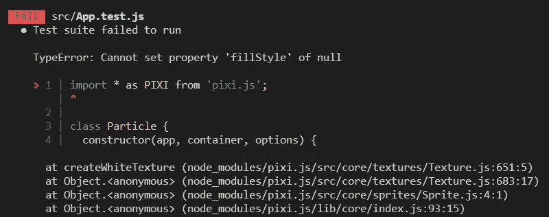
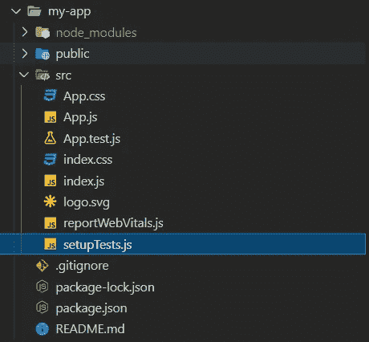
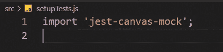

# 如何让 Jest 在 Create React 应用程序中使用 PixiJS

> 原文：<https://javascript.plainenglish.io/getting-jest-working-with-pixijs-in-create-react-app-using-vscode-af5b50024e89?source=collection_archive---------16----------------------->

## 最近，当我将 [PixiJS](https://www.pixijs.com/) 添加到我的 React 应用程序后，我的测试运行成功时遇到了一个问题

TypeError: Cannot set property ‘fillStyle’ of null

在谷歌上搜索了一下之后，我意识到很多解决方案都已经过时了，或者根本不适合我的本地环境。有些帖子问“*这个神秘的 setupTests.js 文件是什么？*"没有回答。

为了设置场景，我使用了 [VS 代码](https://code.visualstudio.com/)中的 [Create React App](https://reactjs.org/docs/create-a-new-react-app.html) 和内置的 [JEST](https://create-react-app.dev/docs/running-tests/) 。

我终于找到了解决办法。下面是我做的工作

## **第一步。使用 NPM 安装 [jest-canvas-mock](https://github.com/hustcc/jest-canvas-mock#readme)**

在 VS 代码的终端中，运行以下命令:

`npm install jest-canvas-mock`

这增加了画布支持，可能足以让你的测试工作，**对我来说还不够。**。我仍然得到了错误，不得不做以下步骤..

## **第二步。确保你在 src 文件夹中有一个 **setupTests.js** 文件。**

对我来说，这个文件不在那里，我必须创建它。我认为这是大多数人陷入困境的地方。我可以看到，如果你用`npx create-react-app my-app`设置 create-react-app，它是存在的，我仍然不知道为什么它从我的项目中消失了。

setupTests.js location

## **第三步。**在 setupTests.js 文件中导入 jest-canvas-mock

在 **setupTests.js** 文件的顶部添加以下导入:

import ‘jest-canvas-mock’;

## **步骤四。再次运行测试**

现在测试应该超越这个错误，对我来说，我得到了一个成功的结果。

## 结论

我希望这能帮到你。我浪费了相当多的时间来寻找这个错误的解决方案，就像大多数事情一样，一旦解决，它似乎很简单。但愿我帮你节省了一些时间。

*更多内容请看*[***plain English . io***](http://plainenglish.io)