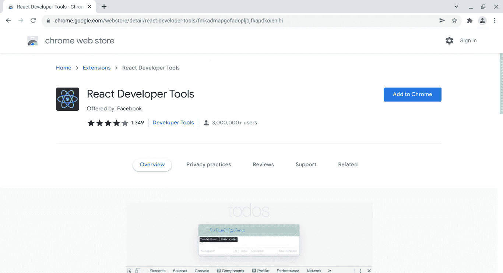
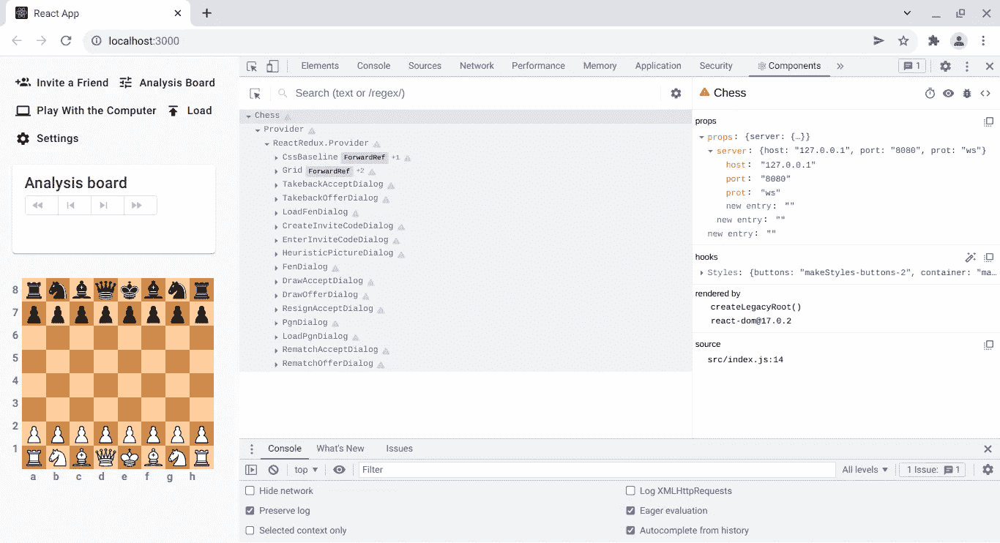
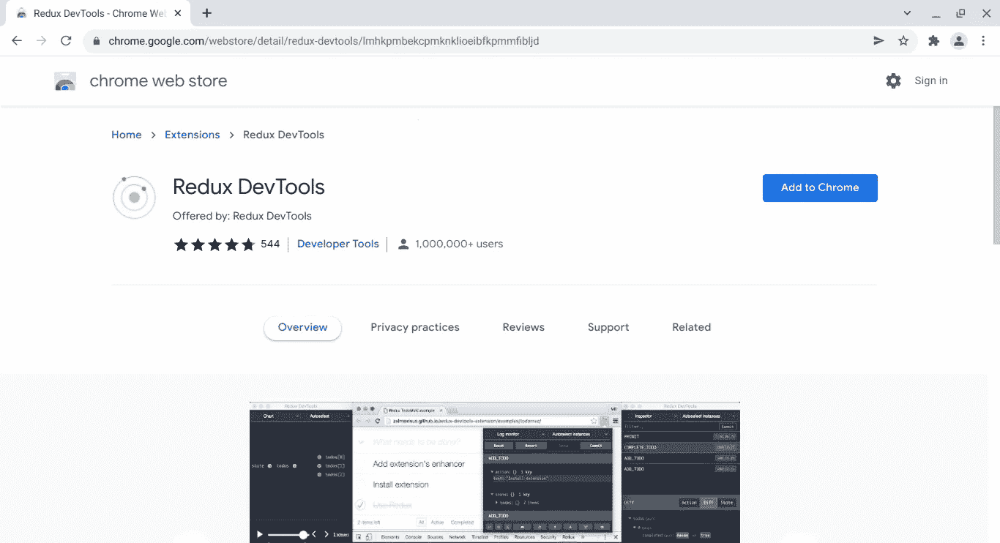
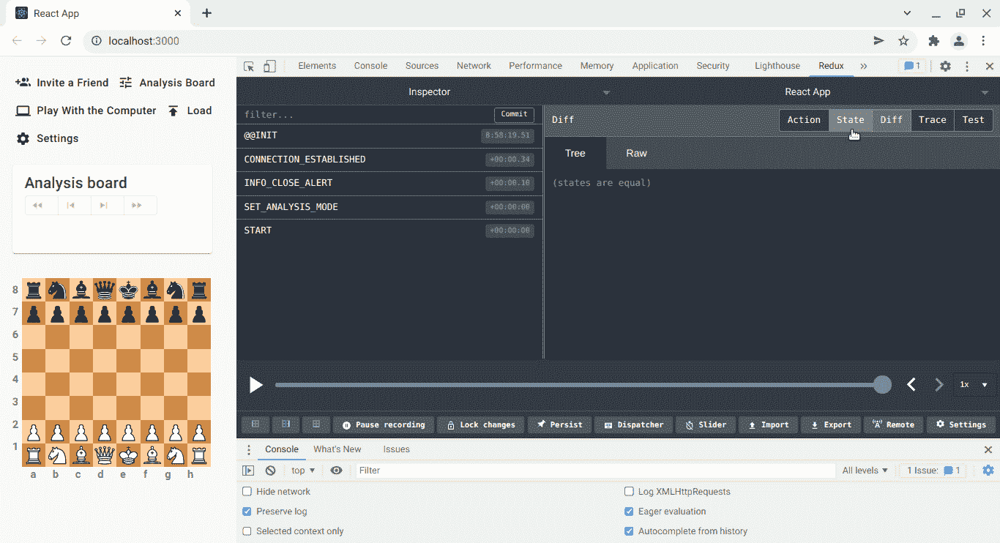

# 准备调试 React Redux 应用程序

> 原文：<https://javascript.plainenglish.io/getting-ready-for-debugging-react-redux-apps-a1eefea535?source=collection_archive---------5----------------------->

## 一边听有助于你感到平静和快乐的音乐


放轻松，笑一笑。软件开发生命周期包括一系列步骤，在这些步骤中不可避免地会出现不同类型的错误。让我们安装两个有用的工具来更好地理解 React 和 Redux，从而发现并消除错误。

[](/check-out-the-redux-chess-demo-acbea003d710) [## 查看 Redux 国际象棋演示

### 请坐下来，享受一杯你最喜欢的啤酒

javascript.plainenglish.io](/check-out-the-redux-chess-demo-acbea003d710) 

记住，Redux Chess 是一个发布在 [NPM 注册中心](https://www.npmjs.com/)的软件包，可以马上安装到你的 React 应用中。

```
$ npm i [@chesslablab/redux-chess](http://twitter.com/chesslablab/redux-chess)
```

问题是，为了继续开发这个包，无论是通过添加新功能还是修复错误，我们都需要一个主机应用程序来进行测试。 [Redux Chess 测试应用](https://github.com/chesslablab/testing-redux-chess)基本上是一个用`[create-react-app](https://reactjs.org/docs/create-a-new-react-app.html)`创建的 React 应用，其中嵌入了一个 Redux Chess 插件。

```
import React from 'react';
import ReactDOM from 'react-dom';
import { Chess } from '[@chesslablab/redux-chess](http://twitter.com/chesslablab/redux-chess)';const props = {
  server: {
    prot: 'ws',
    host: '127.0.0.1',
    port: '8080'
  }
};ReactDOM.render(
  <Chess props={props} />,
  document.getElementById('redux-chess')
);
```

就是这样！

[](/testing-a-local-react-npm-package-with-ease-7d0668676ddb) [## 如何轻松测试本地 React NPM 包

### 关于何时需要安装本地 npm 软件包而不使用符号链接的教程

javascript.plainenglish.io](/testing-a-local-react-npm-package-with-ease-7d0668676ddb) 

所以，是的，我们正在开发一个测试应用程序中的本地 NPM 包，但是在继续阅读之前，请记得照顾好自己。看着一株植物，深呼吸。

# 安装 React 开发者工具扩展

从 [Chrome 网上商店](https://chrome.google.com/webstore/category/extensions)安装 React Developer Tools 扩展很容易，只需搜索它，然后点击**添加到 Chrome** 按钮。



Figure 1\. Find the React Developer Tools and click on Add to Chrome.

它将在几秒钟内被添加到您的浏览器中。

现在，如果您在端口 3000 上运行 [Redux Chess 测试应用程序](https://github.com/chesslablab/testing-redux-chess)时打开 **Chrome DevTools** ，则**组件**和**分析器**选项卡将出现在右侧，如下图所示。



Figure 2\. The Components tab shows the React components rendered on the page.

**组件**选项卡允许检查 React 组件层次结构，并为调试提供有用的信息；例如，使用它，您可以一眼看到主`[Chess](https://github.com/chesslablab/redux-chess/blob/master/src/components/Chess.js)`组件已经在`[src/index.js](https://github.com/chesslablab/testing-redux-chess/blob/master/src/index.js)`文件中初始化，并具有以下属性。

```
const props = {
  server: {
    prot: 'ws',
    host: '127.0.0.1',
    port: '8080'
  }
};
```

此外，所选组件(⚠象棋)左侧的警告标志表明它没有在严格模式下运行。谢谢**组件**标签！

另一方面，**分析器**选项卡在 React 的[分析器 API](https://reactjs.org/docs/profiler.html#gatsby-focus-wrapper) 的帮助下收集每个组件渲染的计时信息。

# 安装 Redux DevTools 扩展

Redux DevTools 扩展将帮助您将调试技能提升到一个新的水平；只需在 [Chrome 网上商店](https://chrome.google.com/webstore/category/extensions)中搜索并点击**添加到 Chrome** 按钮。



Figure 3\. Find the Redux DevTools extension and click on Add to Chrome.

与 React 开发人员工具相反，在这种情况下，需要对这个扩展进行微小的微调，以便与我们的 React 代码一起很好地工作。

[](/how-to-disable-redux-devtools-in-production-e07b7ed3142b) [## 如何在生产中禁用 Redux DevTools

### 记得安装 Redux DevTools 扩展帮助器，以便进一步定制

javascript.plainenglish.io](/how-to-disable-redux-devtools-in-production-e07b7ed3142b) 

如果你查看`[package.json](https://github.com/chesslablab/redux-chess/blob/master/package.json)`中的`dependencies`，你会注意到 [Redux DevTools 扩展助手](https://www.npmjs.com/package/redux-devtools-extension)已经按照它的文档安装好了。

```
$ npm install --save redux-devtools-extension
```

然后在`[src/store.js](https://github.com/chesslablab/redux-chess/blob/master/src/store.js)`中初始化扩展助手，只在开发环境中启用 Redux DevTools，而不是在生产环境中。

```
import { createStore, applyMiddleware } from 'redux';
import { composeWithDevTools } from 'redux-devtools-extension/developmentOnly';
import thunk from 'redux-thunk';
import rootReducer from './reducers/rootReducer';const store = createStore(
  rootReducer,
  composeWithDevTools(applyMiddleware(thunk))
);export default store;
```

现在，如果您在端口 3000 上运行 Redux Chess 测试应用程序时打开 **Chrome DevTools** ，则 **Redux** 选项卡将出现在右侧，如下图 GIF 所示。



Figure 4\. The Redux tab really helps to debug the application’s state changes.

这个例子展示了当用户通过调度动作与 UI 交互时，应用程序的状态是如何变化的。`1.e4 e5`在**分析板**中播放，随后从 **⚙设置**菜单打开一个板翻转和一个 **PGN 移动文本**对话框。下面列出的是应用程序启动后自动调度的 Redux 操作。

```
@@INIT
CONNECTION_ESTABLISHED
INFO_CLOSE_ALERT
START
```

下面是作为用户与 UI 交互的结果而分派的一系列动作。

```
PICK_PIECE
LEGAL_MOVES
LEAVE_PIECE
VALID_MOVE
PICK_PIECE
LEGAL_MOVES
LEAVE_PIECE
VALID_MOVE
FLIP_BOARD
OPEN_GET_PGN_DIALOG
CLOSE_GET_PGN_DIALOG
```

Redux DevTools 帮助你直观地理解正在发生的事情，从而调试你的应用程序；希望一个有效的棋步被分解成四个重复的动作是不言自明的。下面描述的是动作的顺序`1.e4 e5`。

e4:

```
PICK_PIECE
LEGAL_MOVES
LEAVE_PIECE
VALID_MOVE
```

e5:

```
PICK_PIECE
LEGAL_MOVES
LEAVE_PIECE
VALID_MOVE
```

应用程序的状态变化与被调度的动作密切相关，但是，在这个 GIF 示例中，应用程序的状态没有被检查。暂时不要担心这个问题，我们会在接下来的文章中详细讨论。

非常感谢你的阅读！

[](/what-is-redux-chess-6264c99c1eca) [## Redux 棋是什么？

### 嵌入到 React 应用程序中的易于使用的象棋插件

javascript.plainenglish.io](/what-is-redux-chess-6264c99c1eca) [](/free-web-development-ebooks-to-read-online-82469809d76) [## 免费在线阅读网络开发电子书

### 诀窍是知道该读哪些书，但它们都在这里

javascript.plainenglish.io](/free-web-development-ebooks-to-read-online-82469809d76) 

*更多内容请看*[*plain English . io*](http://plainenglish.io/)*。报名参加我们的* [*免费周报*](http://newsletter.plainenglish.io/) *。在我们的* [*社区*](https://discord.gg/GtDtUAvyhW) *获得独家的写作机会和建议。*