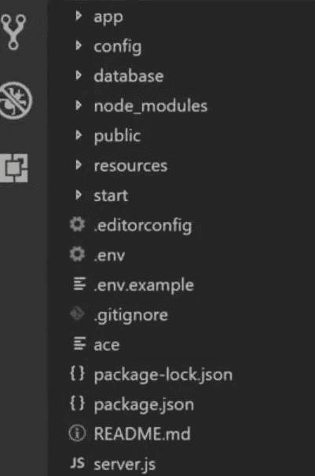

# AdonisJS 后端 JavaScript 框架入门

> 原文：<https://javascript.plainenglish.io/getting-started-with-adonisjs-backend-javascript-framework-ffca60d80391?source=collection_archive---------17----------------------->

## 用 AdonisJS JavaScript 框架构建后端应用。


Image from [DEV.TO](https://www.google.com/url?sa=i&url=https%3A%2F%2Fdev.to%2Fericchapman%2Fthere-was-rails-then-laravel-and-now-adonis-js-2900&psig=AOvVaw2GfKX5Wxjmdi1tARcZ50wd&ust=1625848084213000&source=images&cd=vfe&ved=0CAsQjhxqFwoTCJCjsKLy0_ECFQAAAAAdAAAAABAD)

AdonisJS 是一个令人惊叹的 Node.js 后端 web 框架。它非常强大，因为它易于安装和使用。对于那些尝试过用 PHP 进行 Laravel 开发的人来说，AdonisJS 分享了几乎相同的简单应用程序架构。

它的模型视图控制器(MVC)方法类似于 Laravel，包括模型和应用程序结构。如果你不熟悉 MVC，请查看下面链接的文章。

[](/what-is-the-model-view-controller-mvc-d4d51b642565) [## 什么是模型视图控制器(MVC)？

### MVC 的初学者友好解释。

javascript.plainenglish.io](/what-is-the-model-view-controller-mvc-d4d51b642565) 

在本文中，我们将看到如何用 AdonisJS 建立一个简单的后端应用程序，以及如何处理路由和其他事情。

关于措辞，现在让我们进入代码。

**先决条件**

*   安装 Node.js
*   安装了 NPM
*   基本的 JavaScript 知识
*   基本的命令行知识

## **建立 AdonisJS 项目**

使用 AdonisJS 设置项目。打开开发人员命令提示符，运行下面的命令。

以下命令会将 AdonisJS 命令行交互(CLI)全局安装到您的系统中，以便您可以在系统的任何地方使用它。

```
npm i — — global [@adonisjs/cli](http://twitter.com/adonisjs/cli)
```

要获得与 AdonisJS 项目相关的帮助，只需运行以下命令

```
adonis — — help
```

## **创建一个 AdonisJS 项目**

要使用 AdonisJS 创建项目，请运行命令

```
adonis new <name of your project>
```

该命令将使用您提供的名称创建一个应用程序。
将您的目录更改为新创建的项目，以导航到应用程序支架。

您可以使用命令

```
cd <name of your project>
```

## **运行 AdonisJS 项目**

要运行 AdonisJS，只需运行以下命令

```
adonis serve — — dev
```

该命令将运行 AdonisJS 项目，并作为开发环境的一部分。它将在某种程度上类似于下图所示。


Adonis Live server

## **AdonisJS 文件夹结构**

如果你已经启动并运行了这个项目，你可以用你喜欢的代码编辑器导航到应用程序的文件夹结构，你将会得到和下图相似的东西。



AdonisJs Folder Structure

**app**

app 目录是您的应用程序逻辑的主目录。它自动加载在命名空间应用程序下。

**配置**

config 目录用于定义应用程序的配置。AdonisJS 附带了许多配置文件，但是您可以随意创建自己的文件。

**数据库**

数据库目录用于存储所有与数据库相关的文件。

**公开**

公共目录用于通过 HTTP 提供静态资产。此目录映射到您网站的根目录:

## **使用 AdonisJS 的好处。**

*   对 i18n 的内置支持
*   SQL、ORM、迁移和种子
*   无缝认证
*   测试支持

## **资源**

[AdonisJS 文档](https://legacy.adonisjs.com/docs/4.0/)

## **结论**

AdonisJS 是一个非常强大的 MVC 后端 JavaScript 框架，有许多现成的有趣特性。

感谢您到目前为止阅读完这篇文章。我希望它有助于您入门并对 AdonisJS 的工作原理有一个背景了解。

## **更多内容:**

[](/what-is-the-model-view-controller-mvc-d4d51b642565) [## 什么是模型视图控制器(MVC)？

### MVC 的初学者友好解释。

javascript.plainenglish.io](/what-is-the-model-view-controller-mvc-d4d51b642565) [](/algorithm-and-data-structure-challenge-implementing-bubble-sort-34403eecc87) [## 算法和数据结构挑战—实现冒泡排序

### JavaScript 中的冒泡排序挑战 freeCodeCamp 的一个面试准备问题的解决方案。

javascript.plainenglish.io](/algorithm-and-data-structure-challenge-implementing-bubble-sort-34403eecc87) 

*更多内容请看*[***plain English . io***](http://plainenglish.io/)