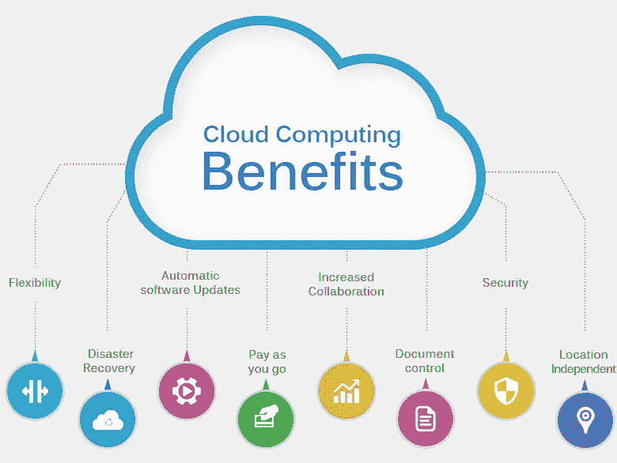
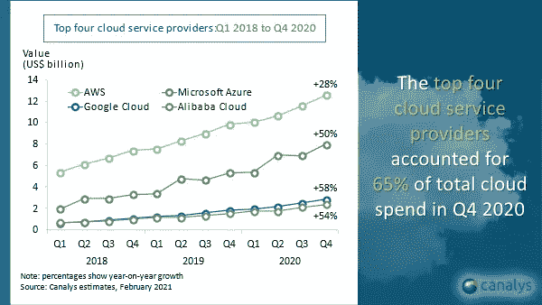

# Amazon Web Services (AWS)入门

> 原文：<https://javascript.plainenglish.io/getting-started-with-aws-amazon-web-services-1b06dd0fc119?source=collection_archive---------19----------------------->

亚马逊提供的云平台亚马逊网络服务(AWS)可以说是云计算的领先提供商。网飞、Twitter、Twitch、Dropbox、Airbnb 等公司都在使用他们的服务，AWS 提供的服务范围非常广泛！

# **什么是云计算？**

*   [云计算](https://aws.amazon.com/what-is-cloud-computing/)是计算机系统资源，尤其是数据存储(云存储)和计算能力的按需可用性，无需用户直接主动管理。
*   云计算这个术语通常用来描述许多用户通过互联网可以使用的数据中心。
*   如今，许多公司正在从内部数据中心迁移到云，因为云有其优势。因此，如果你是一家初创公司或公司，想要从内部部署迁移到云，我会强烈推荐 AWS。

Benefits of Cloud Computing

# **为什么选择 AWS？**

1.  [**全球基础设施**](https://aws.amazon.com/about-aws/global-infrastructure/)
    AWS 全球云基础设施是最安全、最广泛、最可靠的云平台，提供来自全球数据中心的 200 多种全功能服务。截至目前，共有 24 个区域和 77 个可用区。
2.  [**灾难恢复**](https://aws.amazon.com/cloudendure-disaster-recovery/)灾难恢复是当今世界最重要的事情。对于某些业务来说，数据丢失或少量的停机都会导致巨大的损失。AWS 平台为您的灾难恢复计划提供了合适的工具。
3.  [**备份**](https://aws.amazon.com/backup/)AWS 提供了多种备份方式 AMIs 和快照。它使您能够跨 AWS 服务集中和自动化数据保护。
4.  [**安全**](https://aws.amazon.com/security/)当今世界安全是最大的挑战。AWS 为您提供了各种方法来保护您的云环境。
5.  [**现收现付定价**](https://aws.amazon.com/pricing/)AWS 为您提供了一种现收现付的云服务定价方法。你只为你消费的服务和你消费的时间付费。

截至 2020 年，AWS 提供了超过 175 种产品和服务，并且他们正在不断地向列表中添加更多的服务。从服务器、数据库到机器学习、物联网，您将找到运行应用所需的一切。

# **使用 AWS 的好处**

1.  使用方便
2.  灵活的
3.  性价比高
4.  可靠的
5.  可攀登的
6.  安全的
7.  高性能

截止 2021 年 2 月，[科纳仕公司报道](https://www.canalys.com/newsroom/global-cloud-market-q4-2020) AWS 是领先的云服务提供商。

> *AWS 为您提供 1 年免费等级。报名地点:*[*https://aws.amazon.com/free*](https://aws.amazon.com/free/)

# **最常用 AWS 服务概述**

1.  **身份和访问管理(IAM)** AWS IAM 使您能够安全地管理对 AWS 资源和服务的访问。使用 IAM，您可以创建和管理 AWS 用户和组，使用权限来允许和拒绝他们对 AWS 资源的访问。它还可以与贵组织的 2FA 和 MFA 结合使用。
    有关更多详情，请参阅 [AWS 文档](https://aws.amazon.com/iam/)和[常见问题解答](https://aws.amazon.com/iam/faqs/)。
2.  **弹性计算云(EC2)**
    EC2 实例是带有操作系统的服务器，可用于在互联网上运行您的应用程序。EC2 机器有不同的 CPU、内存、Ram 等配置。它们根据计算能力、内存优化、存储优化等进行分类。毫无疑问，Amazon EC2 是众多 AWS 服务中最受欢迎和增长最快的服务之一。
    有关更多详情，请参阅 [AWS 文档](https://aws.amazon.com/ec2/)和[常见问题解答](https://aws.amazon.com/ec2/faqs/)。
3.  **关系数据库服务(RDS)**
    RDS 是一种分布式关系数据库服务。它可用于在几分钟内创建专用的数据库实例。Amazon RDS 可用于多种数据库实例类型，如针对内存、性能或 I/O 进行优化，并提供多种熟悉的数据库引擎供选择，包括 Amazon Aurora、MySQL、MariaDB、PostgreSQL、Oracle 数据库和 SQL Server。
    有关更多详情，请参阅 [AWS 文档](https://aws.amazon.com/rds/)和[常见问题解答](https://aws.amazon.com/rds/faqs/)。
4.  **简单存储服务(S3)**
    顾名思义，S3 提供低成本的对象存储服务，具有高可扩展性、数据可用性、安全性和性能。亚马逊 S3 专为 99.99999999%(11 个 9)的耐用性而设计。我们甚至可以用它来触发 lambda 事件。S3 被认为是一个桶，所以大多数时候你会听到术语 S3 桶，简单地说，它是一个桶，你可以在其中存储数据，构建或资产，并添加适当的权限，以便只有授权的人可以访问它。
    欲了解更多详情，请访问 [AWS 文档](https://aws.amazon.com/s3/)和[常见问题](https://aws.amazon.com/s3/faqs/)。
5.  **虚拟专用云(VPC)** AWS VPC 是 AWS 内的核心组件之一，它与多个其他组件一起保护应用程序，这是 AWS 云的一个逻辑隔离部分，您可以在其中启动虚拟专用网内的资源。通过安全组、子网、路由表等，您可以完全控制您的虚拟网络环境。
    有关更多详情，请参阅 [AWS 文档](https://aws.amazon.com/vpc/)和[常见问题解答](https://aws.amazon.com/vpc/faqs/)。
6.  **CloudFront** 这些服务共存于边缘位置，并通过 AWS 主干网络连接。
    要了解更多详情，请查阅 [AWS 文档](https://aws.amazon.com/cloudfront/)和[常见问题解答](https://aws.amazon.com/cloudfront/faqs/)。
7.  AWS Lambda 是一个无服务器的计算/计算服务，它让你在不提供或管理服务器的情况下运行代码。您只需为使用的计算时间付费，而在 EC2 实例中，您需要为这些服务器运行的整个时间付费。您还可以设置您的代码从 140 AWS 服务自动触发，或者直接从任何 web 或移动应用程序调用它。
    有关更多详情，请参阅 [AWS 文档](https://aws.amazon.com/lambda/)和[常见问题解答](https://aws.amazon.com/lambda/faqs/)。
8.  **Route 53**
    Route53 是 AWS 提供的一种高度可用且可扩展的 DNS 服务。它允许我们通过各种[路由策略](https://docs.aws.amazon.com/Route53/latest/DeveloperGuide/routing-policy.html)路由流量，如简单路由、故障转移路由、地理位置路由、地理邻近路由、延迟路由、多值应答路由、加权路由。通过这些的不同组合，我们可以构建高度可用的容错系统。
    有关更多详情，请参阅 [AWS 文档](https://aws.amazon.com/route53/)和[常见问题解答](https://aws.amazon.com/route53/faqs/)。
9.  **API Gateway**
    Amazon API Gateway 是一个完全托管的服务，让开发者可以轻松创建、发布、维护、监控和保护任何规模的 API。API 充当应用程序从后端服务访问数据、业务逻辑或功能的“前门”。使用 API Gateway，您可以创建 RESTful APIs 和 WebSocket APIs。
    有关更多详情，请参阅 [AWS 文档](https://aws.amazon.com/api-gateway/)和[常见问题解答](https://aws.amazon.com/api-gateway/faqs/)。
10.  **CloudWatch**
    亚马逊 CloudWatch 是一项监控和可观测性服务。CloudWatch 以日志、指标和事件的形式收集监控和运营数据，为您提供 AWS 资源、应用程序和服务的统一视图。还可以设置 CloudWatch 闹钟。
    欲了解更多详情，请访问 [AWS 文档](https://aws.amazon.com/cloudwatch/)和[常见问题解答](https://aws.amazon.com/cloudwatch/faqs/)。

## 结论

我希望这将有助于您的 AWS 之旅稍微容易一点，因为您知道您将在 AWS 中使用的服务的基础知识，如果您需要更多特定于服务的文章，请随时在下面发表评论。

谢谢你阅读它。更多内容一定要关注我。我将很快放弃更多的 AWS 内容，所以保持关注。😃

非常感谢 Lav Shah 鼓励我写这篇文章。

谢谢，祝您愉快！😃