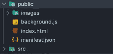
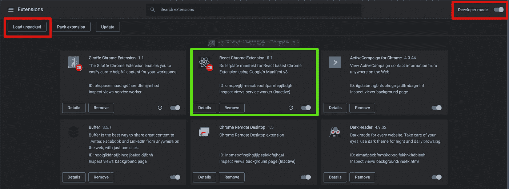
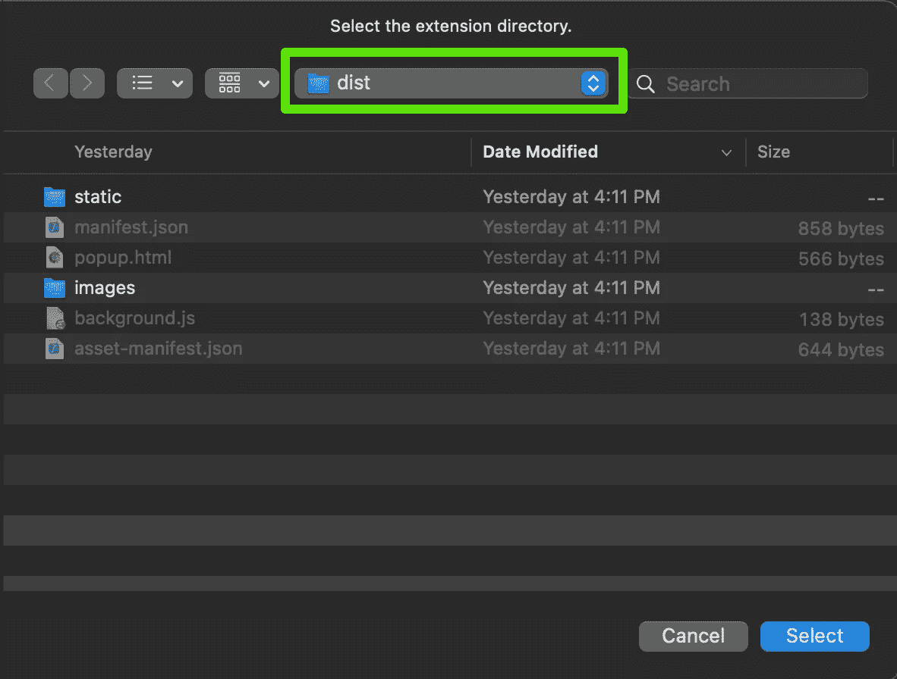
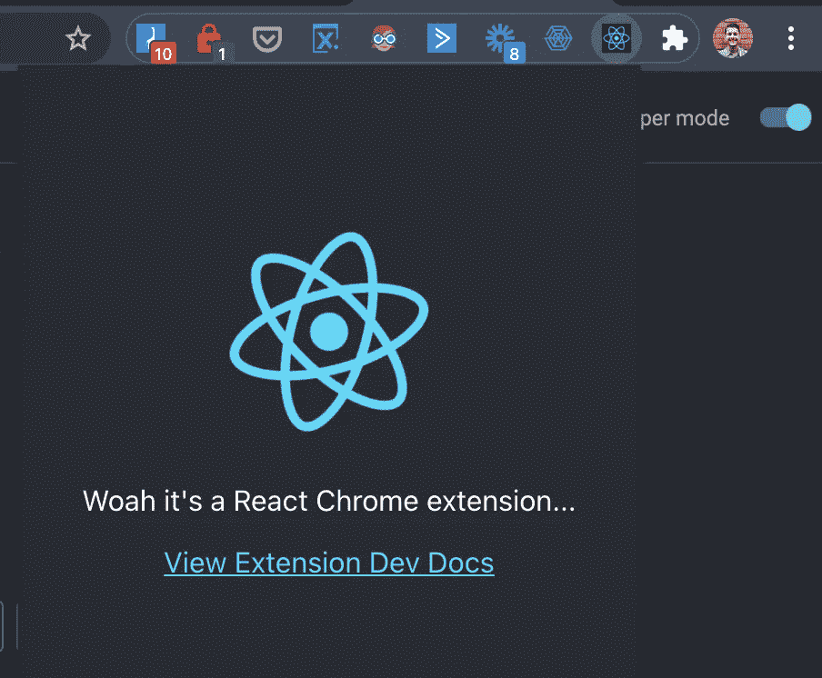

# Chrome 扩展(清单 v3)和 React 17+入门

> 原文：<https://javascript.plainenglish.io/getting-started-with-chrome-extensions-manifest-v3-and-react-17-a5ef87026486?source=collection_archive---------0----------------------->

## 让我们看看如何使用 create-react-app 和 Google 的 manifest v3 来为更现代的浏览器扩展奠定基础。


Photo by [Ferenc Almasi](https://unsplash.com/@flowforfrank?utm_source=medium&utm_medium=referral) on [Unsplash](https://unsplash.com?utm_source=medium&utm_medium=referral)

> 扩展可以极大地增强您的浏览器体验，并为其增添一些乐趣，但开发起来也很乏味，因为它们传统上依赖普通的 Javascript 来完成工作。让我们看看如何使用 create-react-app 和 Google 的 manifest v3 来为更现代的浏览器扩展奠定基础。

如果您希望创建一个具有丰富用户界面和体验的浏览器扩展，React 可以让您的生活轻松许多。但 create-React-app(CRA)创建的默认 React 项目需要做一些调整，才能作为浏览器的扩展。本安装指南假定您对 Chrome 扩展架构有基本的了解。如果你还没有浏览谷歌的[入门指南](https://developer.chrome.com/docs/extensions/mv3/getstarted/),我建议你在开始阅读之前先浏览一下。我们还将使用谷歌最新的清单 v3，如果你只使用过 v2，你应该快速浏览一下[迁移指南](https://developer.chrome.com/docs/extensions/mv3/mv3-migration-checklist/)。

**注意:**Chrome 扩展和 CRA 有一些限制，包括需要修改默认的 webpack 配置来访问更高级的扩展功能，如选项菜单和内容脚本。但是，我们将把它排除在本指南之外，并把重点放在什么工作得好——弹出窗口和基于服务人员的后台脚本。这些特性涵盖了一般扩展构建所需的大部分内容。如果你想利用[选项页面](https://developer.chrome.com/docs/extensions/mv3/options/)或[内容脚本](https://developer.chrome.com/docs/extensions/mv3/content_scripts/)，你可以使用类似 [react-app-rewired](https://www.npmjs.com/package/react-app-rewired) 的东西来创建多个入口点。我将在以后的文章中讨论这个问题。

喜欢直接钻研代码吗？好消息。我已经把这篇文章中的代码变成了一个模板。**简单点** [**头这里**](https://github.com/casendler/react-chrome-extension-mv3) **克隆样板回购，自己上手。**

## 第一步:设置我们的应用程序

首先，创建您的 react 应用程序，就像您通常使用的一样:

```
npx create-react-app my-react-extension***or***yarn create react-app my-react-extension
```

现在，cd 进入新目录，让我们准备添加和修改必要的项目，将这个 web 应用程序变成 Chrome 扩展。

## 第二步:添加 Chrome 插件

继续打开**。/public** 目录。让我们继续删除我们不需要的东西，添加我们需要的文件。以下是你的目标:



Public directory changes

如您所见，我们删除了 favicon 和其他不需要的资产，并创建了两个新资产:

*   一个**图片**文件夹——这将包含弹出和商店列表的图标，你可以在这里获得我从[样本回购中使用的资产](https://github.com/casendler/react-chrome-extension-mv3)
*   一个 **background.js** 文件——这将包含我们的后台和服务人员脚本

接下来，让我们将 manifest.json 文件更改为 Chrome 扩展清单。为此，我们将使用清单 v3。这是基线模板，您可以在这里[和](https://developer.chrome.com/docs/extensions/mv3/intro/mv3-overview/)[这里](https://developer.chrome.com/docs/extensions/mv3/manifest/)查看所有可能的内容。

```
{"manifest_version": 3,"name": "React Chrome Extension","version": "0.1","description": "Boilerplate manifest for React based Chrome Extension using Google's Manifest v3","background": {"service_worker": "./background.js"},"permissions": [],"author": "Christian Sendler","homepage_url": "https://github.com/casendler/","short_name": "React Extension","action": {"default_popup": "popup.html","default_title": "React Chrome Extension","default_icon": {"16": "/images/react-logo-16.png","32": "/images/react-logo-32.png","48": "/images/react-logo-48.png","128": "/images/react-logo-128.png"}},"icons": {"16": "/images/react-logo-16.png","32": "/images/react-logo-32.png","48": "/images/react-logo-48.png","128": "/images/react-logo-128.png"}}
```

您可以随意更新诸如作者、homepage_url 等内容以满足您的需求，但请确保保留 popup 和 service_worker 属性不变。一旦你开始利用 Chrome 的 API 方法，你还必须[向相应的数组添加权限](https://developer.chrome.com/docs/extensions/mv3/permission_warnings/)。

完成后，继续创建 background.js 文件并粘贴以下代码。这是一小段代码，当用户成功安装应用程序时，它只在控制台记录一条成功消息。您希望由扩展的服务人员处理的任何内容都应该放入(或导入)这个文件中。您可以查看来自 [API 参考](https://developer.chrome.com/docs/extensions/reference/)的事件，了解可能发生的事情。

```
*/*global chrome*/*chrome.runtime.onInstalled.addListener(() => {console.log('Chrome extension successfully installed!');return;});
```

**注意:**记住在任何使用 Chrome API 的文件的顶部添加 */*global chrome*/以避免 ESLint 相关的错误。*

我们在这里的时候，你也可以把你的 index.html 简化成下面这样。

```
<!DOCTYPE html><html lang="en"><head><meta charset="utf-8" /><meta name="viewport" content="width=device-width, initial-scale=1" /><meta name="theme-color" content="#000000" /></head><body><noscript>You need to enable JavaScript to run this extension.</noscript><div id="root"></div></body></html>
```

## 第三步:建立一个构建脚本

如果您已经阅读了 Google 的入门指南，您会注意到我们的扩展仍然没有所需的项目结构。为了使这更容易(和可重复)，我在 repo 中添加了一个定制的 Makefile。只需运行`make build`来准备你的扩展上传到你的浏览器和 Chrome 网络商店。我喜欢 Makefiles(即使一个简单的 shell 脚本已经完成了这里的工作)，其中包含的功能当然还有扩展的空间。Medium 的代码块打乱了格式，考虑到缩进的重要性，我建议在这里 获取正确格式化的 Makefile [**。**](https://github.com/casendler/react-chrome-extension-mv3/blob/main/Makefile)

```
*####################################**# Build command for Chrome Extension**####################################* .PHONY: help build help:$(info ${HELP_MESSAGE})@exit 0build:@echo 'Removing prior build...'@rm -rf dist/*@rm -f latestBuild.zip@echo 'Prior build removed!'@echo 'Preparing new extension build..'@export INLINE_RUNTIME_CHUNK=false; \export GENERATE_SOURCEMAP=false; \yarn build@mkdir -p dist@cp -r build/* dist@echo 'Renaming files...'@mv dist/index.html dist/popup.html@echo 'Zipping up build files for upload...'@zip -r -X latestBuild.zip dist/*@echo 'New extension build ready for upload!'@exit 0define HELP_MESSAGE--- Run this command to prepare the build for upload ---$ make buildendef
```

让我们看看这个脚本做了什么。首先，我们将清除任何以前的构建文件并创建一个**。/dist** 目录来包含我们的扩展构建。这是您将用来运行您的本地构建的目录(我们将在接下来讨论)。该脚本还创建了一个. zip 文件，如果你想分发你的扩展，可以上传到 Chrome 网络商店。

## 第四步:测试它

现在让我们让您的新扩展在本地运行。首先，你将在浏览器中进入 **chrome://extensions** 。确保您启用了开发人员模式，然后选择左上角的“加载解压缩”选项。导航进入**。/dist** 目录并点击 select。现在，您应该会在已安装的扩展列表中看到您的应用程序。



Loading the unpacked extension build



Select the proper directory

你现在应该在你的扩展栏中看到 CRA 启动器图标(如果没有，点击拼图图标并‘锁定’)。点击图标应该呈现一个类似下面的屏幕截图弹出。我已经稍微修改了 CSS 来清理东西，所以如果你没有使用[模板](https://github.com/casendler/react-chrome-extension-mv3)，你的看起来可能会有点不同。



Basic CRA based extension popup

瞧，就是这样！现在，您可以开始添加更多的功能，就像对任何其他 React web 应用程序一样，同时利用 background.js 文件作为浏览器事件侦听器。你也可以从你的应用程序代码中调用 Chrome API 的任何方法(例如 App.js)。无论何时你想更新你的扩展或者测试一个新的构建，只需再次运行`make build`，然后点击 **chrome://extensions** 上的刷新或者更新按钮。

感谢收听，祝编码快乐！欢迎在评论中或在 [GitHub Repo](https://github.com/casendler/react-chrome-extension-mv3) 上提出问题。

*更多内容尽在*[*plain English . io*](http://plainenglish.io/)