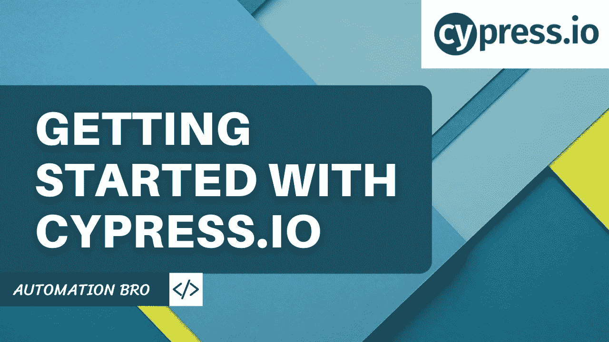

# Cypress 入门

> 原文：<https://javascript.plainenglish.io/getting-started-with-cypress-c91b0bd3068e?source=collection_archive---------7----------------------->

[https://youtu.be/krpKuSqQ0XM](https://youtu.be/krpKuSqQ0XM)

我相信你们大多数人都已经听说过 Cypress，因为它正在成为业界最流行的 E2E 测试工具之一，越来越多的公司使用 Cypress 进行端到端测试。

现在，如果你不熟悉 Cypress 的工作方式以及如何用 Cypress 编写测试，那么一定要看看这个为初学者准备的 [Cypress 测试教程系列](https://www.youtube.com/watch?v=krpKuSqQ0XM)，因为它将涵盖你开始使用 Cypress.io 所需的一切。

# 柏树是什么？

Cypress 是一个 **JavaScript All-in-one 端到端测试框架**。这意味着什么呢？与许多其他框架不同，Cypress 内置了所有特性，让您可以开始进行浏览器自动化。

所以基本上你只需要运行一个命令来安装 Cypress，一旦安装好了，你就可以访问测试框架，断言库，包括嘲讽和存根。

正如你在上面的图片中看到的，在 Cypress 之前，你必须从流行的框架中选择使用哪一个，比如 Mocha、Jasmine、Karma 等等，还要选择断言库，比如 chai 或 expect。然后，您需要安装 selenium 并在 Selenium 上选择一个包装器，如量角器、webdriver，然后还必须安装额外的库来模仿和存根。

但是后来 Cypress 来了，说不要担心这些，我会给你所有你需要的工具，让你马上开始写你的测试。

# 赛普拉斯用什么工具？

Cypress 主要使用 3 个顶级库——Mocha 作为 BDD 测试框架，Chai 作为断言库，Sinon 用于模仿和存根。

因此，Cypress 依靠这些流行的开源测试库来确保您在使用 Cypress 时获得稳定和熟悉的体验。现在，如果您在熟悉这些库之前已经涉足了 JS 测试领域。

除此之外，Cypress 还使用其他流行的库，比如 jquery、chai-jquery、sinon-chai，以及其他一些可以在 Cypress 文档中找到的库

你已经听到了所有关于赛普拉斯的传言，那么让我们来看看它到底有什么不同，为什么每个人都这么喜欢它。

# 柏树有什么不同？

*   **不使用 Selenium**——所以关键的一点是它不像大多数测试框架那样使用 Selenium。因此，与通过网络执行远程命令来控制浏览器的 Selenium 不同，Cypress 运行在与应用程序相同的循环中。因此，Cypress 在您的浏览器中运行，就像您运行您的应用程序一样。
    由于使用硒时可能会遇到很多片状剥落和不稳定的问题，Cypress 承诺会以更有效的方式处理这些问题。
*   **仅 JavaScript**—与 Selenium 不同，您只能用 JavaScript 编写 Cypress 测试。所以如果你想用 Cypress，你需要知道如何使用 JavaScript。
*   **开发& QA 友好**:使用 Cypress，您的开发人员可以进行端到端测试的 TDD。虽然这听起来很奇怪，但用柏树做同样的事情是可能的。测试运行速度极快，当您编写测试时，变化会实时反映出来。因此，开发人员很容易编写一个 Cypress 测试，看到它失败，然后编写应用程序使其绿色化。
    显然，QA 人员也可以编写测试，语法非常简单，任何人都可以拿起它开始用 Cypress 编写测试。
*   **一体化端到端测试框架**:为端到端测试而构建，所以正如我之前提到的，Cypress 是一个端到端测试框架，它专注于做这件事。它不涉及单元测试或任何其他一般的自动化测试，它仅仅关注于端到端的 web 应用程序自动化，并且做得相当好。它还提供了开始编写测试所需的所有工具，而不是安装 10 个不同的库。

# 柏树特征

*   **试车员**:毫无疑问，赛普拉斯最大的特点之一就是它的试车员。它为端到端测试
    提供了全新的体验——测试运行程序本身提供了很棒的特性，比如穿越所有命令的时间旅行
    ——调试应用程序
    ——实时重新加载
*   **设置测试**:我们已经讨论过的另一个很棒的特性是设置测试非常简单，你只需要安装 Cypress，然后一切都为你设置好了
*   **自动等待**——在使用 Cypress 时你几乎不用等待
*   **存根** —您可以轻松地存根应用程序功能行为和服务器响应

# 柏树权衡

就像所有事情一样，在使用 Cypress 时有一些权衡，在开始使用它之前了解这些是很重要的。

*   **浏览器支持**:当我们谈论 Cypress 时，第一个被讨论很多的是浏览器支持。与 Selenium 不同，Cypress 目前对浏览器的支持有限。因此，如果你现在需要对 Safari 或 Internet explorer 等浏览器的支持，那么 Cypress 目前可能不太适合你。然而，他们正致力于为这些浏览器增加浏览器支持，可能需要一段时间才能上市。
*   **本地移动应用支持** : Cypress 是一个 web 自动化框架，它在你的浏览器中运行测试，所以它不支持任何其他类型的自动化，比如本地移动应用或桌面应用。
*   **多个浏览器/标签**:不能用 Cypress 打开多个浏览器或标签。其架构的设置方式，只能使用单一的浏览器和选项卡。因此，如果你的应用程序要求你使用多种浏览器或标签，那么 Cypress 可能不是你的最佳工具。然而，他们确实有很好的指导你如何解决多个浏览器和标签的问题
*   **同源**:什么是同源？如果两个 URL 的协议、端口(如果指定)和主机相同，则这两个 URL 具有相同的来源。例如— Cypress.io 和 docs.cypress.io 同源。但是 cypress.io 和 automationbro.com 是不同起源的规则是:
    ——你不能在同一个测试中访问两个不同起源的域。
    -您可以在不同的测试中访问两个或更多不同来源的域。

好了，我希望现在你明白了什么是 Cypress，以及使用 Cypress 的一些优点和缺点。现在，无论您是否决定在您的工作场所使用 Cypress，我仍然建议您看看这个系列，看看开始使用 Cypress 有多简单，以及它改变整个测试体验的方式。

# 我们将在这个系列教程中讨论什么？

如果你想学习 Cypress，我将为你提供一个深入的教程系列，帮助你开始使用 Cypress.io。我们将涉及以下一些主题

*   柏树游戏攻略
*   设置和安装
*   编写您的第一个 Cypress 测试
*   Cypress API /命令
*   页面对象模型(优点/缺点)
*   等待命令
*   自定义命令
*   Cypress CLI
*   跨浏览器测试
*   报告

好了，我们将在本系列中介绍很多内容，到本系列结束时，您将对 Cypress.io 有一个坚实的了解。

## 观看下面的视频，了解我们将在本系列中涉及的更多内容——

请告诉我您是否正在使用 Cypress.io 或过去是否使用过它，以及您的使用体验如何。

感谢阅读！

*更多内容请看*[***plain English . io***](https://plainenglish.io/)