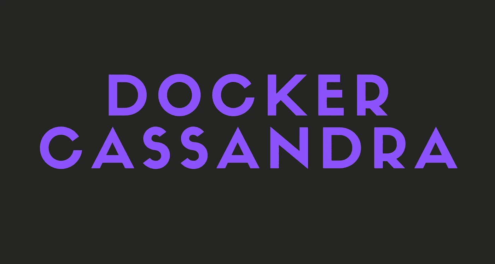

# Docker 和 Apache Cassandra 入门

> 原文：<https://javascript.plainenglish.io/getting-started-with-docker-and-apache-cassandra-eeb1fcd89988?source=collection_archive---------1----------------------->

Docker 和 Apache Cassandra 快速入门指南。



在这个故事中，你将学习 Docker 和 Cassandra 是什么以及它们的基础知识。

您将学习如何提取图像、运行图像、Cassandra 的基础知识等等。

开始吧！

# Docker 是什么？

Docker 是一个用于构建、运行和管理容器的软件框架。

它使开发人员能够将应用程序打包到容器中，从而大大加快开发和部署速度。

## 什么是容器？

容器是一个标准的软件单元，它将代码及其所有依赖项打包，以便应用程序能够快速可靠地从一个计算环境运行到另一个计算环境。

Docker 容器映像是一个轻量级的、独立的、可执行的软件包，包括运行应用程序所需的一切:代码、运行时、系统工具、系统库和设置。

## 那是什么意思？

所以，假设你用 Elixir、Cassandra 和 Node.js 做了一个全栈 app，假设你想把它发给你的朋友。有两种方法可以做到。

1-你的朋友必须安装并设置 Elixir、Erlang、Cassandra、Java、Python 和 Node.js，然后手动运行应用程序、服务器和数据库。

2-你的朋友只需安装 Docker 并运行你的镜像。

你觉得哪个更容易？当然是第二种方式。

这也正是 Docker 所做的。你可以分享非常小的图片，只包括你需要的，而不需要安装数十亿不同的工具。

我不会在这里解释更深层次的话题。不过，如果你想了解更多关于 Docker 的信息，你可以查看它的官方网站。

[](https://www.docker.com/) [## 增强开发者的应用开发能力| Docker

### 新功能 Docker 扩展了面向开发人员的可信内容产品与 AWS、Datadog、Mirantis、Red……

www.docker.com](https://www.docker.com/) 

# 什么是阿帕奇卡珊德拉？

Apache Cassandra 是一个高度可伸缩的高性能分布式 NoSQL 数据库，旨在处理许多商用服务器上的大量数据，提供无单点故障的高可用性。

Cassandra 最重要的特点:

*   它具有可伸缩性、容错性和一致性。
*   这是一个面向列的数据库。
*   它的分发设计基于亚马逊的迪纳摩和它在谷歌的 Bigtable 上的数据模型。
*   它创建于脸书，与关系数据库管理系统截然不同。
*   Cassandra 实现了一个无单点故障的发电机式复制模型，但增加了一个更强大的“列族”数据模型。
*   脸书、Twitter、Discord、易贝、网飞等一些大公司都在使用 Cassandra。

Cassandra 是世界上最快的数据库之一，是用 Java 编写的。

总的来说，Cassandra 是社交媒体应用的完美选择，因为它快速、稳定且易于扩展。

为了保持这个故事的可读性，我不会在这里解释 Cassandra 的更多高级特性。不过，如果你想更多地了解卡珊德拉，你可以查看它的官方网站。

[](https://cassandra.apache.org/) [## 阿帕奇卡桑德拉|

### 快速管理海量数据，无需失眠，重新体验有史以来第一次世界聚会活动！看一打…

cassandra.apache.org](https://cassandra.apache.org/) 

# Docker 入门

好了，现在你知道 Docker 和 Cassandra 是什么了，我们可以开始使用它们了。

我假设你已经安装了 Docker。如果没有，确保先这样做。

## 拉卡珊德拉码头工人的形象

提取图像很容易。只需运行下面的命令来提取 Cassandra 图像。

```
docker pull cassandra
```

运行这个命令后，Docker 将开始提取图像。根据您的连接速度，可能需要一段时间，请耐心等待。

要查看您安装了什么映像，只需运行下面的命令。

```
docker images
```

运行此命令将让您看到您已经在本地安装了哪些映像、它们的大小等等。

## 创建和启动容器

```
docker run -d --name cassandra-docker -p 9842:9842 cassandra
```

这个命令基本上是从 Cassandra 映像创建并启动一个名为“cassandra-docker”的容器，并在端口 9842 托管它。

现在，Cassandra 已经在您的电脑上运行了！这很容易，不是吗？

# 使用容器

让我们在创建的容器中启动 Bash。

```
docker exec -it cassandra-docker bash
```

你当然可以用其他任何东西来改变`bash`。

如果你一切都做对了，你现在应该在集装箱码头。

# Cassandra 入门

好吧，够了码头工人。现在让我们从卡珊德拉开始。

## 连接到卡珊德拉

您可以简单地键入`cqlsh`开始与 Cassandra 一起工作。

```
cqlsh
```

## 创建密钥空间

Cassandra 中的 keyspace 是定义节点上数据复制的名称空间。一个集群的每个节点包含一个密钥空间。

让我们创建我们的第一个密钥空间，好吗？

```
CREATE KEYSPACE tutorial WITH replication = {'class': 'NetworkTopologyStrategy', 'datacenter1': '3'}  AND durable_writes = true;
```

这个命令将创建一个名为`tutorial_db`的新密钥空间，并设置持久写入。

我说过，我不会解释每个小部分是做什么的，所以请随时查看 Cassandra 的官方网站，了解更多关于 Keyspaces 的信息。

## 使用密钥空间

简单。你只需要运行`use <keyspace>`来使用一个密钥空间。

```
USE tutorial;
```

## 创建表格

让我们创建一个名为 posts 的表。它将有三个字段: **id** 、**标题、**和**内容**。

```
CREATE TABLE posts (
    id int PRIMARY KEY,
    title text,
    content text
)
```

它非常类似于 SQL。瞧啊。您现在有了一个名为 posts 的表。

要查看表中的数据，只需运行一个简单的 **SELECT** 查询。

```
SELECT * FROM posts;
```

如果没有看到任何数据，也不用担心。那是因为我们还没有插入任何东西。

## 插入数据

在 Cassandra 中插入数据也非常简单，不言自明！请参见下面的命令。

```
INSERT INTO posts (id, title, content) VALUES(1,'First post!', 'This is my first post!');
```

这将在`posts`表中插入一个新帖子。如果您再次运行 SELECT 查询，您将在那里看到数据。

```
post_id | title       | content
--------+-------------+-----------------------
       1| First post! | This is my first post!
```

酷吧？

## 更新数据

```
UPDATE posts SET content='Updated!' WHERE id=1;
```

这个查询基本上会将帖子的内容设置为“更新！”其中`id`等于 1。

这就是如何在 Cassandra 中更新基本数据。请注意，当处理较大的数据时，您可能需要运行额外的查询，但这通常就足够了。

## 读取数据

读取数据的方法有很多种，我们已经使用了其中一种。让我们看看 Cassandra 中读取数据的不同方式。

选择所有帖子。

```
SELECT * FROM posts;
```

选择`id`为 1 的帖子。

```
SELECT * FROM posts where id=1;
```

只选择文章的标题。

```
SELECT title FROM posts;
```

## 删除数据

我们把唯一的帖子删了吧。

```
DELETE FROM posts WHERE id=1;
```

很简单。我觉得我没必要解释什么。当然，还有很多其他的删除操作，比如只删除一个字段等等。但我不会在这里一一展示。

# 最后的想法

您已经学习了 Docker 和 Cassandra 的基础知识。我希望你能从这个故事中学到一些新的东西。

我是怎么说的，如果你想了解 Docker 和 Cassandra 的更多信息，一定要访问他们的官网。

# 仅此而已。感谢您阅读这个故事！

如果你喜欢这个故事，一定要为它鼓掌！你想问我什么都可以。

在 Twitter 上关注我:

[](https://twitter.com/Re_allyedge) [## re _ ally 边缘

twitter.com](https://twitter.com/Re_allyedge) 

在 Patreon 上支持我:

[](https://www.patreon.com/allyedge) [## 阿里木阿尔斯兰卡亚是创造编程故事和教程。帕特里翁

### 今天就成为阿里木阿尔斯兰卡亚的赞助人:在世界上最大的…

www.patreon.com](https://www.patreon.com/allyedge) 

*更多内容尽在*[***plain English . io***](http://plainenglish.io/)