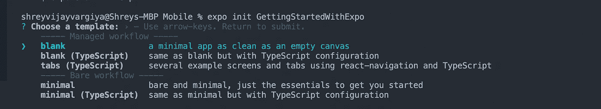

# Expo React-Native 入门

> 原文：<https://javascript.plainenglish.io/getting-started-with-expo-react-native-615d32c72b5?source=collection_archive---------12----------------------->

## 使用 Expo React Native 创建您的第一个移动应用程序


[Read all the articles](http://i-hate-reading-logs.vercel.app/)

大家好，我已经完成了整个 firebase 认证系列的文章，其中我已经介绍了使用 Firebase 提供的几乎所有方法进行认证。

```
You can read more here => http://i-hate-reading-logs.vercel.app/
```

今天我们石婷共出了一个新系列，即 React-Native。我将会利用世博会([https://docs.expo.io/](https://docs.expo.io/))来掩盖那些反动的本土文章。

# 概观

1.  通过创建帐户开始使用 expo
2.  全局安装所需的软件包
3.  设计存储库的架构并编写代码
4.  在物理设备上运行和调试应用程序。

# 入门指南

要安装 expo，你可以参考这个链接(【https://docs.expo.io/get-started/installation/】T2)否则我也解释下面的过程。

首先，在 expo.io 网站上创建一个帐户总是好的。虽然你不需要，但我建议你创建一个。然后在您的系统中全局安装“**Expo-CLI”**NPM 软件包。expo-cli npm 有助于在整个系统中运行 expo 命令，从而帮助您使用 expo 提供的所有现成的帮助。运行以下命令全局安装软件包。

```
yarn global add expo-cli
```

> 注意= >运行上述命令后，无论您使用的是 mac 还是 windows，请在关闭它们后重新打开您的**终端**或 **Powershell** ，否则您的系统将给出**“Command Not Found”**错误。

# 全局测试命令

重新打开终端(mac 用户)和 Powershell (windows 用户)后，运行以下命令检查安装状态。

```
expo whoami
```

如果在安装软件包并在 expo.io 中创建帐户后一切正常，您可以看到您登录的电子邮件。


Expo dashboard after creating an account

# 创建项目

Expo 提供了为 react-native 移动应用程序创建样板文件的命令。运行以下命令创建一个 expo 项目。

```
expo init {name_of _the_project}
```

运行此命令后，您将提示一些基本的模板选项供选择，如下所示。



Boilerplate templates list provided by expo before initiating the project

选择需要的一个模板，点击**进入。**对于示例项目，我将继续使用“**最小**”模板。这将创建项目名称为{项目名称}的样板文件。您的样板模板将具有如下图所示的架构。


First Expo application

很简单，不是吗。Expo 实际上已经为您完成了所有必要的步骤，因此您可以直接开始编写代码。

# **测试&调试**

要运行代码并在物理设备上进行测试，请确保满足以下要求—

1.  世博会移动应用安装在您的手机上。([https://apps.apple.com/us/app/expo-go/id982107779](https://apps.apple.com/us/app/expo-go/id982107779))
2.  您的手机和笔记本电脑应该连接到同一个互联网。

一旦满足上述要求，您就可以进入 expo 文件夹并运行以下命令。

```
**expo start**
```

# 在后台

该命令将创建整个应用程序的 js 捆绑包，并将其上传到 expo 服务器上，然后在通过您的手机扫描 expo 服务器二维码后，您可以在您的 expo 移动应用程序中下载该 JS 捆绑包，并在您的手机上运行。Expo 在 localhost 门户上创建 metro bundler，以显示建筑过程状态。此外，您也可以通过电子邮件和扫描二维码(如下图左下角所示)从麦德龙 Bundler 共享应用程序链接。


Metro bundler running on localhost after running command expo start inside my project

扫描二维码后，Expo 将构建一个反应本地应用程序的 JS 捆绑包，如下图所示。


JS bundle building process in the Metro Bundle

# **调试**

如果一切都没有相应地工作，这里可能会有一些调试问题的提示-

*   检查您的电话互联网和系统互联网，它们应该连接到同一个 IP
*   检查节点包版本，它应该大于 8
*   对于 mac 用户，你确实需要安装 Watchman 和 Git
*   对于 Windows 用户，您确实需要安装 Powershell &纱线

如果一切都如预期的那样运行，您会看到您的应用程序运行在一个物理设备上，如下图所示。


Expo application on my phone

# 结论

我试图让这篇文章简短明了，试图让你理解安装过程，并从 Expo 开始，所以我没有在架构的上下文中涉及任何进一步的步骤，也没有在代码库中进行更改。我将在以后的文章中讨论这些问题。

直到下一次，祝大家有愉快的一天。

```
Code Repository => [https://github.com/shreyvijayvargiya/iHateReadingLogs/tree/main/TechLogs/Mobile](https://github.com/shreyvijayvargiya/iHateReadingLogs/tree/main/TechLogs/Mobile)
```

*更内容于* [***通俗地说就是***](https://plainenglish.io/)