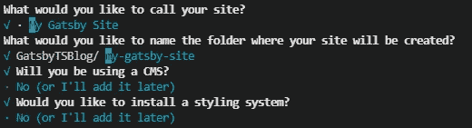

# 如何开始使用 GatsbyJS 和 TypeScript

> 原文：<https://javascript.plainenglish.io/getting-started-with-gatsbyjs-and-typescript-11838c853577?source=collection_archive---------20----------------------->

*TL；DR:将您的文件从。js 到. tsx.*


Photo by [Adeolu Eletu](https://unsplash.com/@adeolueletu?utm_source=unsplash&utm_medium=referral&utm_content=creditCopyText) on [Unsplash](https://unsplash.com/s/photos/javascript?utm_source=unsplash&utm_medium=referral&utm_content=creditCopyText)

[GatsbyJS](https://www.gatsbyjs.com/) 是一个静态站点生成器库，与 Next.js 和 Nuxt.js 放在同一个括号中，它提供了出色的开发人员体验，并试图使部署尽可能简单，以便您可以专注于更重要的任务。

盖茨比的常规体验是在 JavaScript 中。但是由于 [TypeScript](https://www.typescriptlang.org/) 提供了一些更好的特性，比如类型化编程，开发者可能想尝试一下。谢天谢地，盖茨比让我们很容易使用它。

# 装置

Gatsby 提倡向 TypeScript 的过渡是渐进的。因此，它提供了简单地将`.js`文件更改为`.tsx`文件的可能性。这使得在 Gatsby 中开箱即用地使用 TypeScript 变得非常容易。

我们通过常规方式安装盖茨比来开始我们的新项目。我们首先需要使用 NPM 安装 Gatbsy CLI 工具。

```
npm install -g gatsby-cli
```

如果你想了解更多关于 CLI 工具的信息，你可以在这里输入`gatsby --help`或者查看文档。

我们现在可以用 CLI 工具创建一个新的 Gatsby 项目。

```
gatsby new
```

你会看到一堆选项，我会选择它们的默认值，在大多数情况下是“否”。



These CLI-tool options will be presented to you.

安装盖茨比需要的所有东西可能需要一点时间。但是当安装完成后，您可以进入新创建的文件夹，并通过再次调用 CLI 工具来运行项目。

```
gatsby develop
```

或者，如果您愿意，或者如果您不能全局安装 CLI 工具，也可以使用 NPM 运行项目。

```
npm run develop
```

在您最喜欢的浏览器中浏览到`localhost:8000`，查看基本网页。你可以在`/src/pages/index.js`找到这个文件。

现在，让我们改变我们的索引页面，这样我们就可以使用 TypeScript 了！

将`index.js`改名为`index.tsx`。

嗯，事实上就是这样。你可以通过编辑你的文件来检查它，实际上包括一些类型脚本语法，它就会工作。您可能还想从`gatsby`导入`PageProps`。

在这种情况下，路径将只返回一个斜杠。

这可能是我见过的最简单的 TypeScript 实现。当您想要在现有项目中逐步添加更多的 TypeScript 时，我真的可以看到这是如何工作的。

# 结论

TypeScript 已经存在了。很有可能。并且像 Gatsby 这样的库和框架需要使它尽可能容易地在您的项目中实现。Gatsby 以其开发人员体验的前瞻性想法，使我们很容易做到这一点。

非常感谢您的阅读，祝您度过美好的一天。

*更多内容尽在*[*plain English . io*](http://plainenglish.io/)