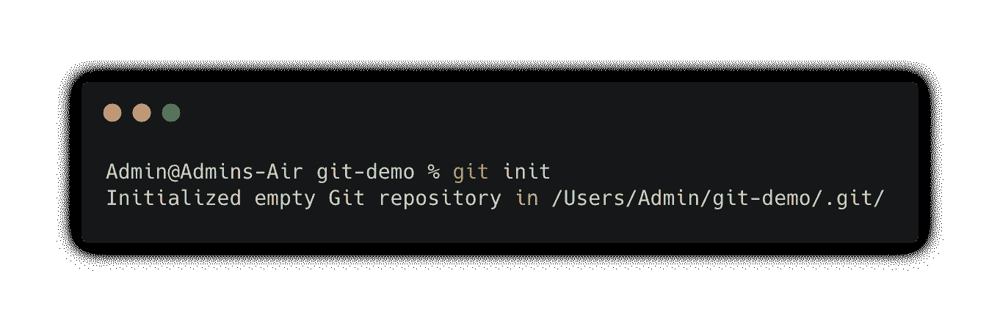
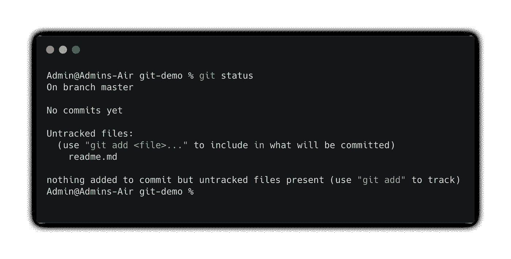
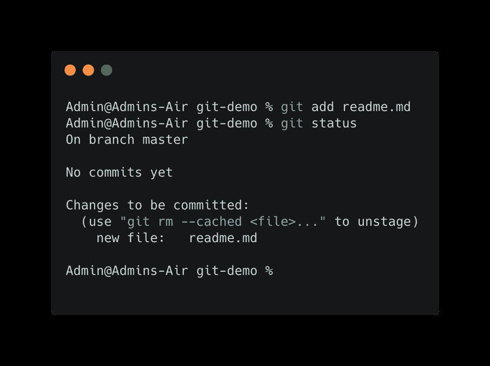
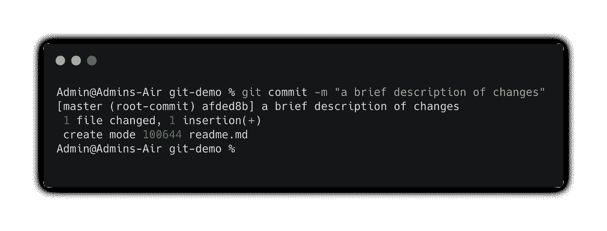
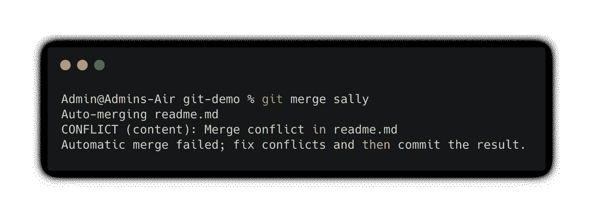
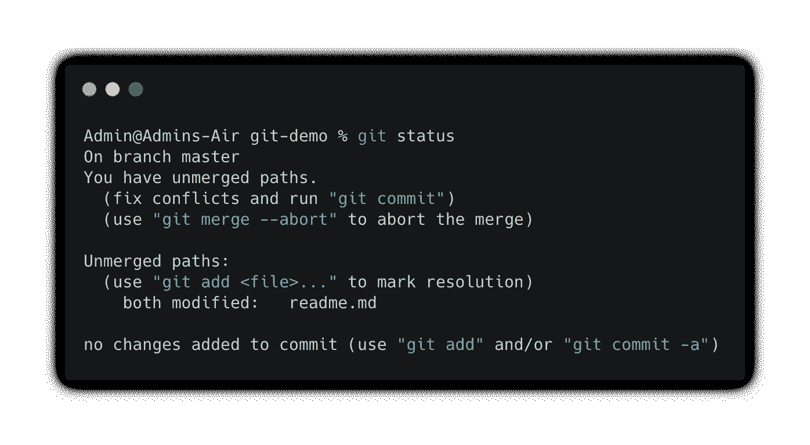
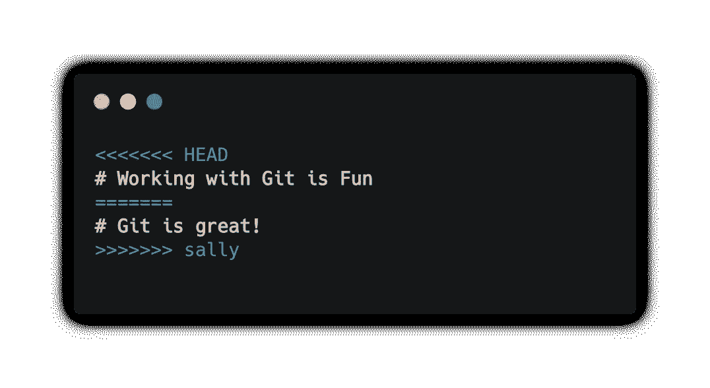

# Git 入门

> 原文：<https://javascript.plainenglish.io/getting-started-with-git-1e2abdd5db2b?source=collection_archive---------17----------------------->

## 开始使用 Git 并感到舒适的第一天指南


一般来说，我不建议*马上优先记忆任何特定的语法，但是如果你想在 2021 年及以后进入科技行业，你几乎肯定会遇到某种版本控制系统..有所准备总是好的，对吗？*

在我们深入探讨这个问题之前，理解 Git 是什么以及我们为什么要使用它以便更有效地使用它是很重要的。同样需要注意的是，Git 与 GitHub 或 GitLab 不是一回事。

Git 已经成为这个领域中最酷的孩子有一段时间了，虽然有一些 Git 的替代品，但它似乎不会很快从顶端退下来。它被采纳为行业标准的一些主要原因是它的分支和合并功能、[工作流的变化](https://git-scm.com/about/distributed#distributed)、数据保证，以及闪电般的速度和开源。

## Git 到底是做什么的？

用简单的英语来说，当*只有当*我们也告诉它时，Git 才会给我们的代码拍快照。有了这个快照，我们可以做一些事情，比如比较变化&将它与来自我们团队成员的其他快照合并等等。

Git 在与 GitHub 或 GitLab 协作使用时变得非常强大，因为它们都提供了一个图形界面，这几乎总是比终端更受欢迎。这两种界面都提供了各自独特的好处，但在很大程度上，它们服务于相同的总体目的。

# Git 入门

对于这些事情，我更喜欢“亲自动手”的方法，所以我们将在讨论每个核心主题时演示它们。在本次演示的大部分时间里，我们将使用终端。

**旁注—安装 Git。**Git 不会默认安装在您的计算机上，为了验证我们是否安装了 Git，我们可以从终端内运行`git --version`。如果什么都没有出现或者您收到一条`command not found`消息，您可能需要[安装 Git](https://git-scm.com/book/en/v2/Getting-Started-Installing-Git) 。

## 建立

为了使用 Git，我们需要一个目录来跟踪。我们可能不想跟踪与当前项目无关的文件，所以让我们运行`mkdir git-demo && cd git-demo`来创建和导航我们的新工作目录。

现在我们可以运行`pwd`来确认我们在正确的目录中，之后我们就可以*初始化 Git 了。*

Breaking down the shell commands used above

## 用 Git 初始化存储库

要开始用 Git 跟踪变化，我们必须首先告诉它从哪里开始跟踪。从最外层的工作总监，我们可以运行`git init`并且我们应该看到类似这样的响应。



Begin tracking changes with Git

另一种验证我们用 Git 跟踪目录的方法是运行`ls -a`命令。如果一切都好的话，我们应该看看这个列表中的`.git`文件。

# 使用 Git 跟踪更改

就目前的情况而言，我们真的没有什么可跟踪的。让我们从终端运行 Shell 命令`touch file_name`来创建一个新的自述文件。我们也可以立即向该文件中添加一些文本。

```
touch readme.md
echo "# Git Demo" >> readme.md
```

酷，如果我们打开这个文件，我们会看到我们的文本`# Git Demo`印在第一行。让我们看看吉特对此有什么看法！在终端内，让我们运行`git status`来检查我们项目的当前状态。这个命令将告诉我们 Git 在跟踪什么，以及修改了什么或者最近添加了什么。在这种情况下，我们应该看到这样的东西。



Checking the status of Git

*值得一提的是，每条 git 信息都有很大的帮助和描述性，一定要花时间通读每一条信息，尤其是在感觉迷失的时候！*

根据 Git，我们的工作目录中有一个未跟踪的文件。这是意料之中的事，因为我们需要告诉 Git 我们创建、更新和删除的每个文件。此时，您可能会认为这听起来像是一项艰巨的工作，但不必担心，因为这并不一定像听起来那么复杂。

让我们告诉 Git 开始跟踪这个文件的变化。

```
git add readme.md
```

运行该命令后，我们一眼就能看出没有任何变化。我们可以通过再次运行`git status`来验证上述命令。这一次，我们的反应应该是这样的:



Tracking a new file via Git

如果我们有多个文件甚至整个子目录需要跟踪，该怎么办？下面是我们上面使用的`git add file_name`命令的一些替代方案，它们更适合大批量转移文件和目录。

Alternative git add commands

# 创建快照

下一步是实际创建快照，以便与其他快照进行比较。一旦我们将文件添加到暂存区，我们就可以拍摄快照或`commit`我们的更改。

```
git commit -m "a brief description of changes"
```

这个可能看起来有点复杂，这里我们将向这个快照添加一条消息，该消息将被附加到我们添加到分段的每个文件中。(记得我们运行`git status`的时候)在这个特殊的例子中，我们应该看到类似这样的响应~



Snapshotting a file using git commit

*有时我们会变得健忘，忘记在提交消息中添加* `*-m*` *标志。在这些情况下，默认情况下，我们会看到一个 vim 编辑器，这只是编写提交消息的一种不同方式。在这里我们可以输入一条消息，完成后我们可以点击* `*esc*` *，然后点击* `*:wq*` *退出编辑器并保存我们的提交。*

git staging references

您可能已经注意到，如果在提交后立即运行`git status`，您将看到类似于`nothing to commit, working tree clean`的响应，这不是错误。它只是告诉我们，自上次提交以来，我们没有对文件进行任何更改。

## 入住


Owens River, CA

目前为止你过得怎么样？希望没有拖得太久，你还和我在一起。这里有一张我最喜欢的地方的漂亮照片，提醒你停下来欣赏你所在的地方。🌴

## 跟踪文件的一个很好的经验法则

对某些人来说，这似乎有点过分，但是如果你问我，我会告诉你用描述性消息提交你所做的每一个工作变更，这在以后肯定会派上用场。

# 使用分支

让我们稍微讨论一下分支。现在，我可能不是谈论这里所有不同方法的最佳人选。这一点不太重要，因公司而异。重要的是基本面，你应该对基本面感到舒服。

> 我们在 git 中使用分支的主要原因是为了防止重大变更进入生产构建。

因此，让我们也获得一些使用分支的实践经验。首先，一些角色扮演。假设我们有两个开发人员，*西蒙和莎莉。*每个人的任务都是更新当前自述文件的标题，使其更加引人注目。

让我们先从 Simon 开始扮演一下这两个角色。首先，我们想要创建分支，从那里我们可以告诉 Git 切换到新的分支，这样我们就可以对我们的目录进行一些实验性的更改。

```
git branch simon
git checkout simon
```

第二个命令应该向终端`Switched to branch 'simon'`或您选择的分支机构名称打印一条消息。这个消息是确认我们不再在先前的分支上，并且可以开始进行改变。根据工作要求，让我们将本自述文件的标题更新为更醒目的名称。

```
echo "# Working with Git is Fun" > readme.md
cat readme.md
```

注意单个的`>`覆盖，而`>>`追加。还要注意`cat`命令与 cats 没有任何关系，相反，它直接在终端中打印文件的内容。相当甜蜜！

让我们不要忘记策划和实施这些变革！

```
git commit -a -m "updated title" 
```

此时，Simon 已经完成了他的任务，没有主管的批准，他不能合并他的新头衔。现在，让我们回到主分支机构。

```
git checkout master
```

接下来，我们将关注王汝汀任务，由于上层管理人员的某种形式的误解，该任务与西蒙斯的任务相同。🤔

让我们也为 Sally 创建一个新的分支，之后我们可以更新标题并提交我们的工作。

```
git checkout -b sallyecho "# Git is great\!" > readme.md
git add .
git commit -m "modified project title"
```

# 合并分支和合并冲突

在这一点上，我们可以承担领导开发的角色，他可能会处理更大的决策，例如主分支中的最终结果。

首先，让我们验证我们是否在`master`分支上，如果不是，让我们检查一下。

接下来，我们可以开始将西蒙斯分公司合并到`master`分公司。下面的命令完全按照它所说的去做，将两个独立的分支合并到一起。

```
git checkout master
git merge simon
```

进行得很顺利，也不算太糟。这当然不是一个复杂的概念。如果我们运行`cat`命令，您将看到`master`分支已经更新，以反映`simon`的内容，并有效地覆盖了之前在`master`分支上的内容。

但是等等！我们刚刚从 Sally 那里得到一个更新，她也为这个项目提交了一个新的标题！经过仔细审查，团队同意使用 Sally 的标题。我们的下一步是将名为`sally`的分支合并到`master`中，对吗？就这么办吧！

```
git merge sally
```

这次没有第一次顺利，而且`Automatic merge failed`看起来肯定是个错误。还记得我们之前谈到的，Git 有非常详细的描述性消息，在这种情况下，我们在 readme.md 文件中有一个合并冲突，我们需要手动解决。



merge conflicts with git

发生什么事了吗？让我们运行一个我们现在应该熟悉的命令，`git status`来检查这个目录的当前状态。



请注意，此消息为我们提供了几个选项，我们可以将其用作“后续步骤”。在这种情况下，我们不想中止，这样我们就只剩下第一个选项了。让我们试试这个。

在下一步中，我们需要在文本编辑器中打开`readme.md`文件，你的操作系统上的默认文本编辑器会完成这项工作。打开文件后，你会看到一些不同的东西，然后我们告诉它写！



Resolving merge conflicts

乍一看，这可能是一种令人困惑的状态，尤其是在处理大量和多重冲突时。如果我们花点时间通读一下这个冲突，我们会看到 Git 正在尽最大努力比较这两个分支，因为它无法自动合并这两个分支，它需要我们来决定采取哪条路径。

我们已经同意不使用 Sally 的标题，所以让我们手动删除所有不需要的部分。这一步记得要注意！

一旦我们删除了所有未使用的位，我们就可以像往常一样自由地准备和提交这些更改，我们又回到了正轨。

```
git commit -a -m "resolved merge conflicts"
```

# Git 配置

我们将快速完成这一步，因为您只需要设置一次。如果你已经这样做了，也许你可以利用这个机会快速复习一下。首先，让我们检查验证我们已经拥有的。

```
git config --list
```

我们真的只是想验证`user.name`和`user.email`是当前的和设置好的。如果它们不是我们所期望的。让我们使用`--global`标志来更新这些。尽量让这些符合你的 GitHub 和 GitLab 凭证。

```
git config --global user.name "John Doe"
git config --global user.email johndoe@example.com
```

这很有趣。如果你是这类事情的新手，我希望它已经足智多谋。这里讨论的所有内容都可以在[官方 Git 文档](https://git-scm.com/)中找到。