# GraphQL 和 Express 入门

> 原文：<https://javascript.plainenglish.io/getting-started-with-graphql-98302e2dea9e?source=collection_archive---------23----------------------->

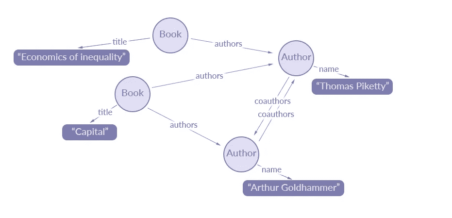

# 什么是 GraphQL *或者说*为什么是 GraphQL？

*(第一个念头:图+QL？为什么是图表？QL？一些语言？好了停下来。)*

GraphQL 是一种查询语言，它提供了一种请求数据的方式。)从服务器通过 [API](https://www.freecodecamp.org/news/what-is-an-api-in-english-please-b880a3214a82/) (嗯，听起来很简单！).[官网](https://graphql.org/)提供了很好的描述，这里:

> 它使客户能够准确地要求他们需要的，而不是更多，使 API 更容易随着时间的推移而发展，并支持强大的开发工具。

# **GraphQL Vs REST**

我们知道 [REST](https://www.codecademy.com/articles/what-is-rest) 模型已经统治 API 领域很长一段时间了。所以让我们看看 GraphQL 提供了什么。

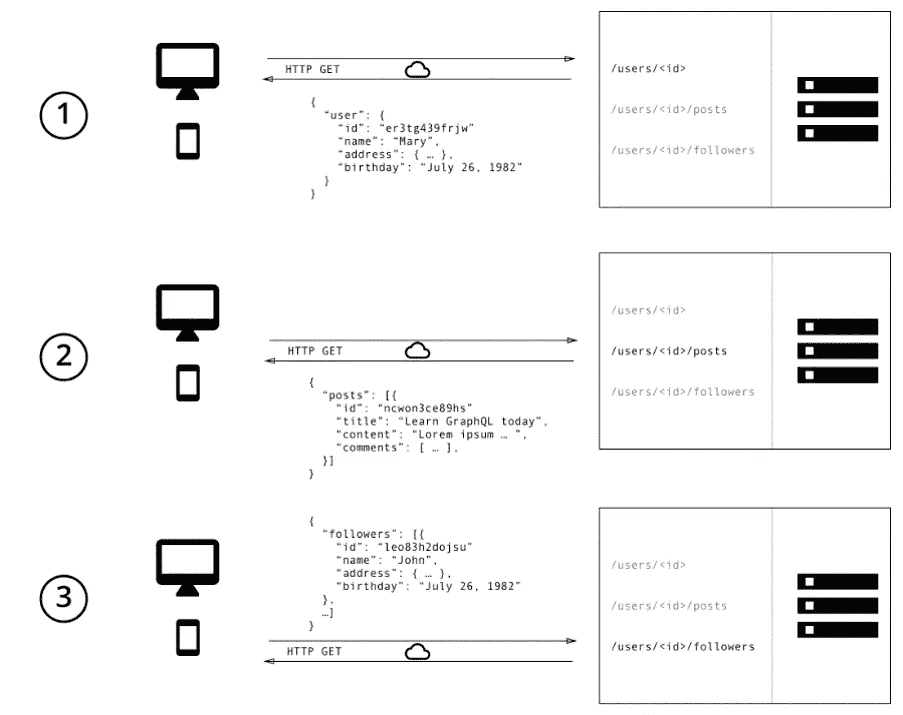

REST way of asking data

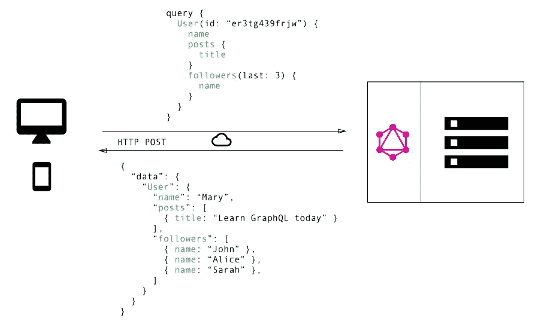

the GraphQL way

如图所示，当客户机与 REST API 集成时，为了请求多个任务的数据，客户机必须多次访问服务器。然而，当使用 GraphQL 时，我们可以只在一个查询中请求相同的数据*(是的，在 GraphQL 中一切都是 POST)。*

最重要的是，客户得到了他/她想要的东西。例如，客户端打算从数据库中获取图书。尽管 GraphQL API 能够获取所有的图书细节，但它只能获取客户要求的内容——书名。

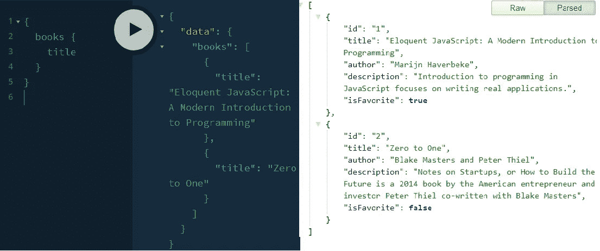

Graphql Vs REST

# GraphQL 的基础知识

模式定义语言 ( [SDL](https://www.prisma.io/blog/graphql-sdl-schema-definition-language-6755bcb9ce51) ):为了编写模式，GraphQL 有它自己的语言，简单而富有表现力。模式定义有两个主要部分:类型和字段

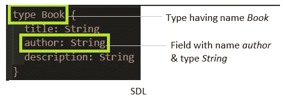

**查询**:正如我们已经看到的，使用 GraphQL 获取数据是灵活的。这意味着客户端需要向服务器发送更多的信息来表达他们的数据需求——一个查询。

**突变**:需要某种方式来改变后端(数据库)中的数据——graph QL 突变来拯救。正如您可能已经猜到的，有三种类型的变化——创建新数据、更新现有数据和删除现有数据。

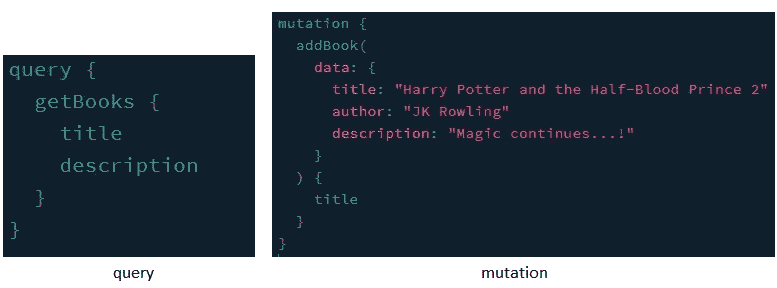

解决者:这是所有有趣的事情发生的地方。现在我们已经准备好了结构，我们可以在解析器函数下实现我们的*逻辑*。解析器是一个负责为模式中的单个字段填充数据的函数。

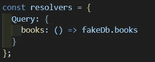

# *Hello World:创建我们的 GraphQL 服务器*

我们将使用 [Apollo](https://www.apollographql.com) (行业标准工具)来实现。
*(当然是 npm！)*

```
npm install **express**npm install **apollo-server-express**
```

> 在 **package.json** *，*的脚本*下，我们可以添加* :
> “开始”:“node server.js”

让我们通过在 ***server.js*** 中编写以下步骤来创建我们的 GraphQL 服务器

**步骤 1:** 强制导入并创建 express app:

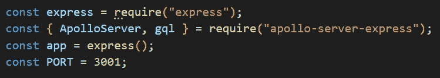

**步骤 2** :使用 GraphQL 模式语言构建模式

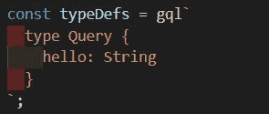

**步骤 3:** 为模式字段提供解析函数

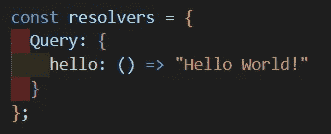

**步骤 4:** 创建提供 TypeDefs 和解析器功能的 graphQL 服务器

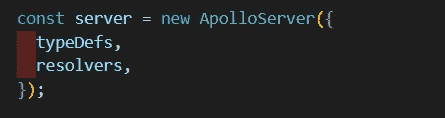

**步骤 5:** 与 express 集成并启动服务器

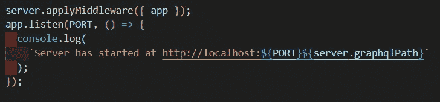

运行`npm start`，我们的 GraphQL 服务器应该在[http://localhost:3001/graph QL](http://localhost:3001/graphql)启动。

GraphQL 还有一个更酷的东西——playground。

> GraphQL Playground 是一个用于 GraphQL 查询的外部交互式编辑器。它基于 GraphQL，可通过 web 浏览器访问

在操场的左半部分，我们可以提供我们的查询(请求数据)并点击 play 按钮。如果一切正常，解析器的响应应该出现在右半部分。

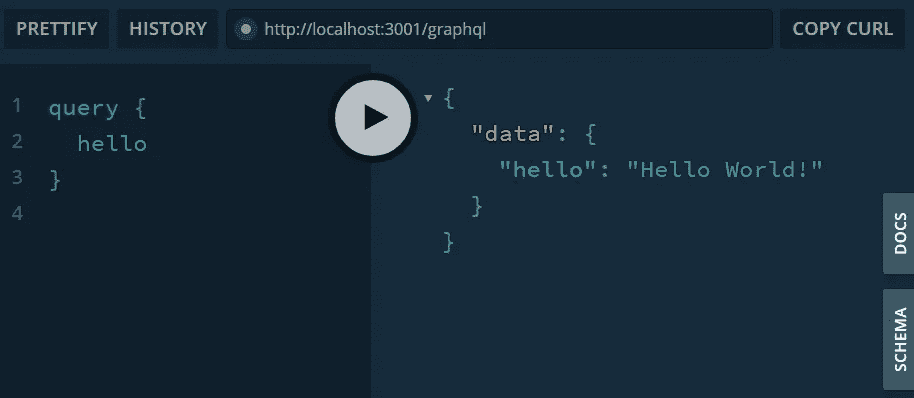

是的，你可以点击侧边的“模式”和“文档”来进一步了解。

欢迎使用 GraphQL！

*更多内容请看*[***plain English . io***](http://plainenglish.io/)