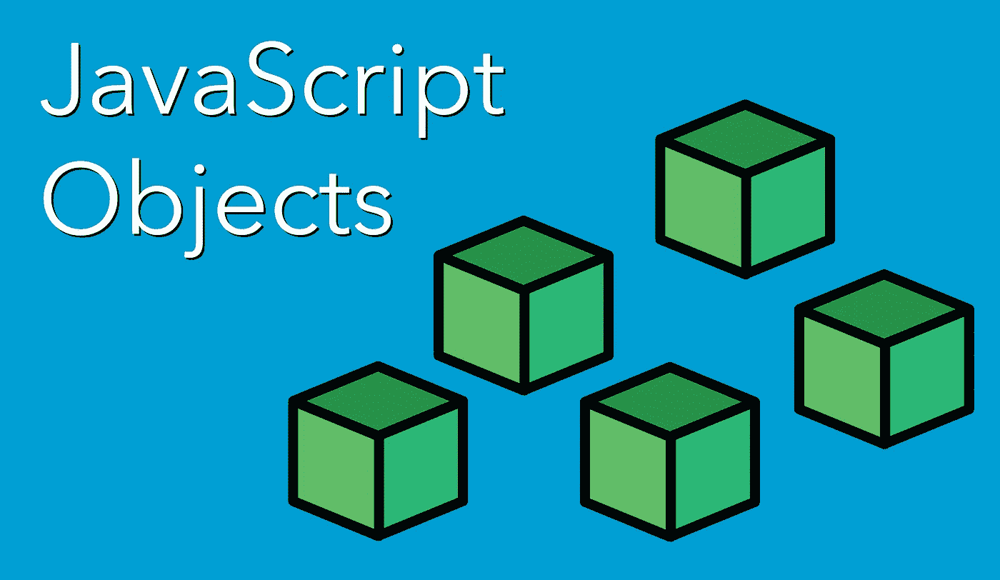

# JavaScript 对象入门——初学者指南

> 原文：<https://javascript.plainenglish.io/getting-started-with-javascript-objects-fe1268947100?source=collection_archive---------18----------------------->

## JavaScript 中的对象简介

JavaScript 中的对象在最基本的定义中是用来在键值条目中存储数据的。对象是 JavaScript 中许多程序的核心构建块，用于存储复杂数据、构建类以及作为面向对象编程的一个组成部分。在对象中，存储数据的键值称为对象属性。存储函数的键值称为对象方法。尽管对象可能非常复杂，但有几个重要的核心概念必须首先了解。



Getting Started with JavaScript Objects

本文介绍了 JavaScript 中关于对象的许多核心概念。本文随后是关于[对象](https://developer.mozilla.org/en-US/docs/Web/JavaScript/Reference/Global_Objects/Object)的 MDN 文档及其关于[对象基础](https://developer.mozilla.org/en-US/docs/Learn/JavaScript/Objects/Basics)的指南，这两者都是非常有用的资源。

## 创建对象

创建新对象有两种方法。第一种方法是使用对象构造函数创建一个新的对象。创建新对象的另一种更直接的方法是使用对象字面语法。

**对象构造器**

可以使用`Object`构造函数创建一个新对象，它接受一个将被对象包装的值。使用对象构造函数创建的没有值或者没有`null`或`undefined`的对象将创建一个空对象。

```
let myPlace = new Object();
myPlace; // {}let myPet = new Object({ type: 'dog', breed: 'terrier' });
myPet; // { type: 'dog', breed: 'terrier' }
typeof myPet; // 'object'
```

**对象文字**

通过使用对象语法为变量赋值，可以直接创建对象，而不需要对象构造函数。

```
const myPet = {
  type: 'dog',
  breed: 'terrier',
};myPet; // { type: 'dog', breed: 'terrier' }
typeof myPet; // 'object'
```

## 访问对象中的属性

从对象中访问属性有两种主要方式，*点符号*和*括号符号*。

```
const myPet = {
  type: 'dog',
  breed: 'terrier',
};myPet.type; // 'dog'
myPet['breed']; // 'terrier'
```

## 分配对象属性

使用点和括号符号，可以重新分配属性值或分配新的属性名称和值。也可以给一个属性指定一个自定义的名字，包括空格，但是这些必须用括号来表示。

```
const myPet = {
  type: 'dog',
  breed: 'terrier',
};myPet.breed = 'poodle';
myPet.name = 'Spot';
myPet['age'] = 4;
myPet['prizes won'] = 5;
myPet; // { type: 'dog', breed: 'poodle', name: 'Spot', age: 4, 'prizes won': 5 }
```

## 在对象中创建子对象

对象特性可以是任何类型的数据，包括另一个对象。它可以像其他属性分配一样进行分配。访问子对象的属性可以通过使用点和括号符号来更深入地查看对象。

```
const myPet = {
  type: 'dog',
  breed: 'terrier',
};myPet.owner = { name: 'bob', age: 32 };
myPet; // { type: 'dog', breed: 'terrier', owner: { name: 'bob', age: 32 } }myPet.owner.name; // 'bob'
myPet['owner']['age']; // 32
```

## 从对象中删除属性

可以给一个属性赋值`undefined`来删除它的值。要删除属性名和值，可以使用`delete`一元操作符来完成。

```
const myPet = {
  type: 'dog',
  breed: 'terrier',
};myPet.breed = undefined;
myPet; // { type: 'dog', name: undefined }delete myPet.breed;
myPet; // { type: 'dog' }
```

## 对对象使用方法(函数)

函数可以添加到对象中，当包含在对象中时，就称为方法。它们可以作为带有属性名的匿名函数添加。可以通过函数调用使用点符号来调用和执行方法。

```
const myPet = {
  type: 'dog',
  breed: 'terrier',
  communicate: function () {
    console.log('my pet communication');
  },
};myPet.communicate(); // my pet communication
```

方法可以引用对象中的属性，方法是使用关键字`this`来指示函数应该使用当前的对象上下文。

```
const myPet = {
  type: 'dog',
  breed: 'terrier',
  communicate: function () {
    console.log(`my ${this.type} communication`);
  },
};myPet.communicate(); // my dog communication
```

方法也可以接受在调用方法时传递给它的参数。

```
const myPet = {
  type: 'dog',
  breed: 'terrier',
  communicate: function (speak) {
    console.log(`my ${this.type} says ${speak}`);
  },
};myPet.communicate('bark'); // my dog says bark
```

## 对象方法

有几个[类](https://developer.mozilla.org/en-US/docs/Web/JavaScript/Reference/Global_Objects/Object#static_methods)和[实例](https://developer.mozilla.org/en-US/docs/Web/JavaScript/Reference/Global_Objects/Object#instance_methods)方法可供`Object`类使用。两个重要的类方法是 [keys()](https://developer.mozilla.org/en-US/docs/Web/JavaScript/Reference/Global_Objects/Object/keys) 和 [values()](https://developer.mozilla.org/en-US/docs/Web/JavaScript/Reference/Global_Objects/Object/values) ，可以用来返回一个数组，分别包含对象的每个属性的名称和值。

```
const myPet = {
  type: 'dog',
  breed: 'terrier',
  owner: {
    name: 'bob',
    age: 32,
  },
  communicate: function (speak) {
    console.log(`my ${this.type} says ${speak}`);
  },
};Object.keys(myPet); // [ 'type', 'breed', 'owner', 'communicate' ]
Object.values(myPet); // [ 'dog', 'terrier', { name: 'bob', age: 32 }, [Function: communicate] ]
```

## 结论

掌握 JavaScript 中的对象是必不可少的，因为大多数 JavaScript 程序都使用对象。理解对象创建、属性、方法和访问数据的基础知识将使在高级 JavaScript 程序中处理复杂的对象使用变得容易得多。

*更多内容请看*[***plain English . io***](http://plainenglish.io/)