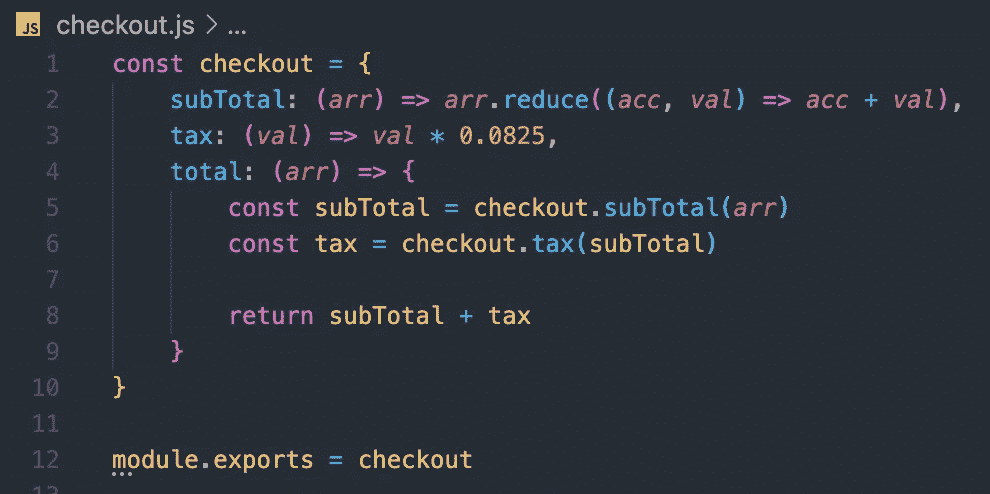
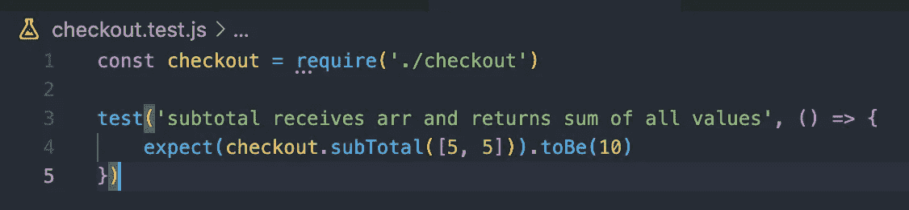
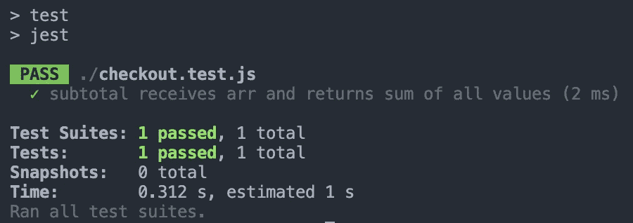
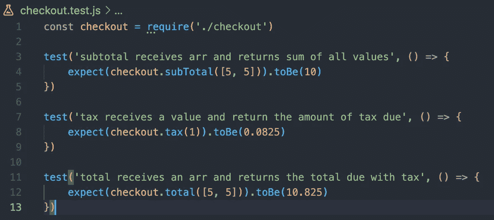
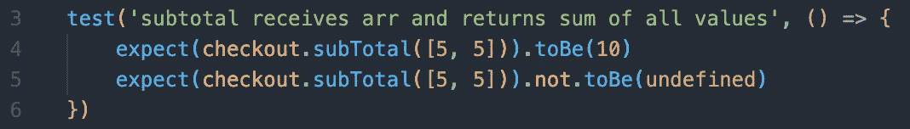

# Jest 入门

> 原文：<https://javascript.plainenglish.io/getting-started-with-jest-40d18796b8c7?source=collection_archive---------23----------------------->


photo by [Janko Ferlič](https://unsplash.com/@itfeelslikefilm) via [unsplash.com](https://unsplash.com/photos/sfL_QOnmy00)

我最近写了一篇关于我如何学习用 RSpec 测试我的后端的博文。我想继续学习，并把我新发现的测试技能转移到前端。

有很多前端测试者，但最让我印象深刻的是 Jest。我选择开始学习 Jest，因为它是由脸书开发的，开箱即用。此外，据我所知，它是最容易配置和快速运行的测试程序之一。

让我们深入研究一下，看看如何快速启动 Jest 并运行它，让它发挥一些很酷的功能。首先，在命令行上创建一个新文件，并将其放入 cd 中。运行:

```
npm install jest --save-dev
```

或者

```
yarn add --dev jest
```

然后在 package.json 文件中添加以下脚本:

```
// package.json"scripts": {"test": "jest"}
```

此时，您应该能够在 CLI 中运行`npm test`并看到 jest 正在工作，但是没有找到测试。让我们通过创建一个名为`checkout.js`的文件并添加以下代码来解决这个问题。



这很简单。我们用三种方法创建一个对象，`subTotal`、`tax`和`total`，其中`total`依赖于前两种方法。现在创建一个名为`checkout.test.js`的新文件，我们将在这里编写测试。这里的命名约定必须以`.test.js`结尾，这样 Jest 就知道在测试期间要运行哪些文件。

在我们的新测试文件的顶部，需要我们的检验文件，如下所示:

```
const checkout = require('./checkout')
```

这使我们能够访问我们的`checkout`对象和其中的方法。现在让我们编写我们的第一个测试或断言。



Jest 使用`test`关键字来定义一个测试。第一个参数是描述测试内容的字符串，第二个参数是运行测试的回调函数。

我们使用`expect`关键字创建一个断言，使用`.toBe()`匹配器告诉 Jest 我们期望这个断言等于什么。所以在第四行，我们断言在`checkout`对象中的`subTotal`方法，当传递一个两个值都等于 5 的数组时，将返回或等于 10。

在您的 CLI 中运行`npm test`，看看会发生什么。您应该会看到类似下面的屏幕截图。



在进一步阅读之前，你为什么不练习写一个税和总函数的测试。你想到了什么？

这是我想到的。



现在我可以说我已经为我的项目获得了 100%的覆盖率，但是如果我们想要改进这些测试并使它们更加简单呢？幸运的是 Jest 有一堆[匹配器](https://jestjs.io/docs/expect)可供选择，我们可以在每次测试中编写多个断言。

我发现一个有用的方法是`.not`方法，它可以与任何匹配器结合使用来测试相反的情况，就像这样。



我发现的另一件事是拥有一个以上的测试场景会很有帮助。例如，在使用`.toEqual()`匹配器时，我决定为我的`tax`方法使用不同的值。由于舍入错误，测试失败。多亏了扩展测试，我能够改进我的方法，使它更有弹性。

这就是 Jest 入门的全部内容，但是过几个星期再来看我的下一篇文章，在那里我将介绍 Jest 中的模拟函数。同时，请在下面留下评论，让我知道你找到的最喜欢的匹配器是什么，以及你打算如何使用它！

*更多内容请看*[***plain English . io***](http://plainenglish.io)