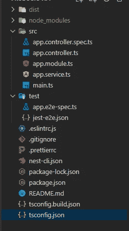

# NestJS 入门

> 原文：<https://javascript.plainenglish.io/getting-started-with-nestjs-application-overview-installation-setup-288e0e83c889?source=collection_archive---------3----------------------->

## 应用概述，安装和设置


NestJS

# **概述**

[NestJS](https://nestjs.com/) 是一个后端框架，构建在 NodeJS 和 ExpressJS 之上来创建服务器端应用程序，它最适合 REST API，因为使用 NestJS 运行 REST API 非常快。它使用现代 JavaScript，构建于 [TypeScript](http://www.typescriptlang.org/) (保持与纯 JavaScript 的兼容性)，并结合了 [OOP](https://en.wikipedia.org/wiki/Object-oriented_programming) (面向对象编程)、 [FP](https://en.wikipedia.org/wiki/Functional_programming) (功能编程)和 [FRP](https://en.wikipedia.org/wiki/Functional_reactive_programming) (功能反应编程)的元素。NestJS 的架构主要受 AngularJS 的启发。

**技术知识前提:**

*   现代 JS 编程方法的知识。
*   有使用 NodeJS、ExpressJS、Typescript 的经验(这不是必需的，但这将有助于您理解并快速运行)
*   使用 MongoDB 的经验，[猫鼬](https://www.npmjs.com/package/mongoose)
*   [装饰人员基本知识](https://www.typescriptlang.org/docs/handbook/decorators.html)

**对系统的要求:**

*   您需要安装 NodeJS & NPM (Node package manager)，您可以从[这里](https://nodejs.org/en/download/)下载最新版本。

## **开始**

首先，您需要安装 NestJS 的命令行界面(CLI ),它允许您在创建新项目时为 NestJS 创建一个框架项目，所以让我们先通过运行以下命令来安装它:

(如果您使用 NPM 作为软件包管理器):

```
npm i -g @nestjs/cli
```

(如果您将纱线用作包装管理器):

```
yarn global add @nestjs/cli
```

(注意:如果您正在运行 windows，您可能需要以管理员身份运行您的 cmd/bash，因为我们正在全局安装软件包。对于 Mac/Linux，只需在命令之前添加“sudo ”,然后它会要求您提供密码，键入密码，它就会安装软件包。)

现在，要使用 Nest-CLI 创建新项目，请在控制台中运行以下命令:

```
nest new products-api
```

一旦您运行这个命令，它将开始创建一个包含基本配置文件、GET 请求示例和测试用例的框架项目。

该命令创建完所有文件后，让我们进入该文件夹:

```
cd projects-api
```

下面是它的样子:



File structure of a NestJS boilerplate

让我们了解一下每个文件包含的内容及其含义:

package . JSON——与 NodeJS 项目相同，这是项目的核心，包含所有基本脚本、依赖项、开发依赖项和测试用例的进一步配置。(我建议在没有意识到自己在做什么的情况下，不要修改这里的任何东西)

ts config . JSON——它包含了所有的 typescript 配置，你可以在这里查看更多的。

nest-cli.json —它保存 NestJS CLI 配置，如果您想将源目录更改为任何其他目录，您可以从这里通过更改“sourceRoot”来完成。

main . ts——这个文件将是我们的 NestJS 应用程序的入口点，它将服务于从这里开始定义的所有内容。

app . Module . ts——这就是模块化的用武之地，你在这里添加的任何东西都将作为一个模块。您会注意到这里我们使用了“@Module”关键字，这是一个从 NestJS 导入的装饰器

```
Module({ 
  imports: [],
  controllers: [AppController],
  providers: [AppService],
})
```

简单地说

>控制器=您在控制器中定义的任何内容都将是路线

> providers =您在此定义的任何内容都将被用作在不同路由中使用的服务功能

> imports =如果您当前的模块依赖于任何其他模块，您可以通过在 imports 中添加该模块来让该模块知道

app.controller.ts —它包含可以使用“@Controller”和其他 REST 方法定义的路线，比如(@Get、@Post、@Put、@Patch、@Delete)

app.service.ts —它有将在控制器中使用的服务，因此这里定义的任何东西都可以在控制器中使用，您还可以在这里定义一些私有的助手函数，这些函数在类之外是不可访问的。

您将在 package.json 文件中看到一些预配置的基本命令，从中您将最需要以下命令:

*   在开发模式下运行您的应用程序
*   `npm run build` = >创建应用程序的生产版本
*   `npm run start:prod` = >在您的本地环境中运行实际的生产构建，您将需要首先创建一个构建。
*   `npm run format`，`npm run lint` = >这将根据为 prettier 和 eslint 定义的配置重新格式化您的代码
*   这将执行应用程序的所有测试用例，并向您显示测试结果的摘要。

为了准备开发你的实际 API，并使它与你的实际数据库一起工作，我将很快发布一个教程，敬请关注！

**更新:**如果你正在寻找用 NestJS 构建 REST API，请点击这里查看我的最新文章[。](https://lavshah.medium.com/rest-api-with-nestjs-using-mongodb-58150eef02a8)

## 结论

感谢阅读，如果这有助于丰富你的 NestJS 学习，请点击👏，如果您需要任何其他信息，请随时在下面发表评论！

非常感谢[塔奈·德赛](https://medium.com/u/b5064b236dfb?source=post_page-----288e0e83c889--------------------------------)帮助我开始这个系列。还有很多要做！

谢谢，祝你愉快！😃