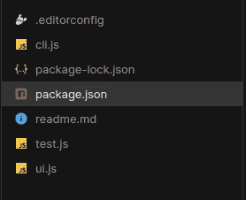
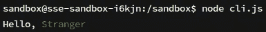
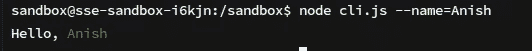
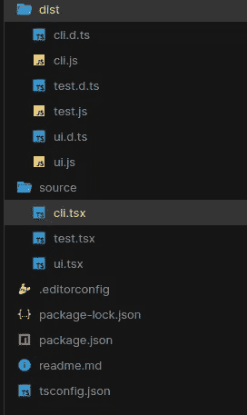
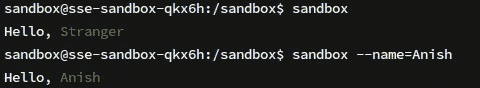

# React Ink 入门:使用 React 构建 CLI 应用程序

> 原文：<https://javascript.plainenglish.io/getting-started-with-react-ink-d8117f4c691e?source=collection_archive---------18----------------------->


您是否想过是否可以将 React 用于命令行界面(CLI)？是的，你可以！React 不仅用于 web 开发，还用于制作 Android 和 iOS 应用( [React Native](https://reactnative.dev/) )和 VR 应用 [(React 360)](https://github.com/facebookarchive/react-360#readme) 等等。React Ink 用于使用 React 构建 CLI 应用程序，非常容易上手，让我们开始吧。

# 创建 React 墨迹项目

对于这个例子，我将使用 [CodeSandBox](https://codesandbox.io/) ，但是您可以使用任何您想要的东西，只要您安装了 Node v10 或更高版本以及 npm。

```
mkdir react-inkcd react-ink
```

现在我们需要创建一个墨水应用程序，我们可以使用 [create-ink-app](https://github.com/vadimdemedes/create-ink-app) 来完成

```
npx create-ink-app
```

如果您使用的是旧版本的 npm，您可能没有安装 npx，在这种情况下，您可以安装并使用`create-ink-app` cli。

要安装 CLI，请运行以下命令:

```
npm install -g create-ink-app
```

然后，您可以运行以下命令:

```
create-ink-app
```

现在拍拍自己的背，你已经成功地创建了一个 React Ink 项目。

# 摆弄已启动的代码

这就是我们的目录结构应该看起来的样子-



让我们一个一个地看这些文件

首先，我们有`ui.js`。这是您编写 React 代码的地方。这是我们现在应该在文件中看到的-

首先 React 是进口的。文本是一个 JSX 组件，用于在 CLI 中显示任何文本。在这里，应用程序接受一个道具，名称，并说“你好，<name>”，如果名称被提供，否则它会说“你好，陌生人”。另外，请注意该名称是如何用绿色文本颜色进行样式化的。现在你可能会问 prop 这个名字是从哪里来的？如果你看到`cli.js`，你会找到答案。</name>

这里使用一个特殊的`importJSX`命令导入 App 组件。Meow 是一个允许我们制作交互式 CLI 的库。这里看一下*渲染*语句。正在创建一个 React 元素，其中 App 元素作为第一个参数被传递(即元素的 JSX 部分)，然后`cli.flags`是一个将被传递到元素中的道具箭头。这就是 prop 这个名字的由来。

现在如果我们运行*节点* `cli.js`，代码就会运行。不带参数运行它将产生以下结果-



现在让我们把名旗递过去。

`node cli.js — name=<yourName>`

用您的姓名替换您的姓名，并查看输出



Codesandxbox -

使用终端运行文件并忽略浏览预览

# 以打字打的文件

React Ink 也支持 TypeScript，这太棒了，让我们来看看。要用 TypeScript 启动 react-ink 项目，我们需要传入 TypeScript 标志。

首先，让我们制作一个目录并移动到其中

```
mkdir react-ink-tscd react-ink-ts
```

现在让我们创建一个 TypeScript React Ink 项目

```
npx create-ink-app — typescript
```

如果您使用的是旧版本的 npm，您可能没有安装 npx，在这种情况下，您可以安装`create-ink-app` cli 并使用它。

要安装 CLI，请运行以下命令:

```
npm install -g create-ink-app
```

然后，您可以运行以下命令:

```
create-ink-app — typescript
```

这一次目录结构明显不同-



我们有一个存储所有 TypeScript 文件的源文件夹。每当我们运行`npm start`时，TypeScript 被编译成 JavaScript，输出存储在`dist`文件夹中。其他大部分都是一样的。请记住， *dist* 文件夹中的`cli.js`文件是主可执行文件。

Codesandbox -

使用终端运行文件并忽略浏览预览

# 符号链接

您可能已经注意到，当您运行`create-ink-app`时，它会链接项目。到底发生了什么？创建了一个符号链接，允许您运行一个命令来调用这个特定项目的`cli.js`文件。如果您将您的目录名作为命令运行，您将看到与 TypeScript 中的`node cli.js`或`node dist/cli.js`相同的结果。

