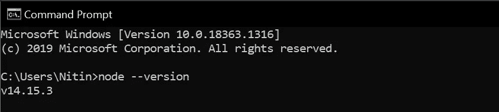

# 面向初学者的 React Native 入门

> 原文：<https://javascript.plainenglish.io/getting-started-with-react-native-for-beginners-958d39fee16a?source=collection_archive---------14----------------------->

## 学习所有你想知道的关于 React Native 的知识。


Photo by [Sydney Rae](https://unsplash.com/@srz?utm_source=medium&utm_medium=referral) on [Unsplash](https://unsplash.com?utm_source=medium&utm_medium=referral)

构建一个移动应用一点也不容易，是的，没有什么是容易的。如果你想成为一名应用程序开发人员，向你致敬。学习一门语言，输入代码，发现错误，测试它，一点也不容易。除此之外，世界上设备的多样性使得在每台设备上运行应用程序变得更加困难。

Android 和 iOS 是目前最受欢迎的两个平台。对于 iOS，我们要用 Swift 写，安卓用 Java 写。多亏了 React Native 和 Flutter，我们可以编写一段代码并在 Android 和 iOS 上运行。

今天我们将讨论由脸书团队开发的 React Native，它有一个很受欢迎的库，叫做 React。

# 那么，什么是 React Native 呢？

React Native 是一个应用程序开发框架，使用 web 技术来构建应用程序。如果你是一名网页开发人员，并开始在应用程序开发方面的道路，这将是一个优势。再说一次，你不必为 iOS 用 Swift 写代码，为 Android 应用用 Java 写代码。React Native 是来帮助我们的。

大多数热门应用都使用 React Native，比如脸书、Airbnb、Discord、Instagram、彭博、Wix，甚至 Skype。

# React Native 入门

对我来说，开始使用 React Native 很容易，我会尽力帮助你理解它。我告诉过你如果你是一个网页开发者，对你来说会容易得多。对于 React Native，您需要随代码编辑器和 Expo 一起安装 Node.js 和节点包管理器(NPM)。

就这样？是的。

如果你有什么不明白的，不要担心，我是来帮你的。

# 安装 Node.js

这里我用的是 Windows 操作系统。

如果您之前已经安装了 Node.js，那么您可以跳过这一部分，继续下一步。

Ryan Dahl 创建了 Node.js，并在 2009 年的欧洲 js 大会上展示了它。Node.js 是一个开源的跨平台 JavaScript 运行时环境。对于几乎任何类型的项目来说，它都是一个流行的工具。Node.js 在浏览器之外运行 V8 JavaScript 引擎，这是谷歌 Chrome 的核心。

它允许 Node.js 非常高效。

[](https://medium.com/dev-genius/intro-to-nodejs-and-why-you-need-to-learn-it-b4b629741a4c) [## 介绍 NodeJS 以及为什么需要学习它。

### 做一个使用 Node 的后端开发者。

medium.com](https://medium.com/dev-genius/intro-to-nodejs-and-why-you-need-to-learn-it-b4b629741a4c) 

你现在不必了解更多关于节点和 NPM，这不是一篇关于节点和 NPM 的文章。

那么现在，让我们来下载吧。

访问 [Node.js](https://nodejs.org/en/) 并遵循以下程序。


Source: Node.js

你可以看到两个版本，主要是最新版本和长期支持(LTS)版本。最新版本意味着它是新的，许多开发人员还没有使用它。大多数开发人员使用长期支持，因为它是稳定的，几乎没有错误。

这取决于你的选择。我更喜欢用 LTS 版本。

这是一个简单的下载和安装过程。

一旦你安装了 Node.js，就意味着你也安装了 NPM(节点包管理器)。

一旦你安装了它，你可以从命令提示符下检查它。打开命令提示符并键入

```
node --version
```



Source: Author

想玩吗？再次打开命令提示符，键入 node，然后输入，并键入

```
console.log(“Hello Everyone”); 
```


Source: Author

# 安装反应原生

一旦你安装了 Node.js，你也安装了 NPM (Node Package manager)。NPM 只是一个有节点的包。所以你不必下载它。

现在就从反应土著开始。打开您的命令提示符，并通过给定的命令全局安装 React Native

```
npm install -g create-react-native-app
```

该命令将使用 NPM 在全球范围内安装 React Native 软件包(-g)。您可以根据自己的选择将其安装到任何目录中。

要了解更多信息，您也可以访问[React Native setup 开发环境](https://reactnative.dev/docs/environment-setup)。

这是一个简单的 facebook 教程，用来创建一个反应型应用程序。

安装后，您可以根据自己的需要在 VS Code 或任何代码编辑器中编写代码。

# 从世博会开始

可通过 [React Native CLI 或使用 Expo](https://reactnative.dev/docs/environment-setup) 运行 React Native。

尼廷，我们选择什么？世博会，我的朋友。它是

1.安装简单。

2.开发者友好。

3.快点。

4.在您的手机上运行它

此外，不需要安卓工作室/XCode。

因此，如果您的电脑笔记本电脑不够强大，您也可以通过 Expo 运行它。

想了解更多，你可以参观[世博会](https://docs.expo.io/)。

**如何安装？**

打开命令提示符并键入

```
npm install — global expo-cli
```

该命令将在全球范围内安装 expo-cli。

**现在在你的手机上安装世博应用。**

打开应用商店或游戏商店，下载世博会。

就这样。

# 简单的 Hello World 应用程序

打开您的代码编辑器。我将去[使用 Visual Studio 代码](https://medium.com/dev-genius/why-visual-studio-makes-you-a-coding-expert-a-complete-guide-723e64e84ad5)。

我将在桌面上创建一个名为“反应原生”的文件夹。

并在 Visual Studio 中打开它。打开命令提示符，转到“反应本机”文件夹，然后键入

```
code .
```


Source: Author

然后按 enter 键，Visual Studio 代码将打开。

现在，我们将使用 VS 代码中的内置命令提示符。

键入 control + backtick，终端将弹出 VS 代码。

```
ctrl + `
```

现在使用以下命令创建您的第一个 React Native 应用程序。

```
expo init HelloWorld
```

它将在 React 本机文件夹内创建一个 HelloWorld 应用程序。按 enter 键，然后键入

```
cd HelloWorld
```

cd 表示更改目录或更改文件夹。

按 enter 键并键入

```
expo start
```

它会启动你的应用程序。

就这样。

现在，您将看到 HelloWorld 文件夹，如下所示。


Source: Author

在这里，您将主要在 App.js 中工作

在 VS 代码中打开 App.js，你会看到这样的结果


Source: Author

够酷了！在这里，我们可以理解它，因为我们是网络开发人员(不是我们所有人，而是你们中的许多人)。

你可以看到

```
<Text>Open up App.js to start working on your app!</Text>
```

如下所示进行更改。

```
<Text>Hello World!</Text>
```

通过以下方式在 VS 代码中打开您的内置终端:

```
ctrl+`
```

键入以下内容运行程序:

```
npm start
```

您也可以键入 expo start，而不是 npm start。

最后，您将看到一个类似的屏幕。


Source: Author

扫描世博会应用程序左下角的二维码。

我希望你喜欢这篇文章，并从中学到一些东西。这就是我的意图！

可以通过 [React Native 官网](https://reactnative.dev/)了解 React Native 的更多信息。

***如果你喜欢我的工作，想要支持，可以*** [***请我喝杯咖啡！***](https://www.buymeacoffee.com/nitinfab)

> 这个故事最初发表在 [Shitus。](https://shitus.com/introduction-to-react-native/)