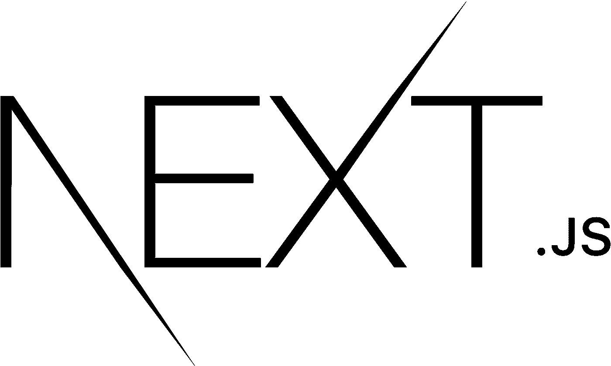
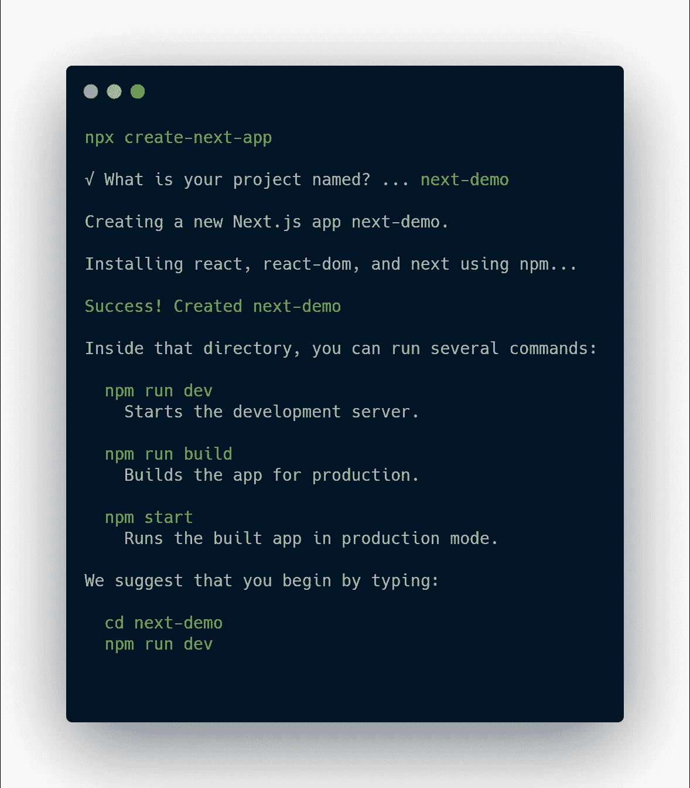
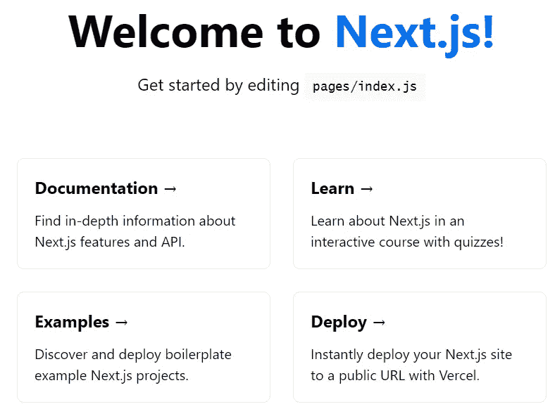

# 使用 Next.js 开始反应服务器端渲染

> 原文：<https://javascript.plainenglish.io/getting-started-with-react-server-side-rendering-using-next-js-ba9ed691fa85?source=collection_archive---------10----------------------->

## 一个全面的框架，用于增强您的 React 应用程序



Next.JS — From [Wikimedia Commons](https://commons.wikimedia.org/wiki/File:Nextjs-logo.svg)

Next.js 是一个开源的 web 框架，它支持服务器端呈现(SSR)以进行反应。SSR 是在服务器上而不是客户端上呈现**初始**网页的过程。

在处理完 JavaScript 捆绑包之前，客户端呈现的反应页面只有最少量的 HTML。

Typical **index.html** for a React app

加载页面时，您最初会看到一个空白屏幕。下载并处理 JavaScript 捆绑包，以生成呈现页面所需的 HTML。

JS 捆绑包是任何 React 应用程序不可或缺的一部分。以下任何一个因素都会增加加载它所需的时间，导致您的用户盯着空白页看的时间更长:

*   缓慢的互联网连接
*   大束尺寸
*   慢速处理器

SSR 旨在通过在将页面发送给客户端之前，在服务器上执行**初始**页面渲染来解决这些问题。这样，客户端收到的第一页包含所有预先呈现的 HTML，可以立即在屏幕上绘制。导致更快的加载时间和改进的搜索引擎优化排名。

# 获取设置

首先，您需要[安装 Node.js 10.13](https://nodejs.org/en/) 或更高版本。

然后打开您选择的终端，运行以下命令创建一个应用程序。

```
npx create-next-app
```

这将提示您为应用程序选择一个名称。然后，安装程序将自动在一个单独的目录中创建所有内容。



Create Next App — From [Carbon](https://carbon.now.sh/)

此时，您可以将 cd 放入目录并运行开发服务器。

```
cd next-demo
npm run dev
```

如果你去`localhost:3000`应该会有登陆页面迎接你。



Next App Default Page — Image by Author

您现在可以开始构建组件了，就像使用任何 React 应用程序一样。让我们来看看 Next.js 提供的一些特性，以及我们如何实现它们。

*Next.js 有完整的文档，在* [*这里*](https://nextjs.org/learn/basics/create-nextjs-app) *可以找到。*

# 按指定路线发送

Next.js 提供的一个很好的特性是其内置的路由系统。除了创建支持它们的相关页面和目录结构之外，不需要配置。

## 静态路由

内置路由器会自动将目录中的`index.js`页路由到其基本路由。这就是为什么在我们的初始设置中`index.js`映射到`localhost:3000/`。

以下示例说明了默认路由器对索引页的工作方式。

```
pages/index.js                 -->  /
pages/product/index.js         -->  /product
pages/product/books/index.js   -->  /product/books
```

## 嵌套路由

扩展我们现有的目录结构，让我们继续添加产品页面。在 pages 目录下，创建一个名为`product.js`的新文件。

```
pages/
  _app.js
  index.js      --> /
  **product.js** --> /productpublic/
styles/
```

Simple **/pages/product.js** page

如果您前往`http://localhost:3000/product`，这将带您进入产品页面。就这么简单！

## 动态路线

让我们更进一步，创建动态路线。我们可以通过使用一个[标签](https://en.wikipedia.org/wiki/Clean_URL#Slug)来标识我们的产品页面。

> 一个 slug 只是一个 URL 的一部分，它用人类可读的文字来标识一个页面。

你只需要将你的页面名称放在方括号`/pages/product/[slug].js`中。然后，可以从 Next.js 路由器对象中提取该参数。

```
pages/
  _app.js
  index.js
  product/
    **[slug].js**   --> /product/{your-slug-here}public/
styles/
```

你不必把这个叫做 **slug，**但是任何名字都适合你的应用。我们修改后的产品页面如下所示。

**/pages/product/[slug].js** dynamic route page

# 服务器端获取

如果您的页面在加载之前需要一些数据，您可以通过让服务器发出请求并向页面组件提供属性来优化这个过程。

这可以通过两种方式之一实现，具体取决于您想要注入页面的内容是静态的还是动态的。这些功能是在服务器端执行的，所以客户端永远看不到它们。

## 静态属性

`getStaticProps`函数将在**构建**时获取并缓存数据。然后，每当请求页面时，这些数据就准备好了。

假设我们想创建一个列出我们所有产品的页面。我们可以在路径`/pages/products.js`创建一个新页面，并让它加载静态数据。例如，我刚刚硬编码了一个虚构的 JSON 响应。

**/pages/products.js** page

如果数据在用户请求之前的**构建时间**可用，这是一个好方法。Next.js 使用 HTML 和 JSON 来缓存这些页面，使它们适合与 CDN 一起使用，这对于页面加载时间和 SEO 来说是非常好的。

## 动态性能

`getServerSideProps`函数实现了类似的结果，关键的区别在于这个代码块在每个页面渲染之前被执行**。**

使用与上面相同的例子，我们可以简单地将函数名改为`getServerSideProps`。该功能的一个更实际的用例是获取关于产品的特定数据。

假设我们希望在用户加载页面时加载更多关于特定产品的数据。使用`getServerSideProps`是一种合适的方法，因为我们可能希望在将来更新这些信息。改变正在销售的产品的价格可能就是这样一种情况。如前所述，`getStaticProps`只在**构建**时运行，所以我们不想在这里使用它。

**/pages/products/[slug].js** page

# API 路线

你想给你的 React 应用添加一些 API 路由，还是运行一些你不想让客户端访问的代码？Next.js 内置了对使用 Node.js 的 API 端点的支持。

您会注意到默认配置在`/pages/api/hello.js`提供了一个示例，它返回默认的 200 OK 响应。

Sample **hello.js** API File

如果您想要一些后端功能，那么您不再需要一个单独的应用程序！`/root/api`下的所有页面都遵循与页面相同的命名约定。这段代码将在 NodeJs 服务器上运行。

要创建一个产品 API，您将创建下面的文件`/pages/api/products.js`，并为任何请求导出一个处理程序。在本例中，我们将接受创建产品的 POST 请求，以及返回现有产品的简单 GET 请求。

**products.js** API file

# 更多支持的功能

Next.js 有许多高级特性，这些特性[在](https://nextjs.org/docs/getting-started)有很好的记录:

*   [静态页面生成和缓存](https://nextjs.org/docs/basic-features/data-fetching)
*   [I18n 国际化支持](https://nextjs.org/docs/advanced-features/i18n-routing)
*   [动态图像优化](https://nextjs.org/docs/basic-features/image-optimization)
*   [支持打字稿](https://nextjs.org/docs/basic-features/typescript)
*   [内置 CSS & SCSS 支持](https://nextjs.org/docs/basic-features/built-in-css-support)
*   [代码拆分和捆绑](https://nextjs.org/docs)

# 包扎

这只是 Next.js 附带的我最喜欢的功能的一小部分。你可以在他们的网站上找到功能和文档的完整列表。

所以，现在您应该非常精通使用 Next.js 来驱动您的下一个 React 应用程序了！我发现这是一个比使用 create React 应用程序更好的开发体验，并且它具有丰富的功能。学习曲线最初可能有点陡，但是一旦你掌握了窍门，它的好处绝对是值得的！

如果你喜欢这篇文章，并且愿意支持我成为一名作家，考虑注册[成为一名媒体成员](https://adam-galtrey.medium.com/membership)。每月只需 5 美元，你就可以无限制地阅读 Medium 上的所有文章。如果你[用我的链接](https://adam-galtrey.medium.com/membership)注册，我也会赚一小笔佣金。