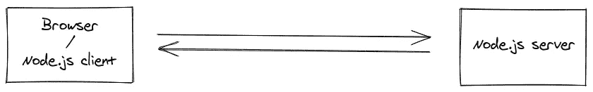
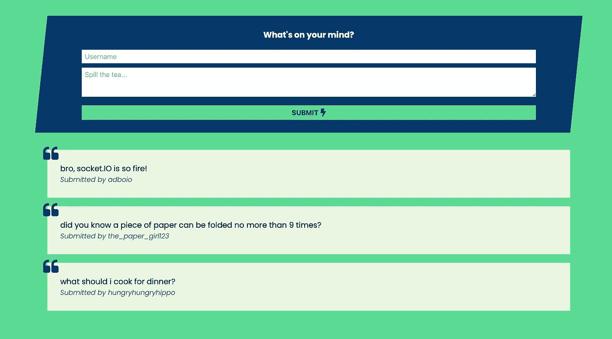
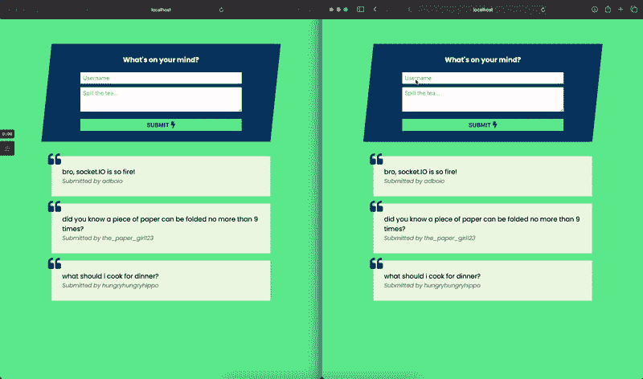

# 套接字入门。超正析象管(Image Orthicon)

> 原文：<https://javascript.plainenglish.io/getting-started-with-socket-io-fe8c7d404b9b?source=collection_archive---------6----------------------->


Photo by [Kelly Sikkema](https://unsplash.com/@kellysikkema?utm_source=unsplash&utm_medium=referral&utm_content=creditCopyText) on [Unsplash](https://unsplash.com/s/photos/socket?utm_source=unsplash&utm_medium=referral&utm_content=creditCopyText)

多年来，当我需要“实时”更新时，我让我的 web 应用程序轮询各种端点…老实说，这只是因为我不知道有什么更好的。

正如你可能想象的那样，随着时间的推移，这产生了大量的问题。我的服务器收到了大量不必要的请求，这些轮询请求不时会超时或返回错误，破坏了用户体验(有时用户甚至不知道)。

一个客户最近在重新设计管理面板时要求一堆实时数据，所以我决定寻找一个更好的解决方案，并找到了 [Socket。IO](https://socket.io) ！

# 什么是插座。木卫一？

在我看来，最简单的方法就是将它视为一种广播和监听服务器和客户端之间事件的方式——例如，就像你监听 web 应用前端的按钮点击一样。



Image from [socket.IO docs](https://socket.io/docs/v4/index.html)

具体来说，从他们的网站:

> 插座。IO 支持实时、双向和基于事件的通信。
> 它可以在任何平台、浏览器或设备上运行，同样注重可靠性和速度。

# 我为什么需要这个？

关于实时客户端-服务器通信，有很多*吨*的用例，但这里是我使用它的一些方式，以及一些其他想法:

*   当有新的文字信息进来时，立即更新聊天界面(另外利用 [Twilio webhooks](https://www.twilio.com/docs/usage/webhooks)
*   重要用户交互的通知，如联系人表单提交
*   实时分析图表
*   各种数据的报价器，如股票、追随者数量等。
*   协作文档应用，如[谷歌文档](https://docs.google.com/)或[代码共享](https://codeshare.io)

# 我确信。让我们开始建设吧！

太棒了。🙌

在本教程中，我们将创建一个简单的 Node.js/Express.js 应用程序，让用户提交包含用户名和消息的“评论”，并提供实时更新的“提要”。请随意复制下面的 starter 项目并直接跟随，或者跳过一点点进入使用 socket.IO 的内容。

如果您使用的是 Node.js 以外的框架:这里介绍的客户端代码和服务器端概念仍然完全适用。检查[插座。IO docs](https://socket.io/docs/v4/index.html) 中的其他语言&框架中社区维护的实现列表。

# 这个计划

在我开始写代码之前，我总是喜欢画出(至少在心里)我的应用程序将会做什么。这个很简单:

*   带有提交新评论的表单和显示所有评论的提要的用户界面
*   可以处理新评论提交并向客户端发送“新评论”事件的后端

# 启动项目

起始项目位于 GitHub 上的[处。您可以使用以下命令克隆它:](https://github.com/adboio/socket-io-starter)

```
git clone [https://github.com/adboio/socket-io-starter.git](https://github.com/adboio/socket-io-starter.git)
```

在您最喜欢的文本编辑器中打开它，您会注意到在`routes/index.js`中设置了两条路线:

1.  `GET /`用于呈现带有评论流的简单用户界面
2.  `POST /`提交新评论

为了确保正常工作，安装依赖项并启动节点服务器:

```
cd socket-io-starter
npm install
npm start
```

…然后在浏览器中导航到 localhost:3000。您应该会看到类似这样的内容:



通过填写表格并单击“提交”来测试意见提交。现在还不会发生什么，但是在终端中，您应该能够看到一个成功的 200 响应被发送回客户端，并且您的请求主体被记录下来(带有一个`username`和`comment`)。

如果有任何问题，退出节点服务器(`ctrl+c`)，确保安装了所需的依赖项(`npm install`)，然后重启服务器(`npm start`)。如果这不起作用，请在下面留言，我会尽我所能帮助你！

# 安装插座。超正析象管(Image Orthicon)

安装非常简单:

```
npm install socket.io
```

接下来，我们需要将它包含在我们的应用程序中，以便从所有潜在的路线轻松访问。一种简单的方法是定义套接字。IO 客户机作为我们的`app`对象的属性，然后将它附加到 http 服务器。我保证，这听起来比实际更复杂！注意下面**粗体**中的新行。

`app.js`:

```
// initialize the express app
var app = express();// add this line to initialize the socket.IO client, and set it as our app's `io` property
**app.io = require('socket.io')();**
```

`bin/www`:

```
// create the http server
var server = http.createServer(app);// add this line to attach the server to our socket.IO client
**app.io.attach(server);**
```

现在，在我们应用程序的任何地方，我们都可以访问套接字。通过简单引用`req.app.io` ⚡️的 IO 客户端

# 从服务器发出事件

看一下`index.js`里面的`POST /`路线。现在，它所做的只是记录请求的主体，并向客户端发送 200 响应。相反，让它在请求进来时发出一个`new comment`事件。

发出事件的语法如下所示:

```
req.app.io.emit('event name', eventData);
```

我们可以使用这个语法在发送回 200 响应之前发出一个包含评论的用户名和消息的`new comment`事件。

```
router.post('/', (req, res, next) => { console.log(req.body); **req.app.io.emit('new comment', {
    username: req.body.username,
    comment: req.body.comment
  });** return res.sendStatus(200);}
```

重新启动服务器，并尝试再次提交评论。从视觉上看，什么都没有改变，但是如果您仍然在终端中看到 200 响应，那么您就在正确的轨道上。

前进！🚀

# 监听前端的事件

这是真正有趣的地方，✨

首先，我们将包括插座。在我们的视图(`views/index.ejs`)中，就在结束的`</body>`标记之前，创建一个新的`io`对象，在紧接着的新脚本标记中称为`socket`。您可以[下载这个库](https://socket.io/docs/v4/client-installation/)并将其存储在您服务器上的某个地方，或者只是从 CDN 中包含它，如下所示:

```
 <!-- start writing your socket code below! --> **<script src="https://cdn.socket.io/4.1.2/socket.io.min.js" integrity="sha384-toS6mmwu70G0fw54EGlWWeA4z3dyJ+dlXBtSURSKN4vyRFOcxd3Bzjj/AoOwY+Rg" crossorigin="anonymous"></script>** **<script>
    let socket = io();
  </script>**</body>
```

为了监听来自服务器的事件，我们将使用一些熟悉的类似 jQuery 的事件监听器语法:

```
socket.on('event name', (data) => {/* do something */});
```

回想一下，我们的服务器发出一个名为`new comment`的事件。出于测试目的，以及快速增加血清素，让我们编写一个快速事件侦听器，将事件数据记录到控制台:

```
<script>
  let socket = io();

 **socket.on('new comment', (data) => {
    console.log(data);
  });** </script>
```

刷新页面，在浏览器中打开开发控制台(通常通过右键单击并选择“检查元素”，然后找到“控制台”选项卡)，然后提交新的评论。几乎在提交之后，您会立即看到控制台中记录的事件数据。大获成功！！🎊我们差不多完成了。

# 更新新事件的评论源

有很多方法可以做到这一点——请记住，下面介绍的方法并不是最容易维护的，可能不太适合您的项目的基础设施，但是对于演示来说，它非常有用😄

starter 项目在视图中有一些硬编码的注释，在`#comments` div 中。它们看起来像这样:

```
<div class="comment">
  <div class="message">bro, socket.IO is fire 🔥</div>
  <div class="username">adboio</div>
</div>
```

当`new comment`事件到来时，我们希望创建这些`div.comment`元素中的另一个，用用户提交的内容填充，并将其添加到现有的评论列表中。

我们可以这样做:

```
<script>
  let socket = io();

  socket.on('new comment', (data) => {
    console.log(data); **let newComment = `
      <div class="comment">
        <div class="message">${data.message}</div>
        <div class="username">${data.username}</div>
      </div>`;

    $('#comments').prepend(newComment);** });</script>
```

> 如果你不熟悉 JavaScript 模板文字(上面反勾```中的字符串)，MDN 文档有一个很好的解释。基本上，它们允许我们编写包含变量的字符串，如下所示:

```
let message = `Welcome, ${userName}!`;
```

> …而不是像这样连接字符串和变量:

```
let message = 'Welcome, ' + userName + '!';
```

# 现在，我们期待已久的时刻到了

刷新您的页面，在第二个窗口中打开应用程序，这样您就可以看到奇迹发生了。在一个窗口中，输入新的注释，然后检查它😍



# 恭喜你！🎉

花一秒钟拍拍自己的背，承认这个配音👊

是的，我意识到这个应用程序并不是最有用的……但是你已经成功地构建了一个全功能的 web 应用程序，它利用了通过 Socket.IO 实现的实时客户端-服务器通信。！

## 解决纷争

如果你在本教程中遇到了任何问题，请在下面留下你的评论，我会尽我所能帮助你。此外，如果您想参考，可以在 GitHub 上找到完整项目的源代码:

https://github.com/adboio/socket-io-tutorial

## 后续步骤

接下来你要做什么完全取决于你，但是这里有一些关于我如何使用 Socket 的细节。生产应用中的 IO:

*   我设置了一个端点来接收传入 SMS 消息的 Twilio webhooks，并将它们存储在数据库中。在这个端点中，在将成功的响应发送回 Twilio 之前，我发出一个`new message`事件，其中包含关于发送者的一些信息，以及一些其他细节:

```
req.app.io.emit('new message', {
  'user': {
    'name': `${user.firstName} ${user.lastName},
    'id': user.id
  },
  'body': body,
  'prettyTime': moment.tz(new Date(), 'America/Los_Angeles').format('MMM D [at] h:mm a')
});
```

…然后我在前端监听这个事件，构建一个新的消息元素，并使用 [tata.js](https://github.com/xrr2016/tata) 为每个新消息显示一个通知:

```
socket.on('new message', function(msg) {
  $('#unreads').prepend(createUnread(msg));
  tata.success('New message!', `from ${msg.user.name}`);
});
```

*   当管理员用户打开 SMS 对话线程时，会调用一个端点来将该线程中的所有消息标记为“已读”。在这个端点中，我触发了一个名为`read messages`的事件:

```
req.app.io.emit('read messages', userId);
```

…在前端，我可以监听此事件，并从未读邮件列表中删除这些线索:

```
socket.on('read messages', function(userId) {
  $('#unreads').find(`tr[data-user-id="${userId}"]`).remove();
});
```

## 你在建造什么？

最后，我喜欢听别人在做什么——请在评论中告诉我你打算如何使用 socket。IO 在你的下一个项目中！👋下次见！

# TL；速度三角形定位法(dead reckoning)

点击此处获取所有代码:

*   首发项目:[https://github.com/adboio/socket-io-starter](https://github.com/adboio/socket-io-starter)
*   最终项目:[https://github.com/adboio/socket-io-tutorial](https://github.com/adboio/socket-io-tutorial)

*更多内容请看*[***plain English . io***](http://plainenglish.io)