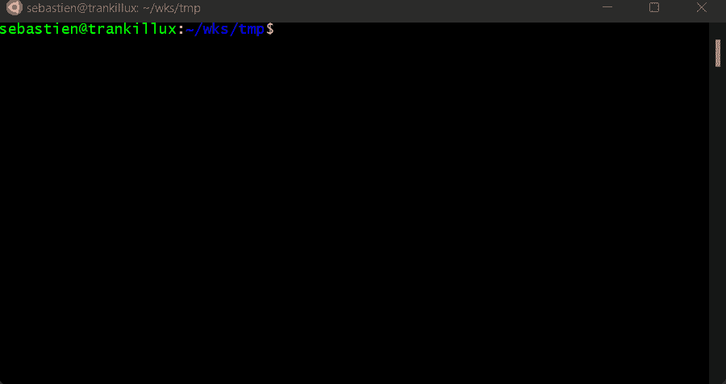
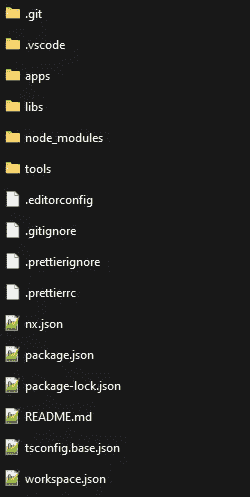
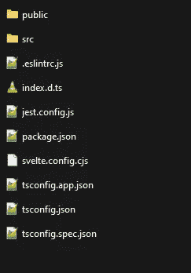
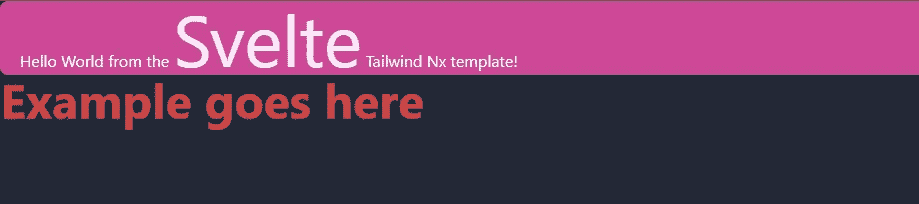

# 开始使用 Svelte、Tailwind 和 Nrwl NX

> 原文：<https://javascript.plainenglish.io/getting-started-with-svelte-tailwind-and-nrwl-nx-9c9c1ea32a54?source=collection_archive---------6----------------------->

## 强大的组合。

在本文中，我将向您展示如何使用 [Nrwl NX](https://nx.dev/) 创建一个[苗条](https://svelte.dev/)应用程序，以及如何安装/配置 [Tailwind](https://tailwindcss.com/) 。

Photo by [Ferenc Almasi](https://unsplash.com/@flowforfrank?utm_source=medium&utm_medium=referral) on [Unsplash](https://unsplash.com?utm_source=medium&utm_medium=referral)

顺风比以往更受欢迎。如果你一直关注我，你会知道我是你的超级粉丝。最近我开始探索苗条，想知道如何结合顺风。不仅如此，我还想用 Nrwl NX。这是我发现的总结。

这是一篇简短但非常实用的文章。如果你希望了解苗条/顺风是如何工作的，为什么你应该使用它，那么这篇文章不适合你。

# 战斗机

首先，我们将创建一个 [Nrwl NX](https://nx.dev/) 工作区来构建我们的项目。

一旦我们完成，我们将安装[苗条插件](https://nxext.dev/docs/svelte/overview/)到工作区，我们将使用它来创建我们的苗条应用程序。

然后，我们将安装 Tailwind 和一些支持工具(例如，PostCSS 和 autoprefixer)。之后，我们将配置 Tailwind、PostCSS 和我们的苗条应用程序。最后，我们将在应用程序中加载 Tailwind 的基本样式，并添加一些样式。

# 创建 Nx 工作空间

NX 是一个非常强大的工具，我在大多数项目中都使用它。NX 支持许多框架和编程语言。

创建 Nx 工作区就像运行以下命令一样简单:

`npx create-nx-workspace <workspace name>`

Creating a Nrwl NX workspace is dead simple

目前，NX 本身不支持 Svelte，所以我们需要创建一个空的工作区。`create-nx-workspace`命令应该为您生成以下结构:

这是 Nx 工作区的标准结构。关键要素是:

*   `apps`文件夹，稍后将包含我们的苗条应用程序
*   `libs`文件夹，我们可以用它来存放我们的 monorepo 的一部分，使它们可以在项目间轻松重用
*   `nx.json`文件，这是 Nx 的配置文件
*   `package.json`文件，我们可以在其中管理我们的依赖关系
*   `workspace.json`文件，这是我们的 Nx 工作空间的配置文件

# 为 Nx 安装苗条插件

既然我们的工作空间已经创建，我们需要安装由[张秀坤·派珀](https://twitter.com/dominik_pieper)创建和维护的[苗条社区插件](https://nxext.dev/docs/svelte/overview/)。这个插件使得在 Nrwl NX 工作空间中创建和构建苗条的应用程序成为可能。你可以在这里找到官方文档。

对于这个例子，我将使用`npm`，但是如果您愿意，也可以随意使用`yarn`。安装插件非常简单:

`npm install @nxext/svelte --save`

一旦完成，我们就能接触到图纸和建造者。

# 创建苗条的应用程序

NX 的苗条插件包括[一个示意图](https://nxext.dev/docs/svelte/schematics/application)，我们将使用它来创建我们的苗条应用程序:

`npx nx g @nxext/svelte:app app_name`

这个命令将生成应用程序并存储在`apps/<app_name>`文件夹中。随便选个你喜欢的名字。

在该文件夹中，您应该可以找到以下内容:

应用程序的代码可以在`src`下找到，而资产(例如，图像、字体、全局样式等)将进入`public`文件夹。

注意这个`svelte.config.cjs`文件。这是 Svelte 的配置文件。我们一会儿就改编它。

# 苗条的应用程序配置

在上一节中，我已经提到了您应该在`apps/<app name>`下找到的`svelte.config.cjs`文件。让我们来看看:

这个文件所做的就是导出一个配置对象来构建我们的苗条应用程序。默认情况下，它使用 [svelte-preprocess](https://github.com/sveltejs/svelte-preprocess) 包，这是一个 svelte 的预处理器，提供对 PostCSS、SCSS、TypeScript 等等的支持。

问题是:构建系统如何使用这个文件？要回答这个问题，我们需要看看 NX 工作空间根目录下的`workspace.json`文件。它已经被 NX 的 Svelte 插件更新了:

正如您所看到的，不同的目标(例如，构建和服务)使用一个特定的执行器:`@nxext/svelte:build`，它是由 NX 的 Svelte 插件提供的。那个执行器支持[许多选项](https://nxext.dev/docs/svelte/builder/build)。在上面的例子中，我们关心的是`svelteConfig`设置，它定义了用于 Svelte 的配置文件。

当我们使用 NX 构建苗条的应用程序时，会发生以下情况:

*   NX 加载`workspace.json`文件来了解不同的应用程序和库
*   它执行请求的操作(让我们想象一个苗条应用程序的构建)
*   当这个苗条的应用程序被构建时，NX 知道启动哪个执行器来处理咕噜人的工作
*   Svelte NX 插件执行器加载它的配置并注意到`svelteConfig`选项。它加载相应的文件(即`svelte.config.cjs`，并相应地更新它的默认构建配置

# 安装顺风

要安装 Tailwind，我们需要向我们的项目添加几个包，如官方文档[中所解释的:](https://tailwindcss.com/docs/installation)

`npm install -D tailwindcss@latest postcss@latest autoprefixer@latest`

我们还将安装几个额外的:

`npm install -D postcss-import@latest postcss-preset-env@latest node-sass@latest`

接下来，我们将配置顺风。

# 配置顺风

要配置 Tailwind，在 NX 工作区的根目录下创建一个名为`tailwind.config.js`的文件，包含以下内容:

该配置启用顺风的 [JIT 模式并正确配置 PurgeCSS。如果想了解更多，可以查看顺风](/why-tailwind-just-in-time-mode-is-a-game-changer-and-how-to-use-it-right-now-dubois-sébastien-182db2e64e26)的[官方文档。](https://tailwindcss.com/docs/configuration)

现在，我们需要配置 PostCSS。

# 配置 PostCSS

[PostCSS](https://postcss.org/) 是一个 CSS 处理器，Tailwind 依靠它来施展魔法。

关于 PostCSS 的细节超出了本文的范围，但是让我解释一下。你需要明白的一件事是，PostCSS 可以用来为 CSS 代码定义一个*处理管道*。管道的第一步接收您编写的 CSS，并以某种方式处理它。然后，下一步接收上一步的结果，并应用自己的处理。诸如此类。现在你知道了这一点，你就会明白下面配置中元素的顺序*确实很重要。*

继续在 NX 工作区的根目录下创建一个名为`postcss.config.js`的文件，内容如下:

这是做什么的？

*   首先，我们应用了`postcss-import` [插件](https://github.com/postcss/postcss-import#readme)，它在我们的 CSS 代码中增加了对`@import`语法的支持
*   其次，我们启用了 Tailwind 及其对 CSS 嵌套的[支持](https://tailwindcss.com/docs/using-with-preprocessors)
*   第三，我们启用了`postcss-preset-env`插件，它增加了对[和许多其他酷东西](https://github.com/csstools/postcss-preset-env)的支持

好了，我们的 CSS 处理管道已经配置好了！

# 加载我们的 PostCSS 配置

默认情况下，Nrwl NX 的苗条插件使用自己的苗条预处理配置。为了确保我们的 PostCSS 配置被加载，我们需要修改我们之前看到的 Svelte 配置文件。

打开`apps/<app name>`下的`svelte.config.cjs`文件，修改如下:

如您所见，我们所做的只是将一个配置传递给`sveltePreprocess`方法并定义`postcss`配置，将其与一个空对象相关联。我们这样做只是为了替换 Svelte NX 插件包含的默认`postcss`配置。这确保了加载我们自己的 PostCSS 配置。

# 在苗条的应用程序中加载顺风

我们已经准备好在代码中使用 Tailwind 了。

接下来我们需要做的是加载默认的顺风风格。为此，在`apps/<app name>/src`下创建一个名为`Tailwind.svelte`的文件，内容如下:

这里有几件事需要注意:

*   我们将样式标记为`global`,以确保它们在全局范围内得到应用
*   我们已经设置了`lang="postcss"`来声明我们正在使用 PostCSS
*   我们已经使用`@tailwind`指令加载了 Tailwind 的全局样式

接下来，我们需要在`App`组件中加载并使用我们的顺风组件。打开`src/<app name>/src/App.svelte`文件，修改内容如下:

我们在这里做的只是导入`Tailwind.svelte`文件，并使用它。

我们完成了配置！太好了。

# 运行应用程序

要运行该应用程序，我们现在可以使用以下命令:

`npx nx serve <app_name>`

我推荐习惯使用`nx`命令，这是 Nrxl NX 的 [CLI。](https://nx.dev/l/r/getting-started/nx-cli)

如果您和我一样，那么您可能想要更新您的`package.json`文件的`scripts`部分:

脚本的名称应该是自描述性的。只需用您选择的应用程序名称替换`<app_name>`。

为了运行我们的应用程序，我们现在可以使用`npm start`

要了解更多信息，请务必查看 [NX CLI 文档](https://nx.dev/l/r/getting-started/nx-cli)。

好了，我们现在可以开始玩顺风了！

# 利用顺风

让我们看看在我们的苗条应用程序中使用 Tailwind 的几种方法。再次编辑`App.svelte`文件，如下所示:

在这个例子中，我们以三种不同的方式使用了顺风:

*   在 HTML 模板中，我们使用了`class="..."`来修改使用 Tailwind 的元素的样式。这是你可以在大多数顺风例子中找到的方法
*   在`style`标签中，我们通过使用 svelete 支持的`:global`作用域[定义了全局样式，并且使用`@apply`指令定义了我们的样式](https://svelte.dev/docs#style)
*   在`style`标签中，我们定义了一个名为`example`的类，其中我们也使用了`@apply`。这种方法创建只存在于当前组件的本地范围的样式。

如果您现在查看应用程序，它应该是这样的:

The impressive-looking result

# 模板

如果你很着急，那么你可以使用我准备好的模板，并把这个实验的结果发布在 Github 上。你可以在这里找到它:[https://github.com/dsebastien/svelte-tailwind-nx-template](https://github.com/dsebastien/svelte-tailwind-nx-template)

# 结论

在本文中，我解释了如何使用 Nrwl NX 创建一个苗条的应用程序。我还介绍了如何添加顺风支持。希望这能教会你一些关于如何配置苗条应用程序、PostCSS 和 Tailwind 的事情。

今天到此为止！

PS:如果你想学习大量关于编程和知识管理的其他很酷的东西，那么[订阅我的时事通讯](https://dsebastien.net/news)，[查看 Dev Concepts 系列丛书](https://dev-concepts.dev/)，[加入软件工匠社区](https://join.slack.com/t/softwarecrafterstalk/shared_invite/zt-umgx3v06-4rtJ20PXz867GTPzCk1zeQ)，还有[来 Twitter 上打招呼吧！](https://twitter.com/dSebastien)

*原载于 2021 年 10 月 18 日 https://dsebastien.net***。**

**更多内容请看*[***plain English . io***](http://plainenglish.io/)*