# 蕨类植物群落简介

> 原文：<https://javascript.plainenglish.io/getting-started-with-the-fern-stack-firebase-express-react-node-js-2a97b93bd920?source=collection_archive---------3----------------------->

## Firebase，Express，reaction，Node.js .世界上最简单的网络堆栈！了解如何创建您梦想的应用程序

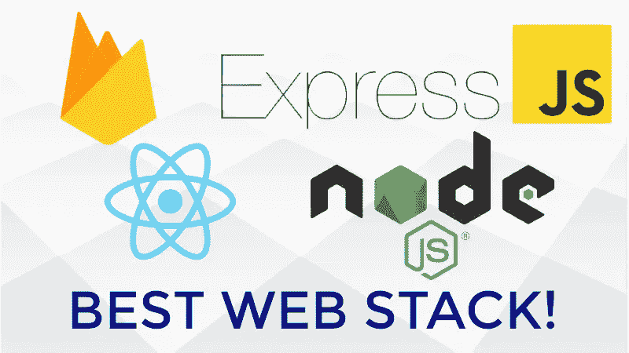

# 什么是 FERN？

很简单:一个帮助你构建网络应用的技术集合。它由 4 个部分组成:

**F** irebase:一个谷歌平台，让您可以访问大量开发工具，最著名的是他们的**实时 NoSQL** 数据库，允许您通过他们的网站修改数据库。

**E** xpress:一个用于构建 API 的快速且极简的网络框架。

**R** eact:一个用于构建用户界面的开源前端 JavaScript 库。

**N**code . js:一个允许您使用 JavaScript 编写后端代码的环境。

正如您所看到的，这个网络堆栈非常适合新开发人员，尤其是那些熟悉 JavaScript 的开发人员。此外， **FERN** 使得更新代码库和调试错误变得非常容易。我们的堆栈是这样的:

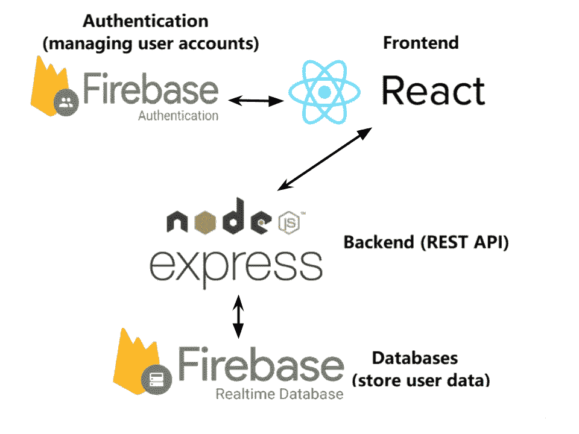

The arrows indicate communication between two technologies

# 我会教你什么

今天，我将教你如何建立一个 **FERN 项目**。开始之前，您需要满足以下**先决条件**:

*   [Node.js](https://nodejs.org/en/)
*   [NPM](https://www.npmjs.com/)
*   [NPX](https://www.npmjs.com/package/npx)
*   [Visual Studio 代码](https://www.google.com/search?q=visual+studio+code&oq=visual+stu&aqs=chrome.2.69i57j0i433l3j0j0i433l2j69i65.2286j0j4&sourceid=chrome&ie=UTF-8)或其他 IDE/文本编辑器
*   谷歌账户
*   访问命令行

# **第 1 步。设置反应项目**

您可以从创建一个名为**“FERN app”**的空文件夹开始，该文件夹有两个子目录:**“前端”**和**“后端”。**

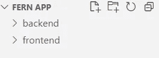

接下来，您可以打开命令行并使用 cd 命令导航到**“……/Fern app/front**”。然后，运行下面的行:

```
npx create-react-app .
```

这将创建一个起始**反应**模板。然后，您必须安装我们需要的软件包。在命令行中运行以下行:

```
npm install firebase react-bootstrap react-router-dom --save
```

命令完成后，您可以删除不必要的文件。您的目录应该如下所示:

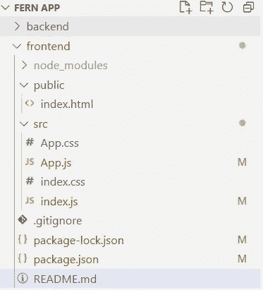

# 第二步。创建 Firebase 项目

要添加 Firebase，您必须访问[http://firebase.google.com/](http://firebase.google.com/)。使用您的谷歌帐户登录后，您会发现创建一个新项目的选项。


Creating a new project

创建项目后，打开它并创建一个新的**实时数据库**。选择安全规则时，确保将其保持在**锁定模式。**

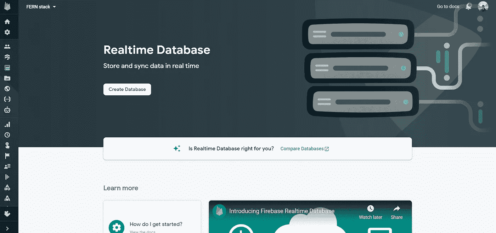

Adding a realtime database

接下来，设置 **Firebase 认证**。您可以允许用户使用他们的 Google 帐户登录。

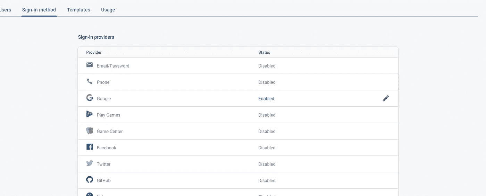

Setting up user authentication

然后，在项目概述页面上，您必须选择将**“Firebase”添加到您的 Web 应用程序的选项**

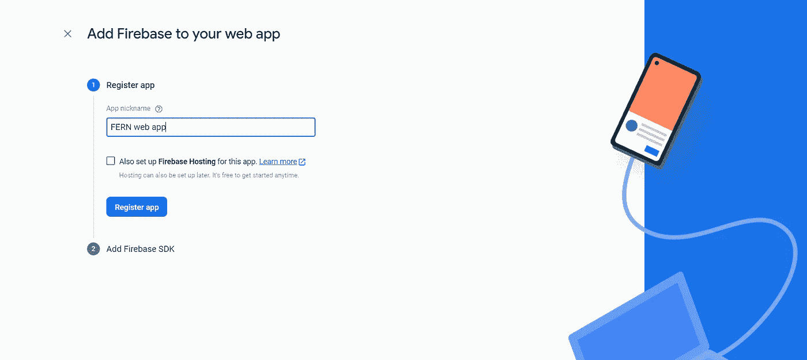

After registering the app, you are all done with Step 2.

# 第三步。设置 Node.js + Express

现在，您将开始创建后端。后端将是一个 **REST API** ，它将与我们的 React 前端进行通信。它的目的是向我们的 **Firebase 实时数据库**读取/写入数据，增加一个额外的安全层，并对用户隐藏代码逻辑。

接下来，您可以打开命令行并使用 cd 命令导航到**“…/Fern app/back end**”。然后，运行以下代码行:

```
npm init
npm install firebase-admin express --save
```

第三，创建一个名为 **index.js** 的文件。您的后端目录应该如下所示:

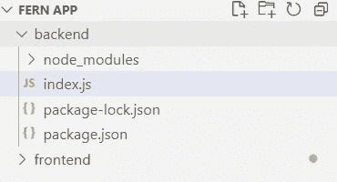

在这个文件中，您可以添加以下代码来设置一个基本的 **REST API。**

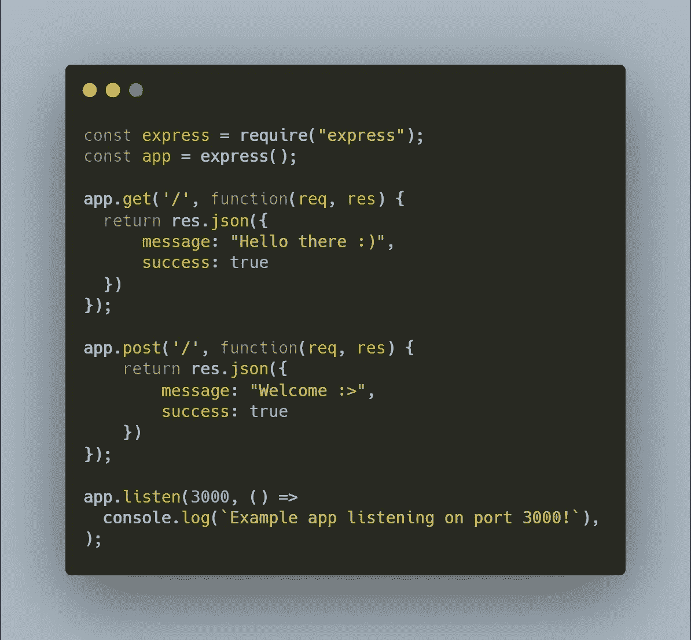

# 将一切联系在一起

让我们首先将我们的 **Firebase** 项目连接到 **React** 前端。您可以通过在您的**"…/frontend/src/index . js "**文件的顶部添加以下几行来实现这一点。

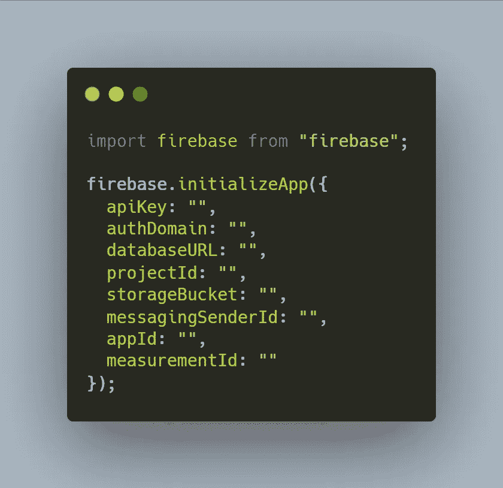

你可以用你的应用的键和标识符来替换引号，这些可以在 **Firebase** 网站的**项目设置**页面的**常规**选项卡下找到。

接下来，添加一个函数，用于从您的 **React** 前端向您的**node . js**+**Express**后端发送请求。您可以通过以下函数来实现这一点:

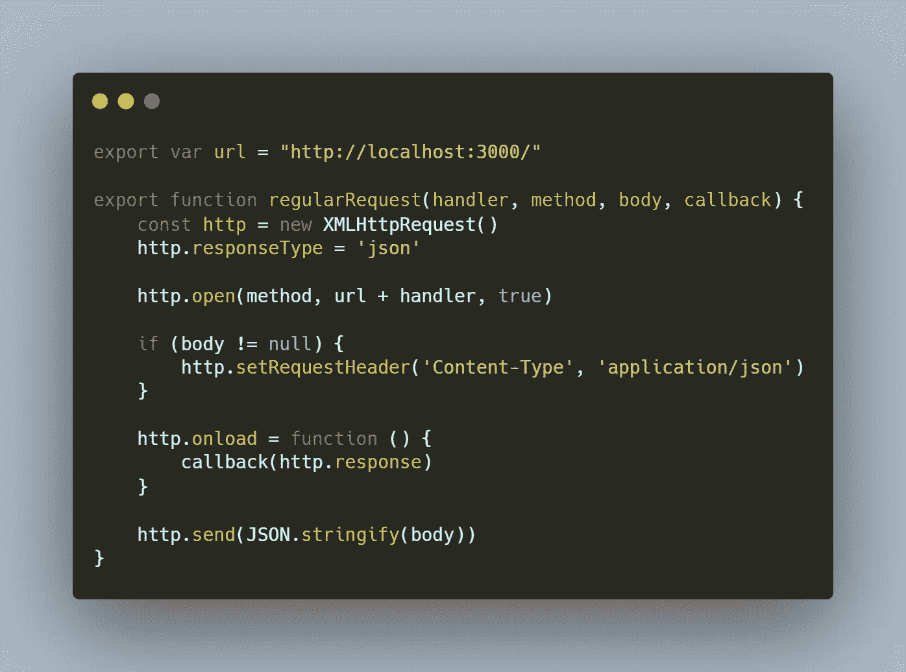

最后，要将 **Firebase 实时数据库**连接到您的**node . js**+**Express**后端，您可以在 **Firebase** 网站的**项目设置**页面中的**服务帐户**选项卡下找到 Admin SDK 配置片段，并生成一个**新私钥。**下载密钥后，将其移动到**后端**文件夹，并将以下代码添加到您的 **"…/backend/index.js"** 文件中:

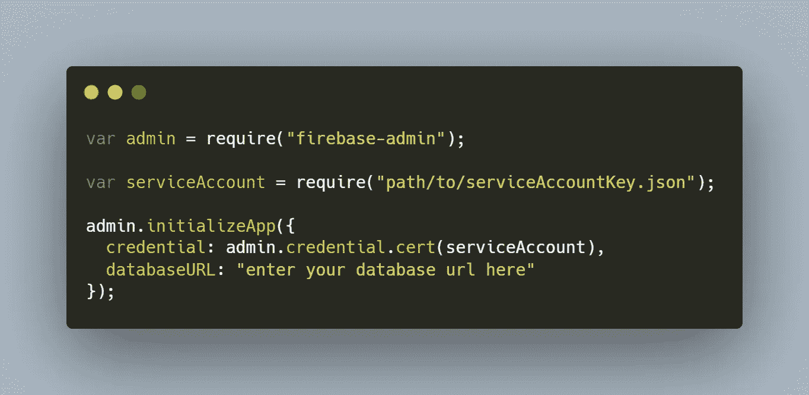

恭喜你，你终于连上了你的**蕨** app！

# 走向

使用我提供的模板，您有可能添加大量的功能、额外的安全性和更多的技术。下面是一些你可以在继续改进你的第一个 **FERN** 应用时添加的东西:

*   [React 前端的谷歌账户登录](https://firebase.google.com/docs/auth/web/google-signin)
*   [使用 React 路由器和 Firebase 认证保护路由](/client-side-routing-with-firebase-a6e630f299f2)
*   Node.js + Express **中间件**使用 JWT 令牌执行授权的函数(见下文)

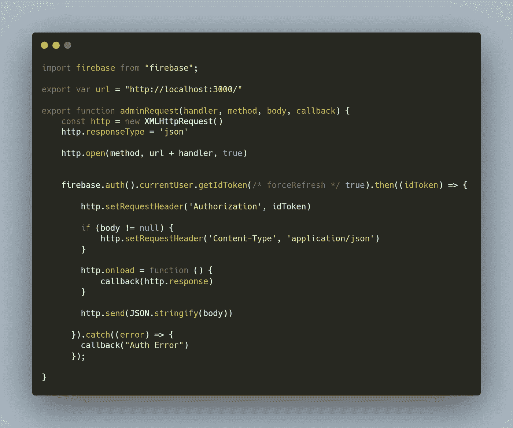

React frontend request code with Firebase ID token (JWT)

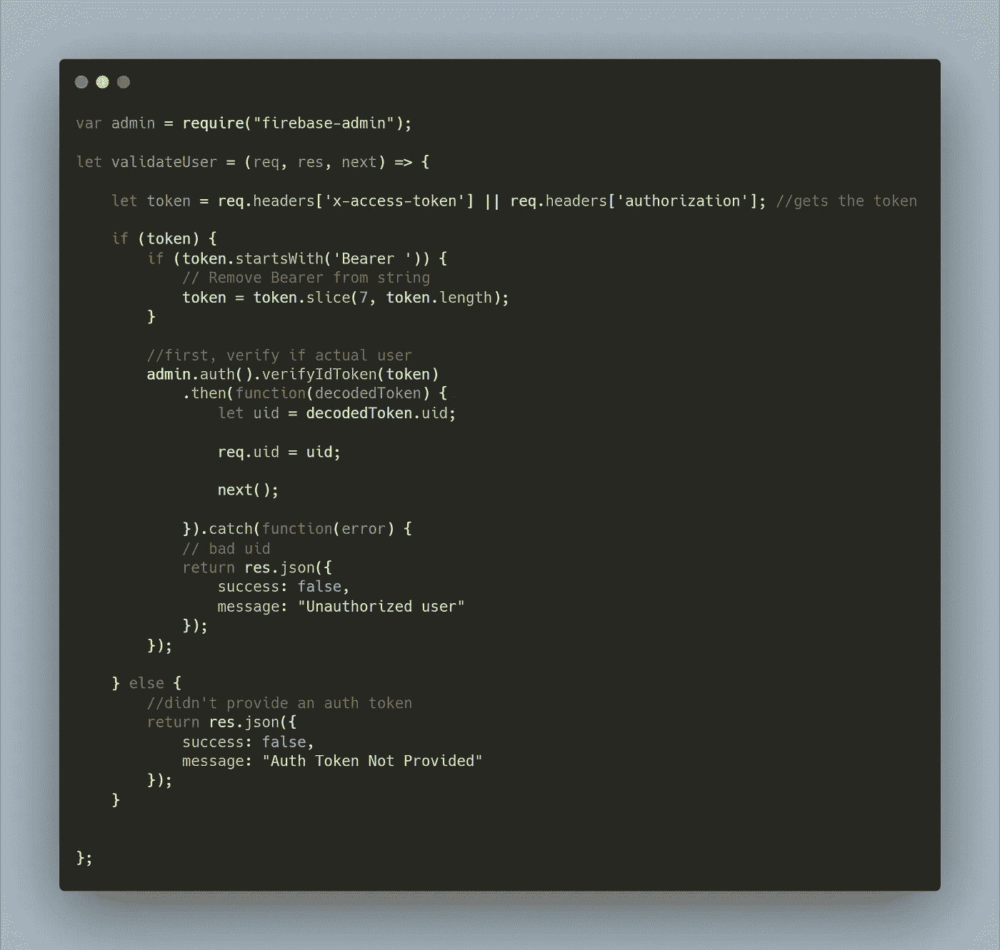

Verifying Firebase ID tokens on the Node.js + Express backend

*   [读取/写入后端 Firebase 实时数据库的数据](https://firebase.google.com/docs/database/admin/start)

## 结论

感谢你把这篇文章看完！我真的很高兴找到像我一样对计算机科学充满热情的人。你尝过羊齿堆吗？如果是这样，一定要在评论中让我们知道你的想法。

我将会发布更多关于上述主题的教程，所以请继续关注👀