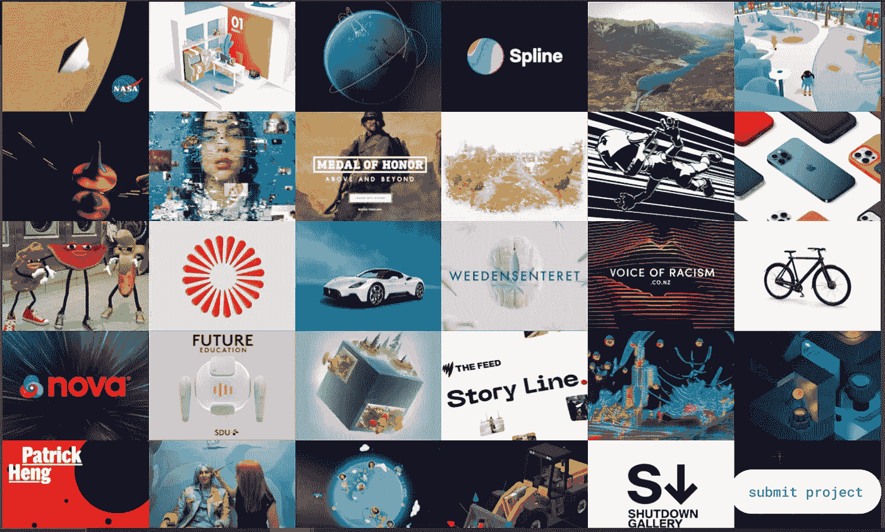

# Three.js 入门

> 原文：<https://javascript.plainenglish.io/getting-started-with-three-js-e0941324b624?source=collection_archive---------14----------------------->

## 关于 3D 动画你需要知道的。



Source: Three.js

我不想学 Three.js。这都是因为我的一个客户看了我的个人资料并亲自给我发了信息。

他想在他们的网站上使用 3D 动画。所以我上网搜索了一下。我找了三个. js，Blender，Sketchup，React360 做 3D 动画。

React 360 用的是 Three.js 概念，而 Blender 和 Sketchup 是制作 3D 动画的软件。

经过一点点的研究，我为我的客户网站使用了 Three.js。

这就是我所学到的。

在开始使用 Three.js 之前，你至少要了解 JavaScript。

在过去，开发人员使用 WebGL(Web Graphics Library)来实现高性能的交互式 2D 和 3D 图形。想了解更多，可以访问 [mdn](https://developer.mozilla.org/en-US/docs/Web/API/WebGL_API) 。

WebGL 已经过时，因为它需要大量代码来创建 3D 图形。

这就是为什么一个名为 Three.js 的修改版本出现了。

Three.js 是一个 3D Javascript 库。它帮助我们使用 Three.js 构建 3D 动画。

你可能听说过 React360、SketchUp——它们用于创建 3D 设计，概念保持不变。

Three.js 够酷的，我他妈的肯定学完之后，你会在每个项目中用到它。

# 装置

如果您正在使用 HTML、CSS 和 JavaScript。Three.js 的安装非常简单。您需要编写一行代码来开始使用 Three.js。

在您的首选目录中创建一个名为 three 的文件夹。添加名为 index.html 和 style.css 的文件

在 index.js 中编写下面的代码。

```
<!DOCTYPE html>
<html><head>
<meta charset=”utf-8">
<title>My first three.js app</title>
</head><body>
<script src=”https://threejs.org/build/three.js"></script>
</body></html>
```

仅此而已。

到目前为止我们什么也没做。只是使用了一个带有 three.js url 的脚本标签。

# 我们在建造什么

代码摘自 [Three.js](https://threejs.org/docs/index.html#manual/en/introduction/Creating-a-scene) 文档并简单解释。

# 让我们开始

在 index.js 中，修改代码或粘贴以下代码。

```
<!DOCTYPE html><html><head>
<meta charset=”utf-8">
<title>My first three.js app</title><style>
body { margin: 0; }
</style></head><body>
<script src=”https://threejs.org/build/three.js"></script>
<script src=”main.js”></script>
</body></html>
```

在本教程中我们不需要样式，所以我们使用内部 CSS。

创建一个名为 main.js 的文件，并将其添加到 index.html。

现在让我们开始使用 Three.js。

要使用 Three.js，我们主要需要四个组件。

1.  事件
2.  照相机
3.  渲染器
4.  目标

实现 3D 需要场景、摄像机、渲染器和对象。

首先，我们必须创建一个场景、摄像机和渲染器。

在 main.js 中，我们必须编写下面的代码。

```
const scene = new THREE.Scene(); const camera = new THREE.PerspectiveCamera( 75,window.innerWidth / window.innerHeight, 0.1, 1000 ); const renderer = new THREE.WebGLRenderer();renderer.setSize( window.innerWidth, window.innerHeight );document.body.appendChild( renderer.domElement );
```

场景中最关键的物体是放置摄像机的物体。

相机主要有透视相机和正交相机两种。这里我们使用透视相机。

之后，我们必须创建几何图形和材料。

```
const geometry = new THREE.BoxGeometry();
const material = new THREE.MeshBasicMaterial({ color: 0xffffff });
const cube = new THREE.Mesh(geometry, material);
scene.add(cube);
camera.position.z = 5;
```

BoxGeometry 是一个存在于 Three.js 中的矩形长方体的类。之后，我们用 MeshBasicMaterial 类创建一个材质。在里面，我们可以添加颜色等参数。

现在我们将添加几何图形和材质到场景中。

但是什么是`camera.position.z=5;`？它是沿着 z 轴定位我们的照相机。

现在我们必须渲染我们的场景和摄像机，所以我们将创建一个函数并调用它。

```
const animate = function () {
requestAnimationFrame(animate);
cube.rotation.x += 0.01;
cube.rotation.y += 0.01;
renderer.render(scene, camera);
};animate();
```

就是这样。

现在，您可以打开您的 index.html 或运行实时服务器。

你将会看到这样的输出。

Source: Author

main.js 的完整代码

```
const scene = new THREE.Scene();
const camera = new THREE.PerspectiveCamera(45,window.innerWidth / window.innerHeight,0.1,1000);
const renderer = new THREE.WebGLRenderer();renderer.setSize(window.innerWidth, window.innerHeight);
document.body.appendChild(renderer.domElement);
const geometry = new THREE.BoxGeometry();
const material = new THREE.MeshBasicMaterial({ color: 0xffffff });
const cube = new THREE.Mesh(geometry, material);
scene.add(cube);
camera.position.z = 5;const animate = function () {
requestAnimationFrame(animate);
cube.rotation.x += 0.01;
cube.rotation.y += 0.01;
renderer.render(scene, camera);
};animate();
```

# 使用 Three.js 的优势

1.  简单易学。
2.  包含大量示例的优秀文档。
3.  Three.js 是开源的。
4.  它不需要任何第三方插件来运行代码。
5.  要理解 Three.js，你只需要了解 JavaScript。
6.  几乎所有的网络浏览器都支持 Three.js。

## 结论

我希望你喜欢这个教程。我尽量让它变得简单，谢谢。

***如果你喜欢我的工作，想要支持，可以*** [***请我喝杯咖啡！***](https://www.buymeacoffee.com/nitinfab)