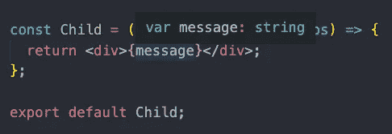
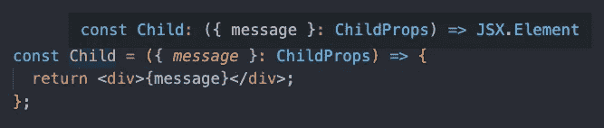
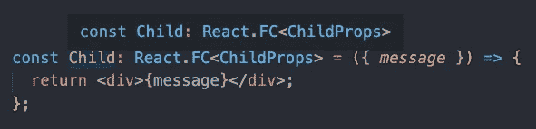

# TypeScript 和 React 函数组件入门

> 原文：<https://javascript.plainenglish.io/getting-started-with-typescript-and-react-function-components-558a6f11dc6d?source=collection_archive---------9----------------------->

## 何时应该使用 React。定义一个函数组件？


Photo by [Flow Clark](https://unsplash.com/@flowclark?utm_source=medium&utm_medium=referral) on [Unsplash](https://unsplash.com?utm_source=medium&utm_medium=referral)

TypeScript 和 React 是当今最流行的两种技术。你可以将它们结合起来，利用两者的优势来构建令人惊叹的项目。React 使构建用户界面变得容易，并且 TypeScript 类型检查所有 JavaScript 以帮助防止错误。

React 的一个关键特性是使用函数组件并在它们之间传递属性。在使用带有 React 的 TypeScript 时，我们需要在传递道具时采取额外的步骤。这一步将检查属性的类型并使 TypeScript 满意。

在本文中，我们将了解在处理功能组件和道具时如何使用类型。

我假设您熟悉 React 和 TypeScript 的基础知识。如果您不熟悉 TypeScript，请阅读下面的文章开始学习。

[](https://levelup.gitconnected.com/type-annotation-vs-type-inference-in-typescript-85ba2194ebe1) [## TypeScript 中的类型注释与类型推理

### 如何在 TypeScript 中向变量添加类型

levelup.gitconnected.com](https://levelup.gitconnected.com/type-annotation-vs-type-inference-in-typescript-85ba2194ebe1) 

# 正常功能组件

当将道具从一个组件传递到另一个组件时，您将需要创建一个接口来定义道具类型。这个接口将为我们做两项检查。它将检查我们是否从父组件中提供了正确的道具。它还将检查我们是否在子组件中正确地使用了道具。

例如，假设我们有一个父组件，我们想将一个消息属性传递给一个子组件。该消息将是一个字符串。

在子组件中，我们将创建一个接口`ChildProps`。

```
interface ChildProps {
  message: string;
}
```

然后，当我们将道具传递给子组件时，我们会像这样给道具一个类型`ChildProps`。

```
const Child = (*props*: ChildProps) => {
  return <div>{props.message}</div>;
};
```

当我们收到孩子的道具时，我们有时并不想收到所有的道具。相反，我们可以破坏我们想要的。

为此，在子组件中，我们将析构道具。然后像以前一样添加一个`ChildProps`类型。

```
const Child = ({ *message* }: ChildProps) => {
  return <div>{message}</div>;
};
```

由于我们创建的接口，TypeScript 知道消息现在将是一个字符串。



回到父组件，当我们呈现子组件时，我们必须传递一个字符串形式的消息属性。如果我们忘记了消息属性或者试图传递除了字符串以外的任何东西，我们将会得到一个错误。

```
const Parent = () => {
  return (
    <div>
      *// message prop must be a string*
      <Child message="Hello world" />
    </div>
  );
};
```

# 使用 React。足球俱乐部

我们上面写的函数组件是完全有效的。一个缺点是 TypeScript 不知道我们正在使用 React 组件。相反，它说我们只是返回一个 JSX 元素。



这不是什么大问题。但是正因为如此，子组件将不能访问基本 React 组件的属性，比如`defaultProps`、`propTypes`、`displayName`和`contextTypes`。

如果我们确实需要显式返回一个 React 函数组件，您可以注释该类型。为此，您将把组件的类型注释到`React.FC`。然后说你会收到道具，里面加一套`<>`里面加`ChildProps`界面。

现在我们可以使用道具，或者破坏我们想要的道具。

```
const Child: React.FC<ChildProps> = ({ *message* }) => {
  return <div>{message}</div>;
};
```



另一个区别是如果你使用 React。FC 类型注释，您将可以访问子属性。当我们为一个组件使用开始和结束标签时，这将非常有用。介于两者之间的任何东西都将是孩子财产的一部分。

# 你应该使用哪一个？

注意反应。FC 最近已从 create-react-app TypeScript 模板中删除。看看下面的 PR。有很多信息为什么反应。不需要 FC。

[](https://github.com/facebook/create-react-app/pull/8177) [## 移除 React。Retsam Pull Request # 8177 Facebook/create-react-app 从 Typescript 模板生成的 FC

### 这移除了 React。来自 Typescript 项目的基模板的 FC。一个小变化的长解释:反应。FC 是…

github.com](https://github.com/facebook/create-react-app/pull/8177) 

似乎普遍的共识是鼓励使用普通函数而不是 React.FC。在我目前的工作中，我们实际上正在使用 React.FC。在一天结束时，您可以自由使用您喜欢的任何函数。

感谢阅读！如果您准备开始构建 TypeScript 和 React 应用程序，请查看下面的文章。

[](https://medium.com/code-and-chill/curated-list-of-resources-to-learn-typescript-with-react-f7d40421bc7a) [## 使用 React 学习 TypeScript 的精选资源列表

### 如果您想学习使用 React 的 TypeScript 并开始构建应用程序，请遵循以下路径

medium.com](https://medium.com/code-and-chill/curated-list-of-resources-to-learn-typescript-with-react-f7d40421bc7a) 

*更多内容尽在*[***plain English . io***](https://plainenglish.io/)