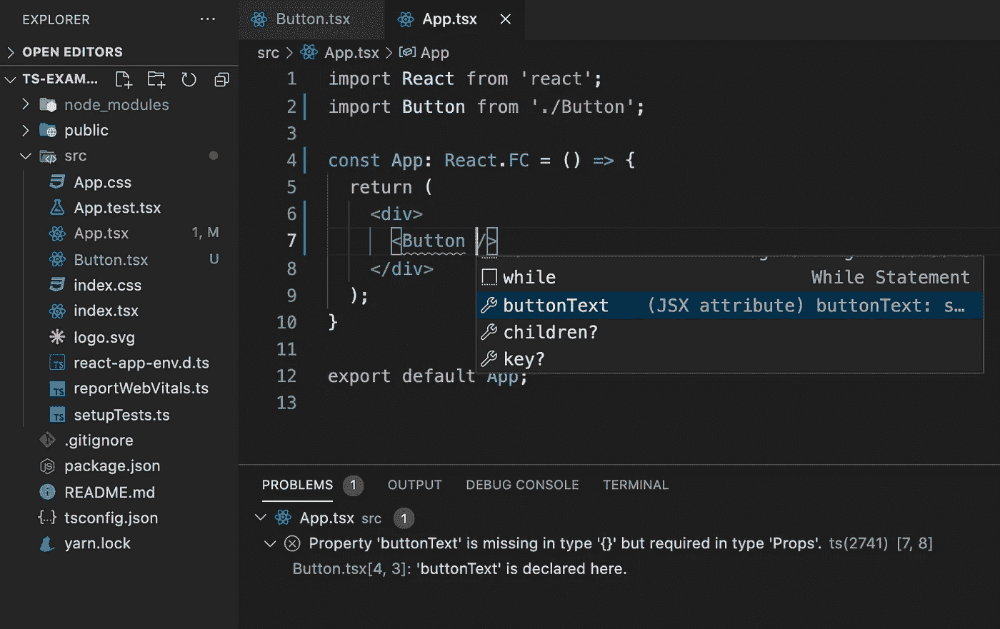

# React 中的 TypeScript 入门

> 原文：<https://javascript.plainenglish.io/getting-started-with-typescript-in-react-9f93f478aaca?source=collection_archive---------14----------------------->


随着 JavaScript 接管世界，TypeScript 似乎也将随之而来。在我申请的入门级前端工作中，至少有一半把使用 TypeScript 的经验列为一项要求或“最好有”。虽然没有人指望你成为这方面的专家，但了解一些基本知识，以便你可以在面试中谈论它，这会让你领先于大多数其他候选人。因此，让我们学习一些基础知识，让您开始使用一个简单的 React 应用程序！

TypeScript 是 JavaScript 的强类型静态超集。这意味着在编译时而不是运行时检查变量的类型。如果变量的类型与预期的不匹配，也会给出类型错误。JavaScript 与此相反。它是一种弱类型的动态语言。在运行时检查变量的类型，变量不绑定到特定的数据类型。变量仍然有数据类型，但是与强类型语言相比，类型检查约束更少。因此，TypeScipt 在编译时为我们提供了 JavaScript 中的类型检查功能，这是普通 JavaScript 所不具备的。从某种意义上来说，它是 JavaScript 的超集，围绕 JavaScript 构建，可以实施某些开发方式，但是您可以选择使用尽可能多或尽可能少的类型脚本。您用普通 JavaScript 编写的所有代码都将一如既往地工作，但也会受到您用 TypeScript 添加的任何开发约束的影响。最终结果是可以更早地发现错误，让其他开发人员更容易导航，并更快地执行我们的代码。

让我们开始吧。要开始使用，请确保您至少安装了 create-react-app 2.1 版。下一步只是对您习惯于在 React 中创建新项目的方式稍作修改:

```
npx create-react-app name-of-your-app --template typescript
```

或者

```
yarn create react-app name-of-your-app --template typescript
```

添加了 tsconfig.json、react-app-env.d.ts 文件和新的。ts 和。tsx 文件类型。js 之前是:


create-react-app ts-example-app — template typescript


create-react-app no-ts-example

tsconfig.json 文件表明它存储的目录是项目的根目录。它为我们的项目指定了根文件和编译器选项:


tsconfig.json

在“编译选项”中，“目标”是我们要编译到的 JavaScript 版本。*然而*看到“noEmit”默认设置为真。这意味着我们的代码不会从这个文件中编译和发出，它只会进行类型检查。“include”中的数组告诉我们,“src”目录中的所有内容都将包含在类型检查中。选项“jsx”:“react-jsx”告诉我们 jsx 在。tsx 文件。点击阅读更多关于编译器选项[的信息。](https://www.typescriptlang.org/docs/handbook/compiler-options.html)


react-app-env.d.ts

react.app.env.d.ts 文件包含对“react-scripts”模块中另一个 d.ts 文件的引用。d.ts 文件包含 TypeScript 类型定义。这个 react-app.d.ts 文件定义了各种模块的类型。比如你导入一个. jpeg，它会告诉 React 返回值的类型(。jpeg 返回类型*字符串*。见下文:


react-app.d.ts

现在我们已经看了一下，让我们开始为按钮创建一个新的功能组件。我们将使用 React。FC，实际上是 React 提供给我们的，用来声明组件类型为功能组件。关于是否使用 React，人们的意见不一。FC(在这里阅读他们)，但是因为我们才刚刚开始，我们现在不打算关心这个。接下来，我们可以声明通过*类型别名*或*接口传递给组件的道具类型(完整列表[见这里](https://github.com/typescript-cheatsheets/react))。*接口更多的是与面向对象的编程联系在一起，所以我们将使用类型别名，这是由于 React 的函数式编程特性。随着 TypeScript 的发展，类型别名和接口之间的差异变得越来越小。点击阅读更多关于它们的信息[。让按钮组件接受名为 buttonText 的属性，类型为 *string* 。我们的新按钮组件应该如下所示:](https://dev.to/reyronald/typescript-types-or-interfaces-for-react-component-props-1408)


Button.tsx

现在，让我们将应用程序组件转换为功能组件，并传递 buttonText。当我们将按钮组件添加到 App 中时，我们注意到 React now 无法编译，因为我们没有在 Button 中定义 buttonText 属性。如果我们在按钮内部按下 *control +空格键*，我们可以看到哪些内容可以传递给组件，感谢 TypeScript！



App.tsx

让我们设置按钮组件来接受一个计数和一个函数，该函数将在每次单击按钮时使计数增加 1。在类型别名属性中，我们添加了类型编号为*的*计数*和类型编号为*和 *onClick* 的箭头函数，该函数不返回任何内容，也不接受任何参数:


Button.tsx

现在，在 App 组件中，让我们传递字符串“click me”作为 buttonText 属性。让我们也为按钮被点击的次数创建一个计数。我们将从 App 组件中的 React 导入 useState 挂钩，并创建名为“increment”的函数，该函数将在每次单击按钮时将计数增加 1。我们将把这两者作为道具传递给按钮组件:


App.tsx

请注意，如果您在增量函数中传递任何不是数字的东西给 setCount，React 会对您大喊大叫。这是因为我们在 useState 钩子中将默认值设置为 0，所以 setCount 现在只接受带有 *number* 类型的值。

例如，如果您想使计数支柱不需要传递给按钮组件，您所要做的就是插入一个“？”就在变量名后面，就像这样:


这是一个非常简短的介绍，介绍如何在 React 中使用 TypeScript 帮助您开始。还有*很多*需要覆盖，所以请一定要查看下面链接的优秀资源，继续您的旅程。

[](https://react-typescript-cheatsheet.netlify.app/docs/basic/setup) [## 设置类型脚本与反应|反应类型脚本数据表

### 先决条件

reactor-type script-cheat sheet . netlify . app](https://react-typescript-cheatsheet.netlify.app/docs/basic/setup) [](https://www.sitepoint.com/react-with-typescript-best-practices/) [## 对类型脚本做出反应:最佳实践-站点点

### React 和 TypeScript 是当今许多开发人员使用的两种非常棒的技术。知道如何做事可以…

www.sitepoint.com](https://www.sitepoint.com/react-with-typescript-best-practices/) [](https://www.educative.io/blog/react-and-typescript) [## 开始使用反应和类型脚本

### 了解开发人员在使用 TypeScript 时可以利用的主要好处。更进一步，创造你自己的…

www . education . io](https://www.educative.io/blog/react-and-typescript) 

*感谢您的阅读——在*[**LinkedIn**](https://www.linkedin.com/in/kylefarmer85)*上与我联系，在* [**上查看我的文件夹。干杯！**](https://kylefarmer.dev/)