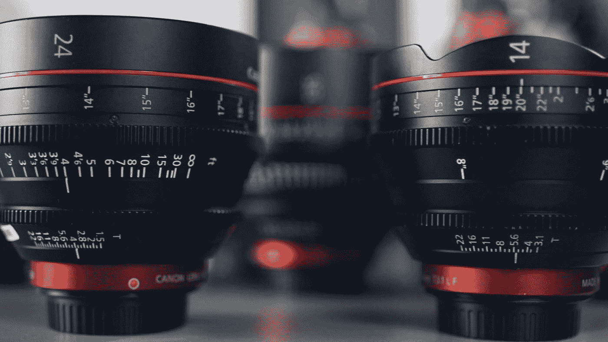

# 使用 PrimeVue 框架开始 Vue 3 开发

> 原文：<https://javascript.plainenglish.io/getting-started-with-vue-3-development-with-the-primevue-framework-a74f60c64fad?source=collection_archive---------3----------------------->



Photo by [ShareGrid](https://unsplash.com/@sharegrid?utm_source=medium&utm_medium=referral) on [Unsplash](https://unsplash.com?utm_source=medium&utm_medium=referral)

PrimeVue 是一个与 Vue 3 兼容的 UI 框架。

在本文中，我们将了解如何开始使用 PrimeVue 开发 Vue 3 应用程序。

# 入门指南

我们通过运行以下命令来安装所需的软件包:

```
npm install primevue@^3.1.1 --save
npm install primeicons --save
```

这将安装带有所有组件和图标的库。

接下来，我们将`PrimeVue`插件添加到我们的应用程序中:

`main.js`

```
import { createApp } from "vue";
import App from "./App.vue";
import PrimeVue from "primevue/config";
import InputText from "primevue/inputtext";
import 'primevue/resources/primevue.min.css'
import 'primevue/resources/themes/bootstrap4-light-blue/theme.css'
import 'primeicons/primeicons.css'const app = createApp(App);
app.use(PrimeVue);
app.component("InputText", InputText);
app.mount("#app");
```

`App.vue`

```
<template>
  <div>
    <InputText type="text" v-model="text" />
    <p>{{text}}</p>
  </div>
</template><script>
export default {
  name: "App",
  data() {
    return {
      text: "",
    };
  },
};
</script>
```

在`main.js` m 中，我们调用`app.use`来添加插件。

然后我们调用`app.component`来注册`InputText`组件。

`import ‘primevue/resources/primevue.min.css’`导入核心 CSS。

`import ‘primevue/resources/themes/bootstrap4-light-blue/theme.css’`是主题的 CSS。

`import ‘primeicons/primeicons.css’`添加图标。

我们还可以包含单个组件的脚本标记:

```
<!DOCTYPE html>
<html lang="en">
  <head>
    <meta charset="utf-8" />
    <title>calendar demo</title>
    <link
      href="https://unpkg.com/primevue/resources/themes/saga-blue/theme.css "
      rel="stylesheet"
    />
    <link
      href="https://unpkg.com/primevue/resources/primevue.min.css "
      rel="stylesheet"
    />
    <link
      href="https://unpkg.com/primeicons/primeicons.css "
      rel="stylesheet"
    />
    <script src="https://unpkg.com/vue@next"></script>
    <script src="https://unpkg.com/primevue@3.1.1/components/inputtext/inputtext.umd.min.js"></script>
  </head>
  <body>
    <div id="app">
      <p-inputtext v-model="text"></p-inputtext>
      <p>{{text}}</p>
    </div> <script>
      Vue.createApp({
        data() {
          return {
            text: ""
          };
        },
        components: {
          "p-inputtext": inputtext
        }
      }).mount("#app");
    </script>
  </body>
</html>
```

我们为 Vue 3 和 PrimeVue 的`inputtext`组件添加脚本标签。

然后我们可以在代码中使用它。

# PrimeFlex

我们可以安装`primeflex`包来添加 CSS，让我们轻松地创建布局，而无需从头开始编写任何东西。

要安装它，我们运行:

```
npm install primeflex --save
```

然后，我们可以通过编写以下代码来添加 CSS:

`main.js`

```
import { createApp } from "vue";
import App from "./App.vue";
import PrimeVue from "primevue/config";
import InputText from "primevue/inputtext";
import 'primeflex/primeflex.css';const app = createApp(App);
app.use(PrimeVue);
app.component("InputText", InputText);
app.mount("#app");
```

现在我们可以通过编写来使用这些类:

`App.vue`

```
<template>
  <div class="card">
    <InputText type="text" v-model="text" class="p-ml-2 p-d-inline" />
    <p>{{ text }}</p>
  </div>
</template>
<script>
export default {
  name: "App",
  data() {
    return {
      text: "",
    };
  },
};
</script>
```

`p-ml-2`在左侧添加一些边距。

`p-d-inline`使输入内联显示。

我们可以用`p-shadow-{x}`类添加阴影，其中`x`可以是 1 到 24。

`p-d-flex`让我们创建一个灵活布局。

`p-d-inline-flex`让我们创建一个内嵌 flex 布局。

`p-flex-{direction}`让我们设置伸缩方向。其中`direction`可以是:

*   行(默认)
*   行反转
*   圆柱
*   列-反向

flex 容器中的项目顺序可以用`p-order-{value}`类来改变。

我们还可以添加根据断点变化的布局:

```
<template>
  <div class="p-d-flex">
    <div class="p-mr-2 p-order-3 p-order-md-2">Item 1</div>
    <div class="p-mr-2 p-order-1 p-order-md-3">Item 2</div>
    <div class="p-mr-2 p-order-2 p-order-md-1">Item 3</div>
  </div>
</template><script>
export default {
  name: "App",
};
</script>
```

我们根据断点是`md`和 up 还是其他来改变顺序。

如果是`md`或更高，那么我们得到:

```
Item 3 Item 1 Item 2
```

否则，我们会得到:

```
Item 2 Item 3 Item 1
```

# 结论

PrimeVue 是最早兼容 Vue 3 的 UI 框架之一。

喜欢这篇文章吗？如果有，通过 [**订阅我们的 YouTube 频道**](https://www.youtube.com/channel/UCtipWUghju290NWcn8jhyAw?sub_confirmation=true) **获取更多类似内容！**

*更多内容请看*[***plain English . io***](https://plainenglish.io/)