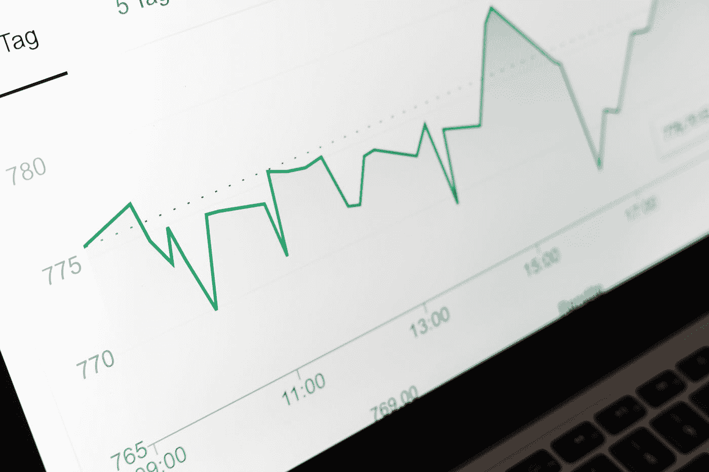

# vue-chartjs 入门

> 原文：<https://javascript.plainenglish.io/getting-started-with-vue-chartjs-c7184cd4738c?source=collection_archive---------8----------------------->



Photo by [Markus Winkler](https://unsplash.com/@markuswinkler?utm_source=medium&utm_medium=referral) on [Unsplash](https://unsplash.com?utm_source=medium&utm_medium=referral)

vue-chartjs 库让我们可以轻松地向 vue 应用程序添加图表。

在本文中，我们将了解如何使用 vue-chart.js 向 Vue 应用程序添加图表

# 装置

我们可以通过运行以下命令来安装带有 chart.js 的包:

```
yarn add vue-chartjs chart.js
```

或者:

```
npm install vue-chartjs chart.js --save
```

chart.js 是必需的依赖项。

# 创建我们的第一个图表

现在，我们可以通过创建一个新组件来创建我们的第一个图表。

例如，我们可以写:

`components/LineChart.vue`

```
<script>
import { Line, mixins } from "vue-chartjs";
const { reactiveProp } = mixins;export default {
  extends: Line,
  mixins: [reactiveProp],
  props: ["chartData", "options"],
  mounted() {
    this.renderChart(this.chartData, this.options);
  }
};
</script>
```

`App.vue`:

```
<template>
  <div>
    <line-chart :chart-data="data" :options="options"></line-chart>
  </div>
</template><script>
import LineChart from "./components/LineChart.vue";export default {
  components: {
    LineChart
  },
  data() {
    return {
      data: {
        labels: ["Monday", "Tuesday", "Wednesday"],
        datasets: [
          {
            label: "# of Votes",
            data: [12, 19, 3],
            borderWidth: 1
          }
        ]
      },
      options: {
        responsive: true,
        maintainAspectRatio: false
      }
    };
  },
  methods: {}
};
</script>
```

我们创建了`LineChart`组件来显示折线图。

它使用了带有图表数据的`chartData`道具。

它需要一个带有图表选项的`options`道具。

`extends`属性被设置为`Line`，这样我们就可以显示一个折线图。

然后我们可以调用`this.renderChart`来显示带有数据和选项的图表。

在`App.vue`中，我们获得我们创建的`line-chart`组件，并使用它来显示我们的图表。

我们将数据传递给`chart-data`属性，将选项传递给`options`属性。

`responsive`使图表反应灵敏。

并且`maintainAspectRatio`保持图表的长宽比不变，无论屏幕大小如何。

`label`有图表的标签。

`labels`有 x 轴标签。

`backgroundColor`是线条和 x 轴之间填充的背景色。

`data`有 y 轴值。

mixin 让我们的图表响应适当的变化。

现在，我们应该会看到一个折线图。

# 事件

图表发出各种信号。它们包括:

*   `chart:render` -如果 mixin 执行完整的重新渲染，则发出此事件
*   `chart:destroy` -当 mixin 删除图表对象实例时发出
*   `chart:update` -如果 mixin 执行更新而不是重新渲染时发出
*   `labels:update` -设置新标签时发出
*   `xlabels:update`如果设置了新的 x 轴标签，则发出
*   `ylabels:update` -如果设置了新的 y 轴标签，则发出

# 自己的观察者

我们可以用添加自己的观察器，并在图表数据更新时调用`this.$data._chart.update()`方法来更新图表。

例如，我们可以写:

```
<script>
import { Line } from "vue-chartjs";export default {
  extends: Line,
  props: ["chartData", "options"],
  mounted() {
    this.renderChart(this.chartData, this.options);
  },
  watch: {
    chartData() {
      this.$data._chart.update();
    }
  }
};
</script>
```

然后我们观察`chartData`道具的变化，并相应地更新图表。

这在我们想要在折线图组件中转换折线图时很有用。

# 结论

我们可以使用 vue-chartjs 组件轻松地将图表添加到 Vue 应用程序中。

喜欢这篇文章吗？如果有，通过 [**订阅我们的 YouTube 频道**](https://www.youtube.com/channel/UCtipWUghju290NWcn8jhyAw?sub_confirmation=true) **获取更多类似内容！**