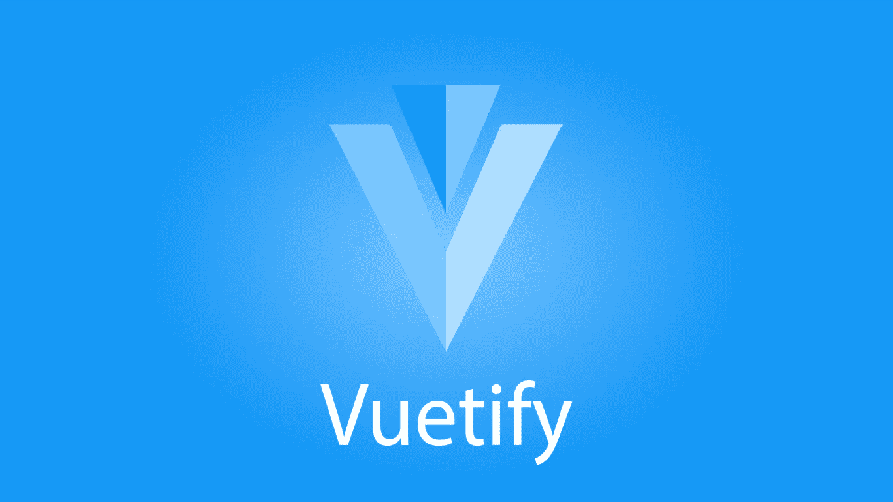
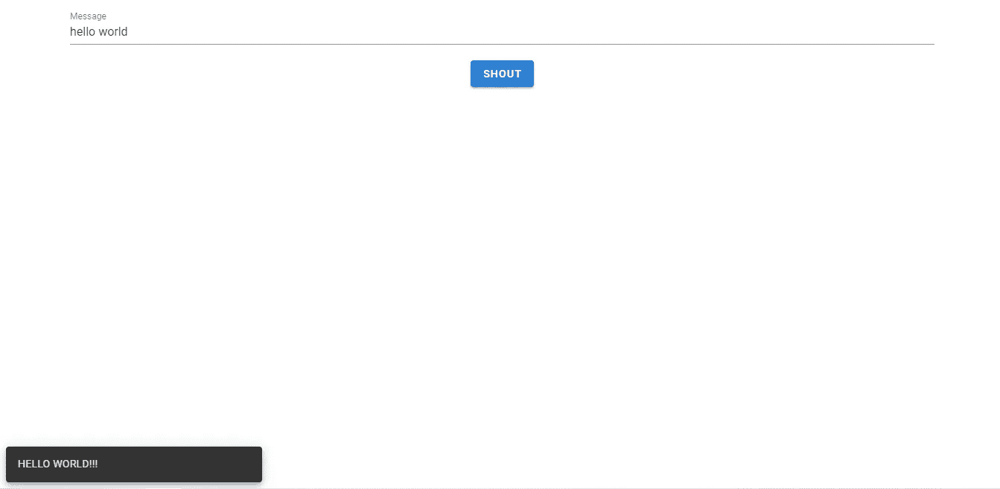
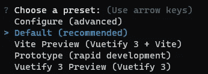
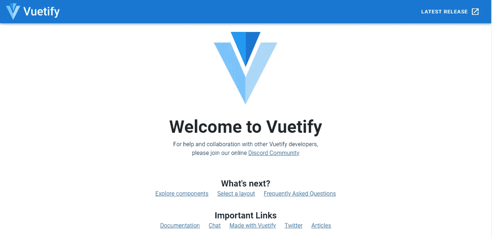
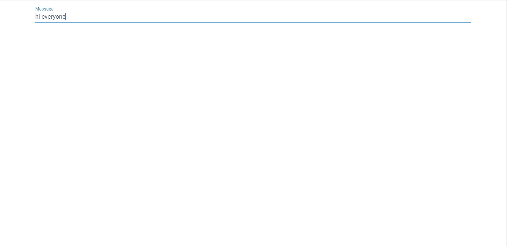
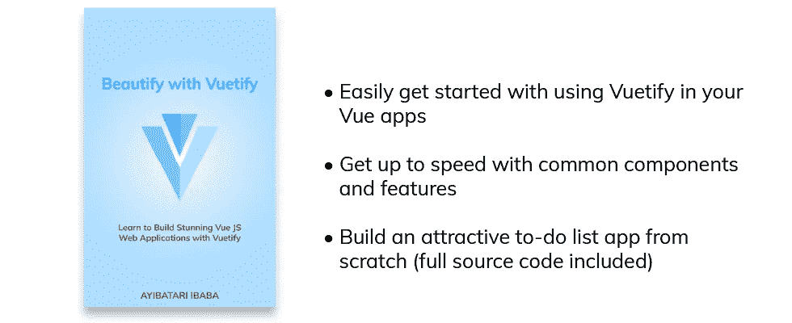
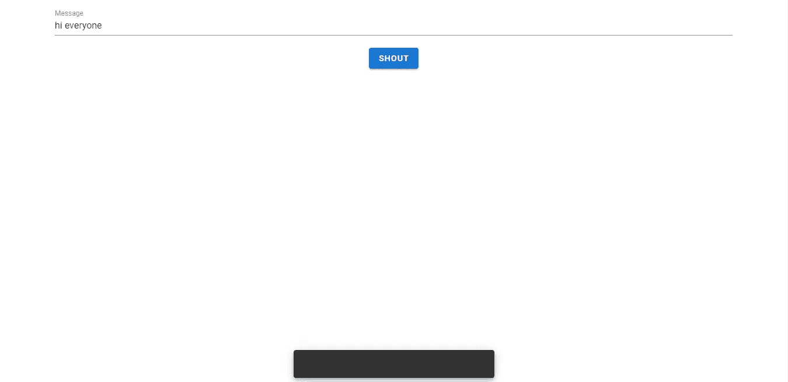
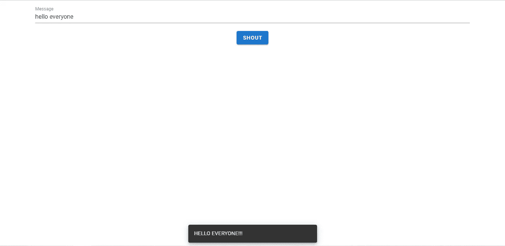

# Vuetify 入门

> 原文：<https://javascript.plainenglish.io/getting-started-with-vuetify-1f133a06e89a?source=collection_archive---------16----------------------->



从头开始设计一个优秀的用户界面需要付出很多努力。除了构建令人愉快的用户体验所需的技能之外，你还必须担心创建自己的设计系统——有自己的图标、[颜色](https://codingbeautydev.com/blog/vuetify-colors/)组合、排版等等。同时确保系统与用户习惯的东西相当一致，这样他们就不会对这种风格感到迷惑。当然，你还必须记得确保你的应用程序是移动响应的，以便它们在各种尺寸的设备上保持功能和美观。

幸运的是，有大量的 CSS UI 库可以帮助简化这个过程，并与不同的 JavaScript 框架一起工作。特别是对 Vue.js 来说，Vuetify 是最流行的框架之一，你可以用它来快速构建好看且响应迅速的应用程序。

# 引入 Vuetify

Vuetify 是一个开源的 UI 组件库，它允许您毫不费力地创建具有惊人视觉效果的 web 应用程序。您可以轻松添加常见的 UI 功能，如[传送带](https://codingbeauty.medium.com/creating-a-colourful-rainbow-app-using-carousels-in-vuetify-cf0ded93b655)、[工具栏](https://codingbeauty.medium.com/create-a-beautiful-todo-app-in-vuetify-toolbars-5e321f43c548)、[导航抽屉](https://codingbeauty.medium.com/creating-custom-lists-with-navigation-drawers-vuetify-to-do-list-app-tutorial-c64c92b645f6)、[卡片](https://codingbeautydev.com/blog/how-to-use-cards-in-vuetify/)、[对话框](https://codingbeautydev.com/blog/how-to-use-dialogs-in-vuetify/)和[表格](https://codingbeauty.medium.com/creating-data-tables-with-vuetify-fc5d3d810f11)，这些功能在您的应用程序中已经很棒了。这样，它在 GitHub 上有超过 33，000 颗星，并由开发人员频繁更新。它基于谷歌开发的著名材料设计系统，该系统被谷歌用于其几乎所有的应用程序和网站。如其[官网](https://material.io)所述:

> Material 是一个由指南、组件和工具组成的适应性系统，支持用户界面设计的最佳实践。在开源代码的支持下，Material 简化了设计师和开发人员之间的协作，并帮助团队快速构建漂亮的产品。

这说明了一切。在你的网站和应用程序中使用材料设计确实是一个明智之举。自 2014 年发布的 Android Lollipop (5.1)以来，它一直是 Android 每个主要非定制版本的设计语言。因为它的受欢迎程度，采用材料设计指南将会给你的应用程序一个一致的设计，这是很多人已经熟悉的。

# 创建应用程序

在本教程中，我们将创建一个简单的 Vue.js 项目，它利用了一些 Vue 化特性。这是我们完成后的主页外观:



当用户输入一条消息并点击`Shout` [按钮](https://codingbeautydev.com/blog/how-to-use-buttons-in-vuetify/)时，会出现一条消息的通知。

## 创建新项目

首先，使用 [Vue CLI](https://cli.vuejs.org/) 在 shell 窗口中创建新的 Vue 项目。姑且称之为`vuetify-app`:

```
vue create vuetify-app
```

让我们使用以下命令在 shell 中移动到我们的项目目录:

```
cd vuetify-app
```

让我们使用 Vue CLI 将 Vue 化添加到我们的项目中。虽然在 Vue.js 应用程序中包含 Vuetify 还有其他方法，但这是最简单、最直接的方法之一:

```
vue add vuetify
```

当要求选择预置时，选择`Default`。这个预设是可以的，并且推荐给大多数项目，包括我们将要构建的项目。



安装 Vuetify 后，使用`npm start`或`yarn start`运行项目，并在浏览器的新标签中导航到`localhost:8080`。您将看到标准的 Vue.js 样板文件已经被修改为 Vuetify:



让我们打开项目目录中的`src/App.vue`,清除这个样板文件，直到我们只剩下这个:

```
**src/App.vue**<template>
  <v-app>
    <v-main>
    </v-main>
  </v-app>
</template><script>
export default {
  name: 'App',
  data: () => ({
    //
  }),
};
</script>
```

组件现在是我们应用程序的根。它取代了默认的 Vue 入口点(在 Vue.js 样板文件中是`<div id=”app”>`)。`v-main`组件应该作为我们应用程序主要内容的根——就像`main` HTML 元素一样。

您马上会注意到组件名中的前缀`v-`。所有来自 Vuetify 的组件都有这个前缀。这是用于表示组件是其库的一部分的命名约定，类似于 Vue 中自定义指令的命名方式。

让我们使用`v-text-field`组件向应用程序添加一个文本字段。我们将使用`label`属性来设置一个占位符值。我们还为与文本字段的双向输入绑定创建了一个`message`属性，因此每当用户编辑文本字段中的文本时，`message`就会相应地更新。这个变量对于最终显示通知很有用。

```
**src/App.vue**<template>
  <v-app>
    <v-main>
      <v-container>
        <v-text-field label="Message" v-model="message"></v-text-field>
      </v-container>
    </v-main>
  </v-app>
</template><script>
export default {
  name: 'App',
  data: () => ({
    message: '',
  }),
};
</script>
```

注意，我们将`v-text-field`包装在了一个`v-container`组件中。`v-container`在其子组件和其外部的其他组件之间添加一些填充。



# 用美化来美化

使用 Vuetify 材料设计框架创建优雅 web 应用程序的完整指南。



在这里免费下载[](https://mailchi.mp/583226ee0d7b/beautify-with-vuetify)****！****

# **添加按钮和 Snackbar**

**接下来，让我们使用`v-btn`组件添加一个[按钮](https://codingbeautydev.com/blog/how-to-use-buttons-in-vuetify/)。我们将把这个元素放在一个 div 中，并给这个 div 分配一个`text-center`类。顾名思义，这个类可由 Vuetify 用于文本居中。我们将提供一个名为`shout()`的方法来处理[按钮](https://codingbeautydev.com/blog/how-to-use-buttons-in-vuetify/)上的点击。**

**我们还将使用`v-snackbar`组件为通知添加一个 snackbar。在`shout()` click 处理程序中，我们将设置一个新的`showSnackbar`属性为 true。`v-snackbar`绑定到这个属性。将其设置为`true`将弹出 snackbar。几秒钟后，`v-snackbar`会将该变量设置回`false`，这样 snackbar 可以再次隐藏。**

```
**src/App.vue**<template>
  <v-app>
    <v-main>
      <v-container>
        <v-text-field label="Message" v-model="message"></v-text-field>
 **<div class="text-center">
          <v-btn color="primary"** [**@click**](http://twitter.com/click)**="shout">Shout</v-btn>
        </div>**
      </v-container>
    </v-main>
  **  <v-snackbar v-model="showSnackbar"></v-snackbar>**
  </v-app>
</template><script>
export default {
  name: 'App',
  data: () => ({
    message: '',
 **showSnackbar: false,**
  }),
 **methods: {
    shout() {
      this.showSnackbar = true;
    },
  },**
};
</script>
```

****

# **显示喊叫信息**

**现在，点击[按钮](https://codingbeautydev.com/blog/how-to-use-buttons-in-vuetify/)只会显示一个空的通知。为了让 snackbar 显示用户输入的消息的主要版本，我们将创建一个新变量 `loudMessage`。在`shout()` click 处理程序中，我们将使用 JavaScript `toUpperCase()` string 方法将该变量设置为`message`值的大写形式，并用三个感叹号将其连接起来。我们将使这个消息成为`v-snackbar`元素的文本子元素。**

```
**src/App.vue**<template>
  <v-app>
    <v-main>
      <v-container>
        <v-text-field label="Message" v-model="message"></v-text-field>
        <div class="text-center">
          <v-btn color="primary" [@click](http://twitter.com/click)="shout">Shout</v-btn>
        </div>
      </v-container>
    </v-main>
    <v-snackbar v-model="showSnackbar">**{{loudMessage}}**</v-snackbar>
  </v-app>
</template><script>
export default {
  name: 'App',
  data: () => ({
    message: '',
    showSnackbar: false,
    **loudMessage: '',**
  }),
  methods: {
    shout() {
      **this.loudMessage = `${this.message.toUpperCase()}!!!`;**
      this.showSnackbar = true;
    },
  },
};
</script>
```

****

# **更改 Snackbar 过渡和位置**

**让我们自定义 snackbar。目前，它在屏幕的底部中心淡入。让我们通过修改元素的一些属性使它从左下方滑入。我们可以将`transition`属性设置为许多其他值，但是出于我们的目的，我们需要将它设置为`slide-y-reverse-transition`。要向左移动 snackbar，我们将把`left`属性设置为`true`。请注意，我们在`left`前使用了冒号(`:`)，这样`true`将被计算为布尔值`true`，而不是字符串“true”。**

```
**src/App.vue**<template>
  <v-app>
    <v-main>
      <v-container>
        <v-text-field label="Message" v-model="message"></v-text-field>
        <div class="text-center">
          <v-btn color="primary" [@click](http://twitter.com/click)="shout">Shout</v-btn>
        </div>
      </v-container>
    </v-main>
    <v-snackbar
      v-model="showSnackbar"
      **transition="slide-y-reverse-transition"
      :left="true"**
      >{{ loudMessage }}</v-snackbar
    >
  </v-app>
</template>
...
```

**我们的 Vuetify 应用程序已经完成！**

**即使有了这个小应用程序，我希望你已经能够亲眼看到像 Vuetify 这样的 UI 库可以为你节省多少工作。在不使用任何 CSS 或自定义样式的情况下，我们已经能够在短时间内设计出一个外观漂亮、功能齐全的 web 应用程序。**

**[](http://eepurl.com/hRfyJL)***注册我们的每周简讯，了解 Vuetify 和 Vue 的最新提示。*****

*****在*[*codingbeautydev.com*](https://codingbeautydev.com/blog/vuetify-getting-started/)*获取更新文章。*****