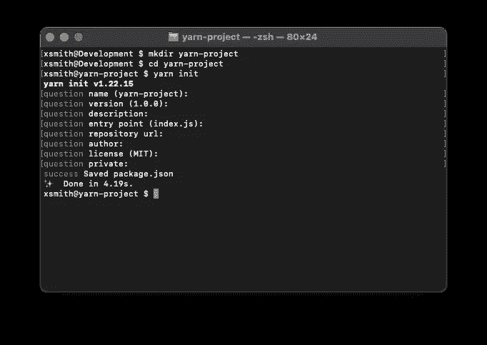
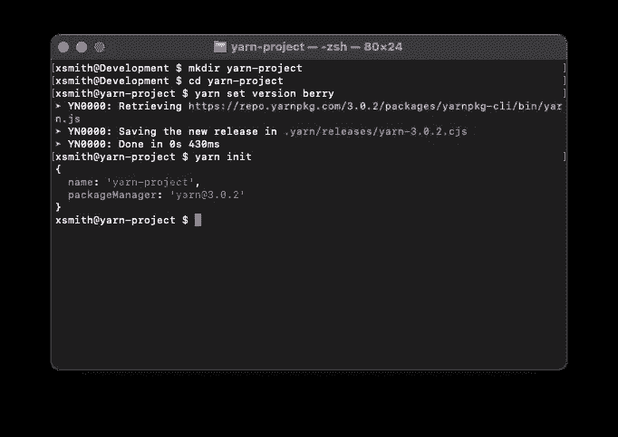
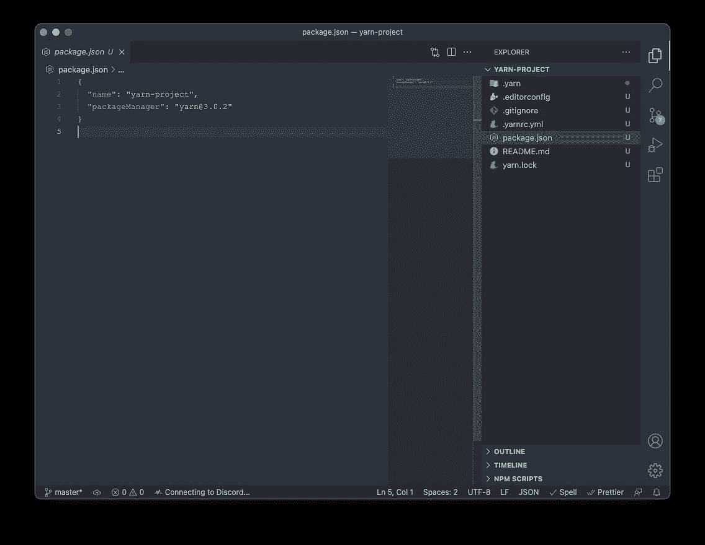
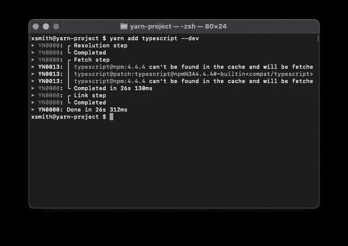
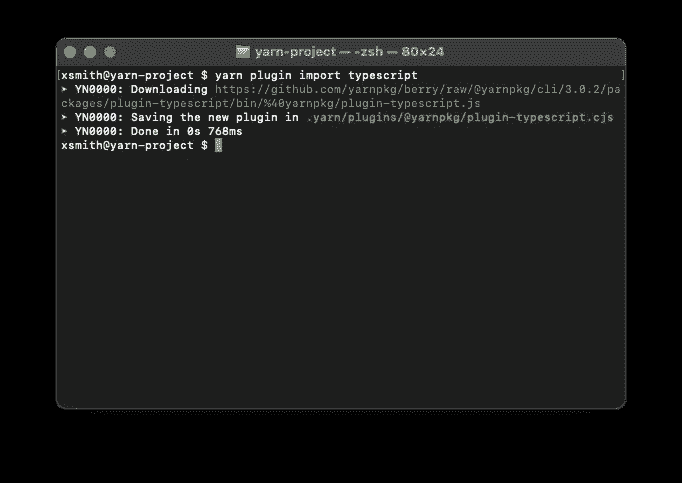
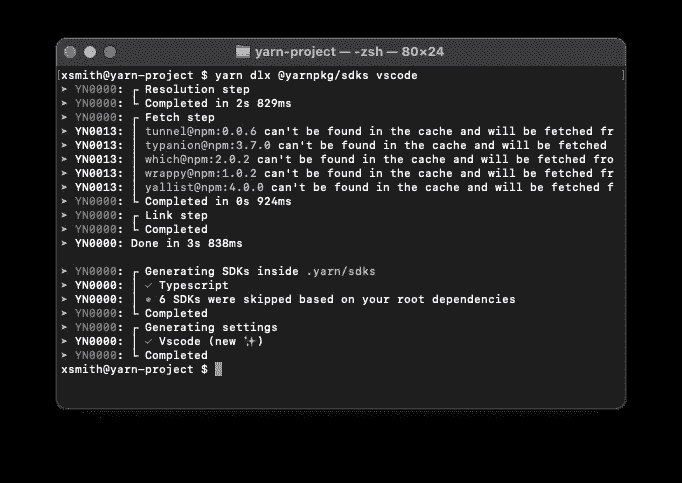
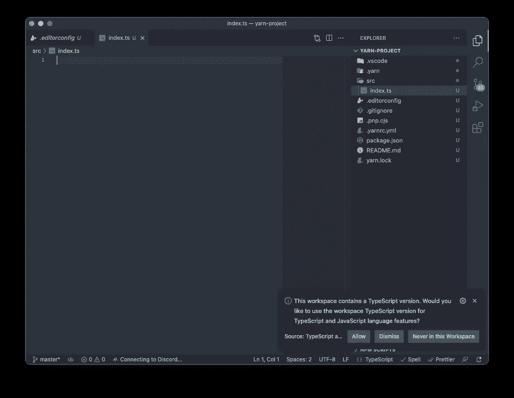

# 使用 TypeScript 开始使用 Yarn 3

> 原文：<https://javascript.plainenglish.io/getting-started-with-yarn-3-and-typescript-125e7b537e6c?source=collection_archive---------3----------------------->


Photo by [Maxwell Nelson](https://unsplash.com/@maxcodes?utm_source=medium&utm_medium=referral) on [Unsplash](https://unsplash.com?utm_source=medium&utm_medium=referral)

## 粉丝最喜欢的软件包管理器的下一个令人印象深刻的迭代。

在我们开始之前，请随意查看我关于 Yarn 2 的文章，“[开始使用 Yarn 2 和 TypeScript](https://medium.com/swlh/getting-started-with-yarn-2-and-typescript-43321a3acdee) ”，它有点过时(2020 年 6 月👀)但是如果你不打算升级，需要一个介绍，你已经有了。都准备好了吗？那好吧。

所以已经很久很久了。纱线 2 在发布后几乎立即发生了很大变化。在针对 VS 代码和其他编辑器和环境的 SDK 变更之间，对于如何存储和命名各种核心包文件，这是一个理所应当的头痛问题，但对于关注该版本的专门开发人员来说，这是一个受欢迎的问题。包括我自己！然而，现代纱线终于稳定下来，随着新发现的稳定性和大量的反馈，我们发现自己正处于一个全新的纱线迭代中，纱线 3.0！

# 移民

随着每个主要版本的变化，一些突破性的变化是意料之中的。好消息是，与最初的 Yarn 1 → Yarn 2 切换相比，Yarn 团队已经减少了这种迭代的麻烦。我将只讨论普通开发人员将面临的主要问题，而不是只有 Yarn API 开发人员会遇到的较低级别的变化，比如虚拟文件系统从`$$virtual`重命名为`__virtual__`。

## 现在不支持节点 10

在 Node 10 于 2021 年 4 月最终停产后，Yarn 3 继亚马逊 AWS 等其他公司之后，停止了对 Node 10 的支持。没有什么不寻常的，但如果你发现自己处理错误，你应该仍然使用节点 10，并试图安装纱线 3。

大多数当前和新的节点开发人员可能会发现自己使用的是最新的 LTS 版本 12 或当前的 LTS 版本 14，所以这不是问题。另一方面，在 Node 10 上运行的现有和较老的项目如果希望这次使用 Yarn 3，就需要升级。

## @yarnpkg/sdks

如果您使用带有 Yarn 的编辑器或环境，您通常需要通过工具添加额外的支持，以便 Yarn 文件系统可以被它识别。我不会深入讨论 Yarn 文件系统，但总的来说，它使用一个虚拟文件系统，并将您的模块物理存储在压缩文件中，而不是普通文件，如流行的`node_modules`，由于依赖关系树，它可以轻松地在单个依赖关系安装中占用 1 GB。

之前你可以简单地`yarn pnpify --sdk vscode`(我想那是旧的命令？)，然而，对于 Yarn 3，你需要使用`@yarnpkg/sdks`来添加所需的支持。这一次您有两个选择，可执行的或基于依赖的 SDK 支持。

*   *基于依赖的*支持意味着你只需运行`yarn add --dev @yarnpkg/sdks`然后运行`yarn sdks vscode`例如，如果你想确保 VS 代码理解 Yarn 正在做什么。
*   *基于二进制的*支持允许你使用`yarn dlx @yarnpkg/sdks vscode`，而不是增加依赖项。考虑到你很少使用 SDK 支持工具，我推荐这个选项。

## 重新生成您的缓存

需要修改时间戳来修复 zip 规范的一个缺陷，这个缺陷导致了一些第三方工具的问题，所以建议您重新生成您的`.yarn/cache`。这个超级简单，只需运行`yarn cache clean`，然后运行`yarn`，重新安装你的依赖项！

好了，我相信这就结束了一般的迁移，到了新手身上！

# 安装纱线全局

为了做任何事情，首先，确保您已经安装了[节点](https://nodejs.org/en/)。我推荐 Node 14，因为它是当前的 LTS，但也可以随意使用 Node 17 或任何最新的版本。请记住，并不是所有的工具都支持最新的节点。

如果您已经安装了 Node，那么我们就可以安装 Yarn Global，也就是 Yarn Classic (Classic 是一个不错的名字，但是 Yarn Global 更好地代表了它的目的，因为 Yarn Modern (2 及以上)只能通过 Yarn Global 按项目安装)，所以我们将使用默认情况下随 Node 附带的 npm 来安装 Yarn。所以还是装纱吧！

```
npm i -g yarn
```

这比以前简单多了，你过去必须通过 MSI 包、Chocolatey 和其他方法手动安装 Yarn，这使得更新变得很痛苦。无论如何，一旦安装完成，你就可以开始使用 Yarn Modern 了！

# 创建新项目

创建一个新项目很容易，但是您有几个选择。现代初始化和经典初始化。虽然两者做的工作大致相同，但您可能会发现自己更喜欢现代的 init，而不是经典的 init，因为它附带了设置。

## 经典初始化

要开始，你需要注意创建目录和运行`yarn init`以及回答设置问题的基础知识。



Yarn Classic init prompt

在这里，你会看到一个冗长的设置提示，询问名称、版本等……最后，结果只是简单的`package.json`和几秒钟的浪费时间。🤦🏻‍♂️

这就是为什么 Classic 的 init 远不是首选，但绝对是最简单的一个。

## 现代初始化

在这里，我们有一些额外的步骤来获得 Modern init，除了创建目录之外，我们还需要将版本设置为“berry ”,然后使用 init 命令来完成。



Yarn Modern’s init

现在我们已经尝到了纱现代的最小初始！如你所见，我们首先运行`yarn set version berry`来安装纱线 3，然后是`yarn init`，它现在使用纱线 3 来启动我们。更好的是，它自动生成我们的`package.json`,没有任何问题！但是等等，还有呢！除了我们的包文件之外，Yarn 2 和 up 给了我们一个开始项目的结构，让我们真正开始工作。这包括事实上的“README ”,在幕后自动运行的`git init`,以及一个用于平滑交叉编辑器设置的`.editorconfig`文件。下面是一个例子:



An overview of the Yarn 3 project structure

这已经是我最喜欢的设置程序了，但是你可以随意使用你喜欢的东西！

# 添加 TypeScript

既然你已经读到这里，我假设你已经熟悉了 TypeScript，跳过介绍，如果没有，那么一定要亲自看看 [TypeScript](https://www.typescriptlang.org/) ！

当然，这可能是您阅读本文的主要原因，就像上一篇《Yarn 2》发布时一样。遵循这种模式，由于插件的存在，集成变得尽可能容易。首先，您需要导入 Yarn 的 TypeScript 插件，当然还要安装 TypeScript 本身，并使用我们之前学习过的`@yarnpkg/sdks`进行环境设置。我们开始吧！

## 安装 TypeScript

安装 TypeScript 非常简单，任何依赖项都是如此，而且多亏了 Yarn，安装速度也非常快！



## 可选:导入 TypeScript 插件

在这里，您可以像往常一样很容易地开始开发，但是有一件关于包的 TypeScript 支持的事情一直是个难题，那就是安装类型。有些包确实提供了包内自带的 TypeScript 类型，但是其他的包往往太大了，以至于宁愿单独提供可选的特性。这方面的一个例子是 [React](https://yarnpkg.com/package/react) ，*顺便说一下，我添加了 Yarn 包链接而不是 React 的网站，这样你就可以看到 Yarn 是如何告诉你哪些包有 TypeScript typings/support* 。



然而，这个插件所做的是，每当我们安装一个支持的包时，自动为我们导入这些类型！所以我们只需要`yarn add react`而不是`yarn add react && yarn add @types/react --dev`！

## 向我们的编辑器添加类型脚本支持

在幕后，Yarn 将对包进行修补，以允许它们与它的虚拟文件系统一起工作。我不知道许多软件包，但从个人经验来看，我知道 TypeScript 是其中之一，它的支持历史相当坎坷，不久前才趋于平稳。这个补丁的问题是，虽然软件包理解 Yarn 如何工作，但我们的编辑器不再理解 TypeScript 的语言服务器如何工作，这意味着当使用 TypeScript 时，我们会遇到各种问题，如模块丢失或随机语言功能被禁用，因为我们使用了两个不同的版本。

因此，为了解决这个问题，我们将只使用`yarn dlx @yarnpkg/sdks`或`yarn sdks`(如果您选择了依赖路径)来更新所有内容。



您可以看到它现在在 TypeScript 旁边显示了一个复选标记，此外，一旦我们在编辑器中打开 TypeScript 文件，我们将收到一个请求，告诉我们检测到了不同的版本。这个版本是我们通过 SDKs 工具添加到编辑器工作区设置中的补丁版本。



# 结论

无论是开始还是迁移，这都是您需要知道的。老实说，这一次他们做得再简单不过了，总的来说，这是一次愉快的使用纱线的经历。虽然许多人对每个项目的安装表示厌恶，但由于 Yarn Classic 没有被项目锁定，所以这是一个要求，但总体来说，在我看来这是一个完美的系统。

Yarn Classic 是一个基本的但仍然快速的包管理器，它可以在任何可以使用 npm 的地方使用，但是 Yarn Modern (2，3 等)可以随意使用，如果你想使用更高级的特性，如插件等。这意味着如果你在后端工作，Yarn Classic 的行为类似于版本管理器，每个项目都可以有自己的版本和补丁。隔离对我有利，你呢？

所以，很久没写了。在写完《Yarn 2 和 TypeScript 入门》之后，我真的与它完全脱节了，因为我的生活总是到处走错路。但我不断收到关于那篇文章的电子邮件，它在没有我宣传的情况下获得的成功，甚至在我的新闻订阅中看到它，都让我无法理解。所以那篇文章显然已经过时了。

但不久前我在 Twitter 上收到了一条消息，感谢我个人撰写了一篇关于 Webpack 和 Yarn 2 的后续文章，这激励我尝试并重新撰写文章，以帮助其他可能很难找到答案的人，我自己也找到了答案，并希望分享解决方案。

谢谢你读到这里，这意味着很多😊。也请随时提供反馈，告诉我如何改进，或者您认为我可能遗漏了什么！

*更多内容看*[***plain English . io***](http://plainenglish.io/)