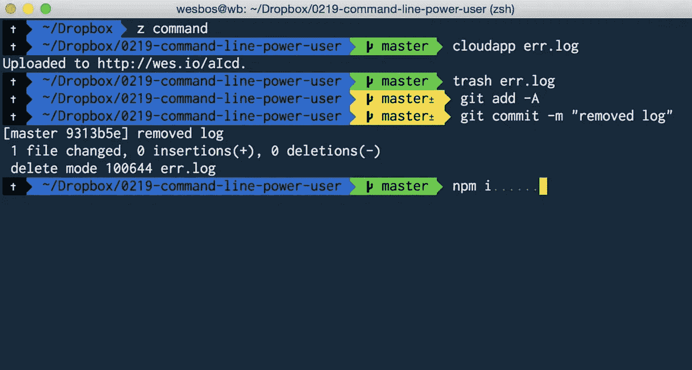
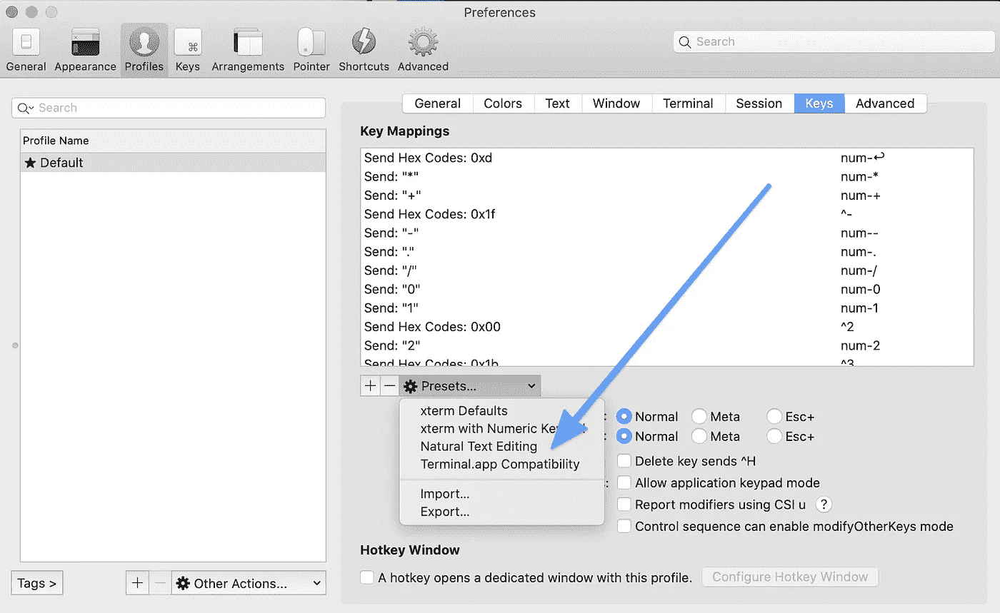
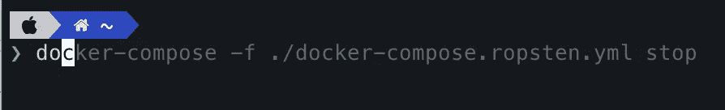
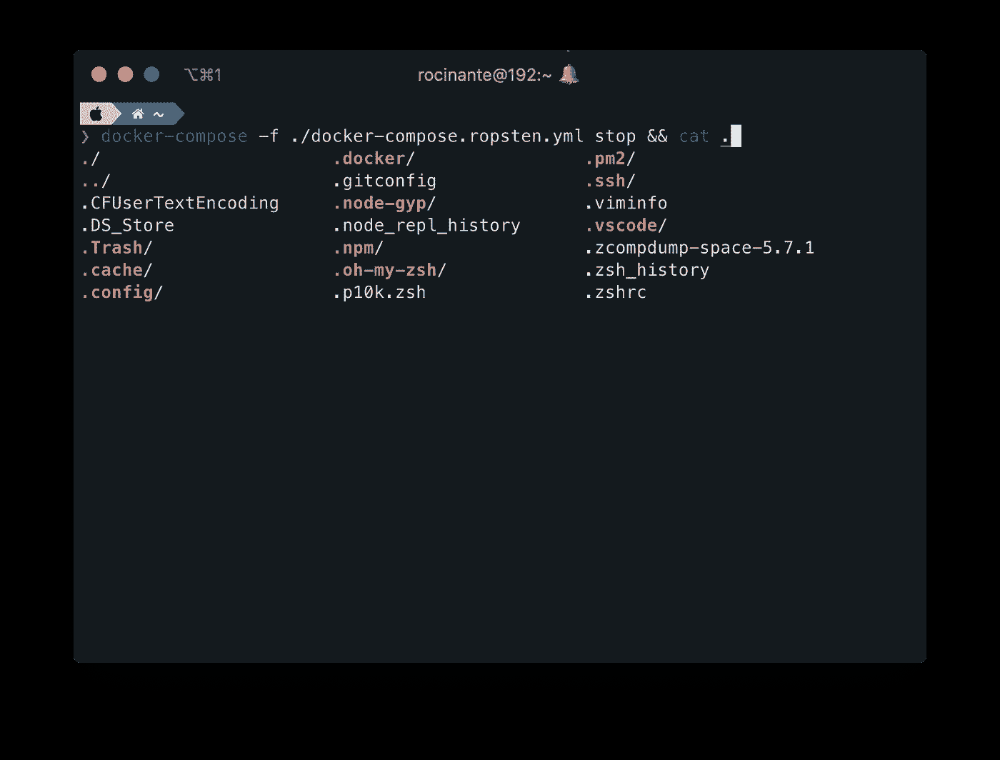
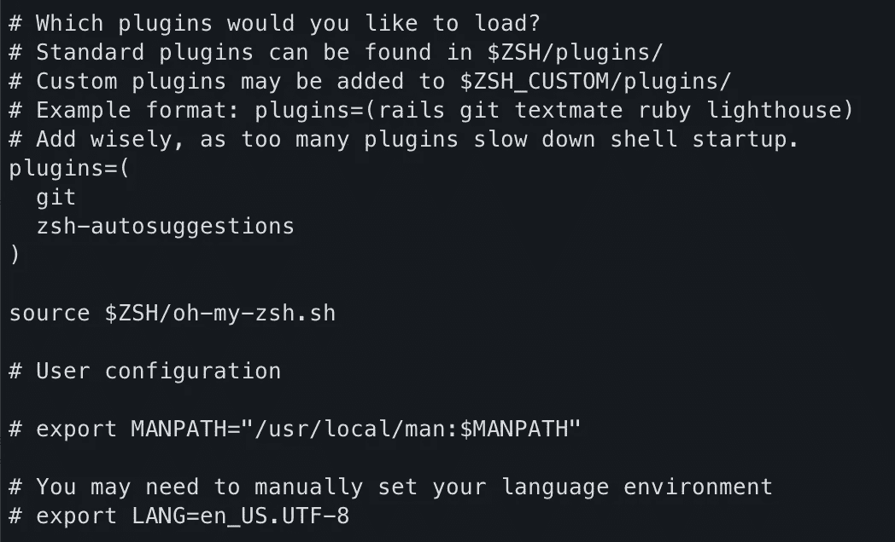
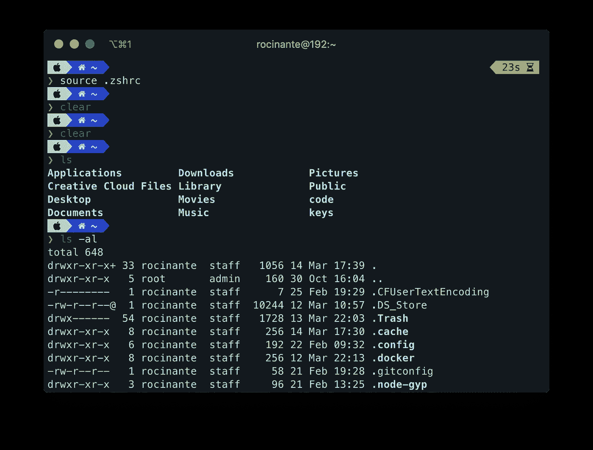

# Z-SHELL 入门

> 原文：<https://javascript.plainenglish.io/getting-started-with-z-shell-d92f072430bc?source=collection_archive---------11----------------------->

## 酷男孩和酷女孩使用的终端


Photo by [Lorenzo Herrera](https://unsplash.com/@lorenzoherrera?utm_source=medium&utm_medium=referral) on [Unsplash](https://unsplash.com?utm_source=medium&utm_medium=referral)

就是这样！我得到了我的第一份工作！经过几个月的努力工作，我决定要改变一些事情。

2016 年冬天，我被一家大型欧洲银行录用。我感到非常幸运！这个团队很酷，很友好，气氛也很轻松。有一份全职工作似乎没有我想象的那么糟糕。

像任何球队一样，有一个很酷的人。在我们团队中，最酷的人是凯文。他使用很酷的词语，很酷的工具，轻松编码。所以当我们开始一起工作时，我注意到的关于凯文的第一件事是他的**水力压裂终端**。看起来太棒了！每次凯文会在他的笔记本电脑上展示一些代码，我都会被他的终端迷住并嫉妒。



some screen capture of Wes Bos

原来 Kevin 使用的是 z-shell，特别是 [**OhMyZsh**](https://ohmyz.sh/) 一个扩展 Z-Shell 并添加了大量好东西的框架。当然，我也想这样。所以让我们一起安装和配置它，这样我们就可以像凯文一样酷了。

# Z-SHELL 是什么？

[**ZSH**](https://github.com/robbyrussell/oh-my-zsh/wiki/Installing-ZSH) ，也叫 Z-shell，是伯恩 Shell (sh)的扩展版本，有很多很酷的东西，并且支持**插件**和**主题**。Z-shell 与 Bash 非常相似，所以应该不会有切换问题。

另一边是一个扩展 z-shell 的仓库。

你可以拥有一个看起来很酷的终端，带有自动完成、高亮显示和许多其他功能。例如，你可以输入`**google** how to cook an egg`，它会打开 chrome 和谷歌*“如何煮鸡蛋”*。

# 装置

*如果你在 MAC 上，你可能想使用*[***iterm 2***](https://iterm2.com/)**作为你的基本终端。**

*至于**我的天啊 ZSH** ，安装起来非常容易！*

*下面是如何用卷曲安装*

```
***sh -c “$(curl -fsSL https://raw.github.com/ohmyzsh/ohmyzsh/master/tools/install.sh)"***
```

*****或用 wget*****

```
***sh -c “$(wget [https://raw.github.com/ohmyzsh/ohmyzsh/master/tools/install.sh](https://raw.github.com/ohmyzsh/ohmyzsh/master/tools/install.sh) -O -)”***
```

***你应该让它跑起来。现在你可能想安装一些很酷的功能***

# ***自然文本选择***

***如果您有 iTerm2，您可以选择一个**自然文本编辑预设**。使用此预置，您可以像使用文本编辑器一样在终端中导航。***

***例如，您可以使用 **alt/option** 从一个单词跳到另一个单词，使用 **cmd/ctrl** 跳到一行开头的末尾。***

******

# ***自我暗示***

******

***自动建议帮助您在键入命令时看到可能的命令。那很酷！***

*****下面是安装方法:*****

***[](https://github.com/zsh-users/zsh-autosuggestions/blob/master/INSTALL.md#oh-my-zsh) [## zsh-用户/zsh-自动建议

### 鱼一样的自我暗示。创建一个帐户，为 zsh 用户/zsh 自动建议的发展作出贡献

github.com](https://github.com/zsh-users/zsh-autosuggestions/blob/master/INSTALL.md#oh-my-zsh) 

# 语法突出显示



通过语法高亮显示，终端将**检测并高亮显示您编写的**命令和可执行文件。

```
 brew install zsh-syntax-highlighting
```

如果你没有或者不喜欢自制软件，请按照 [**的安装说明**](https://github.com/zsh-users/zsh-syntax-highlighting/blob/master/INSTALL.md) 进行操作。

安装后，在您的`.zshrc`文件的末尾添加下面一行。

```
source /usr/local/share/zsh-syntax-highlighting/zsh-syntax-highlighting.zsh
```

该文件应该在您的个人文件夹中。要访问您的个人文件夹，可以键入`cd ~`。

您可能需要用

```
cd ~
source .zshrc
```

# Powerlevel10k，最好的题材

虽然你可以选择你想要的主题，但我强烈建议使用 **powerlevel10k** 主题。它速度快，易于安装，并有许多内置功能。

下面的安装链接👇

[](https://github.com/romkatv/powerlevel10k) [## romkatv/powerlevel10k

### Powerlevel10k 是 Zsh 的一个主题。它强调速度、灵活性和开箱即用的体验。准备好开始了吗…

github.com](https://github.com/romkatv/powerlevel10k) 

# 插件

z-shell 最酷的功能大概就是插件了。它预装了 git 插件，但是你可以添加更多的插件。

例如，我安装了 git 和自动完成功能。



the contents of my .zshrc file in ~

检查下面数百个其他插件👇这样你就可以给你的终端充能了。

[](https://github.com/ohmyzsh/ohmyzsh/wiki/Plugins) [## ohmyzsh/ohmyzsh

### 🙃一个令人愉快的社区驱动的(有 1800 多个贡献者)框架，用于管理您的 zsh 配置。包括…

github.com](https://github.com/ohmyzsh/ohmyzsh/wiki/Plugins) 

# 结论

瞧啊。现在你应该有这样的东西。



当然，它的外观很大程度上取决于你的终端的配色方案。你可以根据自己的需要定制，改变颜色，添加自己的颜色主题等。

# 你可能喜欢的其他文章

[](/10-things-every-nest-js-developer-should-know-911dec32f66a) [## 每个 Nest.js 开发者都应该知道的 10 件事

### 如何像坏蛋一样使用 Nest.js

javascript.plainenglish.io](/10-things-every-nest-js-developer-should-know-911dec32f66a) [](/why-its-okay-to-feel-like-an-imposter-e33a4f98f646) [## 为什么感觉自己是个冒名顶替者没关系

### 为什么你觉得自己像一个软件开发骗子，为什么没关系

javascript.plainenglish.io](/why-its-okay-to-feel-like-an-imposter-e33a4f98f646) [](https://medium.com/swlh/why-90-of-startups-fail-ea41ed0a2f8c) [## 为什么 90%的创业公司会失败

### 以及如何成为成功的 10%

medium.com](https://medium.com/swlh/why-90-of-startups-fail-ea41ed0a2f8c) 

# 下一步是什么？

我希望您喜欢这篇文章，并发现它很有用。当我继续记录我的创业和软件开发之路时，你可以在 Twitter 上关注我。***