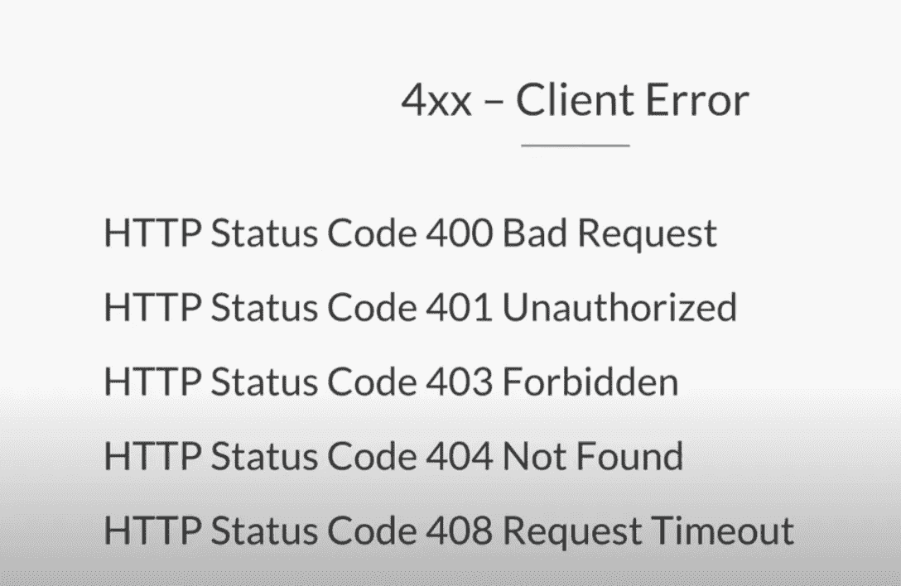
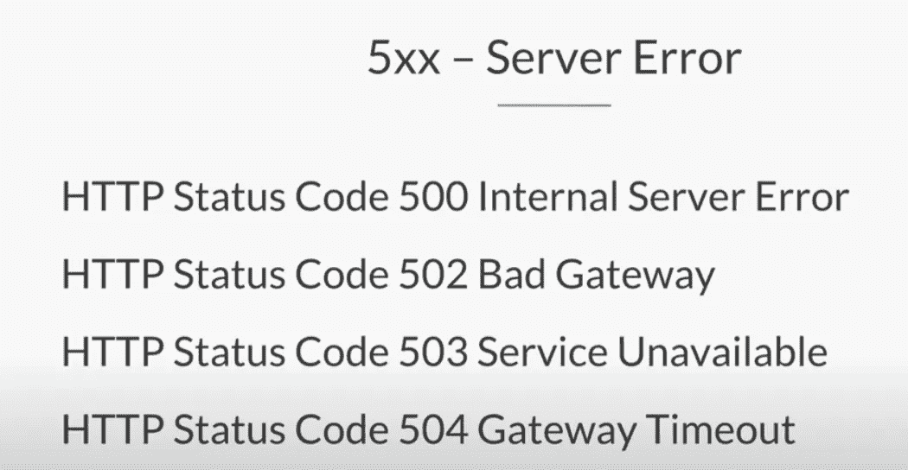

# 了解 HTTP 400 与 500 状态错误代码。

> 原文：<https://javascript.plainenglish.io/getting-to-know-http-400-vs-500-status-error-codes-2ce5bf1a7cb3?source=collection_archive---------7----------------------->

HTTP 状态码初学者指南。

Photo by [visuals](https://unsplash.com/@visuals?utm_source=medium&utm_medium=referral) on [Unsplash](https://unsplash.com?utm_source=medium&utm_medium=referral)

让我们用 HTTP 错误代码来更接近和个人化一点。作为一名开发人员，当我们构建我们的 web 应用程序时，我们必然会遇到它们，当然，作为一名用户，我确信您在日常生活中已经看到过一些 HTTP 错误状态代码！

# 客户端和服务器

归结起来，互联网由两个核心组成:**客户端**和**服务器**。客户端是你的网络浏览器，想想谷歌浏览器、火狐浏览器、Safari 浏览器、ie 浏览器。每当你请求一个网站时，你通常是在向一个 web 服务器发出请求，你会发出请求，服务器会做出响应。

# 什么是 HTTP 状态代码？

HTTP 状态代码让我们知道从客户端到服务器的请求是成功、失败还是介于两者之间。

# HTTP 状态代码类型

首先，让我们定义不同的 HTTP 状态代码类型:

**HTTP 1xx —信息**

**HTTP 2xx-成功**

**HTTP 3xx-重定向**

**HTTP 4xx-客户端错误**

**HTTP 5xx-服务器错误**

# HTTP 400 客户端错误代码

任何以 400 左右的形式出现的状态代码都是客户端错误。

**不同 HTTP 400 状态代码的示例:**

# HTTP 404 状态错误代码

一个 *HTTP 404 错误代码导致一个网页找不到*并不一定是一件坏事。你可能想知道为什么？好吧，如果用户输错了网址，他们应该得到一个 404 代码。什么时候要警惕 404 代码是如果你有一个网页充满了链接，过去有内容，但现在服务于 404 错误。这是一个危险信号，因为在这种情况下，您希望网页重定向(认为 HTTP-301 状态代码-重定向)到其他实际内容。

# HTTP 500 服务器错误代码

HTTP 500 错误代码意味着我们有一个内部服务器问题。客户端提出了一个很好的请求，但是服务器没有完成，服务器有问题。

*   HTTP 状态代码表示一般的服务器问题，应该尽快解决。建议联系您的 web 主机来解决此问题。

**不同 HTTP 500 状态代码的示例:**

# 结论

对我们的 HTTP 代码有一个总体的概念是很重要的，这样才能理解我们构建的程序，并且可能不得不调试像 HTTP 状态错误代码这样的问题。我希望你喜欢这个博客，并且可以用它作为导航理解 HTTP 状态代码的路线图！

*更多内容请看*[***plain English . io***](http://plainenglish.io/)