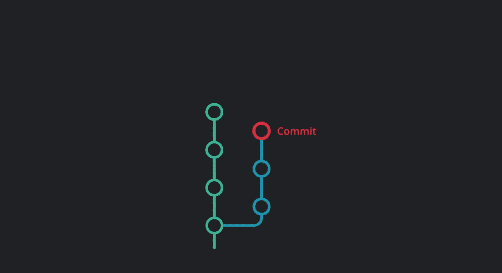
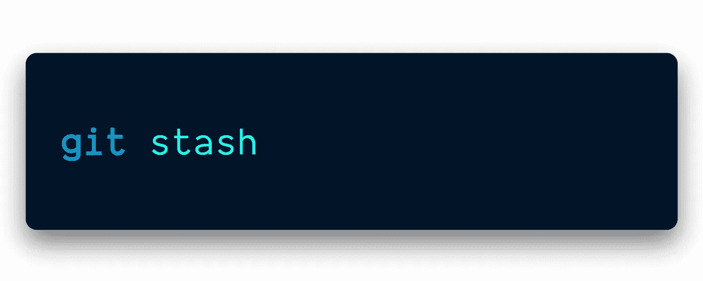

# Git 命令让您的生活更加轻松

> 原文：<https://javascript.plainenglish.io/git-commands-that-make-your-life-easier-1f285653449d?source=collection_archive---------6----------------------->

## 你将被铭记在你的错别字和编辑历史中

[📷](http://Made By the Author)

在本文中，我们将学习一些救命的 Git 命令。

我们不仅会了解它们，还会通过了解它们在幕后是如何工作的来构建一个心智模型。

其中一些你可能以前用过，而另一些对你来说可能是新的，但它们都是救命稻草。

# 真正的错误是有错误而不改正

> “你将被铭记在你的错别字和编辑历史中”
> 
> —匿名

错别字时有发生！

Git 给了我们改正错误的选择。

当提交时，有时我们会太快地按下“Enter ”,在提交消息的某个地方有一个打字错误。

use -amend command to fix the typo

完美！现在，你的同事将看不到你的“ **commit** ”最初拼写为“**commit**”。

# 精心制作的东西值得一看

您可能已经多次使用命令`git add <file>`或`git add .`，但是这样做并不允许我们只提交文件的一部分。

`git add -p`允许您暂存部分已更改的文件，而不是整个文件。

这允许您进行简洁的、精心制作的提交，从而使历史更易于阅读。

这样做可以提高提交的质量。

它还可以轻松地删除文件中仅用于调试目的的部分更改——在提交之前，无需返回编辑器。

一旦这个命令运行，我们将被询问关于“hunks”的信息。

“Hunks” are the *chunks* of code that we’ll decide what to do with.

你会看到这个问题，“上演这个大块头[y，n，g，a，d，e？]?"在终端的底部。

当完成所有的“大块”时，我们将能够看到我们的提交已经准备好了，我们可以继续推送了！

## 额外提示:

`git commit -p`将`git add -p`和`git commit`组合在一个命令中。

# 你的错误并不能定义你

你做了承诺，但现在你后悔了？也许你不小心犯了秘密——这不是一个好主意——或者你想在你的代码变更中添加更多的测试。

这些都是撤销你上一次承诺的正当理由。

Git 给我们一个命令来撤销我们的最后一次提交。

命令`git reset`有各种各样你可以跟踪的东西，让我们谈谈“软”跟踪。

`git reset —soft HEAD~` *删除当前分支的提交，但保留更改！*

**这个命令最酷的一点是这些改变不会消失**！

所有的改变都将保留在工作树中！

We ran the command git reset — soft HEAD~2 — it moved the HEAD to the previous two commits.

如果你不想保留由某些提交引入的变更，那么使用`git reset —hard HEAD~`

## **奖励提示:**

git [预提交钩子](https://gist.github.com/eyarz/64770d343b9cab442b257869f497af9e)是一个内置特性，允许您定义在每次提交之前自动运行的脚本。使用它来减少取消提交的需要。

# 寻找你的选择，选择最好的，然后跟着它走。

假设您正与一个开发团队一起从事一个中型到大型的项目。

另一个团队成员提出了一些更改，您希望将其中的一些应用到您的主项目中，而不是全部应用。

因为管理几个 Git 分支之间的变更可能会成为一项复杂的任务，并且您不希望将整个分支合并到另一个分支中。

您只需要选择一两个特定的提交。从其他分支中挑选一些变更到您的主项目分支中被称为精选。

在这个命令中，我们可以选择一个已经提交的特定分支，并将其拖到另一个分支中。让我们走一遍。

提交是您的 git 存储库在某个时间点的快照，每次提交累积起来形成了您的回购历史。

`cherry-pick`命令从目标提交中获取更改，并将它们放在当前签出分支的头上。

从这里开始，您可以继续处理工作目录中的更改，也可以立即提交精选的更改。

如果您不小心提交到了错误的分支，这很有帮助。

通过精选，您可以将这些更改放到正确的分支上，而无需重新做所有的工作。

但是，慎用`cherry-pick`！

过度使用`cherry-pick`会导致重复提交，有时合并可能更有利于保存提交历史。

## 现实生活场景:

假设我们有一个分支`76d12`，并且我们已经提交了所有的变更。

还有另一个分支，我们将只使用`master`，但是这可以是任何分支，并且我们想要拉入`76d12`的提交。

通过使用命令，`git cherry-pick 76d12`,我们可以将整个提交转移到另一个分支。

`cherry-pick b`*ring an entire commit from one branch into another.*

# 不想要全部吗？没问题——只需结账

想从一个分支中挑选一个特定的文件并把它放入当前分支吗？

Som，我使用`git checkout`主要是为了从一个分支切换到另一个分支。

是的，我知道，但是我们也可以用它来检查文件和提交。

这就像`git cherry-pick`，但是我们不是“挑选”整个提交，而是深入到一个分支，只挑选我们想要合并的特定文件。

当一直停留在`master`中时，我们可以运行命令`git checkout Som-test index.js`来获取该特定分支中的特定提交文件，并将其交给主服务器最终推送。

当一个特定的分支有很多变化，而我们只寻找一个文件来测试或推送时，这是非常简单的。

## 它是如何工作的:

`git checkout`告诉 Git 哪个分支或提交应用您的新更改。

一个分支只是一个指向一个特定提交的指针，而一个提交是你的存储库在某个时间点的快照。

分支指针随着每次新的提交而移动。

如果您想要对当前尚未签出的分支进行更改，您首先需要签出该分支。

检出一个分支将会更新您的回购文件，以匹配该分支指向的任何提交的快照。

从这里开始，分支指针将跟随您在分支上进行的每个新提交。

也可以直接签出提交，这将更新您的回购文件，以匹配您签出的任何提交的快照。

请注意，签出提交会将头指针移动到提交而不是分支，将您的回购置于所谓的“分离头状态”，其中任何更改都不会提交到分支。

虽然 git checkout 对于开始使用分支非常有用，但它也是审查旧提交的有用工具，因为它将您的 repo 版本切换到这个旧快照。

# 有一天…但还不是时候，还不是时候

假设我们对一个文件做了很多更改，但是在提交和推送之前需要返回并测试一些东西，或者我们还没有准备好提交我们的更改。

这就是`git stash`发挥作用的地方。

Save uncommitted changes and stash them for later. This is useful for when you want to commit and push, but aren’t ready to commit the changes since the last commit.

当我们运行命令`git stash`时，它会将那些保存的、未提交的更改“藏起来”以备后用。

然后，我们可以在不同的分支之间移动，将更改拉入主模块，等等。

一旦我们完成了测试或者做了我们需要做的任何事情，我们可以回到我们的分支，运行命令`git stash pop`，我们的改变就会回来！就像我们从未离开过一样！

# 你该去寻求帮助了。

有太多的 git 命令可供选择。重要的是，我们不要在不知道命令会对代码产生什么影响的情况下运行命令。

如果我们只运行`git help <command>`,那么我们将在我们的终端中得到这个命令的解释。

## *奖励提示:*

运行命令`git help -w <command>`会将我们直接带到一个网站，我们可以在这个网站上阅读与该命令相关的所有内容。

# 结论

Git 是一个非常有用的工具。如果处理不当，可能会是一场噩梦。我希望这些隐藏的宝藏能让您的 Git 体验更有成效。

你的 Git 命令是什么？请在评论里告诉我！

# 感谢信

我想利用这最后的机会说声谢谢。

感谢您的光临！如果没有像你这样的人跟随并带着信念阅读我的帖子，我将无法做我所做的事情。

我希望你能 [**加入我的**](https://polymathsomnath.medium.com/subscribe)[**我未来的博客文章**](https://polymathsomnath.medium.com/subscribe) 并留下来，因为我们这里有一些很棒的东西。

我希望在未来的许多年里，我能在你的职业生涯中帮助你！

下次见。再见！

*更多内容请看*[***plain English . io***](http://plainenglish.io/)