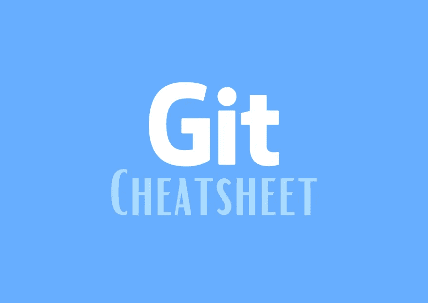

# 把它弄好🚀(Git CheatSheet)

> 原文：<https://javascript.plainenglish.io/git-it-right-git-cheatsheet-b757ca6ec9d5?source=collection_archive---------16----------------------->



`**Git commands cheatsheet📁**`

# 基本命令

*   **Git 配置:**
*   `git config -- global user.name NAME` =全局设置用户名
*   `git config --global user.email EMAIL` =全局设置用户电子邮件
*   `git config user.name` || `git config user.email` =检查保存的信息

# 创建回购

*   `git init` =在当前目录下创建一个 git 存储库

基本要素——在自己或与他人一起使用 git 时

*   `git status` -提醒你离开的地方。查看本地更改、远程提交和未跟踪文件的摘要。
*   `git diff` -查看被跟踪文件的特定本地更改。使用- name-only 查看更改的文件名。
*   `git add` -对跟踪和未跟踪的文件进行修改。使用-u、-a 和。战略上。
*   `git commit` -使用先前添加的更改创建新的提交。使用-m 并添加一条有意义的提交消息。
*   `git push` -将变更发送到您配置的远程存储库，最常见的是 GitLab 或 GitHub。

# 基本流程 git 的日常使用，包括标志

1.cd 到您想要用 git 开始版本控制的本地项目。您只需要在第一次运行 git init 来设置版本跟踪的目录。

```
git init 
git status 
git add --all 
git status 
git commit -m "meaningful initial commit message"
git show
```

2.你开始入侵你的本地文件，然后定期提交。

```
git diff 
git commit -a -m "Another commit message. -a performs the add step for you"
git status 
git log --graph --pretty=oneline --abbrev-commit
```

3.过了一会儿，您有 3 次提交，这比单次提交更有意义

```
git log --graph --pretty=oneline --abbrev-commit
git reset --soft HEAD~3 
git diff --cached 
git commit -a -m "Better commit 
message for last 3 commits"
```

4.最后，删除当前目录中一些不需要的文件

```
git status 
git diff --cached 
git add -u 
git commit -m "Another commit message. -u adds updates, including deleted files"
git status 
git log --graph --pretty=oneline --abbrev-commit
git push origin master
```

基本分支—分支代表一系列提交。

*   `git branch --all` -列出所有本地和远程分支机构
*   `git checkout <branch>` -更改为现有分支
*   `git checkout -b <branch> master` -基于 master 创建一个分支并检查它
*   `git checkout master && git merge <branch>` -将分支变更合并到主控上

重要标志——这是我个人最喜欢的保持一切井然有序的标志。

*   `git reset HEAD --` -返回上一次提交并取消其他提交
*   `git add -u` -仅添加更新的、之前提交的文件
*   `git log --graph --pretty=oneline --abbrev-commit` -对于一个漂亮的分支历史来说。创建一个 shell 或 git 别名以便于访问，比如 git log。

使用远程存储库——一旦你进入流程，你将频繁地为更大的项目做出贡献，并可能管理分叉的分叉。这里有一些这样做的技巧。

*   下载所有提交、文件和对所有远程存储库上的分支的引用，这样你就可以签出或获取你想要的东西。
*   `git pull --rebase <remote> <branch>` -在不创建合并提交的情况下，从远程分支合并自上次公共提交以来的所有提交。
*   `git stash` -根据需要使用这个来保存未提交的修改，这样你就可以把它们放到不同的分支上。
*   `git stash pop` -把它带回来
*   `git add [-A or . or -- <filename>]` -要有意识地向提交中添加什么文件，尤其是如果你想打开一个请求，将它们合并到一个上游项目中。
*   `git commit -m "commit message"` -大多数项目都有自己喜欢的提交消息格式。查看项目中的 CONTRIBUTING.md 文件或查看以前的提交，以了解它们的格式。
*   `git push origin <branch>` -将当前分支推送到名为“原点”的遥控器，分支名为
*   `git checkout -b <new_branch>`-git 分支&的快捷方式& git checkout 分支。当你想尝试一个想法，并有一个新的分支可以尝试，然后可以合并或删除时，这是非常好的。
*   `git checkout master && git pull --rebase` -对于一个你很少关注的项目来说，获得最近的提交是很棒的。
*   当你不可避免地迷失在所有的事物中，需要到达一个已知的状态。警告:这将擦除所有更改，甚至是自上次提交被推送到 branch master 上的远程源之后的提交。
*   `git push origin master`——当你不可避免地做了正确的事情！将您的更改发送到 branch master 上标题为 origin 的遥控器。

获得帮助

*   `git <cmd> -h` -非常适合快速查看命令标志
*   `git <cmd> --help` -深入研究该命令的完整手册页

*更多内容请看*[***plain English . io***](http://plainenglish.io/)