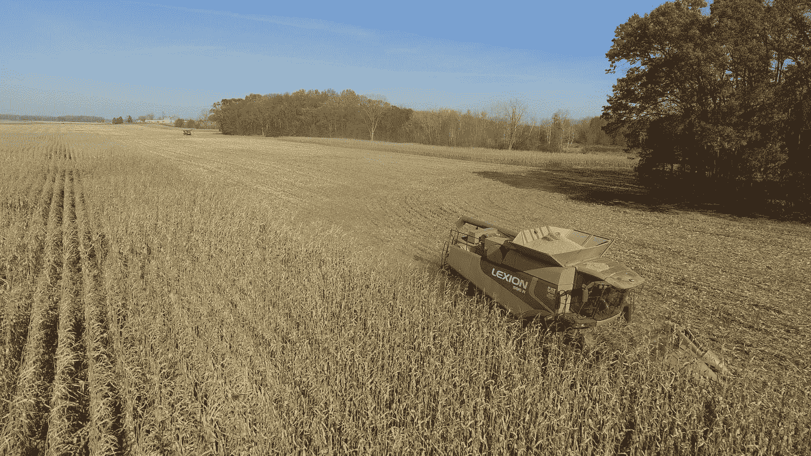

# Git 合并策略:简单的解释和指南

> 原文：<https://javascript.plainenglish.io/git-merging-strategies-a-simple-explanation-and-guide-9e7e508b369c?source=collection_archive---------9----------------------->



Photo by [Loren King](https://unsplash.com/@kingimaging?utm_source=medium&utm_medium=referral) on [Unsplash](https://unsplash.com?utm_source=medium&utm_medium=referral)

我们这些做过 git 版本控制系统的人一定都遇到过这两种合并策略:**快进合并和递归策略做的合并**。

但是很多时候，由于大部分事情都是由 git 自己处理的，我们并不确切地知道 git 历史上会发生什么，或者至少这就是我的情况。每次我看到类似“快进”或“递归策略合并”的消息，我都想知道这是什么意思。在这篇文章中，我将试着解释这些合并策略的含义，我希望它也能给你们一些启发。

# 我们正在研究的例子

这是我们将在本文中使用的 git 树。

```
master       m1  m2feature      m1  m2  f1  f2
```

让我们将 master 作为我们的主分支，我们将从中分支并作为 master 的新分支。

master 中的初始提交是 m1 和 m2，之后检查新的分支特性，该特性进一步具有 f1 和 f2 提交。

# 快进合并


Photo by [Kurt Cotoaga](https://unsplash.com/@kydroon?utm_source=medium&utm_medium=referral) on [Unsplash](https://unsplash.com?utm_source=medium&utm_medium=referral)

在快进合并中，如果**主**在分支**特征**后没有任何变化，则在合并到主时，不会创建合并提交，而是所有特征提交都放在主提交之上。

例如，如果在上面的例子中，我们在主服务器上运行“git merge 特性”,下一个状态应该是这样的:

```
master       m1  m2  f1  f2
```

> **注意:**如果您在特性分支中有多个提交，并且您想在合并到主特性之前将它们合并成一个，您可以运行:
> **"git merge - squash feature "，**这将提示您提交消息，状态如下:

```
master        m1  m2  “single commit”
```

> 这里的“单次提交”是我们在运行 squash 命令时提供的消息(f1 和 f2 都是该提交的一部分)。

# 非快进合并(递归策略)


Photo by [Mario Mesaglio](https://unsplash.com/@seimesa?utm_source=medium&utm_medium=referral) on [Unsplash](https://unsplash.com?utm_source=medium&utm_medium=referral)

自从从**主模块**创建**特征**以来，当**主模块**已经发展并具有更新的提交(可能是由于一些其他分支被合并)时，git 采用该策略。在这种情况下，初始树应该是:

```
master       m1  m2  m3feature      m1  m2  f1  f2
```

如您所见，m3 是主模块中的新提交，如果我们现在在**主模块**上运行“git 合并功能”，那么**功能**分支的所有提交都会在**主模块**上执行，并且还会创建一个合并提交。这不同于在附加提交创建中的快速前进合并。

这是合并后的新状态:

```
master       m1  m2  f1  f2  m3  "merge commit of feature branch"
```

***虽然 git 会自动执行这种类型的合并策略，但如果我们明确地想要这样做，我们可以运行“git merge - no-ff feature”。***

> **注意:**如果您在特性分支中有多个提交，并且您想在合并到主特性之前将它们合并成一个，您可以运行:
> " **git merge - squash 特性**，这将提示您一个提交消息，其状态如下:

```
master        m1  m2  m3  “single commit”
```

> 这里的“单次提交”是我们在运行 squash 命令时提供的消息(f1 和 f2 都是该提交的一部分)。

# 资源

[](https://www.tutorialspoint.com/what-is-a-fast-forward-merge-in-git) [## 什么是 Git 中的快进合并？

### 当存在从源分支到目标分支的直接线性路径时，可以执行快进合并。在…

www.tutorialspoint.com](https://www.tutorialspoint.com/what-is-a-fast-forward-merge-in-git) [](https://www.atlassian.com/git/tutorials/using-branches/git-merge) [## Git 合并| Atlassian Git 教程

### 合并是 Git 将分叉的历史重新组合在一起的方式。git merge 命令允许您将…

www.atlassian.com](https://www.atlassian.com/git/tutorials/using-branches/git-merge) 

*更多内容请看*[***plain English . io***](http://plainenglish.io/)