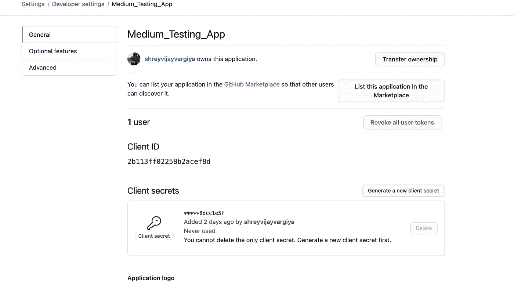
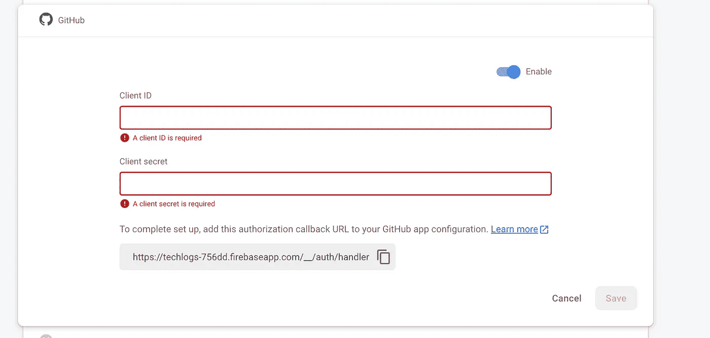
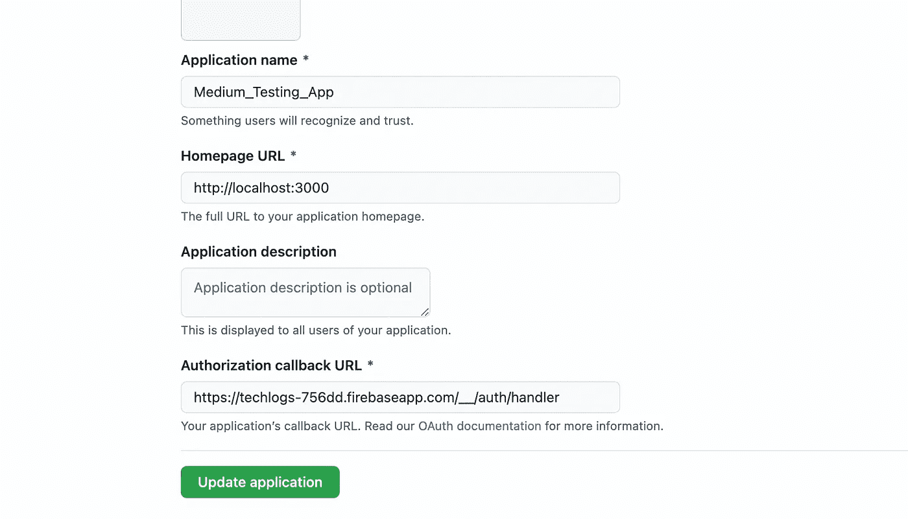
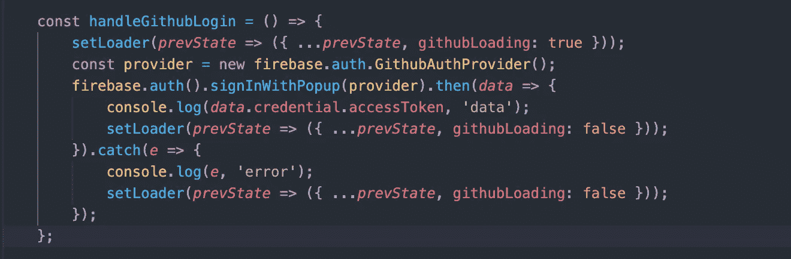
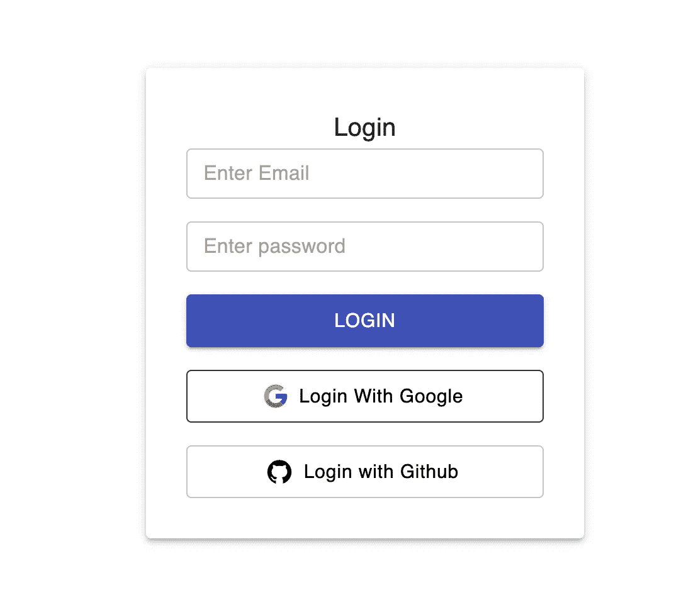

# 使用 Firebase 通过 GitHub 身份验证来验证用户

> 原文：<https://javascript.plainenglish.io/github-authentication-using-firebase-f08bd9d7e659?source=collection_archive---------15----------------------->

## 使用 GitHub 认证您的用户


[Read the articles](http://i-hate-reading-logs.vercel.app/)

使用谷歌、脸书、Twitter 和 GitHub 认证用户可以提供更流畅的用户登录体验。我已经写过一篇关于使用 Firebase 进行 google 认证的文章。下面是文章的链接:

```
Google Authentication using Firebase => [Article](https://medium.com/nerd-for-tech/firebase-authentication-in-less-than-5-minutes-dce8ad5b8459)
```

今天，我们将使用 Firebase 通过 GitHub 添加身份验证。GitHub 身份验证要求您创建一个 OAuth GitHub 应用程序，其中包含应用程序名称、应用程序回调 URL 和域 URL。我将在后面介绍这一点。

# **概述**

1.  我们将在 GitHub 档案- >设置- >开发者设置- > OAuth 应用中创建一个 **OAuth** 应用
2.  添加回调 URL、域名、应用程序名称并创建 OAuth 应用程序
3.  保存 **clientSecret** 和 **clientID** 用于进一步的 Firebase 控制台。
4.  在 Firebase 控制台上添加 **clientSecret** 和 **clientID** 。
5.  从 firebase 方法创建 GitHub 提供程序。
6.  使用提供者通过 GitHub 添加 firebase 身份验证

在 GitHub 开发者设置中创建 OAuth 应用。这里是链接= >

```
GitHub Developer Settings => [https://github.com/settings/developers](https://github.com/settings/developers)
```

在开发者 OAuth 应用程序中，您需要输入回拨 URL 和 URL，您将从 Firebase 控制台获得回拨 URL。输入上述详细信息后，您将被重定向到 OAuth 应用程序页面，其中包含您的凭据详细信息。保存 **clientID** 和 **clientSecret** ，我们将需要它们进行进一步的处理。最后一步是在本页下面添加一个回拨 URL，您将从 Firebase 控制台获得您的回拨 URL。



Github Developer Settings Page([Link](https://github.com/settings/developers))

**获取 CallbackURL**
转到 Firebase Console =>authentic ation =>sign-in method
通过切换开关
启用通过 Github 方法的身份验证输入上述 clientID 和 clientSecret 并复制粘贴 callbackURL
输入 CallbackURL 的副本到 Github 开发者 OAuth App。



Firebase Authentication via GitHub console

在输入中输入您的 clientID 和 clientSecret，复制您的回调 URL 并将其粘贴到 GitHub OAuth 应用程序上。



Callback URL in GitHub OAuth Developer page

# **编写代码**

我们将使用相同的存储库，我们使用电子邮件-密码和谷歌添加认证。

```
* [Google Authentication repository using Firebase](https://github.com/shreyvijayvargiya/iHateReadingLogs/tree/main/TechLogs/FirebaseAuthentication)
```

首先，我们将创建一个 firebase provider，这是 Firebase GitHub Auth 所需要的。Firebase 本身提供了一种为 GitHub 身份验证创建提供者的方法。

```
const provider = new firebase.auth.GithubAuthProvider();
```



Login via Github method

我们的 handleGithubLogin 方法首先创建提供者，然后使用这个提供者为我们的用户登录使用 GitHub 的用户。Firebase auth 方法提供 signInWithPopup 方法，该方法接受提供者作为参数，作为响应，它给我们提供访问令牌。 **accessToken** 是最重要的令牌，因为我们将来需要这个令牌向 GitHub API 发出进一步的 API 请求。此外，如果您的用户使用 GitHub 登录，请务必保存这个 **accessToken** ，因为您确实需要一些用户 GitHub 凭证，这些凭证只能通过 GitHub API 使用这个 **accessToken** 来访问。



Final Sign-in Page

最后，如果用户已经使用 Google 登录，并试图使用 GitHub 或其他方法登录，Firebase 会提供一条错误消息来响应 API。在这种情况下，最佳实践是为用户提供关于其先前登录方法的错误和消息的正确指示。

# 结论

还有一种方法可以让你的用户通过 GitHub 登录。在这种方法中，我们可以使用 GitHub API 本身来登录，我试图在不创建任何后端服务器或代码的情况下成功做到这一点。一旦我完成了这个任务，我将在同一篇文章中进行介绍。

我将使用无服务器功能对 GitHub 登录 API 进行 API 调用。如果你不知道什么是无服务器功能，你可以找到下面的链接。使用无服务器功能的好处是，我们不需要创建自己的服务器来添加 GitHub 认证到我们的前端。

下次再见，祝大家有美好的一天。

```
[Click to read, What is Serverless Function ?](/serverless-function-in-next-js-3cd0d22ab983) Code repository => [https://github.com/shreyvijayvargiya/iHateReadingLogs/tree/main/TechLogs/GithubAuthenticationUsingFirebase](https://github.com/shreyvijayvargiya/iHateReadingLogs/tree/main/TechLogs/GithubAuthenticationUsingFirebase)
```

*更多内容请看*[***plain English . io***](https://plainenglish.io/)