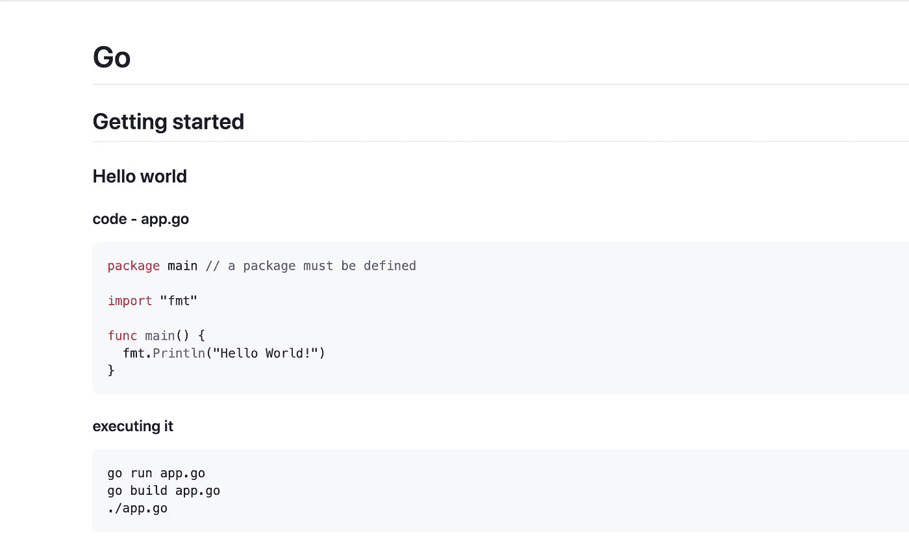
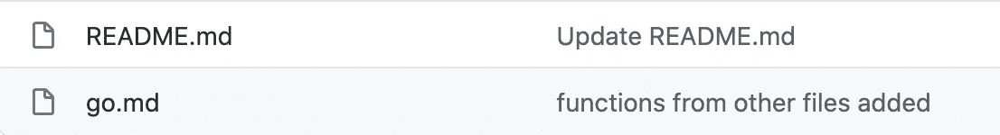
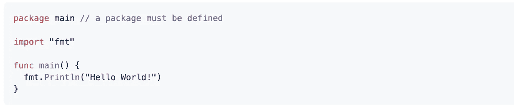
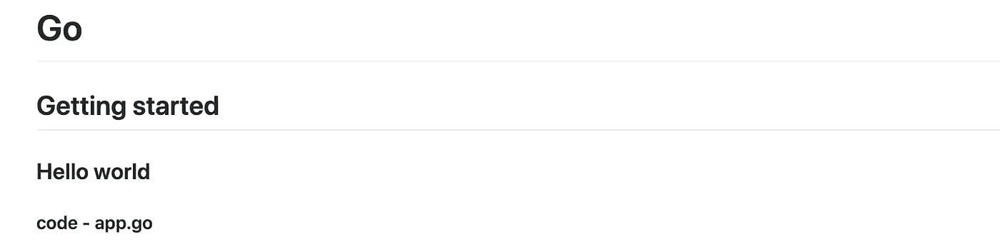
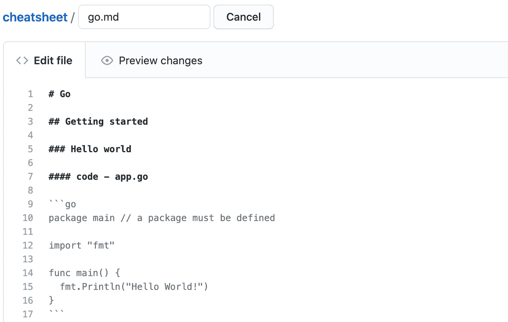
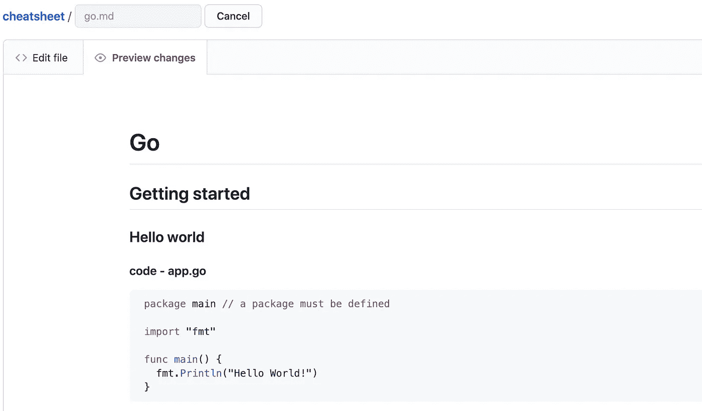

# 如何使用 GitHub 轻松创建编程备忘单

> 原文：<https://javascript.plainenglish.io/github-cheat-sheet-860945e17843?source=collection_archive---------9----------------------->

## 分享、强化和炫耀你的知识


Source: the author.

小抄是个好东西。

我经常使用它们。当学习一门新的编程语言时，我会创造一些语言来巩固我的知识。

使用 GitHub，创建您的备忘单集合非常容易。
多亏了 GitHub 应用程序，你可以将它们随身携带(如封面图片所示)。

下面是 GitHub 备忘单的样子:



Source: [Github.com](https://github.com/LouisPetrik/cheatsheet)

但是你为什么要创建一个自己的备忘单集合呢？

*   学习新技术的时候可以养成习惯。
*   你强迫自己重复你所学的。
*   你在一个地方反复需要的代码。
*   通过小的旁注和注释，一个人将概念和特性内在化——特别是在大型项目中，它可以帮助记录重复出现的错误或问题。

# 让我们创建一个备忘单集合

首先，您需要一个存储库。

可以直接在 GitHub 上创建一个。在创建选项中，选择您想要的 README.md。该 Markdown 将作为起始页。

现在，您可以填充存储库以在本地使用它。为了保持概述，我建议为每种技术创建一个单独的降价文件。



Source: the author

## 如何突出代码

在我的例子中，`go.md`是编程语言 Golang。

填写备忘单不需要了解很多关于减价的知识。突出显示代码的工作方式如下:

```
```go
package main // a package must be definedimport "fmt"func main() {
  fmt.Println("Hello World!")
}
```
```

三个反勾号定义了代码的开始和结束。在第一行，我们告诉 GitHub 这是哪种语言。在您的存储库中，突出显示的代码现在如下所示:



Source: the author

## 创建标题

为了清晰的概述，我们需要标题。它们对于立即构建功能导航也很重要。

使用`#`,我们在 Markdown 中定义一个标题。就像在 HTML 中一样，标题有不同的大小。

虽然`h1`是 HTML 中最大最顶端的标题，但是单个的`#`是 Markdown 的挂件。

如果你在一个序列中写两个、三个或四个散列(#)，你将得到副标题(h2、h3 和 h4)。

下面的代码生成标题，如下图所示。

```
# Go## Getting started### Hello world#### code — app.go
```



Source: the author

## 如何创建导航

在一个备忘单集合中，通常有几种技术，每种技术都有相应的子主题。这些主题可以是 IO、数组、函数、类以及编程语言的更多内容。

幸运的是，您可以快速构建一个导航，将您从存储库的起始页直接带到子主题。


Source: [GitHub](https://github.com/LouisPetrik/cheatsheet)

在我的存储库中，每项技术都有其降价文件，因此也有其唯一的 URL。在 GitHub 上，我们可以根据 Markdown-File 中标题的 id 进行导航。

一个破折号定义了导航中的每个子项。方括号中是链接的文本，直接在它后面；括号中是网址。

无论什么级别的标题，都可以直接链接。

## 轻松编辑您的备忘单。

您可以在线扩展您的备忘单，直接在 GitHub 和 clean markdown 预览中编辑文件。



Source: [GitHub](https://github.com/LouisPetrik/cheatsheet)



Source: [GitHub](https://github.com/LouisPetrik/cheatsheet)

感谢您的阅读！

[**加入我的简讯保持最新**](http://eepurl.com/hacY0v)