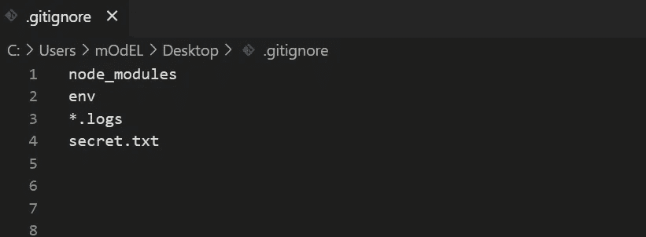

# GitHub 仍在提交来自。gitignore？

> 原文：<https://javascript.plainenglish.io/github-still-commiting-files-from-gitignore-df8bfedea1d7?source=collection_archive---------14----------------------->


Photo by [Richy Great](https://unsplash.com/@richygreat?utm_source=medium&utm_medium=referral) on [Unsplash](https://unsplash.com?utm_source=medium&utm_medium=referral)

# 这是怎么回事？

我们中的一些人是 GitHub 的新手，刚刚发现了`.gitignore`文件的工作原理。基本上，它忽略了列表中的文件上传到远程存储库。如果你也想先了解更多关于 GitHub 的信息，你可以点击[这里](https://sahil-more.medium.com/an-intro-to-github-and-its-usage-2c187f33070e)然后继续这篇文章。👍

# 为什么？

我们大多数人一定在想为什么会这样。尽管该文件列在 gitignore 文件中，但它被推送到远程存储库。冷静点，你肯定漏掉了什么。让我们来看看…🌐

# 发生了什么事？

所以让我们从头开始。您已经创建了一个项目，并且正在将代码推送到远程存储库。但是你忘了添加一个文件夹假设`node_modules`在这种情况下。所以你要做的是，在前一次提交之后，在`.gitignore`文件中添加一个`node_modules`条目。

假设这是你的`.gitignore`文件:



但是这样做之后，你面临着同样的问题。文件夹`node_modules`仍在远程端被推送。😕

# 为什么会这样？

你一定很惊讶，但`.gitignore`正在完美地完成它的工作。它的功能是:

> `*.gitignore*` *会阻止未被跟踪的文件被添加到 git 跟踪的文件集中，但是 git 会继续跟踪任何已经被跟踪的文件。*

想起什么了吗？💡

所以，简单地说，`.gitignore`不会影响已经被索引的文件。因为在第一次提交时已经将`node_modules`文件夹添加到 git 索引中，所以它不会再次运行`.gitignore`。它将只检查新创建的文件，而不是现有的文件，因此，如果你不做任何事情，`node_modules`文件夹将永远不会被删除。

现在，索引，在某种程度上，git 索引就像是你的项目的缓存。它是本地项目文件和提交到存储库之间的中间层。要清除这个缓存，我们需要删除它，这样项目就可以在下一次提交时进行。

# 修复

> **清除您的阶段性项目**

从缓存中取消跟踪您不想被文件跟踪的文件。我们不会删除实际的文件，而只是删除已经添加到缓存中的条目。对于执行命令的:

```
git rm --cached <filename>
```

在这种情况下:`git rm --cached node_modules`

如果您有许多需要取消跟踪的文件，您可以选择退出以下选项:

```
git rm --cached .
```

基本上，这个命令将删除所有缓存的文件，并开始像一个全新的存储库的缓存功能。

# 谢谢你:)

希望你们喜欢这篇文章🙌
请鼓掌让我知道👏
在这里[发表你对新文章的建议](mailto:sahilmore19999@gmail.com)📬你也可以在这里给我买杯咖啡☕️

*更多内容请看*[***plain English . io***](http://plainenglish.io/)