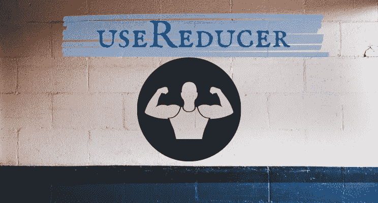

# 给你的用户升级钩子

> 原文：<https://javascript.plainenglish.io/give-an-upgrade-to-your-usereducer-hook-de8b46d3bde3?source=collection_archive---------11----------------------->

## 如何升级 React 中的 useReducer 钩子，使其功能类似 Redux reducers？


Photo by [Oskar Yildiz](https://unsplash.com/@oskaryil?utm_source=medium&utm_medium=referral) on [Unsplash](https://unsplash.com?utm_source=medium&utm_medium=referral)

如果你必须问一个 React 开发人员——React 中最重要的知识是什么，最可能的答案是了解“状态”以及它在幕后如何工作，这是 React 中最重要的原则。

在现代 React 设置中，有几种方法可以管理您的状态。最常见的方法是简单的 useState 挂钩，它让您可以轻松地跟踪和更改您的状态模式。

但是有时您想要管理更复杂的状态。为此，您有几个状态管理工具，比如 Redux。Redux 不仅仅是拥有一个“全局”状态。Redux 还以一种特殊的方式应用状态管理工具，这种方式被称为 dispatch(action)—reducer—store cycle。

在本文中，我将简要解释 Redux 状态循环是如何工作的，但本文的主题不是 Redux。

我将向您展示如何升级您的 useReducer 钩子，它是 React 团队发布的一个钩子，并使它具有类似 Redux 的 Reducer 的功能。我们将深入研究这个名为 useEnhancedReducer 的升级版的源代码，这将会非常有趣，所以让我们不要浪费任何时间，开始吧！

# Redux 中的状态循环

在 Redux 中，如果您想要对状态执行更改，您必须经历一些负责更新状态的函数的循环。让我们来看看它是如何工作的。

第一站——Dispatch:Dispatch 是一个基本负责启动整个调整状态过程的功能。可以在应用程序的任何地方使用 useDispatch 钩子调用它，并向它传递想要触发的操作。

第二站——动作:如上所述，动作由调度触发。这个动作有一个“动作类型”,它告诉 reducer 我们想要返回到商店的状态有什么样的变化。除了动作类型之外，一个动作通常还有一个“有效负载”,它只是我们可以传递给 reducer 的参数。

第三站——减速器:减速器功能是负责对状态进行实际更改的部分。我们决定当一个动作类型被触发时会发生什么变化，然后 reducer 将它返回到最后一站——商店。

最后一站——商店:商店就是保存你状态的地方。为了对商店进行更改，您将 Reducer 作为一个参数传递给商店，然后您用一个提供者来包装整个应用程序，该提供者负责将您的应用程序与商店连接起来，因此您可以从所有组件访问它。

我非常喜欢 Redux 团队在官方文件中提出的寓言:

> 您可以将调度操作视为应用程序中的“触发事件”。发生了一些事情，我们想让商店知道。Reducers 的行为类似于事件监听器，当它们听到感兴趣的动作时，就会更新状态作为响应。

# 减速器并不是 Redux 所独有的

2019 年 2 月，随着 React 16.8 的发布，React 团队提出了钩子的概念。其中一个介绍给我们的钩子是 useReducer 钩子。useRudcer 挂钩允许您以与 Redux 允许您管理状态几乎相同的方式管理状态，但是没有 Redux 设置。

在必须全局管理状态的情况下，比如在 React 上下文中，或者当您想要在单个组件中管理更复杂的状态时，通常使用 useReducer 钩子。

尽管 useReducer 钩子的设置与 Reduxs 的设置几乎相同，但还是有一些不同。

# Redux 中的中间件和 getState

在大多数 Redux 设置中，您通常将中间件应用于您的商店。你可以把中间件看作是在你的行为到达 reducers 然后到达 store 之前的一个过滤器。根据定义，一个动作函数必须返回一个对象，以便操作缩减器和状态。

问题是，有时你确实想在你的行为中产生副作用，这就是中间件出现的地方。它允许您覆盖 Reduxs 操作的“规则”,并在您的操作函数中使用更复杂的操作。

例如，使用 thunk 中间件，您可以将动作作为 thunk 而不是普通对象使用。Thunk 是一个返回另一个函数的函数。这样，我们就能够做出像 HTTP 请求之类的异步动作，然后将一个“常规”动作分派给我们的 reducer。

它看起来像这样:

```
export const onDeletedItem = itemId => {
  return (dispatch) => {

    axios
      .post('http://localhost:3003/deletedItem', {
        id: itemId,
      })
      .then(response => {
        dispatch(deletedSuccess(itemId));
      })
      .catch(err => console.log(err));
  };
};
```

正如你所看到的，我们有一个函数(onDeletedItem)返回另一个函数(匿名函数),它是一个 thunk，多亏了 Redux-thunk 中间件，这才成为可能。

useReducer 钩子中缺少的另一个东西是以一种方便的方式获得当前状态的能力。在 Redux 设置中，我们有一个名为 getState 的内置函数。使用 getState，我们能够获得商店的当前状态。让我们更新最后一个片段，看看它是如何工作的:

```
export const onDeletedItem = itemId => {
  return (dispatch, getState) => { const userId = getState().auth.userId axios
      .post('http://localhost:3003/deletedItem', {
        itemId,
        userId
      })
      .then(response => {
        dispatch(deletedSuccess(itemId));
      })
      .catch(err => console.log(err));
  };};
```

现在，我们能够通过请求传递我们的存储中的用户 id。

useReducer 钩子没有为我们提供一种方法来应用一个中间件，并使用它的默认行为来获取状态，但是我们现在就要实现它！

# 在 useReducer 中实现中间件和 getState

为了实现中间件和 getState 函数，我们必须对 useReducer 钩子进行升级。以下示例的源代码取自此处的[。](https://transang.me/get-state-callback-with-usereducer/)

首先让我们看看如何实现 getState 函数。看起来是这样的:

```
export const useEnhancedReducer = (reducer, initState, initializer) => {
  const lastState = useRef(initState)
  const getState = useCallback(() => lastState.current, [])
  return [
    ...useReducer(
      (state, action) => lastState.current = reducer(state, action),
      initState,
      initializer
    ),
    getState
  ]
}
```

所以让我们来打破这里发生的一切。我们初始化了一个新函数，它接收 3 个参数，这 3 个参数与我们的 useReducer 函数通常接收的参数相同:一个 Reducer 函数、初始状态和初始值设定项，如果您希望初始状态根据具体情况而有所不同，这是很有帮助的。

接下来，我们将创建 getState 函数。首先，我们创建一个名为 lastState 的常量，它有一个对 initState 的引用。这样，我们就能够跟踪状态的任何变化。然后我们创建 getState 函数本身:该函数用 useCallback 钩子包装。这样做是为了确保 getState 函数在每次渲染时都是不变的，所以您可以将它传递给一些钩子，而不用将它们添加到依赖列表中，或者将它们存储在其他地方以便从外部调用它们。

然后我们用。属性来获取我们状态的最新快照。

最后，我们返回一个数组，其中包含:

*   我们最初的 useReducer 钩子及其所有属性(使用 spread 操作符)。我们将从 useEnhancedRudcer 钩子接收到的 reducer、initState 和 initializer 传递给它，这样它就可以处理它们了。
*   我们的 getState 函数。

现在我们可以运行我们新改进的钩子了:

```
const [state, dispatch, getState] = useEnahancedReducer(reducer, initState)
```

恭喜你。现在，我们可以使用 getState 函数来接收状态的最新快照。

现在让我们实现中间件，这将更具挑战性。它的实现看起来像这样:

```
const useEnhancedReducer = (reducer, initState, initializer, middlewares = []) => {
  const lastState = useRef(initState)
  const getState = useCallback(() => lastState.current, [])
  const enhancedReducer = useRef((state, action) => lastState.current = reducer(
    state,
    action
  )).current 
  const [state, dispatch] = useReducer(
      enhancedReducer,
      initState,
      initializer
    )
  const middlewaresRef = useRef(middlewares)
  const enhancedDispatch = useMemo(()=>middlewaresRef.current.reduceRight(
    (acc, mdw) => action  => mdw(state)(getState)(acc)(action),
    dispatch
  ), []) // value of middlewares is memoized in the first time of calling useEnhancedReducer(...)
  return [state, enhancedDispatch, getState]
}
```

正如我们所看到的，我们为我们的 useEnhancedReducer 钩子添加了另一个参数——中间件。它允许我们添加一组中间件，我们希望将它们应用到 useEnhancedReducer 钩子上。

我们使用 useEnhancedRuducer 钩子作为 Reducer 的参数运行 useReducer 钩子，这样我们就可以访问状态和调度。

现在是时候创建我们的 enhancedDispatch 函数了，它将作为我们操作的中间件，这样我们就可以将 Dispatch 用于更复杂的函数(而不仅仅是简单的对象)。

我们为我们的中间件数组保留了一个 ref，并使用内置的 javascript 数组函数 reduceRight。这将让我们在中间件之间“跳跃”我们的动作。然后我们也传递 dispatch 函数，这样我们也可以从我们的中间件中触发“常规”的分派。

我们给我们的函数的中间件签名是 state => getState => next => action。

如果我们检查一个简单的中间件功能，我们可以更好地理解它:

```
const logMiddleware = state => getState => next => action  => { console.log('before action', action, getState()) next(action) console.log('after action', action, getState())
```

现在我们可以清楚地看到模式。当被触发时，中间件将在“动作前”运行。我们将用 getState 函数将我们的操作和当前状态记录到屏幕上。然后我们调用 next 并传递动作给它。

还记得上一段中 next 在哪里吗？你说得对，它在 ACC(ACC 代表 accumulator)的位置。这是什么意思？每个中间件现在将“在动作之前”运行，然后它将调用下一个传递给它的动作。这将导致第一个中间件(在索引 0 中)在“操作前”轮中首先应用，在“操作后”轮中最后应用(由于调用堆栈在 js 中的工作方式)。

现在中间件取 next()调度函数，返回一个调度函数，这个调度函数又作为左边中间件的 next()，以此类推。访问 state 对象和 getState()函数仍然很有用，所以我们将它们放在顶级参数中。

# 继续教育



这是一些深入的分析。我希望你玩得开心。如果你很难跟进，或者你只是想更深入地了解，我建议你参考以下资源:


*   [Redux 基础](https://redux.js.org/tutorials/fundamentals/part-3-state-actions-reducers)。
*   [Redux 中间件](https://redux.js.org/understanding/history-and-design/middleware)。
*   [useReducer 钩](https://reactjs.org/docs/hooks-reference.html#usereducer)。
*   [Redux thunk](https://daveceddia.com/what-is-a-thunk/) 。
*   [使用增强型变径钩](https://transang.me/get-state-callback-with-usereducer/)。

*更多内容请看*[***plain English . io***](http://plainenglish.io/)