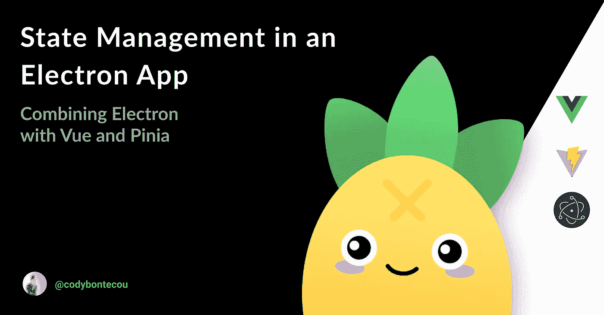

# 使用 Pinia 和 Vue.js 的电子应用中的全局状态管理

> 原文：<https://javascript.plainenglish.io/global-state-management-in-an-electron-application-abdac1a1ce52?source=collection_archive---------20----------------------->



> 将 Vue.js 工具 [Pinia](https://pinia.esm.dev/) 引入我们的电子应用程序来管理其内部状态。这篇文章假设你已经关注了我之前的[文章](https://codybontecou.com/electron-app-with-vuejs-and-vite.html)。

## 什么是商店？

存储是管理应用程序全局状态的实体。无论您在哪个组件中工作，它都允许您读取和写入。

你可能听说过其他帮助管理商店的包，Vuex 是 Vue 的标准，Redux 是 React 的标准。

## 装置

> 这假设您使用的是 Vue 3。
> 如果您使用的是 Vue 2，请参考他们的[文档](https://pinia.esm.dev/getting-started.html#installation)。

因为我们将它连接到一个电子应用程序，这只是一个额外步骤的 JavaScript，我们可以利用我们最喜欢的包管理器如`npm`或`yarn`来安装 Pinia。

```
yarn add pinia
# or with npm
npm install pinia
```

使用`createPinia`功能将其附加到 Vue.js 应用程序:

```
// renderer/main.js

import { createApp } from 'vue'
import App from './App.vue'
import { createPinia } from 'pinia'

createApp(App).use(createPinia()).mount('#app')
```

在 Vue 可用的电子应用中，Pinia 现已可用。

## 创建我们的第一家商店

使用`defineStore()`定义商店，并要求*唯一的*名称。在这种情况下，我使用`main`作为这个商店的惟一 id。

```
// renderer/stores/main.js

import { defineStore } from 'pinia'

// useMainStore could be anything like useUser, useCart
// the first argument is a unique id of the store across your application
export const useMainStore = defineStore('main', {
  state: () => ({
    msg: 'Hello World!',
  }),
  getters: {
    message: state => state.msg,
  },
  actions: {},
})
```

## 在 Vue.js 组件中使用我们的存储

既然我们的商店已经创建好了，我们可以将它导入到单独的组件中，允许我们的组件与商店进行交互。

```
import { useMainStore } from '@/stores/main'
```

在`setup`函数中，我调用我们的存储函数并在一个常量变量中设置值:

```
setup() {
  const main = useMainStore()
}
```

这让我能够与我的商店互动。对于这个简单的例子，我显示了在 [getter](https://pinia.esm.dev/core-concepts/getters.html) 中定义的消息。

```
setup() {
  const main = useMainStore()

  return {
    message: computed(() => main.message),
}
```

整个组件如下所示:

```
// renderer/components/Hello.vue

<template>
  <div id="hello">
    
    <h1>{{ message }}</h1>
  </div>
</template>

<script>
import { computed, defineComponent } from 'vue'
import { useMainStore } from '@/stores/main'

export default defineComponent({
  setup() {
    const main = useMainStore()

    return {
      message: computed(() => main.message),
    }
  },
})
</script>
```

## 让 HMR 工作

> 虽然 HMR 内置于皮尼亚，它不能很好地与电子和需要一点额外的配置。Pinia 在此提供了本主题[的附加文档。](https://pinia.esm.dev/cookbook/hot-module-replacement.html)

HMR(热模块替换)允许您编辑您的商店并查看应用程序中的更改，而无需重新加载页面或重启服务器。

下面是我的`main`商店更新后的样子，考虑到 HMR:

```
import { defineStore, acceptHMRUpdate } from 'pinia'

export const useMainStore = defineStore('main', {
  state: () => ({
    msg: 'Hello World!',
  }),
  getters: {
    message: state => state.msg,
  },
  actions: {},
})

if (import.meta.hot) {
  import.meta.hot.accept(acceptHMRUpdate(useMainStore, import.meta.hot))
}
```

经过`acceptHMRUpdate`你的商店(在我的例子中是`useMainStore`，它给了我们 HMR！

希望你喜欢它！

*更多内容看* [***说白了. io***](http://plainenglish.io/) ***。*** *报名参加我们的* [***免费每周简讯这里***](http://newsletter.plainenglish.io/) ***。***