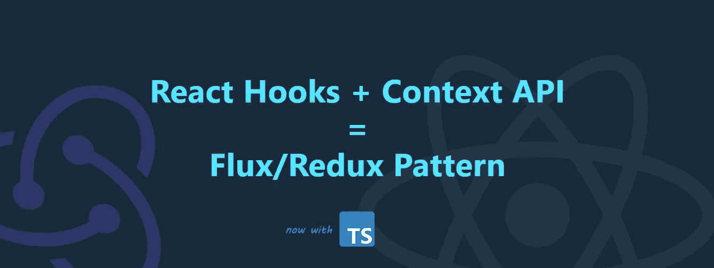

# 仅使用带有上下文 API 的 React 挂钩的全局状态(TypeScript 版)

> 原文：<https://javascript.plainenglish.io/global-state-using-only-react-hooks-with-the-context-api-typescript-edition-ada822fc282c?source=collection_archive---------3----------------------->

> 距离我最近的[全局状态只使用 React 钩子和上下文 API(无 Redux)](https://codeburst.io/global-state-with-react-hooks-and-context-api-87019cc4f2cf) 的故事已经有一段时间了。现在是时候推出 TypeScript 版本，以及持久会话/本地存储机制了。

如果你读过我以前的故事，你应该已经知道，当谈到前端框架和工具时，我更喜欢少即是多的方法。做一件事有很多选择，很多方法，太多了，我们淹没在解决方案和臃肿问题的海洋中已经不是什么秘密了。但是我不会侮辱你最喜欢的 npm 库。我更感兴趣的是谈论你能用它做多少事情。让我们开始吧！

# 1.🟦准备类型

因为我们这次引入了 TypeScript。我们必须为 reducer 函数、状态和上下文提供者声明类型。调度类型定义是从 React 导入的。

# 1.减速器⚛️. ts

我们创建一个 reducer 函数，这个函数与 React 自己的钩子:`useReducer()`协同工作。我们为状态和动作提供类型。

假设我们已经熟悉 Redux，在上面的代码片段中有一个 reducer 函数，它将状态和动作作为参数，用于访问和管理应用程序的全局状态。

# ✨的奖金部分

# 数据持久性

store 模块组件这次有一个机制来将数据持久存储在浏览器的`[window.localStorage](https://developer.mozilla.org/en-US/docs/Web/API/Window/localStorage)`和`[window.sessionStorage](https://developer.mozilla.org/en-US/docs/Web/API/Window/sessionStorage)`对象中。这可以在示例应用程序中得到更好的演示🔗 [*登录*](https://amir0ff.github.io/movie-lab/#/login) 页面。在浏览器中打开开发工具，然后在登录表单下的本地/会话存储选项之间切换。导航到应用程序选项卡，观察状态变化。

# 2.🗄️全球商店

为了创建一个全球性的国家，我们需要一个中央商店。存储是保存上下文(状态)的高阶组件(HOC)。我们提供了上下文的类型，即我们在第一步中创建的状态。此外，GlobalStore 组件及其嵌套的`children`是 React 自己的类型定义中带有`ReactNode`和`ReactElement`的类型。

*   💡在第 10 行，我们提供了一个状态初始化函数和一个 reducer 函数来将 React 的`useReducer()` 作为参数。`globalState`值指向状态对象，`dispatch`方法是 reducer 函数，它通过调度操作管理状态。
*   💡在第 47 行，我们向上下文提供了状态和分派方法。
*   💡在第 50 行，使用 React 的`createContext()`钩子创建上下文。我们提供类型`ContextType`。

# 🔌访问状态

从嵌套在`<GlobalStore>`下的组件访问全局状态和分派方法，我们使用`useContext()`钩子。

例如在我们的**电影**组件中🔗[示例](https://amir0ff.github.io/movie-lab) app:

Code: [https://github.com/amir0ff/movie-lab/tree/main/src/components/Movies/components/Movie](https://github.com/amir0ff/movie-lab/tree/main/src/components/Movies/components/Movie)

*   💡在第 9 行，我们从`store/index.ts`文件导入上下文，并将其作为第 13 行的参数提供给 React 的`useContext(**)**`钩子。这样我们就可以访问组件中的状态对象和分派方法！
*   💡在第 28/35 行，我们分派喜欢/不喜欢某部电影的动作，并相应地更新状态。

# 结论

我们通过使用 React 的内部上下文 API 和钩子特性消除了以下第三方依赖:`[**redux**](https://www.npmjs.com/package/redux)`、`[**react-redux**](https://www.npmjs.com/package/react-redux)`和`[**redux-thunk**](https://www.npmjs.com/package/redux-thunk)`，同时仍然享受 Redux 提供的相同功能。

# 奖金

*   使用的打字稿
*   保存到本地/会话存储的状态持久化机制
*   已部署的[示例应用](https://amir0ff.github.io/movie-lab)

我希望你喜欢阅读，
请[**关注**](https://medium.com/@amir0ff) 和**分享**更多科技内容🤖💖

*更多内容请看*[***plain English . io***](http://plainenglish.io/)