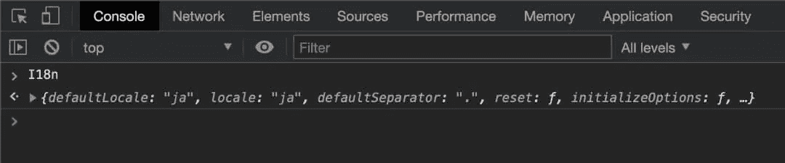

# 在 Node.js 应用程序中全球化变量

> 原文：<https://javascript.plainenglish.io/globalize-variables-in-nodejs-application-f782f52deffe?source=collection_archive---------17----------------------->

## 全球化 js 变量可能不合适，对于常见用例应该最小化。在本文中，我们将展示一些关于全球化变量的问题，另一方面，这种方法的必要性，以及编写全球化函数和它的一些实施的例子。

## 全球化变量一次，初始化后就一直使用


Image Credit: [Fernando @cferdo](https://unsplash.com/@cferdo)

# JavaScript 中全球化变量带来了问题

在我们的应用程序中编写全局变量增加了被第三方脚本或插件覆盖的机会。应用程序可能会出现错误行为，有问题的功能会介入。

因此，在全球化变量时，我们应该尽量避免通用的变量名。避免常见的变量名:

```
result, data, info, gInfo etc.
```

我们应该总是初始化一个局部变量，而不是直接使用它。

> 代替

```
function scoring(point) {
  return existing + point
}
```

> 我们应该这样做

```
**var existing = 0;** function scoring(point) {
  return existing + point
}
```

# 但是，为什么我们有时需要全球化的变量呢？

*   提高效率
*   减少多余的线路
*   用于调试用途

## 提高效率

变量在项目范围内自动可用。函数 **globfunc** 在项目范围内的其他脚本中自动可用。

```
// NodeProject/src/index.js**const globfunc = () => {
  alert("Accessile Globally !!")
}****global.globfunc = globfunc**...
...**// Run the server!**
const start = async () => {
  try {
    app.listen(3000, function() {
      console.log("listening on port 3000!");
    });
  } catch (err) {
    console.log("error");
}};start();
```

## 减少多余的线路

由于上述原因，相同的函数“ **globfunc”不需要 import / require** 行来使其在项目范围内的另一个脚本中可用。

> 另一个场景:

通过从浏览器的控制台部分执行 **I18n** 变量，可以进行快速测试。

```
import I18n from 'I18n-js'**global.I18n = I18n**
```



Self-Shot Console for **I18n**

## 用于调试用途

*   从控制台部分验证数据变得很容易。
*   JavaScript 测试框架 Jest 中的示例用例:

> 抑制控制台警告

```
import * as dFilters from "./test-filters"let **gWarn**describe('test-filters', () => {
  beforeEach(() => {
    **gWarn = global.console.warn
**    global.console.warn = (message) => {
      throw message
    })
  }) afterEach(() => {
 **global.console.warn = gWarn**  }) describe('testFunction1', () => {
    const { testFunction1 } = dFilters
    ...
    ...
  })})
```

# 全球化一个 Js 模块怎么样？

我一直在使用一个简单的助手函数来全球化 JS 模块:

> 示例导出模块:
> NodeApp/src/helper/db _ utils . js

db_utils.js

> NodeApp/src/helper/globalize . js

globalize.js

> 从 NodeApp/src/index.js 实现

```
**global["globalize"] = require("./helper/globalize");
const dbHelper = require("./helper/db_utils");
globalize(dbHelper);**...
...// Run the server!const start = async () => {
  try {
    app.listen(3000, function() {
    console.log("listening on port 3000!");
  });
  } catch (err) {
    console.log("error");
  }
};start();
```

就是这样。有了上面的三行代码，函数 **dbGetAll** 、 **dbGetOne** 、 **dbCreate、**和 **dbUpdate** 现在可以全局访问，并且现在可以在项目范围内的任何地方使用！具体实现请参考文章:**[**你能做些什么来规范 NodeJS**](https://seanpang.medium.com/what-you-can-do-to-standardize-the-crud-calls-to-mongo-in-nodejs-7b4c569488e6) 中对 Mongo 的 CRUD 调用。**

# **结论**

**变量的全球化有利有弊。这些问题在本文中有所解释，你应该对应用程序由于全局变量而导致的漏洞采取额外的预防措施。**

**明智的做法是对关键操作进行进一步的权限检查和访问。**

**感谢您的阅读。我希望您发现这很有用！**