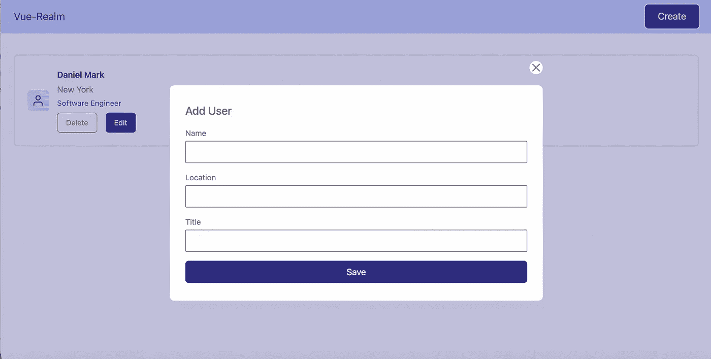

# 使用 MongoDB 领域实现无服务器:Vue.js 版本

> 原文：<https://javascript.plainenglish.io/going-serverless-with-mongodb-realm-vue-js-version-c0f7afae8719?source=collection_archive---------11----------------------->

无服务器架构是一种无需管理基础设施即可运行和构建应用程序和服务的模式。它涉及在服务器上运行的应用程序和服务，但是所有的服务器管理都是由云提供商完成的。

这篇文章将讨论使用 [MongoDB](https://www.mongodb.com/) 、 [MongoDB Realm](https://www.mongodb.com/realm) 和 [Vue.js](https://vuejs.org/) 构建一个全栈用户管理应用程序。在本教程的最后，我们将学习如何在 MongoDB 上创建一个数据库，使用 MongoDB Realm 将无服务器功能作为我们的端点，并在 React.js 应用程序中使用端点。

MongoDB Realm 是一个开发平台，旨在构建移动、web、桌面和物联网应用程序。它提供数据同步、无服务器功能、触发器、用户认证等服务。我们可以使用以下任何一种方法在 MongoDB 领域上构建和维护应用程序:

*   [Realm UI](https://docs.mongodb.com/realm/manage-apps/deploy/manual/deploy-ui/#std-label-deploy-ui) :创建和维护应用程序的基于浏览器的选项
*   [Realm CLI](https://docs.mongodb.com/realm/manage-apps/deploy/manual/deploy-cli/#std-label-deploy-cli) :基于 CLI 的选项，用于定义和部署应用程序
*   [Github 部署](https://docs.mongodb.com/realm/manage-apps/deploy/automated/deploy-automatically-with-github/#std-label-deploy-github):使用 GitHub 上的配置文件从 GitHub 仓库部署应用程序
*   [Admin API](https://docs.mongodb.com/realm/admin/api/v3/#std-label-admin-api) :管理应用程序的基于 HTTP 的请求。

在这篇文章中，我们将使用 [Realm UI](https://docs.mongodb.com/realm/manage-apps/deploy/manual/deploy-ui/#std-label-deploy-ui) 来构建我们的应用程序。

您可以通过克隆这个存储库(**主分支** ) [这里](https://github.com/Mr-Malomz/vue-realm)来进行编码。如果您喜欢查看完整的代码，请查看同一个存储库的 **dev** 分支。

在本教程中，我们将只关注实现。已经用 [TailwindCSS](https://tailwindcss.com/) 设置了项目 UI。

你可以点击查看 React.js 版本[。](https://medium.com/javascript-in-plain-english/going-serverless-with-mongodb-realm-react-js-version-44b095832d59)

# 先决条件

本帖以下步骤需要 JavaScript 和 Vue.js 经验。不要求有使用 TypeScript 的经验，但是有这样的经验是很好的。

我们还需要一个 [MongoDB 帐户](https://www.mongodb.com/)来托管数据库并创建无服务器功能。 [**报名**](https://www.mongodb.com/cloud/atlas/register) **完全免费**。

# 让我们编码

## 运行项目

要开始，我们需要导航到项目位置，打开我们的终端并安装项目依赖项，如下所示:

`npm install`

完成后，我们可以使用下面的命令启动开发服务器:

`npm run serve`

# 设置 MongoDB

首先，我们需要登录或注册我们的 [MongoDB](http://) 账户，并遵循适用于我们的选项:

**对于新账户(注册)** 首先，我们需要回答几个问题来帮助 MongoDB 帮助设置我们的账户。然后点击**完成。**

选择**共享**作为数据库类型。

点击**创建**来设置集群。这可能需要一些时间来设置。

接下来，我们需要通过输入**用户名**、**密码**来创建一个从外部访问数据库的用户，然后点击**创建用户**。我们还需要添加我们的 IP 地址，以便通过点击**添加我当前的 IP 地址**按钮安全地连接到数据库。然后点击**完成并关闭**保存更改。

保存更改后，我们应该会看到一个数据库部署屏幕，如下所示:

**对于现有账户(登录)** 点击项目下拉菜单，点击**新建项目**按钮。

输入`realmVue`作为项目名称，点击**下一个**然后点击**创建项目**

点击**建立数据库**

选择**共享**作为数据库类型。

点击**创建**来设置集群。这可能需要一些时间来设置。

接下来，我们需要通过输入**用户名**、**密码**，然后点击**创建用户**，来创建一个从外部访问数据库的用户。我们还需要添加我们的 IP 地址，以便通过点击**添加我当前的 IP 地址**按钮安全地连接到数据库。然后点击**完成并关闭**保存更改。

保存更改后，我们应该会看到一个数据库部署屏幕，如下所示:

# 加载样本数据

接下来，我们需要用用户的样本数据填充数据库。为此，点击**浏览收藏**按钮

点击**添加我自己的数据**，输入`vueRealmDB`和`vueRealmCol`作为数据库和集合名称，点击**创建**。

接下来，我们需要插入这些样本数据:

sample data

为此，点击**插入文件**按钮，填写上面的详细信息并点击**插入**进行保存。

# 创建和配置 MongoDB 领域应用程序

填充数据库后，我们需要创建无服务器函数来对数据库执行创建、读取、更新和删除(CRUD)。为此，选择**领域**标签，点击**构建你自己的应用**。然后点击**创建领域应用**来设置我们的应用。

MongoDB Realm 还附带了模板，我们可以使用这些模板快速构建我们的应用程序。对于本教程，我们将从头开始构建。

接下来，我们需要为我们的函数设置权限和规则。为此，关闭弹出向导，点击**规则**，选择 **vueRealmCol** 并点击**配置集合**。

**MongoDB 领域的保存和部署**

完成后，MongoDB Realm 将向我们展示一个小部件，展示保存和部署的概念。

当编写一个无服务器功能时，点击**保存**创建一个开发草案，我们可以测试和试验。同时， **Deploy** 将我们的更改公开，供另一个应用程序使用(在我们的例子中是 Vue.js)。

点击**下一步**，然后**拿到**继续。

接下来，我们需要允许**读取**和**写入**权限，然后**保存。**

接下来，导航到**认证**标签，点击**允许用户匿名登录**，打开**保存草稿**。

MongoDB Realm 还附带了几个身份验证选项，我们可以研究一下。对于本教程，我们将使用匿名选项。

# 在 MongoDB 领域上创建无服务器功能

**获取所有用户无服务器函数** 配置完成后，我们现在可以创建一个返回用户列表的无服务器函数。为此，导航至**功能**选项卡，点击**创建新功能**，并输入`getAllUsers`作为功能名称

接下来，选择**功能编辑器**选项卡，将功能修改如下:

上面的代码片段执行了以下操作:

*   创建一个集合变量来访问`vueRealmDB`数据库和`vueRealmCol`集合
*   返回集合中的文档列表。

接下来，我们可以通过点击 **Run** 按钮查看用户列表来测试我们的功能。

最后，我们需要复制任何返回的用户的`_id`并保存在某个地方；我们下一个活动需要它。然后点击**保存草稿**为我们的功能创建一个部署草稿。

**获取用户无服务器功能** 为此，点击**功能**选项卡，点击**创建新功能**，输入`getSingleUser`作为功能名称

接下来，选择**功能编辑器**选项卡，将功能修改如下:

上面的代码片段执行了以下操作:

*   创建一个集合变量来访问`vueRealmDB`数据库和`vueRealmCol`集合
*   通过按 _id 查找返回单个用户。因为 MongoDB 将文档保存在 [BSON](https://en.wikipedia.org/wiki/BSON#:~:text=BSON%20(%2F%CB%88bi%CB%90s,a%20computer%20data%20interchange%20format.&text=It%20is%20a%20binary%20form,originated%20in%202009%20at%20MongoDB.) 中，所以我们需要使用`BSON.ObjectId`将 arg 解析为 BSON。

为了测试我们的功能，导航到**控制台**选项卡，用我们之前复制的用户`_id`替换**导出**功能中的`Hello world!`，然后点击**运行。**

最后，我们需要点击**保存草稿**按钮来保存我们的功能。

**编辑用户无服务器功能** 要做到这一点，我们需要遵循与上面相同的步骤。

首先，点击**功能**选项卡，点击**创建新功能，**并输入`editUser`作为功能名称。

接下来，选择**功能编辑器**选项卡，将功能修改如下:

上面的代码片段执行了以下操作:

*   修改函数以接受`id`、`name`、`location`和`title`参数
*   创建一个集合变量来访问`vueRealmDB`数据库和`vueRealmCol`集合
*   创建一个通过`_id`找到文档的更新变量，更新集合字段并设置一个`returnNewDocument`标志来返回更新后的文档。

接下来，我们可以通过导航到 Console 选项卡来测试我们的功能，替换 Hello world！在**导出**函数中输入所需参数( **_id、名称、位置和标题**)，点击**运行**，然后**保存草稿**。

**创建一个用户无服务器功能** 要做到这一点，我们需要遵循与前面相同的步骤。

首先，点击**功能**标签，点击**创建新功能，**并输入`createUser`作为功能名称。

接下来，选择**功能编辑器**选项卡，将功能修改如下:

上面的代码片段执行了以下操作:

*   修改函数以接受`name`、`location`和`title`参数。
*   创建一个集合变量来访问`vueRealmDB`数据库和`vueRealmCol`集合。
*   通过插入参数并返回用户来创建新用户。

接下来，我们可以通过导航到 Console 选项卡来测试我们的功能，替换 Hello world！在**导出**函数中加入所需参数(**名称、位置和标题**，点击**运行**，然后**保存草稿**。

**删除一个用户
无服务器功能**要做到这一点，我们需要遵循和以前一样的步骤。

首先，点击**功能**选项卡，点击**创建新功能，**并输入`deleteUser`作为功能名称。

接下来，选择**功能编辑器**选项卡，将功能修改如下:

上面的代码片段执行了以下操作:

*   修改函数以接受参数。
*   创建一个集合变量来访问`vueRealmDB`数据库和`vueRealmCol`集合。
*   为删除 by _id 创建一个`deleteUser`变量。

接下来，我们可以通过导航到控制台选项卡来测试我们的函数，用所需的参数替换**导出**函数中的`Hello world!`，单击**运行**，然后**保存草稿**。

# 部署无服务器功能

要开始在我们的应用程序中使用无服务器功能，我们需要部署它们。为此，点击**审阅草稿&部署**按钮，向下滚动，然后点击**部署**。

我们应该得到一个提示，显示我们的部署状态。

# 终于！与 Vue.js 集成

要将 MongoDB 领域集成到我们的应用程序中，我们需要安装以下依赖项:

`npm i realm-web`

`realm-web`是一个[库](https://github.com/realm/realm-js/tree/master/packages/realm-web#readme)，用于从 web 浏览器访问 MongoDB 领域。

**设置一个环境变量** 首先，我们需要在项目根目录下创建一个`.env`文件，在这个文件中，添加下面的代码片段:

`VUE_APP_REALM_APP_ID=<your-realm-app-id>`

要获取我们的**领域应用 ID** ，我们需要点击复制图标，如下所示:

**设置 MongoDB 领域** 接下来，我们需要在`src`文件夹中创建一个`utils`文件夹，在这个文件夹中，创建一个`mongo.client.ts`文件，并添加下面的代码片段:

上面的代码片段执行了以下操作:

*   导入所需的依赖项。
*   创建一个变量来存储**领域应用 ID** 。
*   创建并导出 MongoDB 领域的实例，并传递应用程序 ID。REALM_APP_ID 前面的 bang `!`告诉编译器放松非空约束错误(意味着参数不能为空或未定义)
*   创建并导出我们将用于此应用的凭据类型。我们在前面配置了这个身份验证选项。

**获取所有用户** 要获取所有用户，我们需要创建一个接口来描述响应属性。为此，我们需要在`src`文件夹中创建一个`models`文件夹，在这个文件夹中，创建一个`user.interface.ts`文件并添加下面的代码片段:

**PS**:****_ id****前面的问号告诉 TypeScript 这个属性是可选的，因为是 MongoDB 自动生成的。**

*接下来，我们需要修改`App.vue`，用下面的代码片段更新它:*

*上面的代码片段执行了以下操作:*

*   *导入`IUser`接口、`app`和`credentials`。*
*   *创建`users`属性来管理用户列表。*
*   *创建一个`getListOfUsers`函数，使用导入的凭证来验证我们的应用程序，并通过访问我们之前创建的`getAllUsers`无服务器函数来获取用户列表。然后更新`users`属性，使用`mounted`钩子调用函数。*

> *被调用的无服务器函数(在我们的例子中是 **getAllUsers** )必须与 MongoDB 领域中定义的相同。*

*   *更新标记以显示用户列表。*

***完成 App.vue***

***创建用户*** 

*上面的代码片段执行了以下操作:*

*   *向数据属性添加一个`userValue`属性。*
*   *创建一个`updateUserValue`函数来更新`userValue`属性*
*   *包含`watch`组件属性以监视`userValue`属性，并在对其进行更改时获取更新的用户列表。*
*   *更新模式组件以接受 updateUserValue 作为属性。*

*接下来，导航到 components 文件夹中的`Modal.vue`文件，更新`props`，并创建一个用户。*

*[https://gist . github . com/Mr-malo mz/e2cc 555 fc 72820999 f 3642 a 0205 b 4306](https://gist.github.com/Mr-Malomz/e2cc555fc72820999f3642a0205b4306)*

*上面的代码片段执行了以下操作:*

*   *导入所需的依赖项。*
*   *将`updateUserValue`添加到道具属性*
*   *修改`onSubmitForm`函数，使用导入的凭证验证我们的应用程序。通过访问我们之前创建的 createUser 无服务器函数来创建一个用户，传递所需的参数(**名称**、**位置、**和**标题**，然后更新`userValue`和表单状态。*

***编辑一个用户** 要编辑一个用户，我们首先要通过创建一个属性来管理我们想要编辑的用户的`_id`和更新它的函数来修改`App.vue`。我们还更新了 handleEditClick 函数来更新属性，并将其作为道具传递给模态组件。*

*接下来，我们需要在点击**编辑**按钮时填充表单。要做到这一点，打开`Modal.vue`，更新如下所示:*

*上面的代码片段执行了以下操作:*

*   *导入所需的依赖项。*
*   *给道具属性添加`editingId`*
*   *使用导入的`credentials`创建一个`getAUser`函数来验证我们的应用程序。使用`getSingleUser`无服务器功能获取所选用户的详细信息，然后更新表单值。`getSingleUser`函数还要求我们使用 BSON 将`editingId`转换成字符串。ObjectID 函数。*
*   *包含监视组件属性以监视`isEdit`状态，有条件地调用 getAUser 函数，并更新表单状态。*

*接下来，我们需要更新`onSubmitForm`函数，通过有条件地检查它是否是更新操作来更新用户的详细信息。接下来，我们需要调用`editUser`无服务器函数并传入所需的参数。最后，更新`updateUserValue`，将表单恢复为默认，并关闭模态组件。*

***完成情态。Vue***

*[https://gist . github . com/Mr-malo mz/a 52 EB 3 b 13 bb 44 a 19 EB 3 f 37 e 132 c 2228d](https://gist.github.com/Mr-Malomz/a52eb3b13bb44a19eb3f37e132c2228d)*

*[https://gist . github . com/Mr-malo mz/a 52 EB 3 b 13 bb 44 a 19 EB 3 f 37 e 132 c 2228d](https://gist.github.com/Mr-Malomz/a52eb3b13bb44a19eb3f37e132c2228d)*

***删除用户***

*要删除用户，我们需要通过创建如下所示的 handleDelete 函数来修改 App.vue:*

*[https://gist . github . com/Mr-malo mz/b 744260 e 88 ea 2 de 9958 FCC 68 a2 d 38385](https://gist.github.com/Mr-Malomz/b744260e88ea2de9958fcc68a2d38385)*

*[https://gist . github . com/Mr-malo mz/b 744260 e 88 ea 2 de 9958 FCC 68 a2 d 38385](https://gist.github.com/Mr-Malomz/b744260e88ea2de9958fcc68a2d38385)*

*上面的代码片段执行了以下操作:*

*   *导入所需的依赖项。*
*   *创建一个以 id 为参数的 deleteAUser 函数，使用凭证验证我们的应用程序。使用 deleteUser 无服务器函数删除选定的用户，并更新用户值状态。*

***完成 App.vue***

*最后，我们可以通过启动开发服务器并执行 CRUD 操作来测试应用程序。*

**

# *结论*

*本文讨论了如何在 MongoDB 上创建数据库，使用 MongoDB 领域创建和部署无服务器功能，以及在 Vue.js 应用程序中使用端点。*

*您可能会发现这些资源很有帮助:*

*   *[MongoDB 领域](https://docs.mongodb.com/realm/)。*
*   *[尾翼](https://tailwindcss.com/)。*
*   *[Realm-Web SDK](https://github.com/realm/realm-js) 。*
*   *[无服务器计算](https://en.wikipedia.org/wiki/Serverless_computing)。*
*   *[BSON](https://www.mongodb.com/json-and-bson)*

**更多内容看* [*说白了. io*](http://plainenglish.io/) *。报名参加我们的* [*免费周报在这里*](http://newsletter.plainenglish.io/) *。**