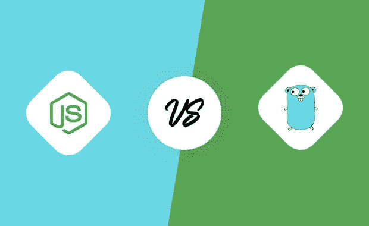
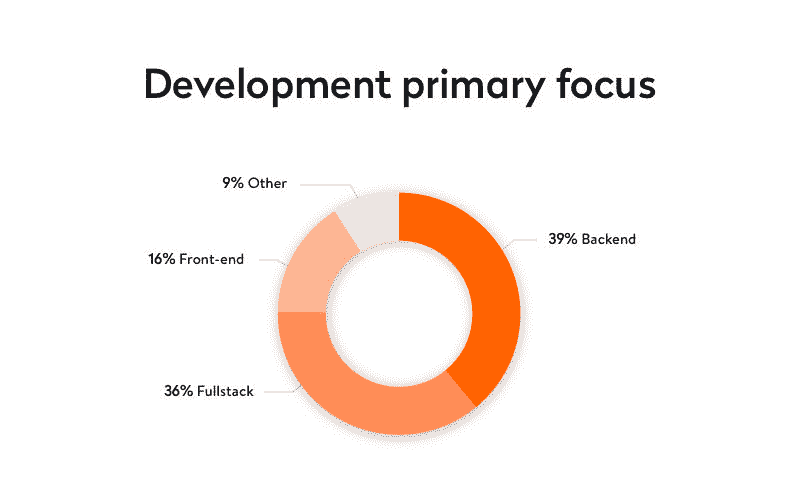
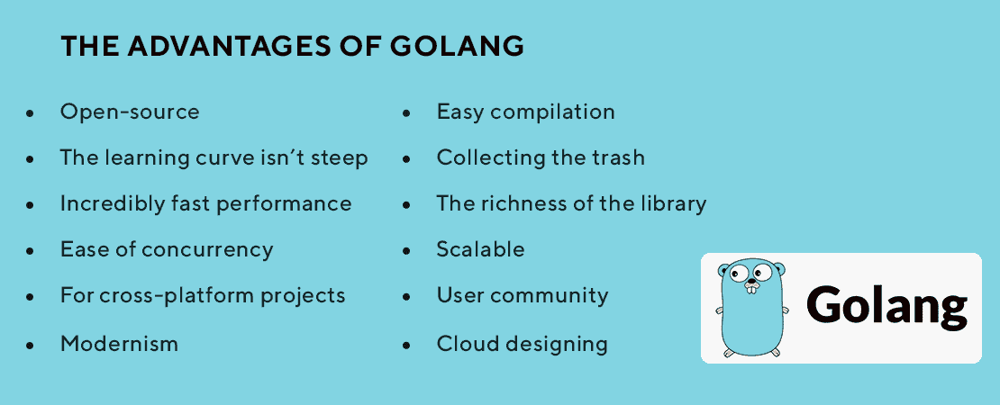
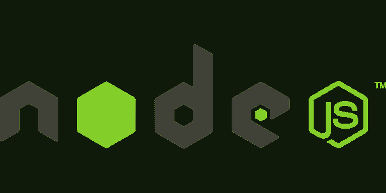
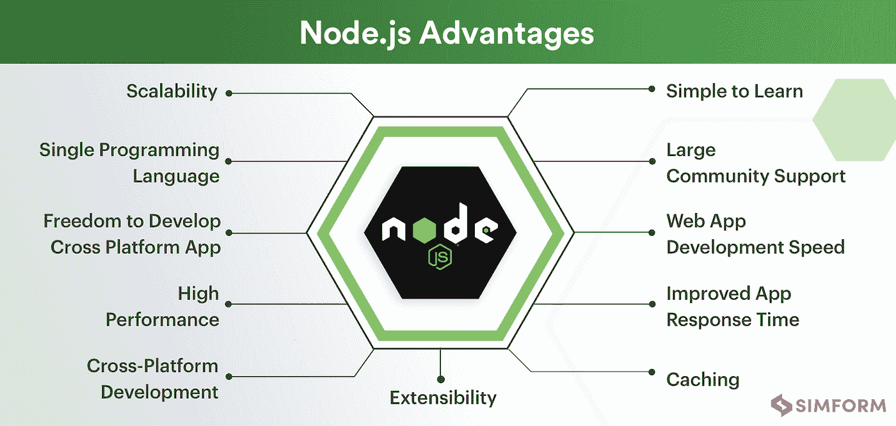
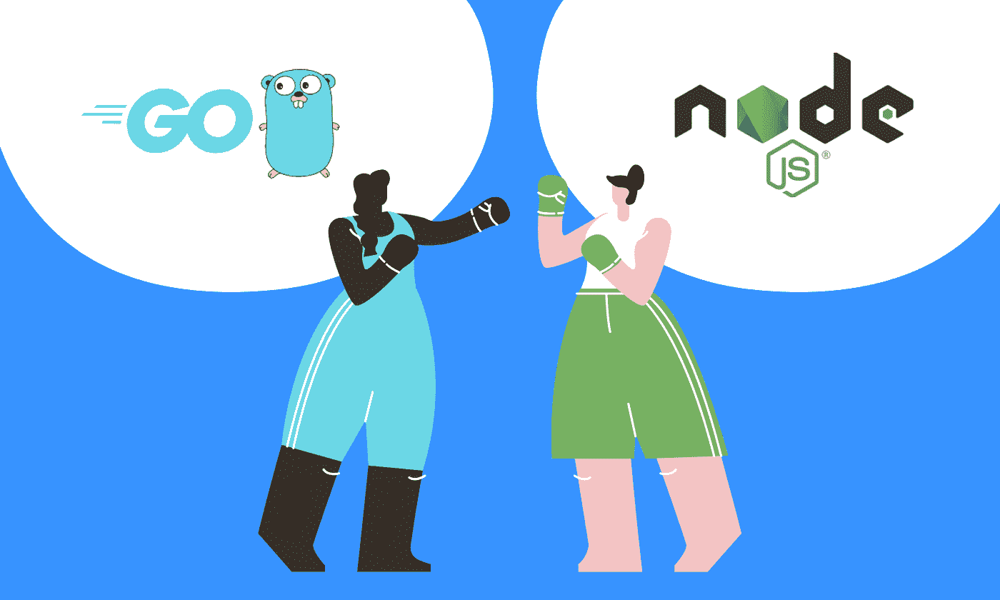
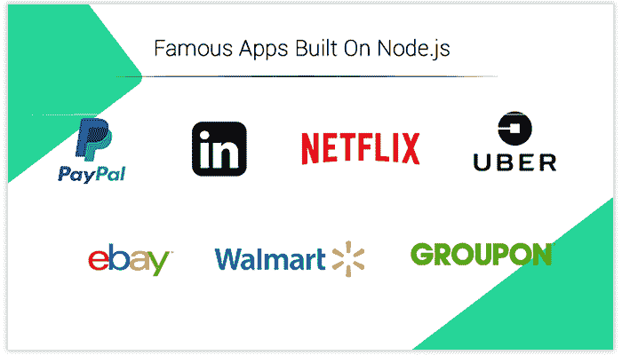

# Go vs. Node.js:谁战胜了后端框架之战？

> 原文：<https://javascript.plainenglish.io/golang-vs-node-js-who-trumps-the-battle-of-backend-frameworks-e5fc31faa3b5?source=collection_archive---------0----------------------->

[Source](https://www.esparkinfo.com/node-js-vs-golang.html)

应用程序的后端确实是产品的重要部分。无论你多么欣赏这个设计，应用程序的成功在于它的后端。有效实现所需业务逻辑的可伸缩后端是程序员的主要目标。

[Source](https://yalantis.com/blog/golang-vs-nodejs-comparison/)

因此，选择最强大和可扩展的技术至关重要。市场上有很多语言可以构成任何应用程序的后端，Node.js 和 Golang 是其中最受欢迎的两种技术。

它们是真实的、发达的语言，最近被用于各种杰出的项目中。Golang 是一种开源编程语言，而 Node.js 是一种开源服务器框架。由于各种原因，他们都越来越受欢迎。

根据一项应用开发统计，在 58，543 名受访者中，有近 50%的人将 Node.js 作为他们首选的应用开发工具。

另一方面，Golang 在应用程序开发市场上已经超越了其他编程语言，并在过去几年中获得了巨大的认可。

但是，哪个后端框架最适合您呢？在本文中，我将基于几个基本特性和各种其他因素，对 Google 最流行的两个后端开发工具进行健康的比较。

开始了…

# **戈朗——简介**

Golang，也被称为 Go，是谷歌在 2009 年推出的一种**开源、跨平台、编译多线程编程语言**。

它结合了其他编程语言的最佳特性。比如在性能和安全性上和 C、C++差不多，又结合了 Python 的速度。因此，Golang 可用于并发编程，提供动态接口和内存安全。

此外，Golang 可以与最流行的操作系统兼容，如**微软、Linux、macOS** 等。此外，它还是云接口、网络应用和微服务的最佳技术。

**Golang 的主要特性:**

*   **标准库:**Golang 的性能可以通过声音库和原语类型的内置函数来证明。
*   **速度:** Golang 因为编译的机器码快。
*   **垃圾收集:**Go 中的内存管理看起来很简单。使用算术指针时，垃圾回收对象是动态分配的。
*   **分析工具**

Source: [**Coders Daddy**](https://www.codersdaddy.com/)

# **Golang 的主要使用案例:**

Golang 是开发以下应用类型的最佳选择:

*   云原生应用
*   可伸缩的数据库实现
*   Web 开发
*   实用程序和独立工具
*   快速优雅的 CLIs
*   支持德沃普斯和 SRE
*   分布式网络服务

# **node . js 是什么？**

Node.js 是一个基于 Google Chrome 的 V8 JavaScript 引擎的开源运行时环境。它已经成为构建跨平台应用程序最流行的环境。此外，它在单线程的基于事件的循环上运行，以使所有执行都是非阻塞的。

由于 Node.js 是用 JavaScript 编写的，程序员可以更容易地使用同一种语言编写客户端和服务器端的脚本。Node.js 受到 Windows、Mac、Linux 和 Unix 的支持，并且有许多简化 web 应用程序开发过程的开源 JavaScript 库。

[Source](https://www.simform.com/nodejs-advantages-disadvantages/)

# **node . js 常用在哪里？**

Node.js 广泛用于在项目前端和后端积极使用 JavaScript 的项目。以下是 Node.js 的一些应用领域:

*   微服务
*   静态文件服务器
*   复杂的 SPA(单页应用程序)
*   脚本和自动化
*   Web 应用程序框架
*   命令行应用程序
*   实时聊天应用
*   嵌入式系统
*   浏览器游戏硬件编程
*   数据流应用

你也可以**雇佣 Node.js 开发者**以合理的价格开发所有这类应用。

# **围棋大战 Node.js:精英之战开始**

[Source](https://hygger.io/blog/golang-vs-node-quick-comparison/)

现在，您已经了解了 Golang 和 Node.js 的基本知识，让我们从性能、可伸缩性、错误处理和其他标准等方面对它们进行比较。

> **#1 性能因素**

性能会显著影响应用程序的加载和响应时间。因此，它直接影响客户对您的应用程序的满意度。

发布 Golang 的核心目标是实现更好的性能。与 Node.js 相比， **Golang 在原始性能和计算方面是更好的选择**。总的来说，Go 是一个快速、轻量级的平台，因为它基于 C 和 C++的特性。

尽管功能强大的 Node.js 是 JavaScript 的衍生物，但它通常比其他编程语言慢。与 Golang 不同， **Node.js 不能提供 CPU 或内存受限任务的原始性能**。

简而言之，Node.js 的表现同样出色或糟糕，这取决于你的应用程序的性质。在这个比较中，Golang 超越了 Node.js，帮助程序员实现了最佳性能。

**节点 vs Golang 胜者:*Golang***

> **#2 可扩展性和并发性**

Node.js 使用单线程机制，指令以特定的顺序执行。而这正是 Node.js 在 Go 语言背后所欠缺的。

虽然这听起来是一个好的实践，但当考虑到大型应用程序并需要并行执行不同的进程时，这给开发人员带来了更多的挑战。

相比之下，Golang 使用由 Go 运行时管理的轻量级线程。此外， **Golang 使用 go-routines** ，可以一次运行多个程序。此外，渠道还负责围棋套路之间流畅轻松的互动。

该语言提供了比 JavaScript 更好的并发选项，使开发人员能够同时处理多个线程，而无需使用太多 RAM。这意味着 **Golang 在比较 Nodejs** 中的并发性时提供了更好的结果。

像并发一样，Golang **也在可伸缩性上胜过 node . js**。因此，由于并行化过程效率低下，Node.js 不适合大型项目。

然而，goroutines 被证明是 Golang 的重要资产，因为它提供了多个线程来同时执行并行任务。

**Goland vs Nodejs 胜者:*Golang***

> **#3 工具的可用性**

现成的解决方案促进了开发，并消除了应用程序开发的成本。不幸的是，Golang 相对来说是一种新语言，还没有变得很受欢迎。

它有不错的库和包，但是可用的工具比 Node.js 少。此外，Golang 缺乏前端支持，而 Node.js 可以帮助您构建一个有吸引力的前端。

而 Node.js 拥有广泛的工具、框架和库，可供程序员开发所有类型的应用程序。

选择 Node.js 的另一个原因是各种各样的开发工具和框架。此外，它是一个基于事件的框架，采用微服务架构。

微服务架构意味着一个应用程序被划分成更小的模块，这些模块具有定义良好的操作接口，因此您可以轻松地向应用程序添加新的组件。

Node.js 由**大约 800，000 个现成的构建模块**组成，可以轻松安装和操作。尽管 Node.js 工具远远超过了 Golang 工具，但 Golang 拥有强大的工具，如 Gofmit、Godoc、GoMetaLiner 和 Go Run。

**围棋 vs 节点胜者:*Node . js***

> **#4 错误处理**

Golang 中的错误处理要求您实现**显式错误检查**。它以不同的方式处理编译时和运行时错误，这给程序员带来了问题。

然而，Golang 的开发者已经开始研究其他的错误处理功能，这些功能可以帮助减少开发时间。

然而， **Node.js 实现了传统的抛出-捕捉错误处理机制，**在开发人员中非常流行。使用这种传统的方法，在执行任何进一步的操作之前，显示并纠正错误。

当比较错误处理机制时，许多开发人员发现 Node.js 更好，因为他们非常熟悉 throw-catch 方法。

**节点 Vs 围棋胜者:*平手***

> **#5 社区支持**

JavaScript 是一种开源编程语言，在世界各地有着庞大的社区。由于是开源的，一大群开发者集思广益，为全球出现的问题开发实用的解决方案。

Node.js 拥有大型组织作为活跃成员，包括 Joyent、微软、Paypal、Groupon、npm、SAP 等等。

根据最近的一项研究，**大约 67.8%的开发者社区更喜欢 Node.js 而不是 Golang** 。另外，如果你看看 Golang 社区，那里挤满了爱好者和专家。它有一个光明的未来，这是不断增长和不断发展。

**Node js vs Golang 胜者:*Node . js***

# **各大科技巨头对 Golang 和 Node.js 怎么看？**

现在，我们来看看热门公司对使用 Golang 和 Node.js 的看法。

> **戈朗**

2016 年，优步从 [Node.js 迁移到 Go](https://eng.uber.com/go-geofence-highest-query-per-second-service/) ，以提高他们的 geofence lookup 微服务的性能。优步决定移居国外有许多原因。

一个主要原因是 Node.js 的动态类型和解释特性妨碍了它高效处理 CPU 密集型多边形内点算法的能力。你也可以 [**雇佣 Golang 开发者**](https://www.pixelcrayons.com/hire-golang-developers) 来达到最佳性能。

[Source](https://www.agiratech.com/golang-use-cases)

> **Node.js**

网飞应用的整个用户界面是用 Node.js 构建的。网飞开发团队选择 Node.js 是因为他们想要一个快速轻量级的应用程序。通过迁移到 Node.js，他们实现了应用启动时间减少 70%的目标。

[Source](https://www.mobileappdaily.com/companies-using-nodejs-applications)

# **Golang vs Node:此战谁胜？**

Golang 和 Node.js 都不是完全完美的，都有优缺点。这就是为什么它们被用于各种各样的项目。然而，Node.js 与其他后端技术不同，它提供了一个开源环境，为成功开发提供了强大的工具。

相比之下，Golang 越来越受欢迎，它提供了很高的实际性能，并允许构建有意义的项目。虽然这两种解决方案有不同的特点，但在某些方面是相似的。

因此，要深入分析它们，并根据项目的目标决定使用哪种语言。

如果你想了解更多关于后台框架的细节，可以联系印度顶级的网站开发公司，获取最相关的信息。它们肯定会帮助您的企业从这些技术中获益。

*更多内容尽在*[***plain English . io***](http://plainenglish.io/)

**结帐我们的服务:**

## [Web 应用程序开发服务](https://www.codersdaddy.com/website-app-development-company-agency)、[移动应用程序开发服务](https://www.codersdaddy.com/mobile-app-development)、[印度 UI UX 设计服务](https://www.codersdaddy.com/ui-ux-design-service-company)、[印度 IT 员工扩充服务](https://www.codersdaddy.com/it-staff-resource-augmentation)、[网站维护&支持服务](https://www.codersdaddy.com/website-app-maintenance-support)、[雇佣专门的软件程序员](https://www.codersdaddy.com/hire-developer-engineer-programmer/)、[雇佣印度 Android 应用程序开发人员](https://www.codersdaddy.com/hire-developer-engineer-programmer/android-app)、[雇佣印度 iPhone 应用程序开发人员](https://www.codersdaddy.com/hire-developer-engineer-programmer/ios-iphone-app)、[雇佣印度 PHP 开发人员](https://www.codersdaddy.com/hire-developer-engineer-programmer/php-web)、  [雇佣印度. Net 开发者](https://www.codersdaddy.com/hire-developer-engineer-programmer/dot-net)，[雇佣印度 Laravel 开发者](https://www.codersdaddy.com/hire-developer-engineer-programmer/laravel)，[数字营销服务](https://www.codersdaddy.com/digital-marketing-agency-company-firm)，[印度 SEO 服务](https://www.codersdaddy.com/seo-service-company-agency-firm)，[印度 ORM 服务](https://www.codersdaddy.com/online-reputation-management-service-company)，[印度 SEO 内容写作服务](https://www.codersdaddy.com/content-writing)，[雇佣印度 WordPress 开发者](https://www.codersdaddy.com/hire-developer-engineer-programmer/wordpress-web)，[雇佣印度 Drupal 开发者](https://www.codersdaddy.com/hire-developer-engineer-programmer/drupal)，[雇佣印度 Angular 开发者](https://www.codersdaddy.com/hire-developer-engineer-programmer/angular-js)，