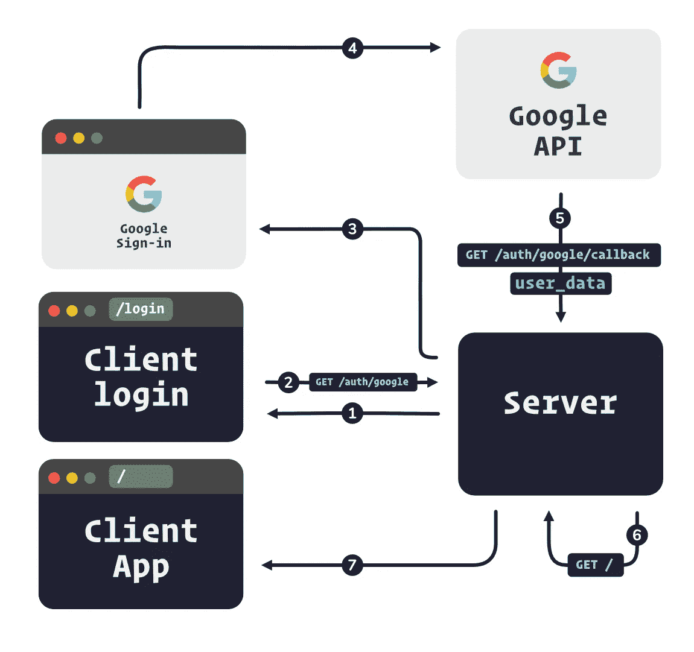

# 使用 Express 和 PassportJS 的 Google 身份验证

> 原文：<https://javascript.plainenglish.io/google-authentication-with-express-and-passportjs-a09a51373580?source=collection_archive---------9----------------------->

## 建立一个登录页面，并使用 Express 和 Passport 通过谷歌认证用户。


创建一个账户(或者登录)从来都不是用户*想要*花时间去做的事情，他们只是想开始点击你的新的酷炫应用。抛开对谷歌的任何个人感受，拥有一个“登录谷歌”或“注册谷歌”确实可以消除认证过程中的一些摩擦。

当我们使用 Google APIs 让用户登录时，流程如下所示:



1.  服务器发送`/login`页面
2.  用户点击“使用谷歌登录”
3.  服务器发送谷歌登录页面
4.  用户使用 Google 登录
5.  Google API 将用户的详细信息发送给服务器
6.  服务器让用户登录并重定向到应用程序路径(或将他们发送回登录页面)
7.  服务器向用户发送应用页面

为了完成这个 IRL，我们将使用 **Express** 来设置我们的服务器和非常basic(比如，*非常* basic)客户端，以及用于服务器认证的 **PassportJS** 。我们的“客户”将由两个简单得荒谬的页面来表示，我们稍后会看到:`/`和`/login`。为了简洁起见，我们也将对数据库进行硬编码。

# Google API 设置

首先，我们必须在谷歌上设置我们的应用程序。前往您的 [Google 开发者控制台](https://console.developers.google.com)，然后通过左上角的下拉菜单创建一个新的**项目**:


Select dropdown to change or create a new project.


Select “New Project”

一旦您创建了新项目(或者选择了一个现有项目)，您就可以通过单击 **Credentials** 来生成您的凭证。


心理！在你继续下一步之前，谷歌希望你配置你的“同意屏幕”。同意屏幕是用户点击你的“用谷歌登录”按钮后看到的。这里有一个在 Dropbox.com[点击“注册谷歌”后显示的同意屏幕的例子:](https://www.dropbox.com/)


实际上，在配置您的同意屏幕时，有数量惊人的障碍需要跳过。你必须提供像申请主页，隐私政策页，条款和条件页等东西。你现在可以捏造这些，但是当实际配置你的应用程序时，你会想要/需要把它们指向真正的页面。

对于“范围”，确保检查`…/auth/userinfo.email`的非敏感范围，因为我们至少需要它。如果你需要像名和姓这样的信息，你也可以查一下`…/auth/userinfo.profile`。

配置好同意屏幕后，*现在*您应该可以转到“**凭据”、“T25”，然后是“创建凭据”，然后是“OAuth 客户端 ID”**


选择“Web 应用程序”并为您的应用程序命名。最后，让我们添加“授权的 JavaScript 源”和“授权的重定向 URIs”前者是授权的*客户端*起源，这告诉 Google 预期登录请求来自哪里，后者告诉 Google 成功登录后将用户信息发送到哪里。

**授权的 JavaScript 起源**

*   这是谷歌可以预期的请求来源。

**授权重定向 URIs**

*   `http://localhost:8080/auth/google/callback` —这是 Google 在成功登录后发送给用户信息的 URI。

> 将`localhost`添加到您授权的 JavaScript 源或重定向中并不理想，所以您需要确保在投入生产时移除它们或者用真实的东西替换它们，例如`https://mycoolapp.io`和`https://mycoolapp.io/auth/google/callback`。

# 计算机网络服务器

我们将使用`express`作为我们的服务器，所以让我们把它和其他一些好东西一起安装:

```
yarn add express express-session dotenv morgan passport passport-google-oauth20
```

安装完成后，使用以下信息在我们的应用程序根目录下创建一个`.env`文件:

```
PORT=8080GOOGLE_CLIENT_ID=YOUR_CLIENT_IDGOOGLE_CLIENT_SECRET=YOUR_CLIENT_SECRETSESSION_SECRET=SOME_STRING_THATS_IDEALLY_NOT_EASY_TO_GUESS
```

文件是我们放置环境变量和敏感令牌和/或秘密的地方。话虽如此，也要确保将其添加到您的`.gitignore`文件中——我们肯定*不想*提交`.env`文件！然后从 Google 开发者控制台用您各自的客户端`id`和`secret`填充它。此外，继续为您的会话秘密添加一个随机散列。

酷酷酷。接下来，我们将创建设置服务器和处理请求的`server.js`文件。

对于我们的`server.js`文件，首先我们需要带有便利的`dotenv`包的`.env`文件，这使得`.env`中的环境变量可以通过`process.env`访问，例如`process.env.PORT`。接下来我们`require`所有的 express server essentials，以及来自 PassportJS 的`passport`。

至于实际的螺母和螺栓，我们使用`express`来创建我们的应用程序:

```
const app = express();
```

在初始化我们的`app`之后，我们为`passport`运行一些基本的设置，我把它移到了它自己的独立模块`./passport/setup.js`中。这一点会更有意义，所以我们现在跳过解释。

然后我们设置我们的`bodyParser`和`logger`，这两个都是一个 express 应用程序所必需的。

接下来，我们为我们的应用程序设置基本会话，在成功登录后，允许用户在对服务器的后续请求中保持登录。

之后，我们在`passport.initialize`上调用`app.use`以及`passport.session`。前者初始化`passport`，后者是使用我们之前在`passport/setup.js`中定义的`passport.serializeUser`和`passport.deserializeUser`的中间件。

跳回到`passport/setup.js`，`serializeUser`获取我们的用户对象的`id`属性，并将其存储在会话中以备后用。另一方面，`deserializeUser`从会话中提供`id`，然后使用它在数据库中查找用户的数据。一旦我们有了用户对象，我们就将它设置为`req`对象的`user`属性。这允许我们通过路径中的`req.user`访问`user`对象！

接下来我们实际上注册了 Google passport“策略”，我也把它放到了`./passport/strategies.js`的一个独立模块中:

PassportJS `GoogleStrategy`接受您的`clientID`、`clientSecret`和`callbackURL`(与我们在 Google 开发者控制台中定义的授权重定向 URI 完全相同)。它使用这些凭证向 Google API 确认请求是合法的。

最后，为了给我们的`server`打上一个漂亮的蝴蝶结，我们定义了一些`GET`路线。

`GET auth/google`—当用户点击“使用 Google 登录”按钮时，该路径用于处理来自客户端的请求。然后它调用`passport.authenticate`，将用户发送到同意和登录屏幕。我们也传入我们想要的`scopes`。

`GET auth/google/callback` —如果用户成功登录 Google，Google API 会向该路由发送一个`GET`请求，记得我们也在 Google 控制台上将其添加到“授权重定向 URIs”列表中。此时调用`./passport/strategies.js`中为`GoogleStrategy`定义的回调函数，参数为`accessToken`、`refreshToken`、`data`和`done`。

在登录流程的这一点上，我们检查数据库中是否存在该用户。一件事——我们没有数据库🤔。我们不是建立一个合适的数据库，而是模拟一个，就像这样:

如你所见，它非常复杂。回头看看`strategies.js`，我们从 Google API 收到的`data`对象包含所有用户感兴趣的内容，嗯，我们在`scopes`中请求的内容，比如`name`、`email`等。您可能想要仔细检查数据模式，但是在编写本文时，`_json`属性包含我们正在寻找的`email`属性。使用我们超级复杂的数据库数组，我们运行一个`find`来寻找具有匹配`email`属性的用户。确保您更新了上面的模拟数据库，以便其中一个用户拥有您的 Google 电子邮件。我们找到具有匹配`email`的用户，并调用`done`，它将`string | Error`作为错误处理的第一个参数，将`user`对象作为第二个参数。

> 这是您使用您选择的数据库进行真正的数据库查找的地方。我一般使用`MongoDB`，但是当然你可以在这里选择你自己的冒险(除了硬编码你的用户……不要那样做)。

当我们登录我们的用户并调用`done(null, user)`时，`passport.serializeUser`被调用，我们将用户的`id`存储在会话中。每一个随后进来的请求现在也将通过`passport.deserializeUser`，这将把`user`添加到`req`对象中。

最后，如果我们已经成功登录，我们的`GET auth/google/callback`中的回调函数被调用，然后我们重定向到我们的应用页面(`/`)。

`GET /`——这是我们的索引路线，我们在这里发送“应用程序页面”，只有登录的用户才能使用(这不是什么应用程序……但你明白了)。我们检查`req`对象是否包含`user`属性。如果是，用户已经登录，否则我们从`redirect`到`/login`。最后，我们向客户发送了一条可爱的问候信息和一个注销按钮。

`GET /login`——这是我们的登录页面——同样，不是很大的页面。无论如何，用谷歌按钮点击我们的登录向`auth/google`发送一个`GET`请求，这启动了我们的整个登录流程。与我们的`/`路线类似，我们检查`user`属性是否存在，如果存在，则用户登录，我们`redirect`到`/`(即“应用”)。如果没有，我们会再次显示登录页面。

`GET /logout`——调用该路由时，我们调用`req.logout`，它是由`passport`添加到 req 对象中的。这将删除用户的会话并将其注销。然后我们`redirect`回到`/login`页。

就这样！我们应该准备好摇滚了。启动您的服务器:

```
node server
```

如果一切顺利，你应该可以登录谷歌了，哈哈！

## 其他登录方式

只允许你的用户使用谷歌登录并不是最好的体验。您可能想要实现一个普通的基于密码的登录，以及其他潜在的“使用[some_service]登录”。要添加基于密码的登录，您可以再次通过`passport``[passport-local](http://www.passportjs.org/packages/passport-local/)`使用，并以类似于我们的`GoogleStrategy`的方式注册另一个策略。

# 摘要

这是如何使用`node`设置服务器和使用`passport`处理谷歌认证的简单介绍。现在，您必须决定您的数据库以及应用程序的实际前端框架。

感谢您的阅读，并一如既往地——希望您学到了一些东西！

这是我们新登陆谷歌应用的 Github 报告🚀

*   [**https://github.com/tmarshall07/google-auth-login**](https://github.com/tmarshall07/google-auth-login)

# **资源**

*   **【https://console.developers.google.com/ **
*   **[http://www.passportjs.org/docs/google/](http://www.passportjs.org/docs/google/)**
*   **[http://expressjs.com/](http://expressjs.com/)**
*   **[https://github.com/tmarshall07/google-auth-login](https://github.com/tmarshall07/google-auth-login)**