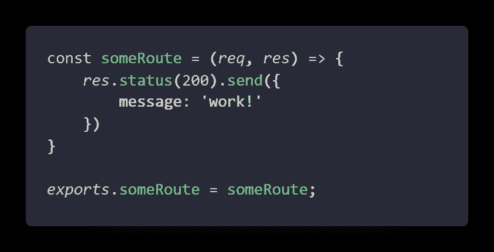

# Express.js 作为谷歌云功能

> 原文：<https://javascript.plainenglish.io/google-cloud-function-with-express-df6951521ded?source=collection_archive---------2----------------------->

Photo by [Mitchell Luo](https://unsplash.com/@mitchel3uo?utm_source=medium&utm_medium=referral) on [Unsplash](https://unsplash.com?utm_source=medium&utm_medium=referral)

# 谷歌云功能是什么？

如果我们按照定义来看，那么 GCF(Google Cloud Function)就是一段简单且用途单一的代码，在被触发时绑定到一个事件。它在无服务器架构上工作，因此消除了服务器、部署、配置软件和打补丁的工作

## 用例

*   当数据发生任何变化时触发客户端 API 的 webhook
*   物联网和移动系统上的读/写操作
*   独立异步代码

# 开始

本文将只关注 express 与 google cloud 功能的连接。我在这篇文章里考虑了一个快递的基础知识。你可以在这里找到 GitHub 回购[。](https://github.com/Piyush-Use-Personal/gcf-with-express)

我们开始吧！

## 第一步。创建快速应用程序

在这里，我们将创建一个简单的 Express 应用程序，具有最小的依赖性

请遵循以下步骤

*   `npm init -y`
*   `yarn add express http-errors cookie-parser morgan cors helmet dotev`
*   创建一个`index.js`文件
*   把这些代码放在一起，你可以从头开始从附加的存储库中获取
*   运行`yarn run dev`

一旦你的服务器开始运行，你就可以找到这条路线，一切都会好的

> 这里有一个问题，根据定义，函数是独立的代码片段，但是在 express routes 中是耦合的，所以让我们把它们隔离开来

## 第二步。创建独立模块

让我们在名为 index.js 的文件中创建名为 controller 的新文件夹

出于本文的目的，我只是将一些原始项目放入其中:

Some sample route

在主 index.js 中创建一个路由，并将控制器连接到它

对于我来说，我已经创建了一个名为`/test`的路线来查看输出。

> 您可以根据需要为项目创建多达 n 条路线

让我们从命令中直接调用每条路由，您可以使用一个新的 dep 来帮助您在本地运行名为`functions-framework`的路由

*   安装 dep 组件`npm install @google-cloud/functions-framework`
*   将 index.js 中的`main`键更改为`/controller/index.js`来运行您的函数
*   运行命令`npx functions-framework someRoute`
*   这将使用您的运行功能打开端口 8080

这将调用您的函数

但是如果你想看到你所有的功能都在运行，那么你可以使用 express power 来实现它

## 第三步。查看所有活动

要在一个命令中包含所有功能并通过 route 进行管理，您可以将 express 用作救星。首先，您需要再次将`main`字段恢复为 index.js，以确定 express 被托管在哪里

*   让每个人都可以使用你的应用
*   像普通函数一样调用它

## 第四步。试验

你可以通过进入每条路线来测试应用程序，看看是否有效，对于示例回购，你可以使用`/`和`/test`路线

您可以添加任意多的路由，并在您的主无服务器应用程序中调用

# 结论

希望这个小教程对用 GCF 设置 express 有帮助，你也可以在这里找到源代码[。如果你喜欢这个内容，请留下你的关注。](https://github.com/Piyush-Use-Personal/gcf-with-express)

谢了。

*更多内容请看*[***plain English . io***](http://plainenglish.io)