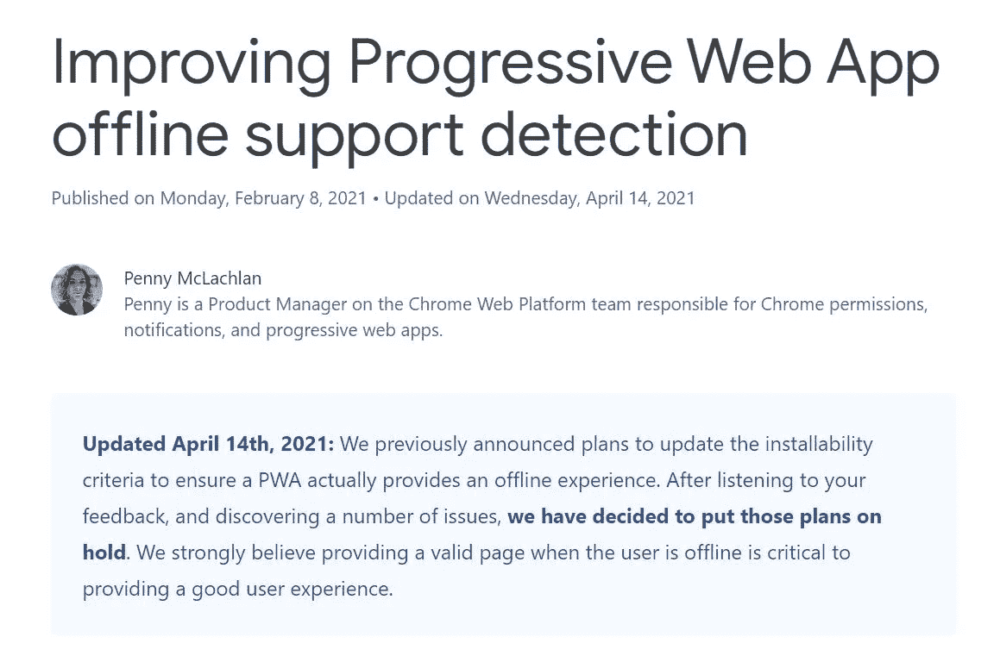
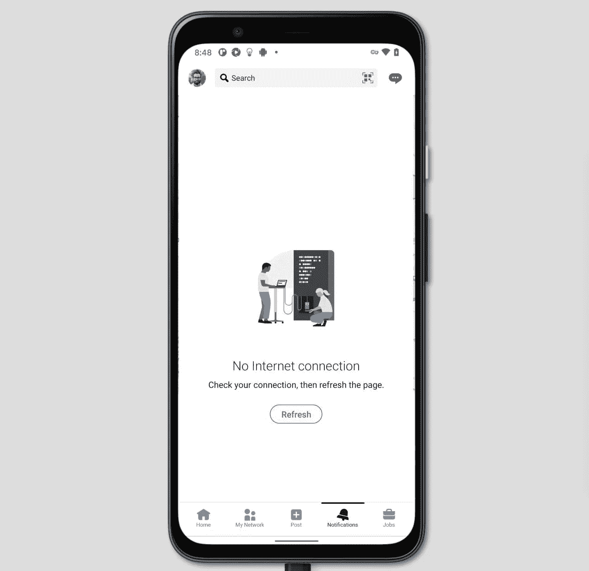
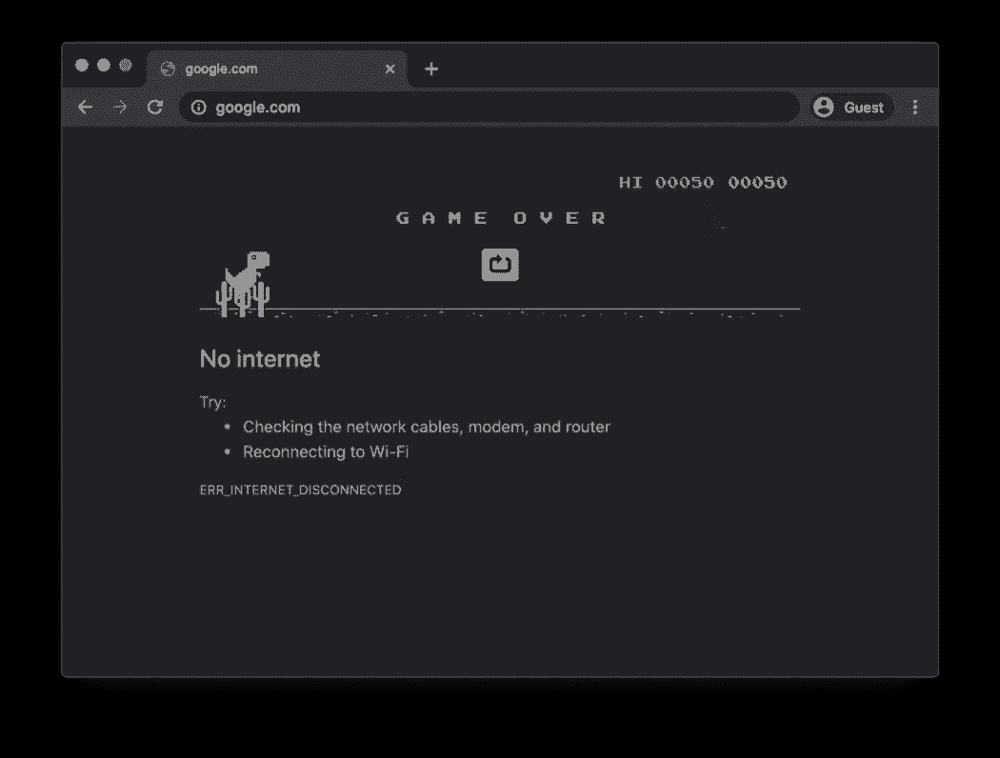

# 谷歌暂停计划打破你的 PWA

> 原文：<https://javascript.plainenglish.io/google-pauses-plan-to-break-your-pwa-d249bca27852?source=collection_archive---------1----------------------->

一个月前，我发表了[你的 PWA 将于 2021 年 8 月崩溃](/your-pwa-is-going-to-break-in-august-2021-34982f329f40)以帮助开发者应对 Chrome 93 中随后即将到来的变化，这些变化在每个人的浏览器控制台中弹出“*页面无法离线工作。从 Chrome 93 开始，可安装性标准正在改变，该网站将无法安装。*

## 谷歌正在后退

好消息！几天前，谷歌决定暂停他们的计划。看起来这些计划将会被搁置一段时间——如果不是无限期的话。

Google decided to put their plans to break your PWA on hold. You can see the announcement [here](https://developer.chrome.com/blog/improved-pwa-offline-detection/).

在我的原始文章中，我假设谷歌想要改变可安装性规则，因为许多开发人员使用一种黑客技术，允许他们从安装功能中受益，而不必做任何事情来使应用程序实际上可以离线访问。

This is what the fetch event listener looks like for a lot of installable high-traffic websites. That’s enough to satisfy the criteria of “being available offline” currently.

## 离线！=可安装

我真的想知道为什么谷歌绝对坚持将这两个概念结合在一起。他们的教条是 PWA 应该离线工作。因此，对于可安装的 PWA，它应该证明它可以脱机工作。

问题是有些 app 在离线状态下真的做不了什么有用的事情。这实际上没问题，不是吗？看看下面 LinkedIn app 的离线回退。它真的能让你做任何有用的事情吗？

I can’t do much useful with LinkedIn app when offline. And that’s a native app.

不完全是。因此，为什么谷歌不认为原生恐龙页面是一个可接受的离线退路，这让我有点困惑——特别是考虑到这是他们自己的页面。

## 谷歌为什么退缩了？

在我的原创文章[的 clickbait 标题背后，有一种真诚的意愿，那就是警告开发者谷歌现已取消的计划的后果。](/your-pwa-is-going-to-break-in-august-2021-34982f329f40)

让一个 web 应用程序持续离线工作比大多数开发者想象的要困难得多。事实上，许多认为他们已经为 8 月 21 日做好准备的人，可能会在几个月后得到一个令人讨厌的惊喜。

当第一次从服务器上检索资源时，需要对其进行缓存，以便以后在没有网络的情况下可以访问它们。但这还不够。对于真正的离线体验，你还必须*预先缓存*大量资源。

直截了当地说，在复杂的应用程序中多次迭代地管理预先缓存的资源是一件非常痛苦的事情。在某些时候，您会忘记将新资源添加到要缓存的资源列表中，这将会破坏您的离线体验——并且没有任何机制会通知您这一点。

此外，服务工作器 *fetch* 事件处理程序并非没有[错误和奇怪之处](https://stackoverflow.com/questions/48463483/what-causes-a-failed-to-execute-fetch-on-serviceworkerglobalscope-only-if)，尤其是在获取和缓存来自其他域的资源时。这里也一样， [CORS](https://developer.mozilla.org/en-US/docs/Web/HTTP/CORS) 会让人非常头疼。

根据定义，当用户离线时，您必须向他们显示最新版本的缓存数据。在一些应用程序中，不显示任何数据比显示陈旧数据更好。

但是如果您决定在脱机状态下显示过时的数据，您必须在您的 UI 中清楚地表明所显示的数据是过时的。有趣的故事:在冠状病毒应用的早期，我们会收到大量愤怒用户的电子邮件，声称数据没有更新。事实上，他们只是在离线时看到缓存的数据。

缓存是一项了不起的改进。如果做得好，它可以让你的应用程序几乎瞬间加载。通过减少发往服务器的请求数量，它可以为您节省大量 AWS/GCP 资金。它可以让你的应用程序的一部分在离线时也很有用。

但谷歌计划的 Chrome 更新本质上说的是“*建立一个完美的缓存实现或不再安装功能*”。考虑到缓存是如此脆弱和困难，完美的实现对于大多数开发人员来说可能是遥不可及的。通过破坏其他东西来迫使他们就范可能不是办法。

## 适时给予的应得的赞扬

感谢谷歌听取我们的反馈！令人惊讶的是，在他们的规模下，他们仍然能够测试，迭代和快速改变方向。希望在可预见的将来，他们更新可安装性标准的计划将被搁置。如果没有，你绝对可以期待我再写一次！

所以总而言之，好消息是——看起来毕竟你的 PWA **不会在 2021 年 8 月**破。

*PS:如果你想节省时间，可以考虑用*[*Progressier*](https://progressier.com)*代替你的 PWA 实现。它是免费的，没有代码，带有推送通知，最重要的是，我们掌握着一切，所以你不必担心。*

*更多内容请看*[***plain English . io***](https://plainenglish.io/)