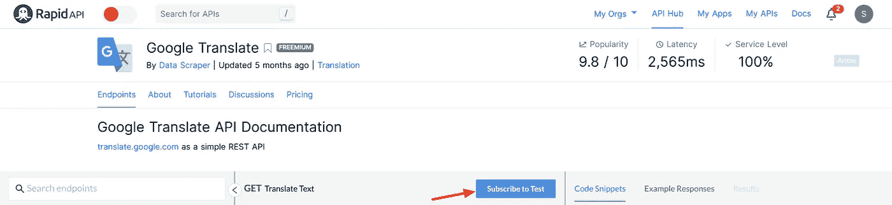
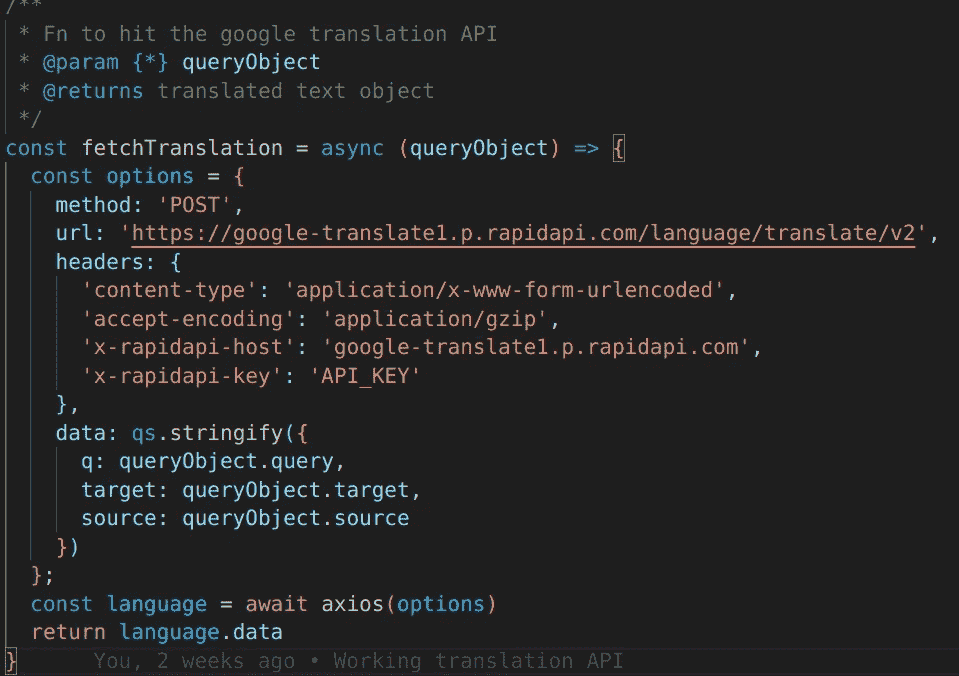
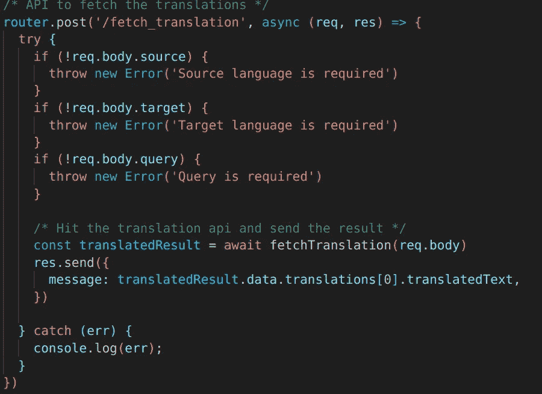
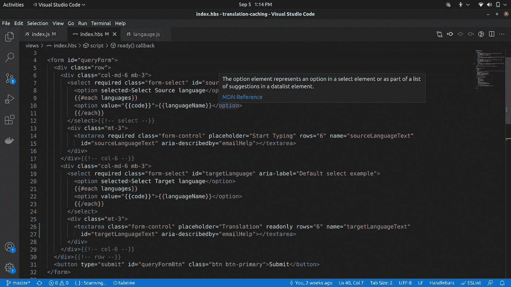
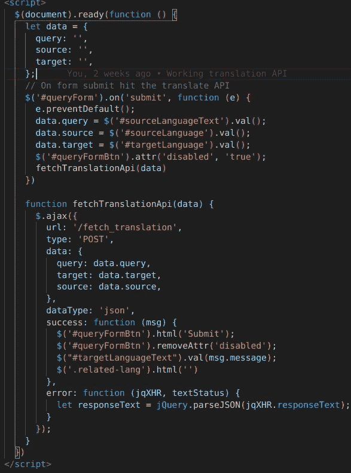

# 如何在 Node.js 中使用 Google 翻译 API

> 原文：<https://javascript.plainenglish.io/google-translation-app-node-js-de28dbae7871?source=collection_archive---------1----------------------->

## 用 Node.js 搭建一个谷歌翻译 app。


Photo by [Nathana Rebouças](https://unsplash.com/@nathanareboucas?utm_source=medium&utm_medium=referral) on [Unsplash](https://unsplash.com?utm_source=medium&utm_medium=referral)

翻译对于信息、知识和想法的传播是必要的**。在一个有超过 7000 种口语的世界里，它变得越来越重要，因为它允许人们交流和理解彼此的思想和文化，而不必学习第二语言。知识的民主化是这个充满偏见的世界中最大的均衡器。**

**在本教程中，我们将学习如何使用 Node.js 来使用谷歌翻译 API，你也可以在这里获得完整的源代码:[https://github.com/shraddha-paghdar/translation-caching](https://github.com/shraddha-paghdar/translation-caching)。**

**让我们将此分为两步，**

1.  **创建一个 Google cloud 项目并生成一个翻译 API 密匙。**
2.  **使用翻译 API 并从中获取翻译。**

# **第一步。答:通过谷歌云控制台生成一个 API 密钥**

1.  **转到[https://console.cloud.google.com/](https://console.cloud.google.com/)**
2.  **如果您没有帐户，请创建一个帐户。谷歌给任何服务 300 美元的免费积分作为免费试用。**
3.  **在搜索栏中输入“云翻译 API”。**
4.  **单击启用选项。(这个会要求计费方式。您可以创建计费帐户或使用步骤 1。b 代表免费的 API 密钥)**
5.  **点击凭证->创建凭证-> API 密钥。复制此 API 密钥供以后使用。**

# **第一步。b:通过 RapidAPI 生成 Google API 密钥**

1.  **转到[https://rapidapi.com/](https://rapidapi.com/)**
2.  **创建您的免费帐户。**
3.  **搜索谷歌翻译并订阅基本计划，该计划将为每个额外请求提供 300 英镑/月+0.001 美元。**

****

**4.这将为您提供 API 密钥。**

# **步骤 2:设置节点项目**

1.  ****安装 Axios，向 Google 发出 HTTP 请求进行翻译。****

```
npm i axios
```

****2。写一个函数来获取翻译。(我们将使用 RapidAPI)****

****

**i. `q`参数代表要翻译的文本。
二。`target`参数代表文本要翻译的目标语言代码。
三。`source`参数代表请求文本的源语言代码。
要了解如何使用原始的谷歌翻译 API，请阅读这里的。**

****3。调用获取翻译函数****

**为了得到结果，这三个参数都是必需的，所以要确保用户输入了所有的输入。**

****

****4。Index.hbs 文件****

**创建用于接收用户输入的表单。您将在 language.js 文件下获得 GitHub 项目中的语言。目前，RapidAPI 支持 100 多种语言的翻译。我们会在查询时询问源语言和目标语言。输出将处于只读模式。**

****

**一旦用户点击提交按钮，调用 API。从 Google 获取结果后，将只读字段的内容更新为翻译后的文本。**

****

****高级翻译:** 你可以将翻译的结果存储在数据库中，保存来自 Google 的 API 调用。每次用户请求翻译时，首先检查数据库，如果数据库中有值，则返回结果，否则向 API 发出请求**。****

**除此之外，您还可以存储用于相同文本翻译的最常用语言。并向用户提供关于其他语言翻译的建议。例如，如果用户从英语翻译成印地语，建议显示古吉拉特语和马拉地语也用于翻译。**

**就这样，你可以在项目的任何地方使用 Google API 和翻译功能。**

*****感谢阅读。最初发布于 2021 年 9 月 4 日***[***https://noob 2 geek . in***](https://noob2geek.in)***。*****

***更多内容看* [***说白了***](http://plainenglish.io/)**