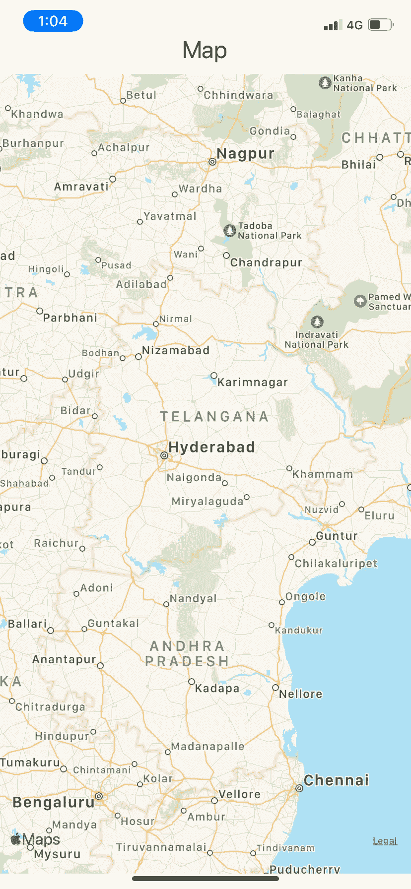
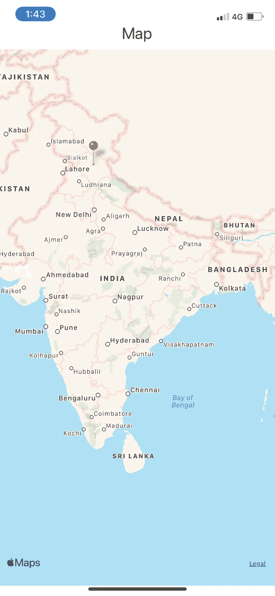
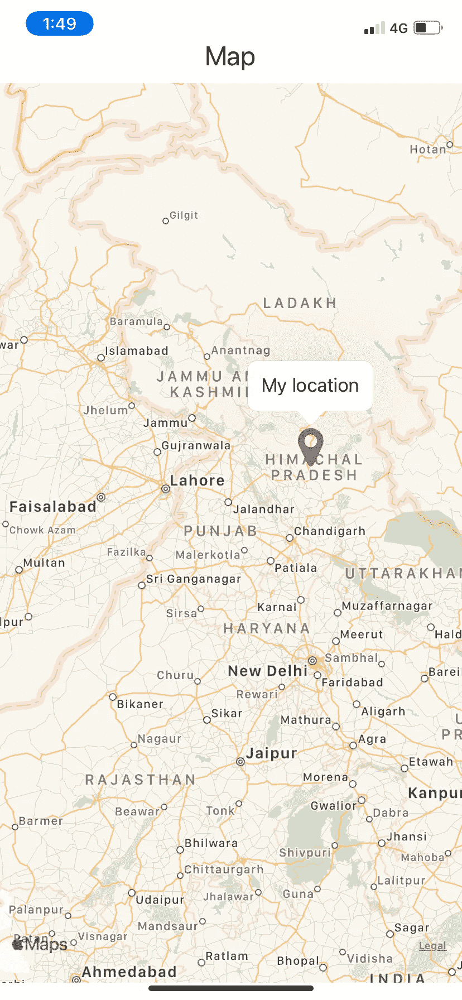

# 在 React Native 中使用地图

> 原文：<https://javascript.plainenglish.io/googleworking-with-maps-in-react-native-ee06760c988f?source=collection_archive---------3----------------------->

## 使用 React Native 中的标记开发实时地图


[Click to read more here](http://i-hate-reading-logs.vercel.app/)

今天我们将在 react native 中使用地图。我已经写了一些关于 Expo React Native 入门和在 Expo React Native 中添加闪屏的文章。我将使用相同的储存库设置来添加地图和实时标记

```
Here is the link to articles => [https://javascript.plainenglish.io/getting-started-with-expo-react-native-615d32c72b5?source=your_stories_page-------------------------------------](/getting-started-with-expo-react-native-615d32c72b5?source=your_stories_page-------------------------------------)
```

# 入门指南

React Native 提供了一个库来将地图添加到应用程序中。这提供了大量的功能来复制在普通 Javascript 或 React 中添加地图的过程。使用下面的命令添加这个库。

```
yarn add react-native-maps
```

`react-native-maps`导出以**区域**为道具的默认组件 **MapView** 。区域值将接受一个位置 JSON 对象，如下所示。

```
const region = {
  latitude: string,
  longitude: string,
  latitudeDelta: string,
  longitudeDelta: string
}
```

然后 JSON 对象需要作为道具传递给由`react-native-maps`提供的 **MapView** 组件。

```
<MapView region={region} />
```



The map on React Native app

# **添加标记**

`react-native-maps`提供一个标记组件，它将是 MapView 的子组件。标记组件接受基本属性，如坐标、标题和描述。其中坐标是以纬度和经度作为键值的对象。我们最初手动设置这个坐标对象，稍后，我们将使用用户当前位置或动态地设置它们。此外，我们可以使用自定义标记作为图像或使用简单的矢量图标来更改默认标记。我将使用`@expo/vector-icons`库添加一个自定义标记到我的标记。另外，确保坐标对象有一个数字类型的纬度和经度键。

```
const region ={ latitude: Number, longitude: Number }
return (
   <MapView>
     <Marker coordinate={region} />
   </MapView>
)
```



Our Map with manually added marker

让我们使用自定义矢量图标作为标记来更改标记的外观。

```
<FontAwesome *name*=”map-marker” *size*={40} *color*=”#B12A5B” />
```

使用`@expo/vector-icons`提供的上述矢量图标组件。



Our custom marker with the title as My location.

# 动态添加标记

要动态添加标记，我们需要首先获取用户位置，如纬度和经度，然后将它们传递给标记组件的坐标属性。Expo 提供了一个名为`expo-location`的包，帮助开发者获取用户位置。这个包使用**地理位置** -浏览器 API 来获取浏览器中的用户位置。您还可以使用`react-native-geolocation` npm 包来获取用户位置。要从设备中获取用户位置，你需要像大多数应用程序那样首先请求用户的许可。

Fetching user location using Location methods from expo-location

我们首先请求用户允许获取他/她的位置。一旦用户授予我们的应用程序权限，我们就可以将这些坐标设置为我们的 location 对象，并将它们传递给我们的 Marker 的坐标属性。

MapComponent.jsx

# 结论

现在，在 React 原生地图上添加地图并不那么困难，我仍然记得 3 年前我使用普通 JavaScript 和谷歌地图时，我必须从谷歌开发者控制台文档中集成谷歌地图，这对于初涉开发的开发者来说并不容易。但是事情在不断改善和变化。do 还附带了其他功能，比如在地图上添加圆形、折线等形状。请务必查看其文档。

直到下一次。祝大家愉快。

*更多内容尽在*[***plain English . io***](https://plainenglish.io/)