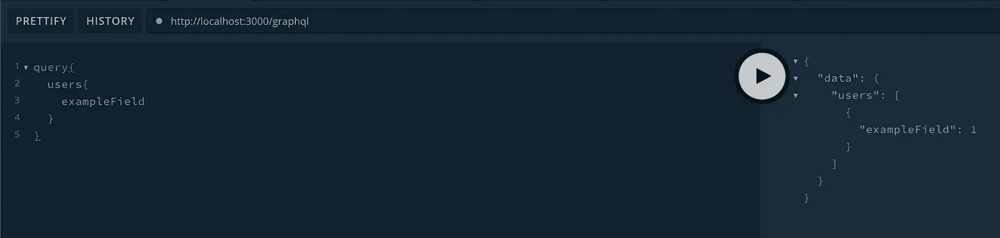
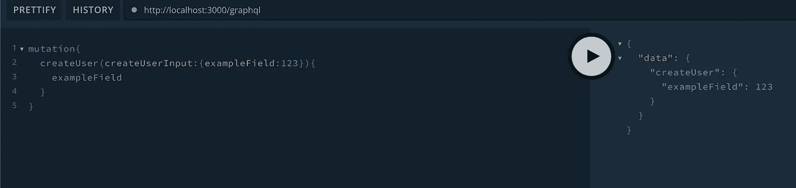

# 使用 NestJS 简化 Node.js 中的 GraphQL 后端

> 原文：<https://javascript.plainenglish.io/graphql-backend-in-nodejs-made-easy-with-nestjs-1489be18b994?source=collection_archive---------1----------------------->

在本文中，我将向您展示如何使用 NestJS 以一种非常非常简单的方式开始一个 GraphQL 后端项目。


Thinking about starting your GraphQL backend?

在过去的几年里，在构建 API 时，GraphQL 比 RESTful 架构更常用。我已经制作了一些关于如何使用 [NestJS](https://nestjs.com/) 构建 REST API 的有用教程，今天我将分享使用代码优先策略使用 GraphQL 构建 NestJS 脚手架的基础知识！

> 如果你觉得太懒，在文章的最后，你可以在一个公共的 git 库中找到所有的源代码。

[](https://makinhs.medium.com/creating-a-rest-api-series-with-nestjs-part-01-scaffolding-and-basic-cli-usage-30ace19c5bb8) [## 使用 NestJS 创建 REST API 系列—第 1 部分—搭建和基本 CLI 用法

### 欢迎回来！在这个迷你系列文章中，我将指导您如何使用 NestJS 框架构建 REST API

makinhs.medium.com](https://makinhs.medium.com/creating-a-rest-api-series-with-nestjs-part-01-scaffolding-and-basic-cli-usage-30ace19c5bb8) 

本文也旨在更加实用，我不会深究为什么使用 GraphQL，也不会深究什么时候使用 Rest 而不是 GraphQL 和其他任何东西。本文是开始编写业务逻辑的实践方法。我们可以开始了吗？

启动前你唯一需要知道和具备的就是[节点](https://nodejs.org/)安装和 NestJS CLI 安装(`npm i -g @nestjs/cli)`)。我们将以一种容易理解的方式遵循 NestJS 文档。

快速检查:

*   写这篇文章时我使用的是 node v14.16.1(我知道…我需要更新它)
*   嵌套 CLI 版本为:8.1.1
*   npm 版本:7.12.1
*   yarn 版本:1.22.10(我还是喜欢 yarn over npm)

要启动您的项目，请在您想要启动的文件夹中打开您的终端(我称之为项目),并运行以下程序

```
nest new nestjs-with-graphql
```

> **nestjs-with-graphql** 是你的项目名称，你可以使用任何你想要的名称。

现在，您可以在 npm、yarn 或 pnpm 之间进行选择。我在选择纱线:

```
⚡  We will scaffold your app in a few seconds..CREATE nestjs-with-graphql/.eslintrc.js (631 bytes)CREATE nestjs-with-graphql/.prettierrc (51 bytes)CREATE nestjs-with-graphql/README.md (3339 bytes)CREATE nestjs-with-graphql/nest-cli.json (64 bytes)CREATE nestjs-with-graphql/package.json (1975 bytes)CREATE nestjs-with-graphql/tsconfig.build.json (97 bytes)CREATE nestjs-with-graphql/tsconfig.json (365 bytes)CREATE nestjs-with-graphql/src/app.controller.spec.ts (617 bytes)CREATE nestjs-with-graphql/src/app.controller.ts (274 bytes)CREATE nestjs-with-graphql/src/app.module.ts (249 bytes)CREATE nestjs-with-graphql/src/app.service.ts (142 bytes)CREATE nestjs-with-graphql/src/main.ts (208 bytes)CREATE nestjs-with-graphql/test/app.e2e-spec.ts (630 bytes)CREATE nestjs-with-graphql/test/jest-e2e.json (183 bytes)? **Which package manager would you ❤️  to use?**npm❯ yarnpnpm
```

坐下，喝一口咖啡，等待…然后…

```
✔ Installation in progress... ☕🚀  Successfully created project nestjs-with-graphql👉  Get started with the following commands:$ cd nestjs-with-graphql$ yarn run startThanks for installing Nest 🙏Please consider donating to our open collectiveto help us maintain this package.**🍷  Donate:** https://opencollective.com/nest
```

安装完成后，它将创建一个以我们的项目命名的文件夹，在我们的例子中是 nestjs-with-graphql…

```
cd nestjs-with-graphql
```

它已经包含一个已配置的 git，但是目前它仍然使用**主**分支。让我们换成**主**吧。

```
git checkout -b main
```

> “保护协会和 Git 项目都意识到最初的分支名称‘master’对一些人来说是冒犯，我们同情那些因使用该术语而受到伤害的人，”软件自由保护协会说。 [**参考**](https://www.theserverside.com/feature/Why-GitHub-renamed-its-master-branch-to-main)

酷毙了。运行“ls”命令，我们可以看到我们已经拥有的所有文件:

```
**nestjs-with-graphql** **git:(main) ✗** lsREADME.md           package.json        tsconfig.build.jsonnest-cli.json       **src**                 tsconfig.json**node_modules**        **test**                yarn.lock
```

这是已经包含 API 集的快速搭建，但是没有 GraphQL。要进行测试，只需运行:

```
**nestjs-with-graphql** **git:(main) ✗** yarn start**yarn run v1.22.10**warning ../../package.json: No license field$ nest start[Nest] 65519  - 08/04/2021, 9:24:10 PM     LOG [NestFactory] Starting Nest application...[Nest] 65519  - 08/04/2021, 9:24:10 PM     LOG [InstanceLoader] AppModule dependencies initialized +25ms[Nest] 65519  - 08/04/2021, 9:24:10 PM     LOG [RoutesResolver] AppController {/}: +5ms[Nest] 65519  - 08/04/2021, 9:24:10 PM     LOG [RouterExplorer] Mapped {/, GET} route +2ms[Nest] 65519  - 08/04/2021, 9:24:10 PM     LOG [NestApplication] Nest application successfully started +2ms
```

默认情况下，它使用端口 3000，默认情况下，它在“/”端点上有自己的“Hello World ”:

```
**➜  nestjs-with-graphql** **git:(main) ✗** curl localhost:3000Hello World!**%**
```

很好。让我们转向 GraphQL！

对我来说，NestJS 的文档非常好。不幸的是，如果你不习惯所有常用的技术术语，你可能会迷路，因为你不知道去哪里找。但是不要担心，今天我正在缩短关心的地方…

一切从快速开始，NestJS 团队有他们自己的 GraphQL 的 [starter 页面，让我们使用它。](https://docs.nestjs.com/graphql/quick-start)

与 npm 相比，我仍然更喜欢 yarn，因此我会将他们的 npm 建议用于以下内容:

```
yarn add @nestjs/graphql graphql apollo-server-express@2.x.x**nestjs-with-graphql** **git:(main) ✗** yarn add @nestjs/graphql graphql apollo-server-express@2.x.x**yarn add v1.22.10**warning ../../package.json: No license field[1/4] 🔍  Resolving packages...warning apollo-server-express > apollo-server-core > apollo-cache-control@0.14.0: The functionality provided by the `apollo-cache-control` package is built in to `apollo-server-core` starting with Apollo Server 3\. See https://www.apollographql.com/docs/apollo-server/migration/#cachecontrol for details.warning apollo-server-express > apollo-server-core > apollo-tracing@0.15.0: The `apollo-tracing` package is no longer part of Apollo Server 3\. See https://www.apollographql.com/docs/apollo-server/migration/#tracing for detailswarning apollo-server-express > graphql-tools@4.0.8: This package has been deprecated and now it only exports makeExecutableSchema.\nAnd it will no longer receive updates.\nWe recommend you to migrate to scoped packages such as @graphql-tools/schema, @graphql-tools/utils and etc.\nCheck out https://www.graphql-tools.com to learn what package you should use insteadwarning apollo-server-express > apollo-server-core > graphql-tools@4.0.8: This package has been deprecated and now it only exports makeExecutableSchema.\nAnd it will no longer receive updates.\nWe recommend you to migrate to scoped packages such as @graphql-tools/schema, @graphql-tools/utils and etc.\nCheck out https://www.graphql-tools.com to learn what package you should use insteadwarning apollo-server-express > apollo-server-core > graphql-extensions@0.15.0: The `graphql-extensions` API has been removed from Apollo Server 3\. Use the plugin API instead: https://www.apollographql.com/docs/apollo-server/integrations/plugins/warning apollo-server-express > graphql-tools > uuid@3.4.0: Please upgrade  to version 7 or higher.  Older versions may use Math.random() in certain circumstances, which is known to be problematic.  See https://v8.dev/blog/math-random for details.[2/4] 🚚  Fetching packages...[3/4] 🔗  Linking dependencies...warning " > ts-loader@9.2.5" has unmet peer dependency "webpack@^5.0.0".warning "@nestjs/graphql > @nestjs/mapped-types@1.0.0" has unmet peer dependency "class-transformer@^0.2.0 || ^0.3.0 || ^0.4.0".warning "@nestjs/graphql > @nestjs/mapped-types@1.0.0" has unmet peer dependency "class-validator@^0.11.1 || ^0.12.0 || ^0.13.0".warning " > @nestjs/graphql@8.0.2" has unmet peer dependency "apollo-server-core@^2.21.1".[4/4] 🔨  Building fresh packages...success Saved lockfile.success Saved 85 new dependencies.info Direct dependencies├─ @nestjs/graphql@8.0.2├─ apollo-server-express@2.25.2└─ graphql@15.5.1info All dependencies├─ @apollo/protobufjs@1.2.2├─ @apollographql/graphql-upload-8-fork@8.1.3├─ @ardatan/aggregate-error@0.0.6├─ @graphql-tools/merge@6.2.14├─ @graphql-tools/schema@7.1.5├─ @graphql-tools/utils@7.10.0├─ @josephg/resolvable@1.0.1├─ @nestjs/graphql@8.0.2├─ @nestjs/mapped-types@1.0.0├─ @protobufjs/aspromise@1.1.2├─ @protobufjs/base64@1.1.2├─ @protobufjs/codegen@2.0.4├─ @protobufjs/eventemitter@1.1.0├─ @protobufjs/fetch@1.1.0├─ @protobufjs/float@1.0.2├─ @protobufjs/path@1.1.2├─ @protobufjs/pool@1.1.0├─ @protobufjs/utf8@1.1.0├─ @types/accepts@1.3.5├─ @types/content-disposition@0.5.4├─ @types/cookies@0.7.7├─ @types/cors@2.8.10├─ @types/fs-capacitor@2.0.0├─ @types/http-assert@1.5.1├─ @types/http-errors@1.8.1├─ @types/koa-compose@3.2.5├─ @types/long@4.0.1├─ @types/ws@7.4.7├─ @wry/equality@0.1.11├─ apollo-cache-control@0.14.0├─ apollo-datasource@0.9.0├─ apollo-graphql@0.9.3├─ apollo-link@1.2.14├─ apollo-server-core@2.25.2├─ apollo-server-errors@2.5.0├─ apollo-server-express@2.25.2├─ apollo-tracing@0.15.0├─ apollo-utilities@1.3.4├─ async-retry@1.3.1├─ backo2@1.0.2├─ camel-case@4.1.2├─ core-js-pure@3.16.0├─ cssfilter@0.0.10├─ deprecated-decorator@0.1.6├─ es-abstract@1.18.5├─ es-to-primitive@1.2.1├─ eventemitter3@3.1.2├─ fast-glob@3.2.6├─ for-each@0.3.3├─ fs-capacitor@2.0.4├─ graphql-extensions@0.15.0├─ graphql-subscriptions@1.2.1├─ graphql-tag@2.12.5├─ graphql@15.5.1├─ has-bigints@1.0.1├─ internal-slot@1.0.3├─ is-bigint@1.0.2├─ is-boolean-object@1.1.1├─ is-callable@1.2.3├─ is-date-object@1.0.4├─ is-negative-zero@2.0.1├─ is-number-object@1.0.5├─ is-regex@1.1.3├─ is-string@1.0.6├─ is-symbol@1.0.4├─ iterall@1.3.0├─ lodash.sortby@4.7.0├─ loglevel@1.7.1├─ long@4.0.0├─ lower-case@2.0.2├─ no-case@3.0.4├─ object-path@0.11.5├─ object.assign@4.1.2├─ object.getownpropertydescriptors@2.1.2├─ pascal-case@3.1.2├─ retry@0.12.0├─ string.prototype.trimend@1.0.4├─ string.prototype.trimstart@1.0.4├─ unbox-primitive@1.0.1├─ util.promisify@1.1.1├─ value-or-promise@1.0.6├─ which-boxed-primitive@1.0.2├─ xss@1.0.9├─ zen-observable-ts@0.8.21└─ zen-observable@0.8.15✨  Done in 8.26s.
```

还是那句话，现实一点。我们现在应该添加 GraphQL 模块。

```
GraphQLModule.forRoot({}),
```

但是在哪里？我们的主模块，在我们生成的 src 文件夹中称为 *app.module.ts* 。在这里，我们应该导入 GraphQL 模块:

```
import { Module } from '@nestjs/common';
import { AppController } from './app.controller';
import { AppService } from './app.service';
import { GraphQLModule } from '@nestjs/graphql';

@Module({
  imports: [
    GraphQLModule.*forRoot*({
      debug: true,
      playground: true,
    }),
  ],
  controllers: [AppController],
  providers: [AppService],
})
export class AppModule {}
```

请注意，如果您使用任何 IDE，如 [WebStorm](https://www.jetbrains.com/webstorm/) (我的最爱)，它将允许您自动导入 GraphQLModule。

不幸的是，如果您现在运行您的服务器，您将面临一个错误，由于“没有模式发现”的问题。为了解决这个问题，并且已经开始创建一个基本的解析器，我们将使用 Nest CLI 创建传统的“用户”资源，使用“*Nest generate resource users*”并选择代码优先的方法。

```
**nestjs-with-graphql** **git:(main) ✗** nest generate resource users? **What transport layer do you use?**REST API❯ GraphQL (code first)GraphQL (schema first)Microservice (non-HTTP)WebSockets
```

它还会问你是否想要 CRUD 入口点，请选择 yes。

```
**➜  nestjs-with-graphql** **git:(main) ✗** nest generate resource users? **What transport layer do you use?** GraphQL (code first)? **Would you like to generate CRUD entry points?** YesCREATE src/users/users.module.ts (224 bytes)CREATE src/users/users.resolver.spec.ts (525 bytes)CREATE src/users/users.resolver.ts (1109 bytes)CREATE src/users/users.service.spec.ts (453 bytes)CREATE src/users/users.service.ts (625 bytes)CREATE src/users/dto/create-user.input.ts (196 bytes)CREATE src/users/dto/update-user.input.ts (243 bytes)CREATE src/users/entities/user.entity.ts (187 bytes)
```

它将创建一个名为 users 的文件夹，其中包含所有基本框架，包括:

*   解析器:您可以对查询(检索数据)和变异(操作数据)进行编码
*   服务:您应该在哪里编写您的业务逻辑
*   模块:控制进口、出口和供应商
*   dto:为您的解析器操作数据录入
*   实体:设置您想用作资源的“用户”
*   规格文件:您可以在其中添加您的单元测试

它还将在您的 app.module.ts 中添加一个 UsersModule，这将允许应用程序了解该用户的资源存在。

我们需要在 app.module.ts 中添加要为 GraphQL 生成模式的位置

```
import { Module } from '@nestjs/common';
import { AppController } from './app.controller';
import { AppService } from './app.service';
import { GraphQLModule } from '@nestjs/graphql';
import { UsersModule } from './users/users.module';

@Module({
  imports: [
    GraphQLModule.*forRoot*({
      autoSchemaFile: './schema.gql',
      debug: true,
      playground: true,
    }),
    UsersModule,
  ],
  controllers: [AppController],
  providers: [AppService],
})
export class AppModule {}
```

现在运行我们的应用程序应该可以正常工作:

```
**nestjs-with-graphql** **git:(main) ✗** yarn start**yarn run v1.22.10**warning ../../package.json: No license field$ nest start[Nest] 66485  - 08/04/2021, 9:43:22 PM     LOG [NestFactory] Starting Nest application...[Nest] 66485  - 08/04/2021, 9:43:22 PM     LOG [InstanceLoader] UsersModule dependencies initialized +28ms[Nest] 66485  - 08/04/2021, 9:43:22 PM     LOG [InstanceLoader] AppModule dependencies initialized +0ms[Nest] 66485  - 08/04/2021, 9:43:22 PM     LOG [InstanceLoader] GraphQLSchemaBuilderModule dependencies initialized +1ms[Nest] 66485  - 08/04/2021, 9:43:22 PM     LOG [InstanceLoader] GraphQLModule dependencies initialized +0ms[Nest] 66485  - 08/04/2021, 9:43:22 PM     LOG [RoutesResolver] AppController {/}: +3ms[Nest] 66485  - 08/04/2021, 9:43:22 PM     LOG [RouterExplorer] Mapped {/, GET} route +2ms[Nest] 66485  - 08/04/2021, 9:43:22 PM     LOG [NestApplication] Nest application successfully started +65ms
```

这应该足够在[http://localhost:3000/graph QL](http://localhost:3000/graphql)上开一个**游乐场**。但是请记住，NestJS CLI 对于搭建您的项目来说是很棒的，但是对于 GraphQL 来说，这个搭建仍然缺少一些内容。如果我们想要获得用户列表，我们将在他们的解析器上找到以下内容:

```
@Query(() => [User], { name: 'users' })
findAll() {
  return this.usersService.findAll();
}
```

请注意，**【User】**表示我们将从这个名为 **findAll 的函数中检索用户列表。**在 users.service.ts 中，我们将有以下内容，它不会返回没有用户实体的数组:

```
findAll() {
  return `This action returns all users`;
}
```

有两个步骤来“修复”这个脚手架，即在返回时添加数组，并在其上返回用户对象。但是什么是**用户**？user.entity.ts 默认设置为:

```
import { ObjectType, Field, ***Int*** } from '@nestjs/graphql';

@ObjectType()
export class User {
  @Field(() => ***Int***, { description: 'Example field (placeholder)' })
  exampleField: number;
}
```

它是一个基本的框架，告诉 GraphQL 对象类型叫做**用户**，并且只有一个叫做“范例字段”的**字段**，其中包含一个数字。你将根据你的项目改变这一点，但为了使这篇文章足够干净，我们不会改变它。

在**返回**到 users.service.ts 之前，请注意，当您运行项目时，您将拥有一个 schema.gql，其内容如下:

```
# ------------------------------------------------------
# THIS FILE WAS AUTOMATICALLY GENERATED (DO NOT MODIFY)
# ------------------------------------------------------

type User {
  """Example field (placeholder)"""
  exampleField: Int!
}

type Query {
  users: [User!]!
  user(id: Int!): User!
}

type Mutation {
  createUser(createUserInput: CreateUserInput!): User!
  updateUser(updateUserInput: UpdateUserInput!): User!
  removeUser(id: Int!): User!
}

input CreateUserInput {
  """Example field (placeholder)"""
  exampleField: Int!
}

input UpdateUserInput {
  """Example field (placeholder)"""
  exampleField: Int
  id: Int!
}
```

> 老实说，理解 graphql 模式很棒也很容易，但我真的很欣赏 NestJS 注释和遵循代码优先方法的能力，以避免在不同的文件中重写相同的逻辑。

回到 **users.service.ts** :由于我们使用了 Typescript，我们可以增强我们希望从服务函数中获得的回报，并且已经适应了解析器的要求:

```
import { Injectable } from '@nestjs/common';
import { CreateUserInput } from './dto/create-user.input';
import { UpdateUserInput } from './dto/update-user.input';
import { User } from './entities/user.entity';

@Injectable()
export class UsersService {
  create(createUserInput: CreateUserInput): User {
    return { exampleField: createUserInput.exampleField };
  }

  findAll(): [User] {
    return [{ exampleField: 1 }];
  }

  findOne(id: number): User {
    return { exampleField: id };
  }

  update(id: number, updateUserInput: UpdateUserInput): User {
    return { exampleField: updateUserInput.id };
  }

  remove(id: number): User {
    return { exampleField: id };
  }
}
```

很好，让我们运行我们的项目，在 http:localhost:3000/graphql 上再次打开游乐场

```
**nestjs-with-graphql** **git:(main) ✗** yarn start**yarn run v1.22.10**warning ../../package.json: No license field$ nest start[Nest] 66703  - 08/04/2021, 9:55:32 PM     LOG [NestFactory] Starting Nest application...[Nest] 66703  - 08/04/2021, 9:55:32 PM     LOG [InstanceLoader] UsersModule dependencies initialized +36ms[Nest] 66703  - 08/04/2021, 9:55:32 PM     LOG [InstanceLoader] AppModule dependencies initialized +1ms[Nest] 66703  - 08/04/2021, 9:55:32 PM     LOG [InstanceLoader] GraphQLSchemaBuilderModule dependencies initialized +0ms[Nest] 66703  - 08/04/2021, 9:55:32 PM     LOG [InstanceLoader] GraphQLModule dependencies initialized +1ms[Nest] 66703  - 08/04/2021, 9:55:32 PM     LOG [RoutesResolver] AppController {/}: +4ms[Nest] 66703  - 08/04/2021, 9:55:32 PM     LOG [RouterExplorer] Mapped {/, GET} route +2ms[Nest] 66703  - 08/04/2021, 9:55:33 PM     LOG [NestApplication] Nest application successfully started +91ms
```

我们可以编写一个查询来获取所有用户，我们将收到硬编码的默认结果:

```
query{
  users{
    exampleField
  }
}
```



list users from our scaffolding

如果我们想尝试一个突变，也非常简单:

```
mutation{
  createUser(createUserInput:{exampleField:123}){
    exampleField
  }
}
```



adding a mutation for our scaffolding

就是这样。您最初从 GraphQL 后端需要的一切都已经设置好了！

在结束之前，我将把这个非常简单的脚手架添加到 github 公共存储库中，因为我想使用这个脚手架来研究更深入的主题，例如:

*   单元测试
*   E2E 测试
*   处理授权和许可
*   实际编码服务业务逻辑
*   用 Mongoose 添加 MongoDB
*   配置一个基本的 CI/CD 管道，类似于我的[上一篇文章](https://makinhs.medium.com/your-scaffold-for-circleci-automated-tests-nestjs-a64f028cdd3d)
*   以及其他有助于后端开发人员的主题

因此，让我们为 git 提交做一个非常基本的配置，这通常会在您的简历中加分

*   使用更漂亮的
*   使用棉绒

缺省情况下，NestJS 已经配置了你的 prettier 和 lint，你有脚本要运行，比如

*   纱线格式:运行更漂亮
*   纱线皮棉:皮棉你的项目

```
**nestjs-with-graphql** **git:(main) ✗** yarn format**yarn run v1.22.10**warning ../../package.json: No license field$ prettier --write "src/**/*.ts" "test/**/*.ts"src/app.controller.spec.ts 178mssrc/app.controller.ts 10mssrc/app.module.ts 6mssrc/app.service.ts 3mssrc/main.ts 4mssrc/users/dto/create-user.input.ts 4mssrc/users/dto/update-user.input.ts 4mssrc/users/entities/user.entity.ts 5mssrc/users/users.module.ts 3mssrc/users/users.resolver.spec.ts 8mssrc/users/users.resolver.ts 15mssrc/users/users.service.spec.ts 8mssrc/users/users.service.ts 8mstest/app.e2e-spec.ts 7ms✨  Done in 0.59s.**➜  nestjs-with-graphql** **git:(main) ✗** yarn lint**yarn run v1.22.10**warning ../../package.json: No license field$ eslint "{src,apps,libs,test}/**/*.ts" --fix✨  Done in 4.26s.
```

我们可以在 git 提交之前添加这个命令。我将为哈士奇添加以下内容:

```
npx husky-init # add --yarn2 for Yarn 2
yarn add --dev pretty-quick
yarn husky set .husky/pre-commit "npx pretty-quick --staged"
```

您将看到类似于以下内容的内容:

```
**nestjs-with-graphql** **git:(main) ✗** npx husky-init # add --yarn2 for Yarn 2yarn add --dev pretty-quickyarn husky set .husky/pre-commit "npx pretty-quick --staged"Need to install the following packages:husky-initOk to proceed? (y) yhusky-init updating package.jsonsetting prepare script to command "husky install"husky - Git hooks installedhusky - created .husky/pre-commitplease review changes in package.json**yarn add v1.22.10**warning ../../package.json: No license field[1/4] 🔍  Resolving packages...[2/4] 🚚  Fetching packages...[3/4] 🔗  Linking dependencies...warning " > @nestjs/graphql@8.0.2" has unmet peer dependency "apollo-server-core@^2.21.1".warning "@nestjs/graphql > @nestjs/mapped-types@1.0.0" has unmet peer dependency "class-transformer@^0.2.0 || ^0.3.0 || ^0.4.0".warning "@nestjs/graphql > @nestjs/mapped-types@1.0.0" has unmet peer dependency "class-validator@^0.11.1 || ^0.12.0 || ^0.13.0".warning " > ts-loader@9.2.5" has unmet peer dependency "webpack@^5.0.0".[4/4] 🔨  Building fresh packages...success Saved lockfile.success Saved 7 new dependencies.info Direct dependencies├─ husky@6.0.0└─ pretty-quick@3.1.1info All dependencies├─ @types/minimatch@3.0.5├─ array-differ@3.0.0├─ arrify@2.0.1├─ husky@6.0.0├─ mri@1.1.6├─ multimatch@4.0.0└─ pretty-quick@3.1.1$ husky installhusky - Git hooks installed✨  Done in 4.25s.**yarn run v1.22.10**warning ../../package.json: No license field$ /Users/marcossilva/projects/nestjs-with-graphql/node_modules/.bin/husky set .husky/pre-commit 'npx pretty-quick --staged'husky - created .husky/pre-commit✨  Done in 0.14s.
```

它创建了一个名为**的文件夹。husky** 和一个预提交文件，其中包含

```
**#!/bin/sh** . "$(dirname "$0")/_/husky.sh"

npx pretty-quick --staged
```

我将添加纱线线头命令后运行漂亮

```
**#!/bin/sh** . "$(dirname "$0")/_/husky.sh"

npx pretty-quick --staged && yarn lint
```

这将在提交到 git 之前自动运行得更漂亮、更 lint，这在多人一起编码时很有帮助。

> **注意:**一些使用 Windows 的朋友，pretty-quick 不能正常工作，他们使用“纱线格式& &纱线线头”来代替。

太好了，我们现在很幸福。您不需要这样做，因为我将代码推送到我的公共 git 存储库，但它是这样工作的:

```
**nestjs-with-graphql** **git:(main) ✗** git add .**➜  nestjs-with-graphql** **git:(main) ✗** git commit -m 'feat: added basic scaffolding'🔍  Finding changed files since **git** revision **null**.🎯  Found **23** changed files.✍️  Fixing up **.prettierrc**.✍️  Fixing up **schema.gql**.✅  Everything is awesome!**yarn run v1.22.10**warning ../../package.json: No license field$ eslint "{src,apps,libs,test}/**/*.ts" --fix✨  Done in 3.64s.[main (root-commit) b9a4040] feat: added basic scaffolding27 files changed, 6489 insertions(+)create mode 100644 .eslintrc.jscreate mode 100644 .gitignorecreate mode 100644 .husky/.gitignorecreate mode 100755 .husky/pre-commitcreate mode 100644 .prettierrccreate mode 100644 README.mdcreate mode 100644 nest-cli.jsoncreate mode 100644 package.jsoncreate mode 100644 schema.gqlcreate mode 100644 src/app.controller.spec.tscreate mode 100644 src/app.controller.tscreate mode 100644 src/app.module.tscreate mode 100644 src/app.service.tscreate mode 100644 src/main.tscreate mode 100644 src/users/dto/create-user.input.tscreate mode 100644 src/users/dto/update-user.input.tscreate mode 100644 src/users/entities/user.entity.tscreate mode 100644 src/users/users.module.tscreate mode 100644 src/users/users.resolver.spec.tscreate mode 100644 src/users/users.resolver.tscreate mode 100644 src/users/users.service.spec.tscreate mode 100644 src/users/users.service.tscreate mode 100644 test/app.e2e-spec.tscreate mode 100644 test/jest-e2e.jsoncreate mode 100644 tsconfig.build.jsoncreate mode 100644 tsconfig.jsoncreate mode 100644 yarn.lock
```

如果你读到这里，你可以在这里找到 [Github 库](https://github.com/makinhs/nestjs-with-graphql)。

感谢阅读到目前为止。这篇文章非常基础，但是旨在通过 Node.js 和使用 NestJS 框架启动 GraphQL 后端。我真的很想找到更多的个人时间来更深入地写一些在使用 NestJS 编码时可以在生产中使用的东西，并且还回去写一些在前端使用在现实环境中有意义的东西的 React。

如果这篇文章对你有用，不要忘了鼓掌，或者发表评论！回头见。

准备好第二步了吗？让我们在下一篇文章中用 TypeORM 添加 Postgres 模块。

[](https://makinhs.medium.com/graphql-nodejs-postgres-made-easy-with-nestjs-and-typeorm-4daff3c516d) [## graph QL+NodeJS+Postgres——使用 NestJS 和 TypeORM 使之变得简单

### 使用 TypeORM 在 NestJS GraphQL 后端添加 Postgres 模块，并创建一个基本的 CRUD

makinhs.medium.com](https://makinhs.medium.com/graphql-nodejs-postgres-made-easy-with-nestjs-and-typeorm-4daff3c516d) 

不喜欢 GraphQL，想在 REST API 中看到 NestJS？查看我的另一篇文章:

[](https://makinhs.medium.com/creating-a-rest-api-series-with-nestjs-part-01-scaffolding-and-basic-cli-usage-30ace19c5bb8) [## 使用 NestJS 创建 REST API 系列—第 1 部分—搭建和基本 CLI 用法

### 欢迎回来！在这个迷你系列文章中，我将指导您如何使用 NestJS 框架构建 REST API

makinhs.medium.com](https://makinhs.medium.com/creating-a-rest-api-series-with-nestjs-part-01-scaffolding-and-basic-cli-usage-30ace19c5bb8) 

*更多内容尽在*[***plain English . io***](http://plainenglish.io/)