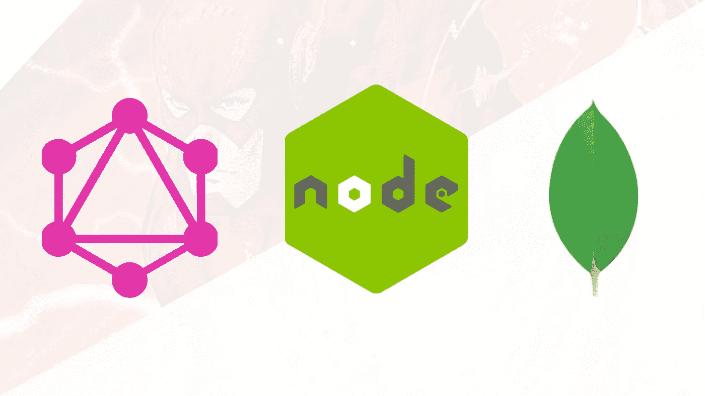
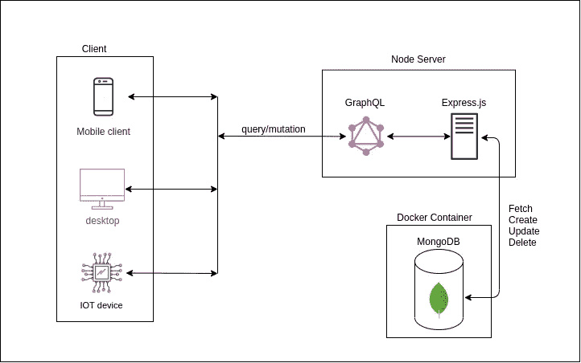
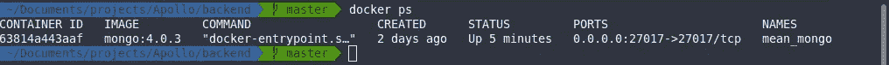
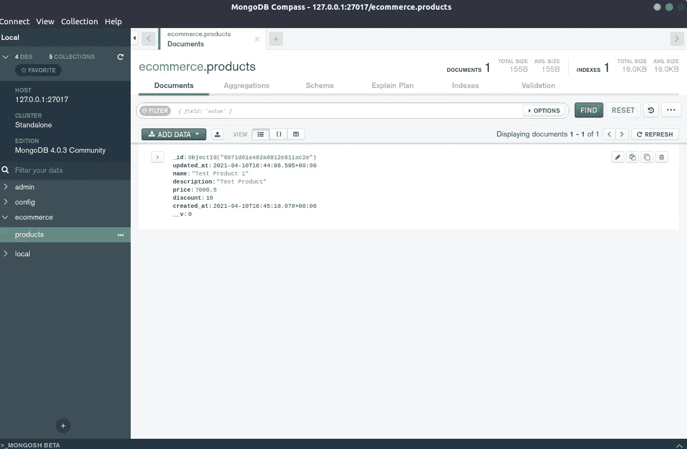
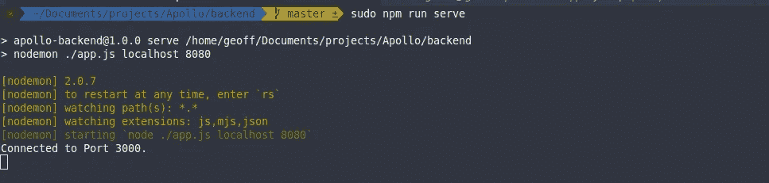
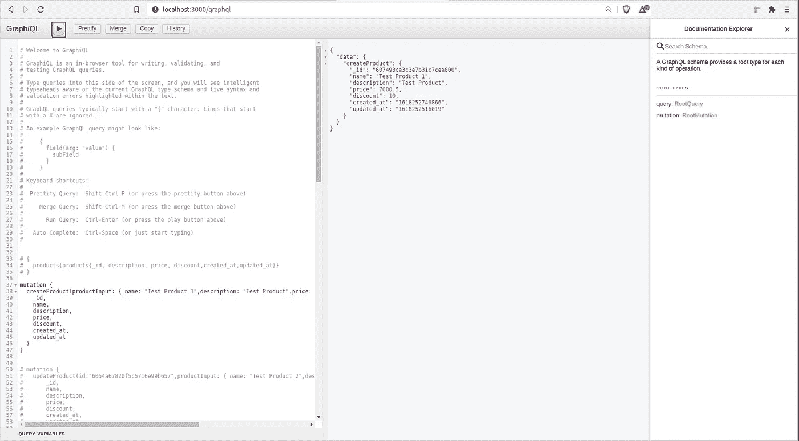

# 如何用 Express 和 MongoDB 构建一个 GraphQL API 后端

> 原文：<https://javascript.plainenglish.io/graphql-express-mongo-backend-d41625f728bf?source=collection_archive---------4----------------------->

快速设置、以客户端为中心的实时单一端点。听起来好得难以置信？在这个设置中，您将学习如何使用 Node.js 构建一个现代的可伸缩的 GraphQL API 后端，使用 MongoDB 作为数据库。



## 为什么选择 GraphQL 而不是 Restful API？

**1。单一端点**

所有的数据查询和变异都是在单个端点上完成的，不像 Restful APIs 那样必须知道特定的端点才能获取数据。

**2。修复了&下的过度蚀刻**

GraphQL 是一种查询语言，因此它针对检索指定的数据进行了优化，这与 Rest APIss 不同，Rest API 检索的数据要么有额外的值(溢出)，要么没有所有的值，因此需要命中多个端点来检索全部数据(溢出)。

**3。更快的开发(以客户端为中心的 API)**

API 是使用后端和前端开发人员共享的模式定义的，因此消除了 API 的模糊性。作为后端/前端开发人员，你会有相同的数据参考。

**4。汽车应用编程接口文档**

一旦项目启动并运行，您就可以访问 GraphQL Web 界面——graph QL 客户端(位于 localhost:3000/graphql ),它包含了您可以对 API 执行的所有查询和变更的文档。

## 设置架构

在本文档中，我们将使用 Express server 作为后端服务器，使用 MongoDB 作为数据库来设置 GraphQL 后端。然后，我们将继续在产品实例上创建 CRUD 操作。

这是应用程序架构的样子:



## 步骤 1-设置 Express.js 服务器

我们将使用 [Express.js](https://expressjs.com/en/starter/installing.html) 作为后端服务器，使我们能够托管 [GraphQL](https://graphql.org/learn/) 服务器，并将其与 [MongoDB](https://www.mongodb.com/) 数据库集成。

**1。初始化项目**

创建一个项目文件夹，并将 cd 放入该文件夹以初始化节点包管理器(npm)。

**先决条件:**

*   安装 [Node.js](https://nodejs.org/en/download/) 。

```
npm init
```

**2。安装 Express.js**

```
npm install express --save
```

**3。安装快速依赖关系:**

```
npm install cors body-parser --save
```

**4。安装 nodemon**

这将有助于我们服务于快速应用程序并进行热重装。我们将把它安装为一个开发依赖项:

`npm install --save-dev nodemon`

要添加**服务器运行**脚本，通过添加以下行来更新您的 **package.json** 文件:

```
"scripts": {
    "serve": "nodemon ./app.js localhost 8080"
},
```

**5。创建 Hello world API 测试应用程序**

创建您的应用程序入口文件 **app.js** (在根文件夹中)，并粘贴以下内容:

```
const express = require('express')
const app = express()
const port = 3000

app.get('/', (req, res) => {
  res.send('Hello World!')
})

app.listen(port, () => {
  console.log(`Example app listening at http://localhost:${port}`)
})
```

上面的代码是一个简单的 hello world 脚本，用于确保应用程序正在运行。您可以通过运行以下命令在 [http://localhost:3000](http://localhost:3000) 访问响应:

```
npm run serve
```

## 步骤 2 —设置 MongoDB

为了让数据库快速启动和运行，我们将使用一个 docker 容器映像，在您的本地磁盘上进行持久存储。

**先决条件:**

*   [已安装 docker](https://docs.docker.com/get-started/)。
*   [安装 docker-compose](https://docs.docker.com/compose/install/)。这用于编排 docker 映像的构建和运行。

**1。环境设置**

为了创建 express 和 MongoDB 都使用的环境设置，您将创建一个**。env** 文件并粘贴下面的细节(根据你的喜好编辑值):

```
MONGO_INITDB_ROOT_USERNAME=backend_adminMONGO_INITDB_ROOT_PASSWORD=passwordMONGO_INITDB_DATABASE=ecommerceMONGO_DATABASE_HOST=localhostMONGO_DATABASE_PORT=27017
```

安装 **DotEnv** 以访问 Node.js 运行时中的环境变量(这将在 express 应用程序中用于访问环境变量)。

```
npm install dotenv
```

**2。创建 Mongo_init 文件**

在这一步中，我们将为 Mongo Docker 映像创建初始化脚本。创建一个 **mongo/docker** 文件夹，并在其中创建一个 **mongo_init.js** 文件；粘贴以下内容(**/mongo/docker/mongo _ init . js**):

> **注意:** Mongo Docker 映像提供了初始化脚本的规范，我们可以在其中指定为容器映像创建的数据库/用户/测试。

```
db.createUser({
    user: "backend_admin",
    pwd: "password",
    roles: [{
        role: "root",
        db: "admin"
    }]
});
```

**3。创建 docker-compose 文件**

然后，我们将在项目文件夹的根目录下创建一个 **docker-compose.yml** (描述映像的规格并编排映像生命周期)文件，并将内容放在下面:

> **注意:**我们使用先前在**中指定的环境变量。env** 文件。我们使用**/mongo/docker/mongo _ init . js**文件中提供的初始化脚本为要创建的用户提供规范。

```
version: "3.3" # specify docker-compose version# Define the services/containers to be runservices:
  database: # name of service: database
  image: mongo:4.0.3 # specify image to build container from
  container_name: mean_mongo
  restart: always
  environment:
    MONGO_INITDB_ROOT_USERNAME: ${MONGO_INITDB_ROOT_USERNAME}
    MONGO_INITDB_ROOT_PASSWORD: ${MONGO_INITDB_ROOT_PASSWORD}
    MONGO_INITDB_DATABASE: ${MONGO_INITDB_DATABASE}
  volumes:
    - ./mongo:/home/mongodb
  # Copies the files from /docker folder containing cong to /docker-entrypoint-initdb.d/ where init scrips for conainer run.
    - ./mongo.docker/:/docker-entrypoint-initdb.d/
    - ./mongo/db:/data/db
  ports:
    - "${MONGO_DATABASE_PORT}:27017" # specify port forewarding
```

**4。构建并运行 MongoDB 映像**

要构建并运行容器映像，请运行下面的脚本:

```
docker-compose -f "./docker-compose.yml" up -d --build
```

要检查容器映像是否正在运行:

```
docker ps
```



You should see the docker image running

要连接和可视化数据库，您可以使用免费的开源工具 [Mongo Compass](https://www.mongodb.com/try/download/compass) (使用您的。env 文件)。



## **步骤 3 —设置 GraphQL API 服务**

我们将在一个产品实例上实现 **CRUD** 。我们的 API 将能够使用 GraphQL API 使用 Mongoose 作为 ODM(对象文档映射)从 MongoDB 创建、读取、更新和删除产品。

**1。装猫鼬。** 首先，我们需要安装[mongose](https://mongoosejs.com/)，它将帮助我们定义数据库的 **chema** ，轻松地交互和操作数据库实例，并轻松地连接到 MongoDB。

```
npm i mongoose
```

**2。创建模式文件**

接下来，我们将创建一个模式文件。首先，在项目的根目录下创建一个 **models** 文件夹，然后创建一个**product . js**(/models/product . js)文件。粘贴以下内容:

```
const mongoose = require('mongoose');const Schema = mongoose.Schema;const productSchema = new Schema ({name: {
        type: String,
        required: true,
    },
    description: {
        type: String,
        required: true,
    },
    price: {
        type: Number,
        min: [1],
        required: true,
    },
    discount: {
        type: Number,
        min: [1],
        required: false,
    },
    created_at: {type: Date, default: Date.now},
     updated_at: {type: Date, default: Date.now()}});module.exports = mongoose.model('Product', productSchema);
```

**3。** [**安装 GraphQL**](https://graphql.org/graphql-js/running-an-express-graphql-server/) **及其依赖:**

```
npm install express-graphql graphql --save
```

**4。创建 GrapQL 解析器**

GraphQL 使用解析器为应用程序定义**业务逻辑/ API 逻辑**。

我们将首先创建一个产品解析器 **:**

在项目的根文件夹中，创建一个 **GraphQL 文件夹，**并在其中创建一个 **resolvers.js** 文件(/graphql/resolvers.js)。在其中，粘贴以下代码:

```
const Product = require('../models/product');module.exports = {
  createProduct: async function ({ productInput }) {
    const product = new Product({
      name: productInput.name,
      description: productInput.description,
      price: productInput.price,
      discount: productInput.discount,
    }); const createdProduct = await product.save();
    return {
      ...createdProduct._doc,
      _id: createdProduct._id.toString(),
    };
  },
}
```

**4。创建 GrapQL 模式**

GraphQL 使用模式来定义 API 的数据格式和解析器的类型，以便在客户端请求查询/变异时运行。

**创建:**我们将继续为已创建的产品**创建一个模式。**

在项目的根目录下创建一个 GraphQL 文件夹，添加一个 **schema.js** 文件(/graphql/schema.js)并粘贴以下内容:

```
const { buildSchema } = require('graphql');export default buildSchema(`
    type Product{
        _id:ID!
        name: String!
        description: StriWng!
        price: Float!
        discount: Int
        created_at: String!
        updated_at: String!
    } input ProductInputData { 
       name: String!
       description: String!
       price: Float!
       discount: Int
    } type RootMutation {
       createProduct(productInput:ProductInputData): Product!
    } schema {
       mutation: RootMutation
   }`);
```

要阅读更多关于 GraphQL 模式定义的内容，请点击这个[链接](https://graphql.org/learn/schema/)。

**5。GraphQL CRUD 操作**

现在我们已经完成了创建操作，我们将继续创建其他操作。

**读取/查询:**获取所有产品 API。

为了读取创建的所有产品，我们将首先创建查询解析器(在解析器文件中将其作为模块导出的一部分添加):

```
products: async function () {
  const products = await Product.find();
  return {
    products: products.map((q) => {
      return {
        ...q._doc,
        _id: q._id.toString(),
      };
    })
  };
},
```

然后在 **schema.js** 文件中，添加产品查询逻辑(作为 buildSchema 导出的一部分):

```
type ProductData {
    products: [Product!]!
}
type RootQuery {
    products: ProductData!
}
schema {
    query: RootQuery
    mutation: RootMutation
}
```

**更新:**更新产品的实例。

我们将首先创建一个 **updateProduct** 解析器，然后在模式中注册它。在 **resolvers.js** 文件中添加以下代码(作为模块导出的一部分):

```
updateProduct: async function ({ id, productInput }) {
  const product = await Product.findById(id);
  if (!product) {
    throw new Error('Product Not found!');
  }

  product.name = productInput.name;
  product.description = productInput.description;
  product.price = productInput.price;
  product.discount = productInput.discount; const updatedProduct = await product.save();
  return {
    ...updatedProduct._doc,
    _id: updatedProduct._id.toString(),
  };
},
```

在 **schema.js** 文件中，添加 **updateProduct** resolver(它获取产品的 ID，并使用请求中提供的值改变数据库中的值):

```
type RootMutation {
    createProduct(productInput:ProductInputData): Product!
    updateProduct(id: ID!, productInput:ProductInputData): Product!
}
```

**删除:**删除一个产品的实例。

我们将创建一个 **deleteProduct** 解析器，然后在模式中注册它。在 resolvers.js 文件中添加以下代码(作为模块导出的一部分):

```
deleteProduct: async function ({ id, productInput }) {
  const product = await Product.findById(id);
  if (!product) {
    throw new Error('Product Not found!');
  } await Product.findByIdAndRemove(id);
  return {
    ...product._doc,
    id: product._id.toString(),
  };
},
```

在 **schema.js** 文件中，添加 **deleteProduct** resolver(这将获取产品的 ID 并从 MongoDB 中删除实例):

```
type RootMutation {
    createProduct(productInput:ProductInputData): Product!
    updateProduct(id: ID!, productInput:ProductInputData): Product!
    deleteProduct(id: ID!): Product!
}
```

最终的 **resolvers.js 文件**应该是这样的:

最终的 **schema.js** 文件应该是这样的:

## 步骤 4-设置 Express 服务器

最初，我们有一个简单的 hello world 应用程序。但是我们需要配置 Express 应用程序入口文件 **(app.js)** ，以便连接到 MongoDB 并服务于 GraphQL 服务器。

将 **app.js** 文件更新为以下内容:

## 步骤 5 —运行 GraphQL API

这是您现在可以运行 GraphQL 服务器的最后一步。

> 注意:确保 docker 容器正在运行。

要运行服务器，请执行以下操作:

```
npm run serve
```



You should see the application serving at localhost:3000

您现在可以在[HTTP://localhost:3000/GraphQL](http://HTTP://localhost:3000/graphql)访问 graph QL 客户端。



## 第 6 步—运行查询和突变。

在 GraphQL 控制台中，您可以运行这些查询和变异:

**1。创建产品变异**(在 GraphQL 客户端控制台中):

```
mutation {
  createProduct(productInput: { name: "Test Product 1",description: "Test Product",price: 7000.50,discount: 10}){
    _id,
    name,
    description,
    price,
    discount,
    created_at,
    updated_at
  }
}
```

**2。读取所有产品查询(在 GraphQL 客户端控制台中):**

```
{
  products{products{_id, description, price, discount,created_at,updated_at}}
}
```

**3。更新产品突变**(在 GraphQL 客户端控制台中):

> **注**:用自己创建的 ID 替换 ID。

```
mutation {
  updateProduct(id:"6054a67820f5c5716e99b657",productInput: { name: "Test Product 2",description: "Test Product",price: 7500.50,discount: 8}){
      _id,
      name,
      description,
      price,
      discount,
      created_at,
      updated_at
  }
}
```

**4。删除产品突变**(在 GraphQL 客户端控制台中):

> **注意** : —用你创建的 ID 替换它。

```
mutation {
  deleteProduct(id:"6054a67820f5c5716e99b657"){
      _id,
      name,
      description,
      price,
      discount,
      created_at,
      updated_at
  }
}
```

希望你喜欢并学到了新的东西！

完整的项目可以在这里找到:

[](https://github.com/GeoffMahugu/apollo-backend) [## GeoffMahugu/阿波罗-后端

### 该文档将包含使用 graphql 服务设置简单 NodeJS 后端的设置指南。我们将会…

github.com](https://github.com/GeoffMahugu/apollo-backend) 

*可以在*[*@ GeoffreyMahugu*](https://twitter.com/GeoffreyMahugu)*关注我的推特。如果你有兴趣一起工作，给我发邮件到 geoffreymahugu@gmail.com。*

*更多内容请看*[*plain English . io*](http://plainenglish.io/)