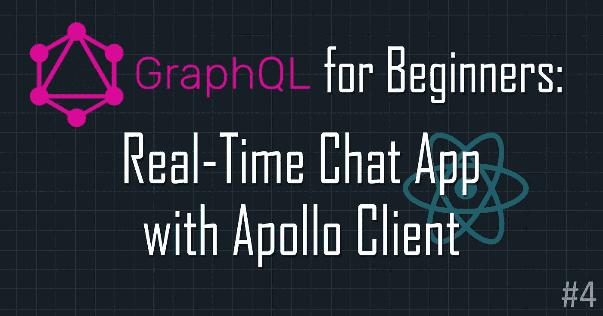
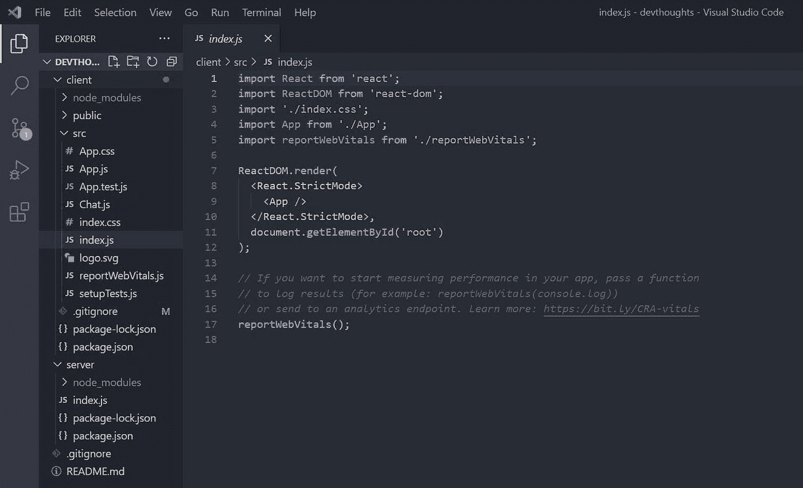
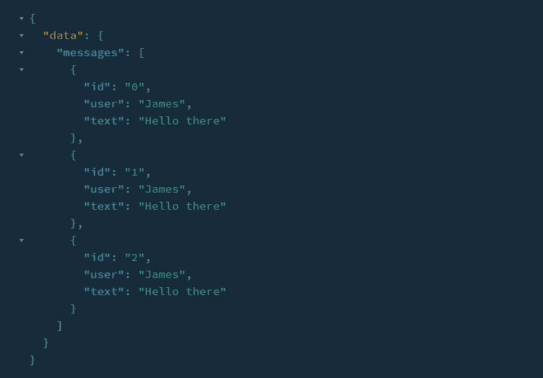
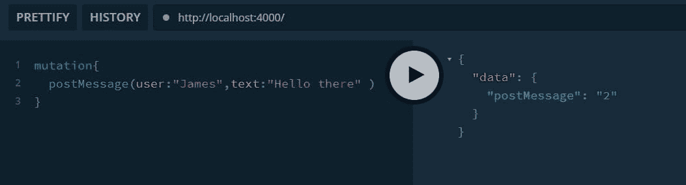
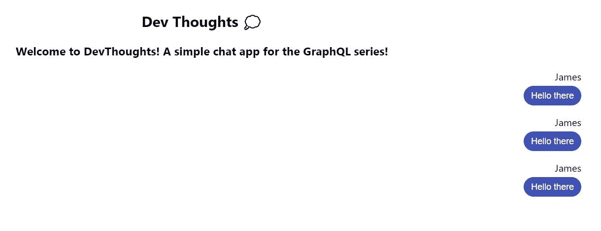
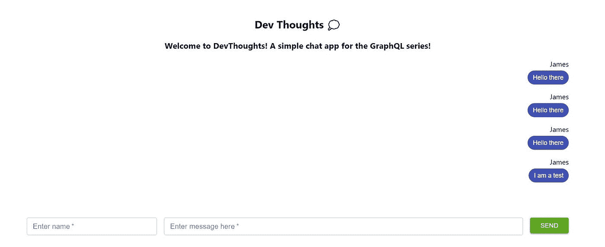
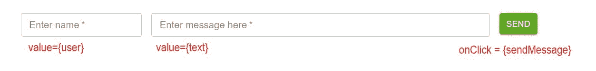
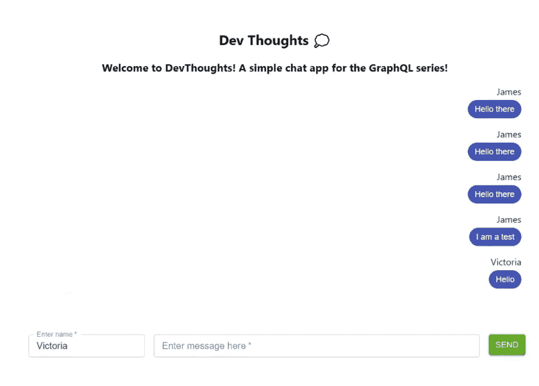
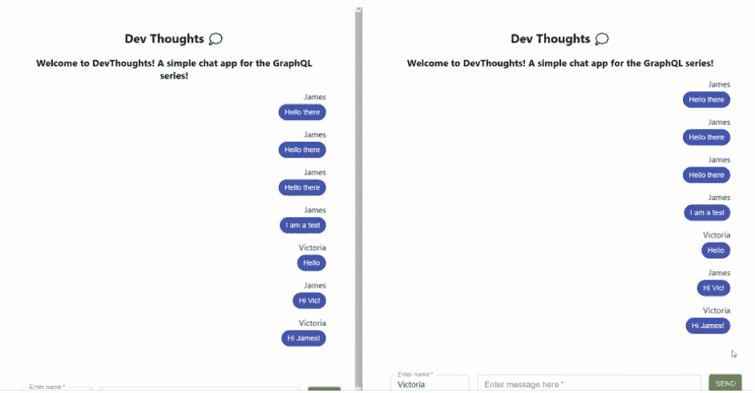
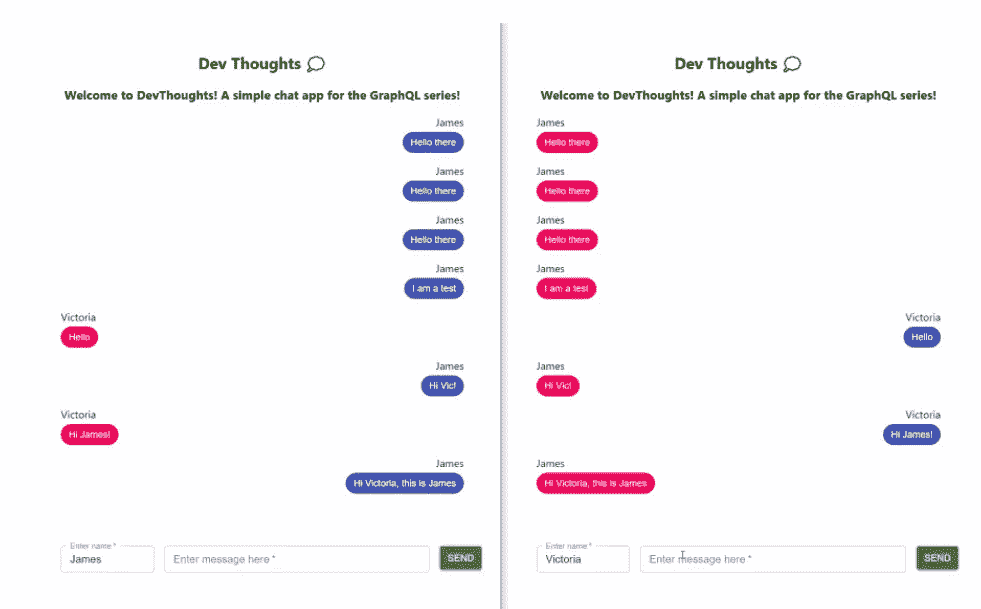

# 面向初学者的 GraphQL:用 Apollo 客户端构建实时聊天应用并做出反应

> 原文：<https://javascript.plainenglish.io/graphql-for-beginners-build-real-time-chat-app-with-apollo-client-and-react-278d22e1d135?source=collection_archive---------12----------------------->

## GraphQL 初学者友好系列🔰继续我们的 app 吧！第 4 部分结尾:用 React 和 Apollo 客户端设置客户端。



欢迎回到 [GraphQL 初学者版](https://lo-victoria.com/series/graphql)！这是一个对初学者友好的系列，介绍了 GraphQL 的基本概念，以及如何将其连接到前端框架，如使用 Apollo 的 React。

在这一部分，我们将通过使用 React 和 Apollo 客户端构建我们的前端来完成我们的简单聊天应用程序。

> 如果你没有看过前面的部分，请阅读:

*   [第 1 部分:GraphQL 简介](https://victoria2666.medium.com/graphql-for-beginners-introduction-90c78a56a96e?sk=ee4885321344329d8af3096f9074427b)
*   [第 2 部分:模式、订阅和服务器](https://victoria2666.medium.com/graphql-for-beginners-subscriptions-schemas-and-servers-c4b440e3b2aa?sk=0141fe163f173af76e407e8688c3fa8f)
*   [第 3 部分:设置 GraphQL 服务器](https://victoria2666.medium.com/graphql-for-beginners-setting-up-graphql-server-ba48a3cbc184?sk=330d2a07f119d5734ae2424a417eecd1)

# 步骤 1:创建一个 React 应用程序

概括地说，我们的项目文件夹中目前有一个`server`文件夹。现在让我们为 React 应用程序创建一个`client`文件夹。

在我们的`client`文件夹中，我们可以创建一个新的 React 应用程序:

```
npx create-react-app my-app
```

现在，您的项目文件夹应该如下所示:



# 步骤 2:安装软件包

要将 React 应用程序连接到 GraphQL 服务器，我们需要安装几个包:

*   `@apollo/client`:在 React 应用中设置 Apollo 客户端
*   `graphql`:解析 GraphQL 查询
*   `subscriptions-transport-ws`:使用 WebSocketLink 通过 WebSocket 使用订阅

```
npm install @apollo/client graphql subscriptions-transport-ws
```

也可以选择安装`@material-ui/core`进行造型。我将在这个项目中使用一些材料的用户界面组件。

```
npm install @material-ui/core
```

# 步骤 3:初始化 WebSocketLink 和 ApolloClient

让我们通过在 React 应用程序的`src`文件夹中创建`Chat.js`来创建一个聊天组件。在这个组件中，我们将初始化我们的 WebSocketLink 和 ApolloClient，以执行我们的聊天应用程序所需的所有必要的查询和功能。

首先，让我们从已安装的包中导入我们需要的东西。

```
import { ApolloClient, InMemoryCache, useMutation, useSubscription, gql} from '@apollo/client';
import { WebSocketLink } from "@apollo/client/link/ws";
import {Container, Chip, Grid, TextField, Button} from '@material-ui/core';
```

然后，初始化一个`WebSocketLink`来处理 import 语句下的订阅。`uri`属性应该是 GraphQL 服务器中订阅的特定端点。在我们的例子中，它只是`/`，我们的服务器在端口 4000。

```
const link = new WebSocketLink({
    uri: `ws://localhost:4000/`,
    options: {
      reconnect: true,
    },
});
```

现在，让我们初始化一个`ApolloClient`实例，这样我们的客户端就可以在`[http://localhost:4000/](http://localhost:4000/.)` [从我们的 GraphQL 服务器获取数据。](http://localhost:4000/.)

```
export const client = new ApolloClient({
  link, //websocket link
  uri: 'http://localhost:4000/', //connect to server
  cache: new InMemoryCache(),
});
```

在此之下，我们现在可以让聊天组件返回一个简单的标题。

```
export const Chat = () =>{
    return(
      <div>
         <h3>Welcome to DevThoughts! A simple chat app for the GraphQL series!</h3>
      </div>
    )
}
```

# 步骤 4:将 ApolloClient 与 React 连接起来

为了用 React 连接初始化的 ApolloClient 实例，我们可以在我们的`App.js`文件中导入 ApolloProvider。这就像一个上下文提供者，它包装 React 应用程序并将 Apollo 客户端放在上下文中，因此可以从应用程序组件树中的任何位置访问它。

在我们的`App.js`文件中，导入一个 ApolloProvider 并将其包装在组件周围。最后，我们从`Chat.js`导入我们的客户端实例和聊天组件。传入 ApolloProvider 组件中的`client`，我们就完成了设置。

```
import './App.css';
import { ApolloProvider } from '@apollo/client';
import {client, Chat} from './Chat'function App() {
  return ( 
    <ApolloProvider client={client}>
      <div className = "App">
        <h2>Dev Thoughts 💭</h2>
        <Chat/>
      </div>
    </ApolloProvider>
  );
}export default App;
```

# 步骤 5: GraphQL 获取消息查询

现在一切都设置好了，我们可以从我们的 React 应用程序获取数据并将其发送到我们的 GraphQL 服务器。为此，我们需要在`Chat.js`中编写一些 GraphQL 查询。

我们可以通过封装在 gql 模板文本中来定义一个查询。下面是我们获取消息的查询:

```
const GET_MESSAGES = gql`
  subscription {
    messages {
      id
      user
      text
    }
  }
`;
```

> 如果您需要对订阅和查询进行总结，请阅读本系列的[上一部分](https://victoria2666.medium.com/graphql-for-beginners-setting-up-graphql-server-ba48a3cbc184?sk=330d2a07f119d5734ae2424a417eecd1)。

然后，我们使用`useSubscription`钩子像这样执行查询:

```
const Messages = ({user}) =>{
    const {data} = useSubscription(GET_MESSAGES) //executes query
    if(!data){
        return null; //if no data fetched, return null
    } //else return the fetched data
    return (
      <div>
         //map fetched data here
      </div>
     )
}
```

如上面的代码所示，Messages 组件将使用`useSubscription`钩子执行`GET_MESSAGES`查询。然后，我们检查提取的数据是否为空。如果是，则组件不返回任何内容。否则，它应该返回`<div>`中的所有消息。

请注意，提取的数据将采用如下格式:



因此，让我们添加获取的数据，并将它们映射为单独的样式。下面是消息组件的外观:

```
const Messages = () => {
  const { data } = useSubscription(GET_MESSAGES);
  if (!data) {
    return null;
  }
  return (
    <div style={{ marginBottom: '5rem' }}>
      {data.messages.map(({ id, user, text }) => {
        return (
          <div key={id} style={{ textAlign: 'right' }}>
            <p style={{ marginBottom: '0.3rem' }}>{user}</p>
            <Chip style={{ fontSize: '0.9rem' }} color='primary' label={text} />
          </div>
        );
      })}
    </div>
  );
};
```

现在，我们将消息组件添加到之前在步骤 3 中创建的聊天组件中，如下所示:

```
export const Chat = () =>{
    return(
      <div>
         <h3>Welcome to DevThoughts! A simple chat app for the GraphQL series!</h3>
         <Messages/> /*add here*/
      </div>
    )
}
```

# 测试！

让我们测试它是否工作，在`http://localhost:4000/`运行服务器并通过操场发布几条消息进行测试。



然后，通过在`client`文件夹上运行`npm start`来运行 React 应用程序。消息组件应该执行订阅查询并显示测试消息。



很好，现在让我们继续创建一个变异查询，以允许从我们的 React 应用程序而不是我们的操场发布新消息。

# 步骤 6: GraphQL Post 消息查询

让我们将这个查询添加到我们的`GET_MESSAGES`查询下面。就像我们在操场上写的一样，`POST_MESSAGE`的变异查询如下:

```
const POST_MESSAGE = gql`
  mutation($user:String!, $text:String!){
    postMessage(user:$user, text:$text)
  }
`;
```

然后，我们需要一个名为`sendMessage`的函数来执行这个查询。为了创建这个函数，让我们首先创建一些用户可以输入消息的 UI 元素，然后单击一个调用`sendMessage`的按钮。

在我们的`Chat`组件中，在我们的`Messages`下面，让我们添加 UI。

```
export const Chat = () =>{
    return(
        <Container>
          <h3>Welcome to DevThoughts! A simple chat app for the GraphQL series!</h3>
          <Messages/>
         {/*add this block below*/}
          <Grid container spacing={2}>
            <Grid item xs={3}>
              <TextField onChange={(e)=>{
                setUser(e.target.value)}} value={user} size="small" fullWidth variant="outlined" required label="Required" label="Enter name" />
            </Grid>
            <Grid item xs={8}>
              <TextField onChange={(e)=>{
                setText(e.target.value)}} value={text} size="small" fullWidth variant="outlined" required label="Required" label="Enter message here" />
            </Grid>
            <Grid item xs={1}>
              <Button onClick={sendMessage} fullWidth  variant="contained" style={{backgroundColor:"#60a820", color:"white"}}>Send</Button>
            </Grid>
          </Grid>
        </Container>
    )
}
```

这是它在浏览器上的样子:



您可能会注意到，除了`sendMessage`之外，我还添加了一些新的变量:`user`和`text`，它们包含了我们刚刚包含的输入字段的值。



让我们在`Chat.js`的顶部导入`useState`钩子，并初始化`Chat`组件中的变量。

在文件的顶部:

```
import React, {useState} from 'react';
```

在我们的`Chat`组件中:

```
export const Chat = () =>{
    const [user, setUser] = useState("Victoria"); //initialize user
    const [text, setText] = useState(""); //initialize text return 
       //...
}
```

最后，我们在变量下面创建 sendMessage 函数。正如阿波罗[文档](https://www.apollographql.com/docs/react/data/mutations/)中所描述的，我们必须使用`useMutation`钩子来执行变异。

下面是代码的作用。花点时间回顾并理解它:

1.  在返回数组的`useMutation`钩子中传递我们的`POST_MESSAGE`查询，其中第一个元素是我们的 mutate 函数`postMessage`。
2.  sendMessage 首先检查两个输入是否都不为空。它通过从输入(`user`和`text`)传递变量来执行`postMessage` mutate 函数，并重置文本字段。
3.  如果其中一个输入字段为空，将会触发一个警告窗口。

```
export const Chat = () =>{
    //...
    // 1.
    const [postMessage] = useMutation(POST_MESSAGE) const sendMessage=()=>{
      // 2.
      if(text.length>0 && user.length >0){
        //calls the mutate function
        postMessage({
          variables:{ user: user, text: text }
        })
        setText(""); //reset text field
      }else{
        // 3.
        alert("Missing fields!")
      }
    } return (
   // ...
}
```

# 试验

如果我们发布一条新消息，它应该会完美地执行变异，监听任何变化的订阅会立即用新数据更新 UI。



我们甚至可以打开多个窗口，这样它就像一个真正的聊天应用程序！



# 第七步:最终改进

上面的片段显示了我们的应用程序可以成功发布和获取新消息。但是，请注意，无论用户是谁，消息总是向右对齐。

在典型的聊天应用程序中，只有用户发送的消息会在右边，而其余的会在左边。让我们添加这个小改进来完成我们的聊天应用程序。

在我们的`Chat.js`文件的`Messages`组件中，让它接受我们的`user`变量作为道具。然后，我们将根据消息数据的`user`属性是否等于`user`变量给出不同的样式。

```
const Messages = ({user}) =>{
    const {data} = useSubscription(GET_MESSAGES)
    if(!data){
        return null;
    }
    return (
      <div style={{marginBottom:"5rem"}}>
        {data.messages.map(({id, user: messageUser, text})=>{
          return(
            <div key={id} style={{textAlign: user===messageUser?"right":"left"}}>
              <p style={{marginBottom:"0.3rem"}}>{messageUser}</p>
              <Chip style={{fontSize:"0.9rem"}} color={user===messageUser?"primary": "secondary"} label={text}/>
            </div>
          )
        })}
      </div>
     )
}
```

最后，记住在`Chat`组件下的`Messages`中传递`user`变量:

```
export const Chat = () =>{
  //...
  return(
    //...
      <Messages user={user}/>
    //...
  )
}
```

# 最终结果和单词

如下图所示，我们的聊天应用终于完成了！



我们现在已经到了 GraphQL 初学者系列的末尾。如果你一直在关注这个系列，非常感谢。我希望它有助于您了解 GraphQL 的基本概念，并将其集成到 React 这样的前端框架中。

如果你认为这个系列对你有帮助，请喜欢并分享它，这样它就能接触到更多的人。

请查看下面的参考资料部分，查看该项目的代码，并阅读更多关于 Apollo 的 GraphQL 的内容。为了提高和更好地使用 GraphQL，我鼓励您尝试构建自己的项目，甚至在开始时向这个聊天应用程序添加更多功能。祝你学习顺利，干杯！

# 阅读更多

*   [第 1 部分:GraphQL 简介](https://victoria2666.medium.com/graphql-for-beginners-introduction-90c78a56a96e?sk=ee4885321344329d8af3096f9074427b)
*   [第 2 部分:模式、订阅和服务器](https://victoria2666.medium.com/graphql-for-beginners-subscriptions-schemas-and-servers-c4b440e3b2aa?sk=0141fe163f173af76e407e8688c3fa8f)
*   [第 3 部分:设置 GraphQL 服务器](https://victoria2666.medium.com/graphql-for-beginners-setting-up-graphql-server-ba48a3cbc184?sk=330d2a07f119d5734ae2424a417eecd1)

# 参考

*   [GitHub 回购](https://github.com/victoria-lo/devthoughts)
*   [apollographql.com/docs/react/get-started](https://www.apollographql.com/docs/react/get-started/)
*   [apollographql.com/docs/react/data/subscript..](https://www.apollographql.com/docs/react/data/subscriptions/)
*   [apollographql.com/docs/react/data/mutations](https://www.apollographql.com/docs/react/data/mutations/)
*   [youtube.com/watch?v=E3NHd-PkLrQ&t = 1697](https://www.youtube.com/watch?v=E3NHd-PkLrQ&t=1697)