# 初学者 GraphQL:简介

> 原文：<https://javascript.plainenglish.io/graphql-for-beginners-introduction-90c78a56a96e?source=collection_archive---------11----------------------->

## 让我们用 GraphQL，React，Apollo 来搭建一个实时聊天 app 吧！初学者的循序渐进教程🔰

# 第 1 部分:GraphQL 简介

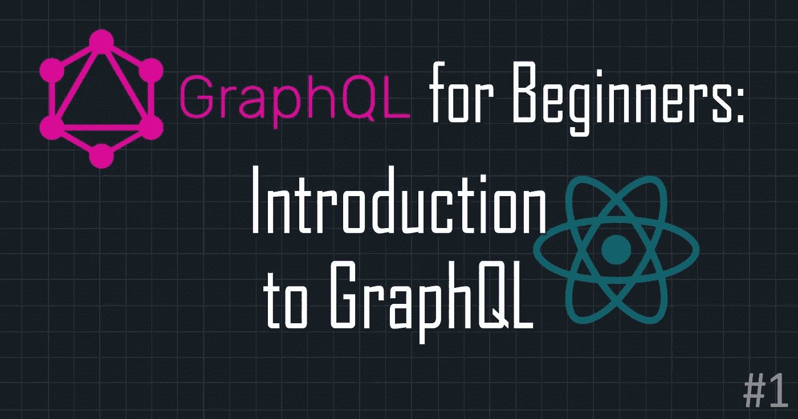

欢迎来到 [GraphQL 初级版](https://lo-victoria.com/series/graphql)！本系列的主要目标是介绍 GraphQL 的基本概念，以及如何使用 Apollo 将其连接到 React 这样的前端框架。在本系列结束时，您将拥有一个用 GraphQL、React 和 Apollo 构建的简单聊天应用程序。

*先睹为快:*

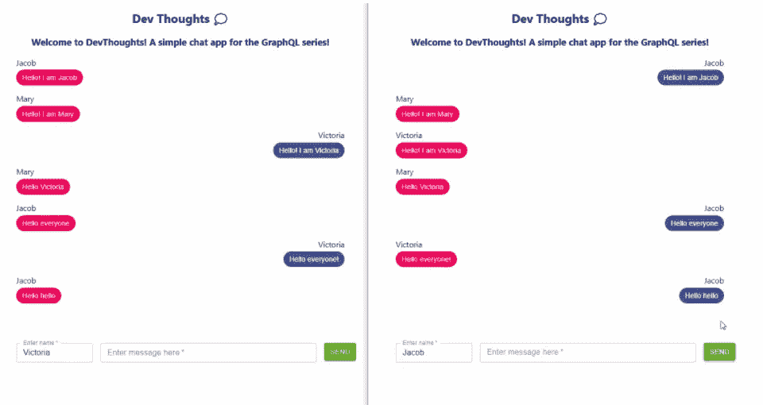

Github repo at: [https://github.com/victoria-lo/devthoughts](https://github.com/victoria-lo/devthoughts)

# 先决条件

*   不需要预先了解 GraphQL 和 Apollo
*   任何代码编辑器
*   React、JavaScript 的中级初学者体验
*   对于 Windows:安装了 Git 和 Git Bash
*   可选:在 VS 代码扩展中获取 GraphQL 以突出显示语法

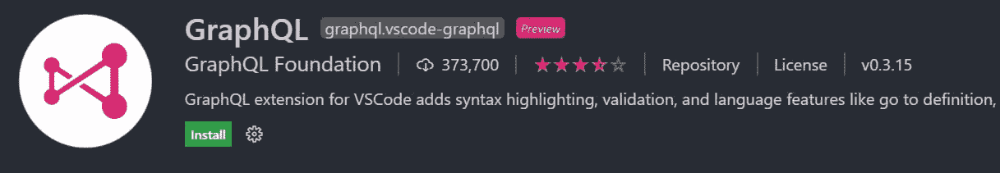

*点击图片下载扩展。*

# GraphQL 简介

在我们开始构建应用程序之前，我们需要了解我们将使用的技术。特别是 GraphQL。

# GraphQL 是什么？

GraphQL 是一种用于 API 的查询语言。它是由脸书开发的，作为一种更有效地获取数据的解决方案。

# 为什么是 graph QL:REST 的问题

在 REST APIs 中，每个端点将返回特定的 JSON 数据负载。即使我们只需要某些字段，它也会根据每个请求返回所有内容。

看看 PokeAPI(Pokemon 的 RESTful API)中的端点([pokeapi.co/api/v2/pokemon/ditto](https://pokeapi.co/api/v2/pokemon/ditto)):

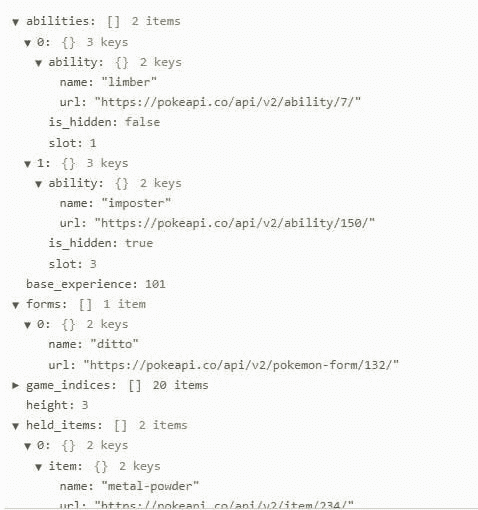

返回的数据块非常大，大多数时候，一个 app 可能不需要所有这些数据。

此外，REST APIs 的设计可能需要一个应用程序发出许多不必要的请求，因为一些数据可能来自不同的端点。回到 PokeAPI，我们可以看到在`abilities`下面，有 URL 来获得关于每个能力的更具体的数据。

这意味着，为了检索单个口袋妖怪能力的数据，你需要发出 3 个 HTTP 请求:

1.  `https://pokeapi.co/api/v2/pokemon/ditto`获得它的能力
2.  `https://pokeapi.co/api/v2/ability/7/`获取能力 1 的信息
3.  `https://pokeapi.co/api/v2/ability/150/`获取能力 2 的信息

随着用户对更快、更高效应用的需求增加，脸书意识到了 REST APIs 中的这些问题。2012 年，它开始在内部开发 GraphQL，然后在 2015 年向公众发布。

让我们看看 GraphQL 是如何解决 REST APIs 等问题的。

# GraphQL 如何工作

如前所述，它是一种查询语言，这意味着它只获取您使用查询需要的数据。使用 GraphQL，有:

*   没有过度蚀刻或蚀刻不足
*   需要管理的终端更少(即只有`/graphql`)
*   与数据库、REST API、云服务和 JSON 文件的灵活集成

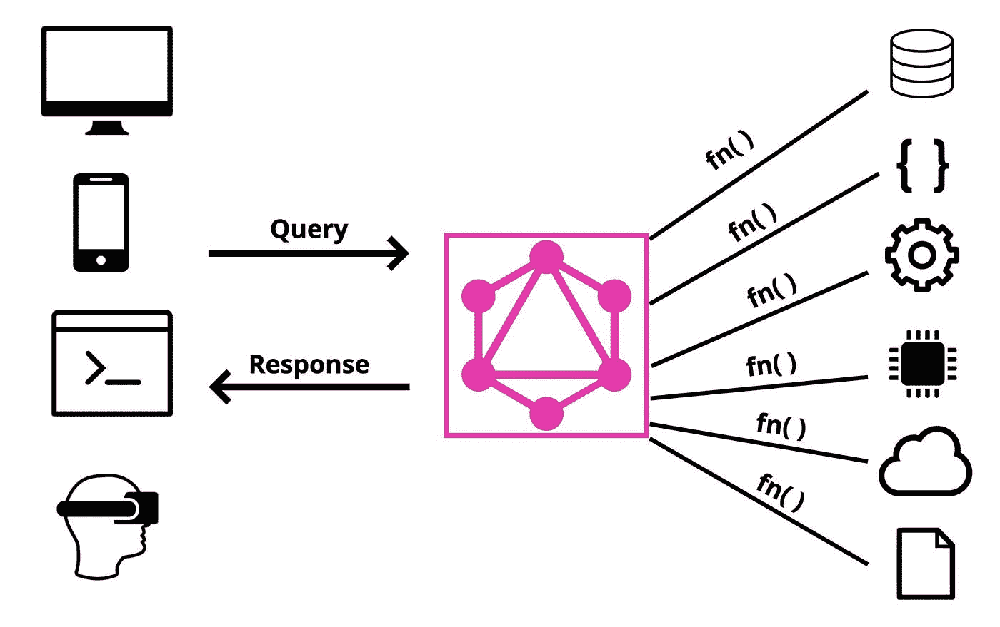

典型的 GraphQL 操作是这样的:

1.  通过查询从 GraphQL 服务器请求数据。
2.  在 GraphQL 服务器上调用一个函数从适当的源获取数据。
3.  GraphQL 服务器向客户端返回一个响应。

GraphQL 附带了一个名为 graph QL 的 IDE，它有助于开发人员测试 API。第一个 [GraphQL API (SWAPI)](https://graphql.org/swapi-graphql) 使用 GraphQL。

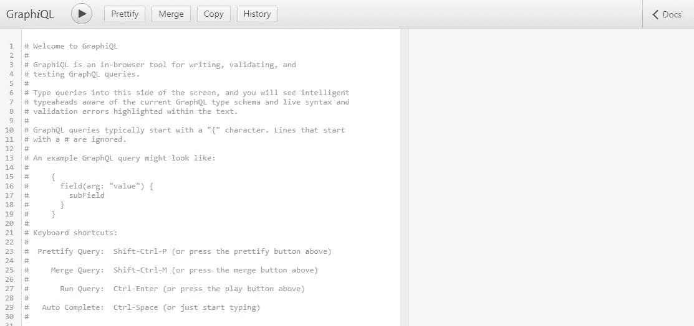

诸如 GraphQL Playground 之类的替代 ide 由 Prisma 开发和维护。这是 Hashnode API 当前正在使用的。

# 问题

现在我们知道了 GraphQL 是如何工作的，让我们以 Hashnode 的 API 为例来学习如何构造一个查询。

> API 游乐场可以在[api.hashnode.com](https://api.hashnode.com/)找到。

每个 GraphQL IDE 都可以访问文档面板。这是在构建 GraphQL API 时生成的 API 文档。这是一个有用的面板，因此任何开发人员，甚至那些从未使用过 API 的人，都可以立即理解 API 可以做什么。

在 Hashnode API 中，我们可以点击右边的“Docs”按钮来打开面板。

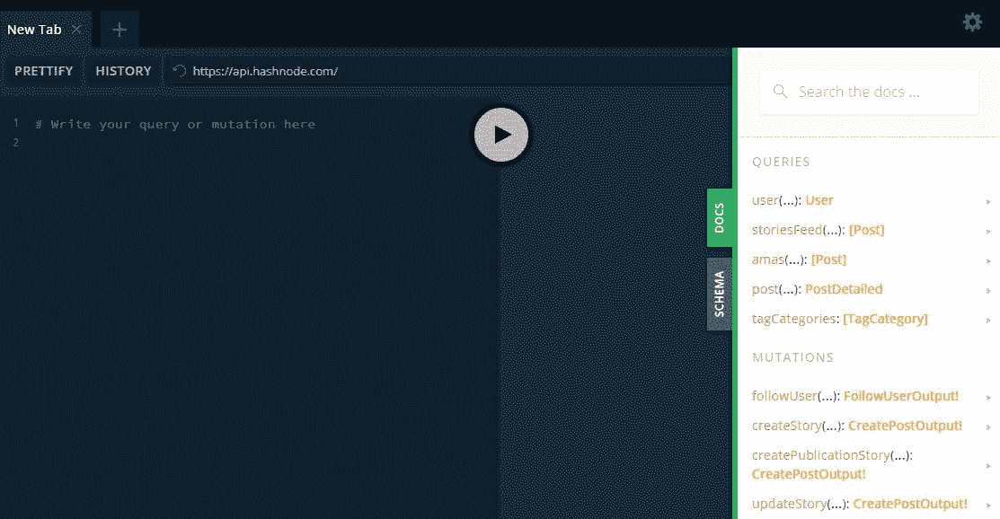

我们可以在查询下看到几行，比如`user(...)`、`storiesFeed(...)`等。这些是这个 API 可以执行的可用查询命令。

让我们试着为`user(...)`写一个查询。单击它以了解有关该查询的更多信息。您将看到类似下图的内容。

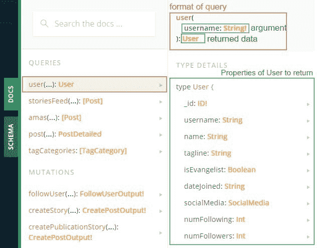

我们可以看到这个查询接受了一个`username`作为必需的(不可为空的)参数。它是必需的，因为旁边有一个感叹号。如果没有感叹号，它就是可空的(可选)。

接下来，这个查询将根据提供的`username`返回一个用户类型。以下是您可以选择返回的用户属性。与 REST APIs 不同，返回的用户类型不需要包含它的所有属性。你可以只查询你想要的。

假设我们想获取我的博客的名字、加入日期和关注人数。我的用户名是`victoria`。对此的查询将是:

```
//any query must start with the query keyword
query{ 
  //write the query according to the format in the docs
  user(username:"victoria"){ //supply the username arg as a String
    //include the properties you want to get
    name
    dateJoined
    numFollowers
  }
}
```

现在让我们在操场上执行这个查询:

还有哒哒！API 返回一个 JSON，其中包含我们想要的确切数据。不多不少。这确实是 GraphQL 的美妙之处。

# 标量与对象类型

在上面的例子中，我们返回的数据是一个用户类型。用户是一种对象类型，因为它具有可以进一步查询的属性。

我们之前查询的属性(name、dateJoined 和 numFollowers)也有类型，比如 String 和 Int。这些是标量类型。标量类型包括 6 个类别:

*   身份证明
*   浮动
*   （同 Internationalorganizations）国际组织
*   线
*   布尔代数学体系的

像 User 这样的对象类型可以有标量类型属性和/或对象类型属性。回到文档中，我们可以看到 User 有两个对象类型属性:SocialMedia 和 Publication。如果我们单击 SocialMedia，我们可以看到对象的属性，并可以进一步查询。

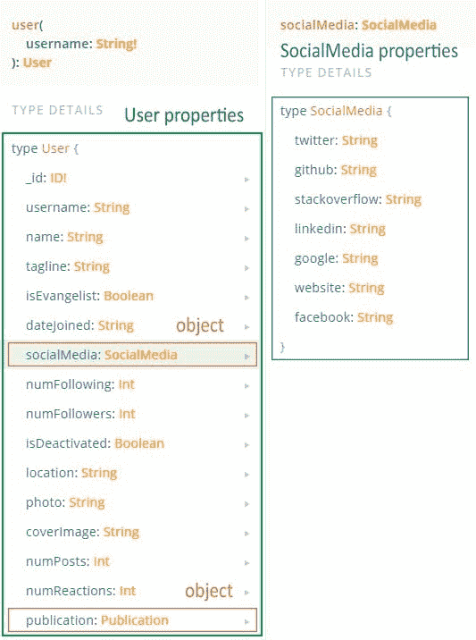

让我们尝试查询一个用户的 SocialMedia 的 twitter、github 和网站属性。

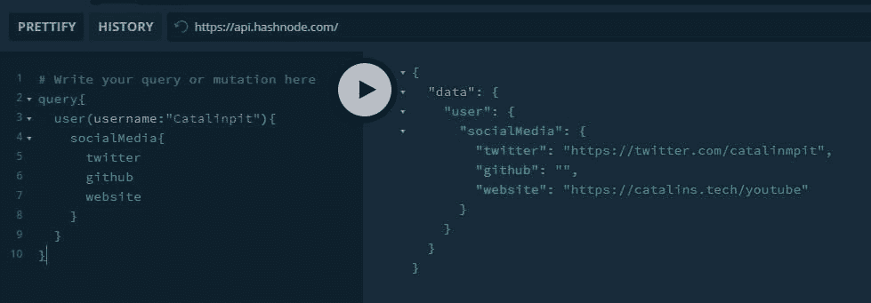

该查询运行良好。这一次，我们有一个更深的嵌套查询，因为我们首先要查询 User，然后是 socialMedia，最后是我们想要的属性。

这就是查询的要点。当然，关于查询的更多细节超出了本系列的范围，所以请随意浏览本文末尾的“阅读更多”部分。如果你想自己了解更多，我已经包括了一些非常令人惊讶的书面资源。

# 突变

关于 GraphQL 的下一个重要概念是突变。如果查询相当于 REST 中的 GET 请求，那么变异就像是 POST 请求。

本质上，它们像查询一样编写。唯一的区别是它用于对后端数据进行更改。

为了说明突变，让我们使用另一个名为 [Snowtooth(滑雪场)](https://snowtooth.moonhighway.com/) API 的 GraphQL API。

在文档中，我们可以在“突变”下看到这个 API 的可用突变。让我们点击`setLiftStatus(...)`看看它能做什么。

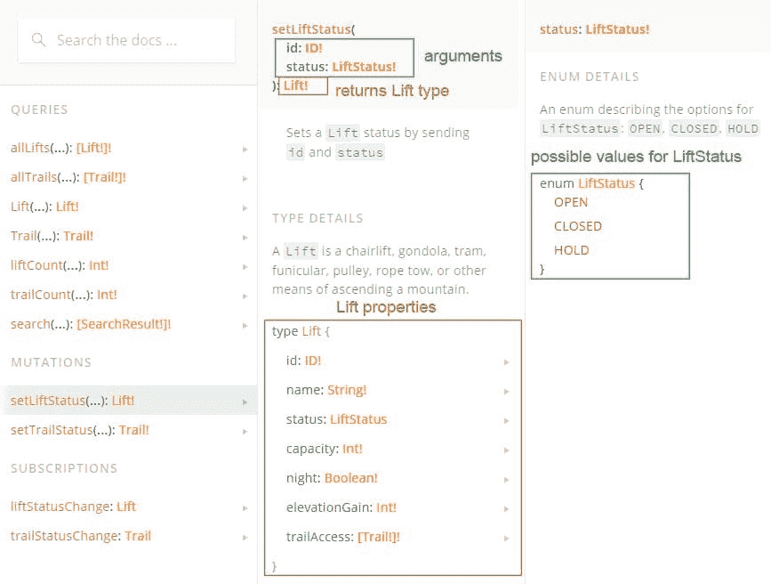

如上图所示，这种变异允许我们通过提供其`id`和`LiftStatus`属性作为参数来更改 Lift 对象类型的`LiftStatus`属性。

注意`LiftStatus`不是标量类型。如果我们点击它，我们可以看到它是一个只有一个值的枚举:`OPEN`、`CLOSED`或`HOLD`。这一点很重要，这样我们就不会提供一个随机的字符串作为它的值，否则它会返回一个错误。

因此，为了执行这种变异，让我们查询`allLifts`以获得随机提升的`id`。如下所示，`allLifts`带有一个可选的`LiftStatus`参数(因为没有感叹号)。

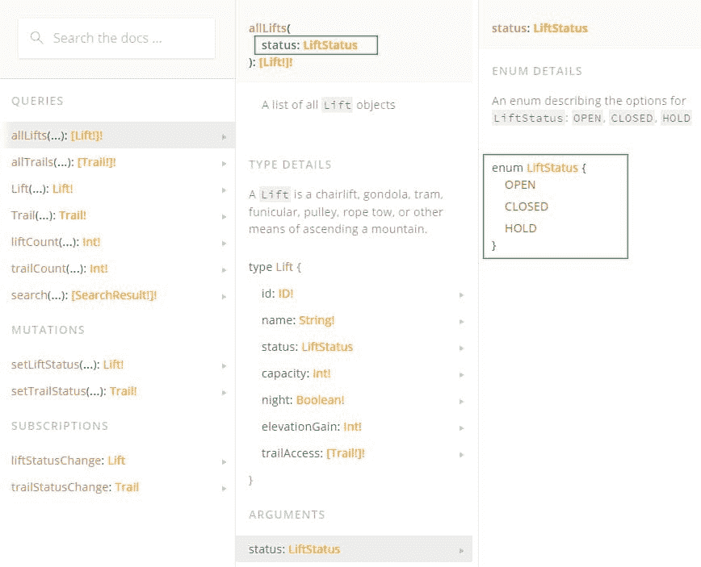

我们做了一个简单的查询来获取带有`OPEN`的`LiftStatus`的所有电梯，并获取它们的`id`属性。

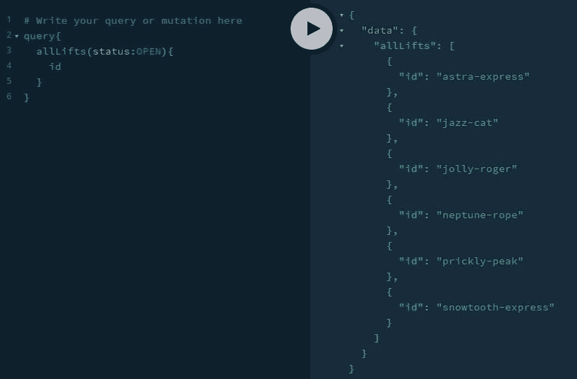

然后，让我们从返回的列表中随机选择一个`id`作为我们的突变。对于这个例子，我选择`astra-express`。

现在，我们有了所有需要的参数来编写突变，将`astra-express`的状态从`OPEN`更改为`CLOSED`，如下所示:

```
//every mutation must start with the mutaion keyword
mutation{
  //supply the appropriate arguments
  setLiftStatus(id:"astra-express", status:CLOSED){
    //return the following properties after the mutation
    id
    name
    status
  } 
```

突变的结果将显示`astra-express`电梯现在的状态为`CLOSED`。

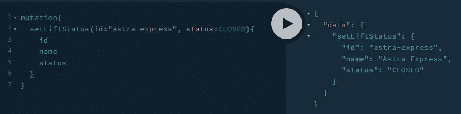

这就是我们如何进行突变。像查询一样简单明了，不是吗？

# 待续

感谢阅读这篇文章。希望到目前为止有所帮助。这已经很长了，所以让我们在下一部分继续，我们将学习 GraphQL 模式、订阅和服务器。

点击这里阅读[第 2 部分:模式、订阅和服务器](https://victoria2666.medium.com/graphql-for-beginners-subscriptions-schemas-and-servers-c4b440e3b2aa?sk=0141fe163f173af76e407e8688c3fa8f)！

同时，如果您想更深入地探索本文中的概念，请查看下面的阅读更多部分。干杯！

# 阅读更多

*   [第 2 部分:模式、订阅和服务器](https://victoria2666.medium.com/graphql-for-beginners-subscriptions-schemas-and-servers-c4b440e3b2aa?sk=0141fe163f173af76e407e8688c3fa8f)
*   [第 3 部分:设置 GraphQL 服务器](https://victoria2666.medium.com/graphql-for-beginners-setting-up-graphql-server-ba48a3cbc184?sk=330d2a07f119d5734ae2424a417eecd1)
*   [第 4 部分:用 GraphQL 和 Apollo React 构建一个实时聊天应用](https://lo-victoria.com/graphql-for-beginners-build-real-time-chat-app-with-apollo-client-and-react)
*   [解剖 GraphQL 查询](https://www.apollographql.com/blog/the-anatomy-of-a-graphql-query-6dffa9e9e747/)
*   [GraphQL 的利弊](https://www.robinwieruch.de/why-graphql-advantages-disadvantages-alternatives)
*   [用简单的术语解释 GraphQL 查询](https://blog.logrocket.com/graphql-queries-in-simple-terms/)

# 链接

*   GitHub 回购项目:[https://github.com/victoria-lo/devthoughts](https://github.com/victoria-lo/devthoughts)
*   [雪齿 API](https://snowtooth.moonhighway.com/)
*   [哈希节点 API](https://api.hashnode.com/)